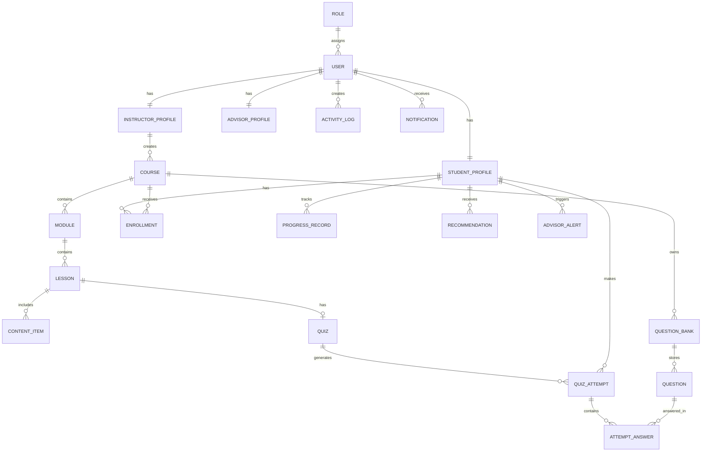
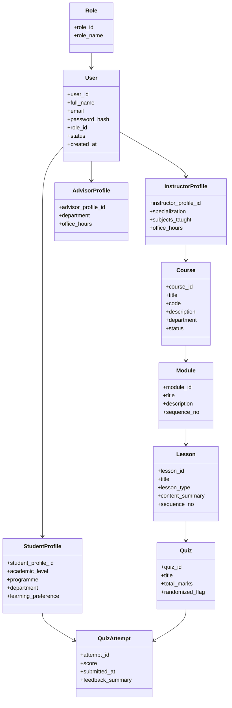

# QuestLearn ERD and UML Reference

## Overview

This document provides the main entities, attributes, and relationships for QuestLearn. It is intended to support ERD and class diagram preparation for the academic project. The content is presented in both diagram-ready text and Mermaid draft form for quick reuse.

## 1. Core Entities

### 1. User

**Attributes:** `user_id`, `full_name`, `email`, `password_hash`, `role_id`, `status`, `created_at`  
**Purpose:** Stores login and identity information for all platform users.

### 2. Role

**Attributes:** `role_id`, `role_name`  
**Purpose:** Supports role-based access control.  
**Examples:** `Student`, `Instructor`, `Academic Advisor`, `Admin`

### 3. StudentProfile

**Attributes:** `student_profile_id`, `user_id`, `academic_level`, `programme`, `department`, `learning_preference`  
**Purpose:** Stores student-specific academic and preference information.

### 4. InstructorProfile

**Attributes:** `instructor_profile_id`, `user_id`, `specialization`, `subjects_taught`, `office_hours`  
**Purpose:** Stores instructor-specific details.

### 5. AdvisorProfile

**Attributes:** `advisor_profile_id`, `user_id`, `department`, `office_hours`  
**Purpose:** Stores advisor-specific details.

### 6. Course

**Attributes:** `course_id`, `instructor_id`, `title`, `code`, `description`, `department`, `status`  
**Purpose:** Represents a course created and managed by an instructor.

### 7. Module

**Attributes:** `module_id`, `course_id`, `title`, `description`, `sequence_no`  
**Purpose:** Divides a course into smaller learning units.

### 8. Lesson

**Attributes:** `lesson_id`, `module_id`, `title`, `lesson_type`, `content_summary`, `sequence_no`  
**Purpose:** Represents a lesson inside a module.

### 9. ContentItem

**Attributes:** `content_item_id`, `lesson_id`, `content_type`, `file_url`, `embed_url`, `source_tool`  
**Purpose:** Stores lesson assets such as video, reading file, or H5P/Lumi activity.

### 10. Enrollment

**Attributes:** `enrollment_id`, `student_id`, `course_id`, `enrolled_at`  
**Purpose:** Maps students to courses.

### 11. Quiz

**Attributes:** `quiz_id`, `lesson_id`, `title`, `total_marks`, `randomized_flag`  
**Purpose:** Represents an assessment attached to a lesson.

### 12. QuestionBank

**Attributes:** `bank_id`, `course_id`, `topic`, `difficulty_level`  
**Purpose:** Groups questions for reuse and randomized quiz generation.

### 13. Question

**Attributes:** `question_id`, `bank_id`, `question_type`, `prompt`, `correct_answer`, `explanation`  
**Purpose:** Stores individual questions and feedback notes.

### 14. QuizAttempt

**Attributes:** `attempt_id`, `quiz_id`, `student_id`, `score`, `submitted_at`, `feedback_summary`  
**Purpose:** Stores a student's submitted quiz attempt.

### 15. AttemptAnswer

**Attributes:** `answer_id`, `attempt_id`, `question_id`, `student_answer`, `is_correct`  
**Purpose:** Stores answers for each question in a quiz attempt.

### 16. ProgressRecord

**Attributes:** `progress_id`, `student_id`, `lesson_id`, `completion_status`, `completion_percentage`, `updated_at`  
**Purpose:** Tracks lesson-level or module-level progress.

### 17. ActivityLog

**Attributes:** `activity_id`, `user_id`, `activity_type`, `target_id`, `timestamp`  
**Purpose:** Tracks user actions such as lesson opening, video viewing, and quiz attempts.

### 18. Recommendation

**Attributes:** `recommendation_id`, `student_id`, `topic`, `recommendation_type`, `message`, `generated_at`  
**Purpose:** Stores rule-based or analytics-driven next-step learning suggestions.

### 19. AdvisorAlert

**Attributes:** `alert_id`, `student_id`, `advisor_id`, `risk_level`, `trigger_reason`, `status`, `created_at`  
**Purpose:** Stores early warning alerts for students who may need intervention.

### 20. Notification

**Attributes:** `notification_id`, `user_id`, `title`, `message`, `type`, `is_read`, `sent_at`  
**Purpose:** Stores reminders, announcements, feedback notices, and alerts.

## 2. Main Relationships

The following relationships are the most important ones to show in the ERD:

- `Role` 1..* `User`
- `User` 1..1 `StudentProfile`
- `User` 1..1 `InstructorProfile`
- `User` 1..1 `AdvisorProfile`
- `InstructorProfile` 1..* `Course`
- `Course` 1..* `Module`
- `Module` 1..* `Lesson`
- `Lesson` 1..* `ContentItem`
- `Lesson` 0..1 `Quiz`
- `QuestionBank` 1..* `Question`
- `Quiz` *..* `Question` through a quiz-question bridge if needed
- `StudentProfile` *..* `Course` through `Enrollment`
- `StudentProfile` 1..* `QuizAttempt`
- `QuizAttempt` 1..* `AttemptAnswer`
- `StudentProfile` 1..* `ProgressRecord`
- `User` 1..* `ActivityLog`
- `StudentProfile` 1..* `Recommendation`
- `StudentProfile` 1..* `AdvisorAlert`
- `User` 1..* `Notification`

## 3. Diagram-Ready Entity Grouping

### Identity and Access

- `Role`
- `User`
- `StudentProfile`
- `InstructorProfile`
- `AdvisorProfile`

### Learning Structure

- `Course`
- `Module`
- `Lesson`
- `ContentItem`
- `Enrollment`

### Assessment and Performance

- `Quiz`
- `QuestionBank`
- `Question`
- `QuizAttempt`
- `AttemptAnswer`
- `ProgressRecord`

### Support and Analytics

- `ActivityLog`
- `Recommendation`
- `AdvisorAlert`
- `Notification`

## 4. Optional Extension Entities

These can be added if a richer ERD or class diagram is required:

- `Badge`
- `StudentBadge`
- `StreakRecord`
- `Department`
- `Announcement`
- `CourseCategory`
- `AdvisorStudentAssignment`

## 5. Mermaid Draft - ERD

## 6. Mermaid Draft - Simplified Class Diagram

