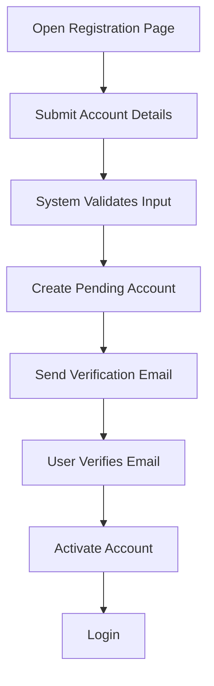
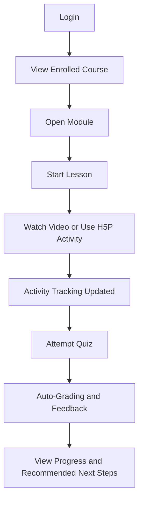
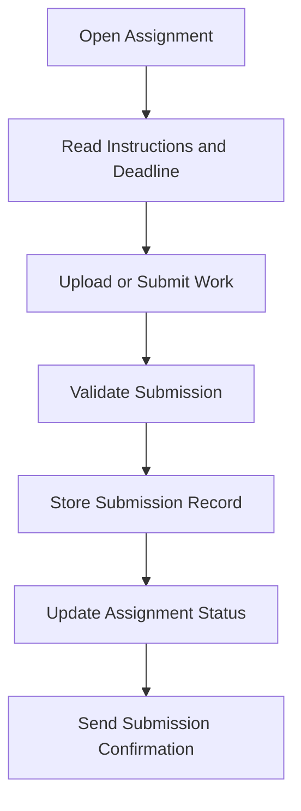
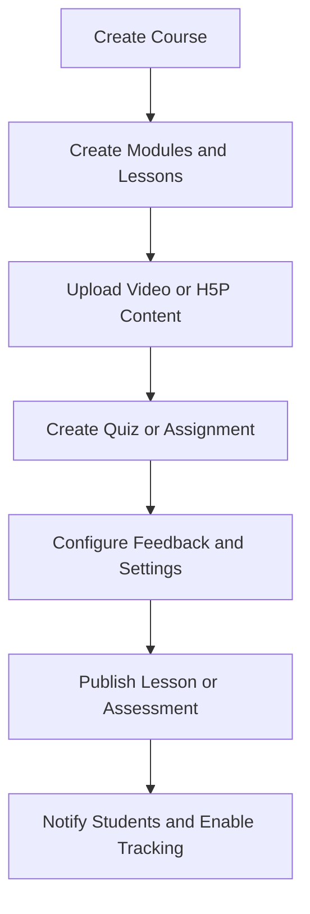
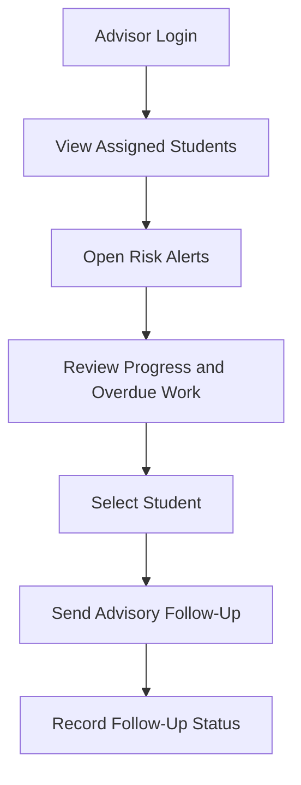
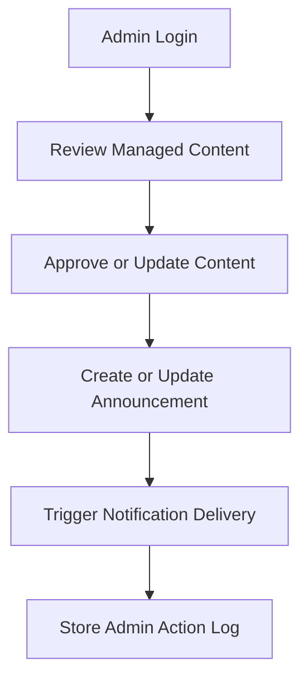

# QuestLearn Use Cases

## Overview

This document provides the use case reference for QuestLearn. It is written to support both academic report writing and UML diagram preparation. The content includes a full role-based use case list, formal use case descriptions, and process-flow drafts that can later be redrawn as submission-grade UML and activity diagrams.

## 1. Full Use Case List

### 1.1 Student Use Cases

1. Register account
2. Verify email
3. Log in
4. Log out
5. Manage profile
6. View enrolled courses
7. View course modules
8. View lessons
9. Start lesson
10. Watch embedded video
11. Open H5P interactive activity
12. Attempt quiz
13. Submit assignment
14. Receive automated feedback
15. View quiz history
16. View assignment status
17. View module completion progress
18. View recommended next steps
19. Review weak topics
20. View grades and assessment history
21. View badges, streak, and XP progress
22. Receive notifications

### 1.2 Instructor Use Cases

1. Register account
2. Verify email
3. Log in
4. Manage instructor profile
5. Create course
6. Edit course details
7. Create module
8. Create lesson
9. Upload video content
10. Upload or embed H5P/Lumi content
11. Create quiz
12. Create assignment
13. Build question bank
14. Randomize assessment questions
15. Configure automated feedback
16. Publish lesson
17. Publish module
18. Update course content
19. Review assignment submissions
20. View student attempts
21. View class performance analytics
22. View course engagement analytics
23. Send course announcements

### 1.3 Academic Advisor Use Cases

1. Log in
2. View assigned students
3. View advisee progress summary
4. View risk alerts
5. View low-engagement students
6. View incomplete modules
7. View student quiz performance trends
8. View overdue assignments
9. Review recommended intervention suggestions
10. Send advisory message
11. Monitor follow-up status
12. View student learning history summary

### 1.4 Admin Use Cases

1. Log in
2. Manage users
3. Assign roles
4. Approve instructor accounts
5. Manage departments or programmes
6. Moderate learning content
7. Manage announcements
8. Manage notification templates
9. View platform-wide analytics
10. Deactivate account
11. Reactivate account

## 2. Core Use Cases for the Main Diagram

These are the main use cases to prioritize in the final UML use case diagram:

- Register account
- Verify email
- Log in
- Manage profile
- Start lesson
- Attempt quiz
- Submit assignment
- View progress
- Create course
- Create lesson
- Upload interactive content
- Create assignment
- View risk alerts
- Manage users
- Manage announcements

## 3. Diagram-Ready Actor Mapping

### Student

- Register account
- Verify email
- Log in
- Manage profile
- Start lesson
- Attempt quiz
- Submit assignment
- Receive automated feedback
- View progress
- View recommended next steps
- Receive notifications

### Instructor

- Register account
- Verify email
- Log in
- Manage instructor profile
- Create course
- Create lesson
- Upload interactive content
- Create quiz
- Create assignment
- Configure automated feedback
- View analytics
- Send course announcements

### Academic Advisor

- Log in
- View assigned students
- View risk alerts
- View progress summary
- Review intervention suggestions
- Send advisory message

### Admin

- Log in
- Manage users
- Assign roles
- Approve instructor accounts
- Moderate learning content
- Manage announcements
- Manage notification templates

## 4. Formal Use Case Descriptions

### UC-01 Register Account and Verify Email

**Primary Actor:** Student or Instructor  
**Trigger:** The user selects the registration function.  
**Precondition:** The user does not already have an active account.  
**Main Flow:**

1. The user opens the registration page.
2. The user enters required account information.
3. The system validates the submitted data.
4. The system creates a pending account.
5. The system sends an email verification link or code.
6. The user completes email verification.
7. The system activates the account and allows login.

**Alternate Flow:**

1. If required fields are invalid, the system rejects the submission and requests correction.
2. If the verification link or code is invalid or expired, the system asks the user to request a new verification email.

**Postcondition:** The account is activated and ready for authenticated use.

### UC-02 Start Lesson

**Primary Actor:** Student  
**Trigger:** The student selects a lesson from an enrolled course.  
**Precondition:** The student is logged in and enrolled in the selected course.  
**Main Flow:**

1. The student opens a course.
2. The student selects a module.
3. The student selects a lesson.
4. The system displays lesson content, which may include reading material, embedded video, and H5P activity.
5. The system records page visits, video interactions, and lesson access in the activity tracking log.
6. The system updates lesson progress status.

**Alternate Flow:**

1. If the lesson is unpublished or unavailable, the system informs the student that access is not currently available.

**Postcondition:** The lesson access event is stored for progress tracking and analytics.

### UC-03 Attempt Quiz and Receive Automated Feedback

**Primary Actor:** Student  
**Trigger:** The student opens an available lesson quiz.  
**Precondition:** The student is logged in and the selected quiz is available.  
**Main Flow:**

1. The student starts the quiz.
2. The system displays quiz questions, including randomized items if configured.
3. The student submits answers.
4. The system auto-grades objective question types.
5. The system stores the attempt score, answer details, and activity record.
6. The system displays automated feedback, identifies weak topics, and shows recommended next steps.

**Alternate Flow:**

1. If the quiz includes subjective questions, the system stores those answers for later review while still grading objective items automatically.
2. If the quiz submission is incomplete, the system warns the student before final submission.

**Postcondition:** The attempt result is saved for performance analysis, feedback, and recommendation generation.

### UC-04 Submit Assignment

**Primary Actor:** Student  
**Trigger:** The student opens an active assignment.  
**Precondition:** The student is logged in, enrolled in the course, and the assignment deadline has not passed unless late submission is allowed.  
**Main Flow:**

1. The student opens the assignment details page.
2. The system displays assignment instructions, deadline, and submission rules.
3. The student uploads or submits the required work.
4. The system validates the submission.
5. The system records the submission time and status.
6. The system confirms successful assignment submission.

**Alternate Flow:**

1. If the file format or submission data is invalid, the system rejects the submission and requests correction.
2. If the deadline has passed, the system either blocks submission or marks it as late according to configured rules.

**Postcondition:** The assignment submission is stored for instructor review and student history.

### UC-05 Create Course and Learning Structure

**Primary Actor:** Instructor  
**Trigger:** The instructor selects the create course function.  
**Precondition:** The instructor account is active and approved.  
**Main Flow:**

1. The instructor opens the create course page.
2. The instructor enters course details such as title, code, department, and description.
3. The system creates the course record.
4. The instructor adds modules to the course.
5. The instructor adds lessons to each module.
6. The system stores the learning structure for later content publishing and student access.

**Alternate Flow:**

1. If required course details are missing, the system requests correction before saving.

**Postcondition:** The course structure is available for content, quiz, and assignment setup.

### UC-06 Publish Lesson Content and Interactive Material

**Primary Actor:** Instructor  
**Trigger:** The instructor opens the lesson editor.  
**Precondition:** A course, module, and lesson already exist.  
**Main Flow:**

1. The instructor selects a lesson.
2. The instructor uploads or links reading material, video content, and H5P/Lumi activities.
3. The instructor saves lesson content.
4. The instructor publishes the lesson.
5. The system makes the lesson available to enrolled students.
6. The system records content publication for notification and analytics purposes.

**Alternate Flow:**

1. If uploaded or embedded content is invalid, the system rejects the content and requests correction.

**Postcondition:** Students can access the published lesson and the system can notify affected users.

### UC-07 Create Assessment and Configure Feedback

**Primary Actor:** Instructor  
**Trigger:** The instructor opens an assessment management function.  
**Precondition:** The instructor has an active course and lesson or assignment target.  
**Main Flow:**

1. The instructor creates a quiz or assignment.
2. The instructor defines assessment rules such as question type, deadline, and marking configuration.
3. The instructor selects or creates question bank items for quizzes.
4. The instructor configures automated feedback for objective questions.
5. The instructor publishes the assessment.
6. The system stores the assessment and makes it available according to course rules.

**Alternate Flow:**

1. If assessment settings are incomplete, the system blocks publishing until the required fields are completed.

**Postcondition:** The assessment is available for student completion and later analytics.

### UC-08 View Advisor Alert Dashboard and Follow Up

**Primary Actor:** Academic Advisor  
**Trigger:** The advisor opens the dashboard.  
**Precondition:** The advisor is logged in and has assigned students.  
**Main Flow:**

1. The advisor opens the advisor dashboard.
2. The system displays assigned students, risk levels, overdue work, and low-engagement indicators.
3. The advisor selects a student.
4. The system displays progress history, quiz performance, overdue assignments, and alert reasons.
5. The advisor reviews recommended intervention suggestions.
6. The advisor sends a follow-up advisory message.
7. The system records the follow-up status.

**Alternate Flow:**

1. If no current alerts exist, the system still allows the advisor to review assigned student summaries.

**Postcondition:** The advisor has current information for intervention and the follow-up action is recorded.

### UC-09 Moderate Content and Manage Announcements

**Primary Actor:** Admin  
**Trigger:** The admin opens a moderation or announcement function.  
**Precondition:** The admin is logged in.  
**Main Flow:**

1. The admin reviews flagged or managed platform content.
2. The admin approves, updates, or removes content where necessary.
3. The admin creates or updates a system or course-related announcement template.
4. The system distributes announcements or stores them for notification delivery.
5. The system records the moderation or announcement action for oversight purposes.

**Alternate Flow:**

1. If content does not require moderation changes, the admin closes the review without modification.

**Postcondition:** Moderation and announcement actions are stored and can affect user notifications or content availability.

## 5. Process-Flow Drafts

### 5.1 Registration, Login, and Email Verification Flow

### 5.2 Student Lesson and Quiz Flow

### 5.3 Assignment Submission Flow

### 5.4 Instructor Content and Assessment Setup Flow

### 5.5 Advisor Alert Review and Follow-Up Flow

### 5.6 Admin Moderation and Announcement Flow

