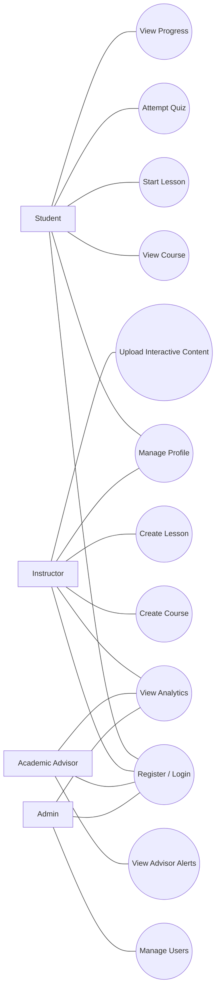
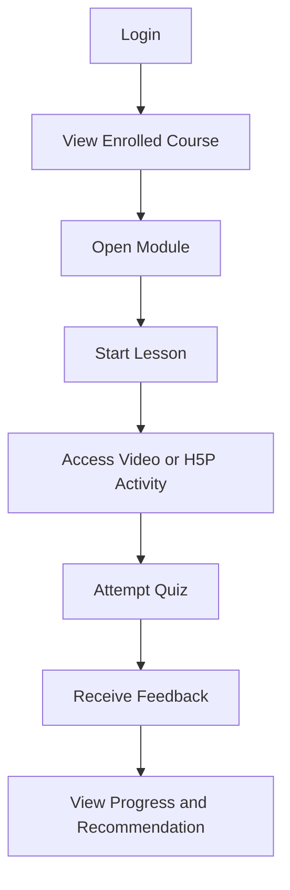

# QuestLearn Use Cases

## Overview

This document provides the use case reference for QuestLearn. It is written to support both academic report writing and UML diagram preparation. The content includes full role-based use case lists, a simplified set of core use cases for a cleaner diagram, short textual descriptions, and Mermaid drafts for quick experimentation.

## 1. Full Use Case List

### 1.1 Student Use Cases

1. Register account
2. Log in
3. Log out
4. Manage profile
5. View enrolled courses
6. View course modules
7. View lessons
8. Start lesson
9. Watch embedded video
10. Open H5P interactive activity
11. Attempt quiz
12. Submit short-answer response
13. Receive automated feedback
14. View quiz history
15. View module completion progress
16. View recommended next steps
17. Review weak topics
18. View badges, streak, and XP progress
19. Receive notifications
20. Track grades and assessment history

### 1.2 Instructor Use Cases

1. Register account
2. Log in
3. Manage instructor profile
4. Create course
5. Edit course details
6. Create module
7. Create lesson
8. Upload video content
9. Upload or embed H5P/Lumi content
10. Create quiz
11. Build question bank
12. Randomize assessment questions
13. Configure automated feedback
14. Publish lesson
15. Publish module
16. Update course content
17. View student attempts
18. View class performance analytics
19. View student engagement analytics
20. Send announcements or notifications

### 1.3 Academic Advisor Use Cases

1. Log in
2. View assigned students
3. View advisee progress summary
4. View risk alerts
5. View low-engagement students
6. View incomplete modules
7. View student quiz performance trends
8. Review recommended intervention suggestions
9. Send advisory message
10. Send encouragement
11. Monitor follow-up status
12. View student learning history summary

### 1.4 Admin Use Cases

1. Log in
2. Manage users
3. Assign roles
4. Approve instructor accounts
5. Manage departments or programmes
6. Manage courses
7. Manage system-wide announcements
8. Manage notification templates
9. View platform-wide analytics
10. Moderate learning content
11. Deactivate account
12. Reactivate account

## 2. Core Use Cases for a Simpler Diagram

These are the most important use cases to prioritize in a cleaner use case diagram:

- Register or Login
- Manage Profile
- View Course
- Start Lesson
- Attempt Quiz
- View Progress
- Create Course
- Create Lesson
- Upload Interactive Content
- View Analytics
- View Advisor Alerts
- Manage Users

## 3. Diagram-Ready Actor Mapping

### Student

- Register account
- Log in
- Manage profile
- View course
- Start lesson
- Attempt quiz
- Receive feedback
- View progress
- View recommendations
- Receive notifications

### Instructor

- Register account
- Log in
- Manage profile
- Create course
- Create lesson
- Upload interactive content
- Create quiz
- Configure feedback
- View analytics
- Send notifications

### Academic Advisor

- Log in
- View assigned students
- View advisor alerts
- View progress summary
- Review intervention suggestions
- Send advisory messages

### Admin

- Log in
- Manage users
- Assign roles
- Approve instructor accounts
- Manage departments
- Manage courses
- Manage announcements

## 4. Short Use Case Descriptions

### UC-01 Start Lesson

**Primary Actor:** Student  
**Precondition:** The student is logged in and enrolled in the selected course.  
**Main Flow:**

1. The student opens a course.
2. The student selects a module.
3. The student selects a lesson.
4. The system displays the lesson content, which may include video, reading material, and H5P interactive activity.
5. The system records the lesson visit and learning activity.

**Postcondition:** The learning activity is stored for progress tracking and analytics.

### UC-02 Attempt Quiz

**Primary Actor:** Student  
**Precondition:** The student is logged in and the lesson quiz is available.  
**Main Flow:**

1. The student opens the quiz.
2. The student answers the quiz questions.
3. The system grades objective question types automatically.
4. The system stores the attempt score and answer details.
5. The system displays automated feedback and recommended next steps.

**Postcondition:** The attempt result is saved for progress tracking and performance analysis.

### UC-03 Create Course

**Primary Actor:** Instructor  
**Precondition:** The instructor account is approved and active.  
**Main Flow:**

1. The instructor selects the create course function.
2. The instructor enters course metadata such as title, code, and description.
3. The instructor saves the course.
4. The system creates the course record.

**Postcondition:** The course is available for module and lesson creation.

### UC-04 Upload Interactive Content

**Primary Actor:** Instructor  
**Precondition:** A course, module, and lesson already exist.  
**Main Flow:**

1. The instructor opens the lesson editor.
2. The instructor uploads or embeds H5P/Lumi content.
3. The system stores the content reference.
4. The lesson preview is updated.

**Postcondition:** The lesson includes an interactive learning activity.

### UC-05 View Advisor Alert Dashboard

**Primary Actor:** Academic Advisor  
**Precondition:** The advisor is logged in and has assigned students.  
**Main Flow:**

1. The advisor opens the dashboard.
2. The system displays the advisee list and risk levels.
3. The advisor selects a student.
4. The system displays progress, weak performance, and overdue modules.
5. The advisor reviews the recommended intervention cues and sends follow-up support if needed.

**Postcondition:** The advisor gains current information for early intervention and student follow-up.

## 5. Mermaid Draft - Use Case Overview

## 6. Mermaid Draft - Student Learning Flow

