# QuestLearn Database Entity-Relationship Diagram (ERD) & Data Dictionary

## Entity-Relationship Diagram (ERD)

```mermaid
erDiagram
    ROLE {
        SERIAL role_id PK
        VARCHAR role_name 
    }

    USER {
        SERIAL user_id PK
        UUID auth_user_id 
        INT role_id FK
        VARCHAR full_name 
        VARCHAR email 
        VARCHAR account_status 
        TIMESTAMP created_at 
    }

    STUDENT_PROFILE {
        SERIAL student_profile_id PK
        INT user_id FK
        VARCHAR student_no 
        VARCHAR academic_level 
        VARCHAR programme 
        VARCHAR department 
        VARCHAR learning_preference 
    }

    INSTRUCTOR_PROFILE {
        SERIAL instructor_profile_id PK
        INT user_id FK
        VARCHAR staff_no 
        VARCHAR specialization 
        TEXT subjects_taught 
        VARCHAR office_hours 
    }

    ADVISOR_PROFILE {
        SERIAL advisor_profile_id PK
        INT user_id FK
        VARCHAR staff_no 
        VARCHAR department 
        VARCHAR office_hours 
    }

    COURSE {
        SERIAL course_id PK
        INT instructor_profile_id FK
        VARCHAR course_code 
        VARCHAR course_title 
        TEXT description 
        VARCHAR department 
        VARCHAR status 
        TIMESTAMP created_at 
    }

    MODULE {
        SERIAL module_id PK
        INT course_id FK
        VARCHAR module_title 
        INT sequence_no 
        TEXT description 
        VARCHAR publish_status 
    }

    LESSON {
        SERIAL lesson_id PK
        INT module_id FK
        VARCHAR lesson_title 
        VARCHAR lesson_type 
        TEXT content_text 
        VARCHAR video_url 
        INT sequence_no 
        VARCHAR publish_status 
    }

    CONTENT_ITEM {
        SERIAL content_item_id PK
        INT lesson_id FK
        VARCHAR content_type 
        VARCHAR title 
        TEXT body_text 
        VARCHAR resource_url 
        VARCHAR storage_path 
        VARCHAR embed_url 
        INT sequence_no 
        VARCHAR publish_status 
        TIMESTAMP created_at 
    }

    ENROLLMENT {
        SERIAL enrollment_id PK
        INT student_profile_id FK
        INT course_id FK
        TIMESTAMP enrolled_at 
        VARCHAR status 
    }

    QUIZ {
        SERIAL quiz_id PK
        INT lesson_id FK
        VARCHAR quiz_title 
        INT total_marks 
        INT time_limit 
        BOOLEAN randomized 
        VARCHAR publish_status 
    }

    ASSIGNMENT {
        SERIAL assignment_id PK
        INT course_id FK
        INT lesson_id FK
        VARCHAR assignment_title 
        TEXT description 
        TIMESTAMP deadline 
        INT total_marks 
        VARCHAR publish_status 
        TIMESTAMP created_at 
    }

    ASSIGNMENT_SUBMISSION {
        SERIAL submission_id PK
        INT assignment_id FK
        INT student_profile_id FK
        TIMESTAMP submitted_at 
        VARCHAR submission_url 
        VARCHAR status 
        NUMERIC score 
        TEXT feedback 
    }

    QUESTION_BANK {
        SERIAL question_bank_id PK
        INT course_id FK
        VARCHAR bank_name 
        TEXT description 
        BOOLEAN is_active 
    }

    QUESTION {
        SERIAL question_id PK
        INT question_bank_id FK
        VARCHAR question_type 
        TEXT prompt 
        TEXT correct_answer 
        TEXT explanation 
        VARCHAR difficulty 
        INT points 
    }

    QUIZ_QUESTION {
        SERIAL quiz_question_id PK
        INT quiz_id FK
        INT question_id FK
        INT sequence_no 
    }

    QUIZ_ATTEMPT {
        SERIAL attempt_id PK
        INT quiz_id FK
        INT student_profile_id FK
        NUMERIC score 
        INT max_score 
        TIMESTAMP submitted_at 
        TEXT feedback_summary 
    }

    ATTEMPT_ANSWER {
        SERIAL attempt_answer_id PK
        INT attempt_id FK
        INT question_id FK
        TEXT student_answer 
        BOOLEAN is_correct 
        NUMERIC points_earned 
    }

    PROGRESS_RECORD {
        SERIAL progress_record_id PK
        INT student_profile_id FK
        INT lesson_id FK
        VARCHAR completion_status 
        INT percentage 
        TIMESTAMP updated_at 
    }

    ACTIVITY_LOG {
        SERIAL activity_log_id PK
        INT user_id FK
        VARCHAR activity_type 
        VARCHAR target_type 
        INT target_id 
        INT duration_seconds 
        JSONB metadata 
        TIMESTAMP activity_time 
    }

    ADVISOR_STUDENT_ASSIGNMENT {
        SERIAL advisor_student_assignment_id PK
        INT advisor_profile_id FK
        INT student_profile_id FK
        TIMESTAMP assigned_at 
        VARCHAR status 
    }

    ADVISOR_ALERT {
        SERIAL advisor_alert_id PK
        INT student_profile_id FK
        INT advisor_profile_id FK
        VARCHAR alert_type 
        VARCHAR severity 
        VARCHAR source_type 
        INT source_id 
        TEXT message 
        VARCHAR status 
        TIMESTAMP created_at 
        TIMESTAMP resolved_at 
    }

    ADVISOR_FOLLOW_UP {
        SERIAL advisor_follow_up_id PK
        INT advisor_alert_id FK
        INT advisor_profile_id FK
        INT student_profile_id FK
        INT instructor_profile_id FK
        VARCHAR follow_up_type 
        TEXT message 
        TEXT next_action 
        TIMESTAMP follow_up_at 
    }

    ANNOUNCEMENT {
        SERIAL announcement_id PK
        INT user_id FK
        VARCHAR title 
        TEXT message 
        VARCHAR scope 
        INT target_scope_id 
        TIMESTAMP published_at 
        VARCHAR status 
    }

    NOTIFICATION {
        SERIAL notification_id PK
        INT user_id FK
        INT announcement_id FK
        TEXT message 
        BOOLEAN is_read 
        TIMESTAMP sent_at 
    }

    MODERATION_ACTION {
        SERIAL moderation_action_id PK
        INT admin_user_id FK
        VARCHAR target_type 
        INT target_id 
        VARCHAR action_type 
        TEXT reason 
        TIMESTAMP action_at 
    }

    AUDIT_LOG {
        SERIAL audit_log_id PK
        INT actor_user_id FK
        VARCHAR action_type 
        VARCHAR target_type 
        INT target_id 
        TEXT summary 
        JSONB metadata 
        TIMESTAMP created_at 
    }

    ROLE ||--o{ USER : "role_id"
    INSTRUCTOR_PROFILE ||--o{ COURSE : "instructor_profile_id"
    COURSE ||--o{ MODULE : "course_id"
    MODULE ||--o{ LESSON : "module_id"
    LESSON ||--o{ CONTENT_ITEM : "lesson_id"
    STUDENT_PROFILE ||--o{ ENROLLMENT : "student_profile_id"
    COURSE ||--o{ ENROLLMENT : "course_id"
    LESSON ||--o{ QUIZ : "lesson_id"
    COURSE ||--o{ ASSIGNMENT : "course_id"
    LESSON ||--o{ ASSIGNMENT : "lesson_id"
    ASSIGNMENT ||--o{ ASSIGNMENT_SUBMISSION : "assignment_id"
    STUDENT_PROFILE ||--o{ ASSIGNMENT_SUBMISSION : "student_profile_id"
    COURSE ||--o{ QUESTION_BANK : "course_id"
    QUESTION_BANK ||--o{ QUESTION : "question_bank_id"
    QUIZ ||--o{ QUIZ_QUESTION : "quiz_id"
    QUESTION ||--o{ QUIZ_QUESTION : "question_id"
    QUIZ ||--o{ QUIZ_ATTEMPT : "quiz_id"
    STUDENT_PROFILE ||--o{ QUIZ_ATTEMPT : "student_profile_id"
    QUIZ_ATTEMPT ||--o{ ATTEMPT_ANSWER : "attempt_id"
    QUESTION ||--o{ ATTEMPT_ANSWER : "question_id"
    STUDENT_PROFILE ||--o{ PROGRESS_RECORD : "student_profile_id"
    LESSON ||--o{ PROGRESS_RECORD : "lesson_id"
    ADVISOR_PROFILE ||--o{ ADVISOR_STUDENT_ASSIGNMENT : "advisor_profile_id"
    STUDENT_PROFILE ||--o{ ADVISOR_STUDENT_ASSIGNMENT : "student_profile_id"
    STUDENT_PROFILE ||--o{ ADVISOR_ALERT : "student_profile_id"
    ADVISOR_PROFILE ||--o{ ADVISOR_ALERT : "advisor_profile_id"
    ADVISOR_ALERT ||--o{ ADVISOR_FOLLOW_UP : "advisor_alert_id"
    ADVISOR_PROFILE ||--o{ ADVISOR_FOLLOW_UP : "advisor_profile_id"
    STUDENT_PROFILE ||--o{ ADVISOR_FOLLOW_UP : "student_profile_id"
    INSTRUCTOR_PROFILE ||--o{ ADVISOR_FOLLOW_UP : "instructor_profile_id"
    ANNOUNCEMENT ||--o{ NOTIFICATION : "announcement_id"
```

## Database Data Dictionary

This data dictionary contains all tables, fields, types, and constraints matching the database schema exactly.

### Table: `role`

| Table Name | Field Name | Data Type | Length | PK/FK | Required | Null/Not Null | Description |
| :--- | :--- | :--- | :--- | :--- | :--- | :--- | :--- |
| **role** | role_id | SERIAL | - | PK | Yes | Not Null | Primary key of the role table. |
|  | role_name | VARCHAR(50) | 50 | - | Yes | Not Null | The role name value. |

---

### Table: `user`

| Table Name | Field Name | Data Type | Length | PK/FK | Required | Null/Not Null | Description |
| :--- | :--- | :--- | :--- | :--- | :--- | :--- | :--- |
| **user** | user_id | SERIAL | - | PK | Yes | Not Null | Primary key of the user table. |
|  | auth_user_id | UUID | 36 | - | No | Null | The auth user id value. |
|  | role_id | INT | - | FK | Yes | Not Null | Foreign key referencing the role table. |
|  | full_name | VARCHAR(150) | 150 | - | Yes | Not Null | The full name value. |
|  | email | VARCHAR(255) | 255 | - | Yes | Not Null | The email value. |
|  | account_status | VARCHAR(20) | 20 | - | Yes | Not Null | The account status value. |
|  | created_at | TIMESTAMP | - | - | Yes | Not Null | The created at value. |

---

### Table: `student_profile`

| Table Name | Field Name | Data Type | Length | PK/FK | Required | Null/Not Null | Description |
| :--- | :--- | :--- | :--- | :--- | :--- | :--- | :--- |
| **student_profile** | student_profile_id | SERIAL | - | PK | Yes | Not Null | Primary key of the student_profile table. |
|  | user_id | INT | - | FK | Yes | Not Null | Foreign key referencing the  table. |
|  | student_no | VARCHAR(30) | 30 | - | Yes | Not Null | The student no value. |
|  | academic_level | VARCHAR(50) | 50 | - | No | Null | The academic level value. |
|  | programme | VARCHAR(100) | 100 | - | No | Null | The programme value. |
|  | department | VARCHAR(100) | 100 | - | No | Null | The department value. |
|  | learning_preference | VARCHAR(50) | 50 | - | No | Null | The learning preference value. |

---

### Table: `instructor_profile`

| Table Name | Field Name | Data Type | Length | PK/FK | Required | Null/Not Null | Description |
| :--- | :--- | :--- | :--- | :--- | :--- | :--- | :--- |
| **instructor_profile** | instructor_profile_id | SERIAL | - | PK | Yes | Not Null | Primary key of the instructor_profile table. |
|  | user_id | INT | - | FK | Yes | Not Null | Foreign key referencing the  table. |
|  | staff_no | VARCHAR(30) | 30 | - | Yes | Not Null | The staff no value. |
|  | specialization | VARCHAR(200) | 200 | - | No | Null | The specialization value. |
|  | subjects_taught | TEXT | - | - | No | Null | The subjects taught value. |
|  | office_hours | VARCHAR(200) | 200 | - | No | Null | The office hours value. |

---

### Table: `advisor_profile`

| Table Name | Field Name | Data Type | Length | PK/FK | Required | Null/Not Null | Description |
| :--- | :--- | :--- | :--- | :--- | :--- | :--- | :--- |
| **advisor_profile** | advisor_profile_id | SERIAL | - | PK | Yes | Not Null | Primary key of the advisor_profile table. |
|  | user_id | INT | - | FK | Yes | Not Null | Foreign key referencing the  table. |
|  | staff_no | VARCHAR(30) | 30 | - | Yes | Not Null | The staff no value. |
|  | department | VARCHAR(100) | 100 | - | No | Null | The department value. |
|  | office_hours | VARCHAR(200) | 200 | - | No | Null | The office hours value. |

---

### Table: `course`

| Table Name | Field Name | Data Type | Length | PK/FK | Required | Null/Not Null | Description |
| :--- | :--- | :--- | :--- | :--- | :--- | :--- | :--- |
| **course** | course_id | SERIAL | - | PK | Yes | Not Null | Primary key of the course table. |
|  | instructor_profile_id | INT | - | FK | Yes | Not Null | Foreign key referencing the instructor_profile table. |
|  | course_code | VARCHAR(20) | 20 | - | Yes | Not Null | The course code value. |
|  | course_title | VARCHAR(200) | 200 | - | Yes | Not Null | The course title value. |
|  | description | TEXT | - | - | No | Null | The description value. |
|  | department | VARCHAR(100) | 100 | - | No | Null | The department value. |
|  | status | VARCHAR(20) | 20 | - | Yes | Not Null | The status value. |
|  | created_at | TIMESTAMP | - | - | Yes | Not Null | The created at value. |

---

### Table: `module`

| Table Name | Field Name | Data Type | Length | PK/FK | Required | Null/Not Null | Description |
| :--- | :--- | :--- | :--- | :--- | :--- | :--- | :--- |
| **module** | module_id | SERIAL | - | PK | Yes | Not Null | Primary key of the module table. |
|  | course_id | INT | - | FK | Yes | Not Null | Foreign key referencing the course table. |
|  | module_title | VARCHAR(200) | 200 | - | Yes | Not Null | The module title value. |
|  | sequence_no | INT | - | - | Yes | Not Null | The sequence no value. |
|  | description | TEXT | - | - | No | Null | The description value. |
|  | publish_status | VARCHAR(20) | 20 | - | Yes | Not Null | The publish status value. |

---

### Table: `lesson`

| Table Name | Field Name | Data Type | Length | PK/FK | Required | Null/Not Null | Description |
| :--- | :--- | :--- | :--- | :--- | :--- | :--- | :--- |
| **lesson** | lesson_id | SERIAL | - | PK | Yes | Not Null | Primary key of the lesson table. |
|  | module_id | INT | - | FK | Yes | Not Null | Foreign key referencing the module table. |
|  | lesson_title | VARCHAR(200) | 200 | - | Yes | Not Null | The lesson title value. |
|  | lesson_type | VARCHAR(20) | 20 | - | Yes | Not Null | The lesson type value. |
|  | content_text | TEXT | - | - | No | Null | The content text value. |
|  | video_url | VARCHAR(500) | 500 | - | No | Null | The video url value. |
|  | sequence_no | INT | - | - | Yes | Not Null | The sequence no value. |
|  | publish_status | VARCHAR(20) | 20 | - | Yes | Not Null | The publish status value. |

---

### Table: `content_item`

| Table Name | Field Name | Data Type | Length | PK/FK | Required | Null/Not Null | Description |
| :--- | :--- | :--- | :--- | :--- | :--- | :--- | :--- |
| **content_item** | content_item_id | SERIAL | - | PK | Yes | Not Null | Primary key of the content_item table. |
|  | lesson_id | INT | - | FK | Yes | Not Null | Foreign key referencing the lesson table. |
|  | content_type | VARCHAR(20) | 20 | - | Yes | Not Null | The content type value. |
|  | title | VARCHAR(200) | 200 | - | Yes | Not Null | The title value. |
|  | body_text | TEXT | - | - | No | Null | The body text value. |
|  | resource_url | VARCHAR(500) | 500 | - | No | Null | The resource url value. |
|  | storage_path | VARCHAR(500) | 500 | - | No | Null | The storage path value. |
|  | embed_url | VARCHAR(500) | 500 | - | No | Null | The embed url value. |
|  | sequence_no | INT | - | - | Yes | Not Null | The sequence no value. |
|  | publish_status | VARCHAR(20) | 20 | - | Yes | Not Null | The publish status value. |
|  | created_at | TIMESTAMP | - | - | Yes | Not Null | The created at value. |

---

### Table: `enrollment`

| Table Name | Field Name | Data Type | Length | PK/FK | Required | Null/Not Null | Description |
| :--- | :--- | :--- | :--- | :--- | :--- | :--- | :--- |
| **enrollment** | enrollment_id | SERIAL | - | PK | Yes | Not Null | Primary key of the enrollment table. |
|  | student_profile_id | INT | - | FK | Yes | Not Null | Foreign key referencing the student_profile table. |
|  | course_id | INT | - | FK | Yes | Not Null | Foreign key referencing the course table. |
|  | enrolled_at | TIMESTAMP | - | - | Yes | Not Null | The enrolled at value. |
|  | status | VARCHAR(20) | 20 | - | Yes | Not Null | The status value. |

---

### Table: `quiz`

| Table Name | Field Name | Data Type | Length | PK/FK | Required | Null/Not Null | Description |
| :--- | :--- | :--- | :--- | :--- | :--- | :--- | :--- |
| **quiz** | quiz_id | SERIAL | - | PK | Yes | Not Null | Primary key of the quiz table. |
|  | lesson_id | INT | - | FK | Yes | Not Null | Foreign key referencing the lesson table. |
|  | quiz_title | VARCHAR(200) | 200 | - | Yes | Not Null | The quiz title value. |
|  | total_marks | INT | - | - | Yes | Not Null | The total marks value. |
|  | time_limit | INT | - | - | No | Null | in minutes, NULL = no limit |
|  | randomized | BOOLEAN | - | - | Yes | Not Null | The randomized value. |
|  | publish_status | VARCHAR(20) | 20 | - | Yes | Not Null | The publish status value. |

---

### Table: `assignment`

| Table Name | Field Name | Data Type | Length | PK/FK | Required | Null/Not Null | Description |
| :--- | :--- | :--- | :--- | :--- | :--- | :--- | :--- |
| **assignment** | assignment_id | SERIAL | - | PK | Yes | Not Null | Primary key of the assignment table. |
|  | course_id | INT | - | FK | Yes | Not Null | Foreign key referencing the course table. |
|  | lesson_id | INT | - | FK | No | Null | Foreign key referencing the lesson table. |
|  | assignment_title | VARCHAR(200) | 200 | - | Yes | Not Null | The assignment title value. |
|  | description | TEXT | - | - | No | Null | The description value. |
|  | deadline | TIMESTAMP | - | - | Yes | Not Null | The deadline value. |
|  | total_marks | INT | - | - | Yes | Not Null | The total marks value. |
|  | publish_status | VARCHAR(20) | 20 | - | Yes | Not Null | The publish status value. |
|  | created_at | TIMESTAMP | - | - | Yes | Not Null | The created at value. |

---

### Table: `assignment_submission`

| Table Name | Field Name | Data Type | Length | PK/FK | Required | Null/Not Null | Description |
| :--- | :--- | :--- | :--- | :--- | :--- | :--- | :--- |
| **assignment_submission** | submission_id | SERIAL | - | PK | Yes | Not Null | Primary key of the assignment_submission table. |
|  | assignment_id | INT | - | FK | Yes | Not Null | Foreign key referencing the assignment table. |
|  | student_profile_id | INT | - | FK | Yes | Not Null | Foreign key referencing the student_profile table. |
|  | submitted_at | TIMESTAMP | - | - | Yes | Not Null | The submitted at value. |
|  | submission_url | VARCHAR(500) | 500 | - | No | Null | The submission url value. |
|  | status | VARCHAR(20) | 20 | - | Yes | Not Null | The status value. |
|  | score | NUMERIC(52) | 5 | - | No | Null | The score value. |
|  | feedback | TEXT | - | - | No | Null | The feedback value. |

---

### Table: `question_bank`

| Table Name | Field Name | Data Type | Length | PK/FK | Required | Null/Not Null | Description |
| :--- | :--- | :--- | :--- | :--- | :--- | :--- | :--- |
| **question_bank** | question_bank_id | SERIAL | - | PK | Yes | Not Null | Primary key of the question_bank table. |
|  | course_id | INT | - | FK | Yes | Not Null | Foreign key referencing the course table. |
|  | bank_name | VARCHAR(200) | 200 | - | Yes | Not Null | The bank name value. |
|  | description | TEXT | - | - | No | Null | The description value. |
|  | is_active | BOOLEAN | - | - | Yes | Not Null | The is active value. |

---

### Table: `question`

| Table Name | Field Name | Data Type | Length | PK/FK | Required | Null/Not Null | Description |
| :--- | :--- | :--- | :--- | :--- | :--- | :--- | :--- |
| **question** | question_id | SERIAL | - | PK | Yes | Not Null | Primary key of the question table. |
|  | question_bank_id | INT | - | FK | Yes | Not Null | Foreign key referencing the question_bank table. |
|  | question_type | VARCHAR(20) | 20 | - | Yes | Not Null | The question type value. |
|  | prompt | TEXT | - | - | Yes | Not Null | The prompt value. |
|  | correct_answer | TEXT | - | - | Yes | Not Null | The correct answer value. |
|  | explanation | TEXT | - | - | No | Null | The explanation value. |
|  | difficulty | VARCHAR(10) | 10 | - | No | Null | The difficulty value. |
|  | points | INT | - | - | Yes | Not Null | The points value. |

---

### Table: `quiz_question`

| Table Name | Field Name | Data Type | Length | PK/FK | Required | Null/Not Null | Description |
| :--- | :--- | :--- | :--- | :--- | :--- | :--- | :--- |
| **quiz_question** | quiz_question_id | SERIAL | - | PK | Yes | Not Null | Primary key of the quiz_question table. |
|  | quiz_id | INT | - | FK | Yes | Not Null | Foreign key referencing the quiz table. |
|  | question_id | INT | - | FK | Yes | Not Null | Foreign key referencing the question table. |
|  | sequence_no | INT | - | - | No | Null | The sequence no value. |

---

### Table: `quiz_attempt`

| Table Name | Field Name | Data Type | Length | PK/FK | Required | Null/Not Null | Description |
| :--- | :--- | :--- | :--- | :--- | :--- | :--- | :--- |
| **quiz_attempt** | attempt_id | SERIAL | - | PK | Yes | Not Null | Primary key of the quiz_attempt table. |
|  | quiz_id | INT | - | FK | Yes | Not Null | Foreign key referencing the quiz table. |
|  | student_profile_id | INT | - | FK | Yes | Not Null | Foreign key referencing the student_profile table. |
|  | score | NUMERIC(52) | 5 | - | No | Null | The score value. |
|  | max_score | INT | - | - | No | Null | The max score value. |
|  | submitted_at | TIMESTAMP | - | - | Yes | Not Null | The submitted at value. |
|  | feedback_summary | TEXT | - | - | No | Null | The feedback summary value. |

---

### Table: `attempt_answer`

| Table Name | Field Name | Data Type | Length | PK/FK | Required | Null/Not Null | Description |
| :--- | :--- | :--- | :--- | :--- | :--- | :--- | :--- |
| **attempt_answer** | attempt_answer_id | SERIAL | - | PK | Yes | Not Null | Primary key of the attempt_answer table. |
|  | attempt_id | INT | - | FK | Yes | Not Null | Foreign key referencing the quiz_attempt table. |
|  | question_id | INT | - | FK | Yes | Not Null | Foreign key referencing the question table. |
|  | student_answer | TEXT | - | - | No | Null | The student answer value. |
|  | is_correct | BOOLEAN | - | - | No | Null | The is correct value. |
|  | points_earned | NUMERIC(52) | 5 | - | No | Null | The points earned value. |

---

### Table: `progress_record`

| Table Name | Field Name | Data Type | Length | PK/FK | Required | Null/Not Null | Description |
| :--- | :--- | :--- | :--- | :--- | :--- | :--- | :--- |
| **progress_record** | progress_record_id | SERIAL | - | PK | Yes | Not Null | Primary key of the progress_record table. |
|  | student_profile_id | INT | - | FK | Yes | Not Null | Foreign key referencing the student_profile table. |
|  | lesson_id | INT | - | FK | Yes | Not Null | Foreign key referencing the lesson table. |
|  | completion_status | VARCHAR(20) | 20 | - | Yes | Not Null | The completion status value. |
|  | percentage | INT | - | - | Yes | Not Null | The percentage value. |
|  | updated_at | TIMESTAMP | - | - | Yes | Not Null | The updated at value. |

---

### Table: `activity_log`

| Table Name | Field Name | Data Type | Length | PK/FK | Required | Null/Not Null | Description |
| :--- | :--- | :--- | :--- | :--- | :--- | :--- | :--- |
| **activity_log** | activity_log_id | SERIAL | - | PK | Yes | Not Null | Primary key of the activity_log table. |
|  | user_id | INT | - | FK | Yes | Not Null | Foreign key referencing the  table. |
|  | activity_type | VARCHAR(50) | 50 | - | Yes | Not Null | The activity type value. |
|  | target_type | VARCHAR(50) | 50 | - | No | Null | The target type value. |
|  | target_id | INT | - | - | No | Null | The target id value. |
|  | duration_seconds | INT | - | - | No | Null | The duration seconds value. |
|  | metadata | JSONB | - | - | No | Null | The metadata value. |
|  | activity_time | TIMESTAMP | - | - | Yes | Not Null | The activity time value. |

---

### Table: `advisor_student_assignment`

| Table Name | Field Name | Data Type | Length | PK/FK | Required | Null/Not Null | Description |
| :--- | :--- | :--- | :--- | :--- | :--- | :--- | :--- |
| **advisor_student_assignment** | advisor_student_assignment_id | SERIAL | - | PK | Yes | Not Null | Primary key of the advisor_student_assignment table. |
|  | advisor_profile_id | INT | - | FK | Yes | Not Null | Foreign key referencing the advisor_profile table. |
|  | student_profile_id | INT | - | FK | Yes | Not Null | Foreign key referencing the student_profile table. |
|  | assigned_at | TIMESTAMP | - | - | Yes | Not Null | The assigned at value. |
|  | status | VARCHAR(20) | 20 | - | Yes | Not Null | The status value. |

---

### Table: `advisor_alert`

| Table Name | Field Name | Data Type | Length | PK/FK | Required | Null/Not Null | Description |
| :--- | :--- | :--- | :--- | :--- | :--- | :--- | :--- |
| **advisor_alert** | advisor_alert_id | SERIAL | - | PK | Yes | Not Null | Primary key of the advisor_alert table. |
|  | student_profile_id | INT | - | FK | Yes | Not Null | Foreign key referencing the student_profile table. |
|  | advisor_profile_id | INT | - | FK | No | Null | Foreign key referencing the advisor_profile table. |
|  | alert_type | VARCHAR(30) | 30 | - | Yes | Not Null | The alert type value. |
|  | severity | VARCHAR(10) | 10 | - | Yes | Not Null | The severity value. |
|  | source_type | VARCHAR(50) | 50 | - | No | Null | The source type value. |
|  | source_id | INT | - | - | No | Null | The source id value. |
|  | message | TEXT | - | - | Yes | Not Null | The message value. |
|  | status | VARCHAR(20) | 20 | - | Yes | Not Null | The status value. |
|  | created_at | TIMESTAMP | - | - | Yes | Not Null | The created at value. |
|  | resolved_at | TIMESTAMP | - | - | No | Null | The resolved at value. |

---

### Table: `advisor_follow_up`

| Table Name | Field Name | Data Type | Length | PK/FK | Required | Null/Not Null | Description |
| :--- | :--- | :--- | :--- | :--- | :--- | :--- | :--- |
| **advisor_follow_up** | advisor_follow_up_id | SERIAL | - | PK | Yes | Not Null | Primary key of the advisor_follow_up table. |
|  | advisor_alert_id | INT | - | FK | No | Null | Foreign key referencing the advisor_alert table. |
|  | advisor_profile_id | INT | - | FK | Yes | Not Null | Foreign key referencing the advisor_profile table. |
|  | student_profile_id | INT | - | FK | Yes | Not Null | Foreign key referencing the student_profile table. |
|  | instructor_profile_id | INT | - | FK | No | Null | Foreign key referencing the instructor_profile table. |
|  | follow_up_type | VARCHAR(30) | 30 | - | Yes | Not Null | The follow up type value. |
|  | message | TEXT | - | - | Yes | Not Null | The message value. |
|  | next_action | TEXT | - | - | No | Null | The next action value. |
|  | follow_up_at | TIMESTAMP | - | - | Yes | Not Null | The follow up at value. |

---

### Table: `announcement`

| Table Name | Field Name | Data Type | Length | PK/FK | Required | Null/Not Null | Description |
| :--- | :--- | :--- | :--- | :--- | :--- | :--- | :--- |
| **announcement** | announcement_id | SERIAL | - | PK | Yes | Not Null | Primary key of the announcement table. |
|  | user_id | INT | - | FK | Yes | Not Null | Foreign key referencing the  table. |
|  | title | VARCHAR(200) | 200 | - | Yes | Not Null | The title value. |
|  | message | TEXT | - | - | Yes | Not Null | The message value. |
|  | scope | VARCHAR(20) | 20 | - | Yes | Not Null | The scope value. |
|  | target_scope_id | INT | - | - | No | Null | The target scope id value. |
|  | published_at | TIMESTAMP | - | - | Yes | Not Null | The published at value. |
|  | status | VARCHAR(20) | 20 | - | Yes | Not Null | The status value. |

---

### Table: `notification`

| Table Name | Field Name | Data Type | Length | PK/FK | Required | Null/Not Null | Description |
| :--- | :--- | :--- | :--- | :--- | :--- | :--- | :--- |
| **notification** | notification_id | SERIAL | - | PK | Yes | Not Null | Primary key of the notification table. |
|  | user_id | INT | - | FK | Yes | Not Null | Foreign key referencing the  table. |
|  | announcement_id | INT | - | FK | No | Null | Foreign key referencing the announcement table. |
|  | message | TEXT | - | - | Yes | Not Null | The message value. |
|  | is_read | BOOLEAN | - | - | Yes | Not Null | The is read value. |
|  | sent_at | TIMESTAMP | - | - | Yes | Not Null | The sent at value. |

---

### Table: `moderation_action`

| Table Name | Field Name | Data Type | Length | PK/FK | Required | Null/Not Null | Description |
| :--- | :--- | :--- | :--- | :--- | :--- | :--- | :--- |
| **moderation_action** | moderation_action_id | SERIAL | - | PK | Yes | Not Null | Primary key of the moderation_action table. |
|  | admin_user_id | INT | - | FK | Yes | Not Null | Foreign key referencing the  table. |
|  | target_type | VARCHAR(30) | 30 | - | Yes | Not Null | The target type value. |
|  | target_id | INT | - | - | Yes | Not Null | The target id value. |
|  | action_type | VARCHAR(30) | 30 | - | Yes | Not Null | The action type value. |
|  | reason | TEXT | - | - | No | Null | The reason value. |
|  | action_at | TIMESTAMP | - | - | Yes | Not Null | The action at value. |

---

### Table: `audit_log`

| Table Name | Field Name | Data Type | Length | PK/FK | Required | Null/Not Null | Description |
| :--- | :--- | :--- | :--- | :--- | :--- | :--- | :--- |
| **audit_log** | audit_log_id | SERIAL | - | PK | Yes | Not Null | Primary key of the audit_log table. |
|  | actor_user_id | INT | - | FK | No | Null | Foreign key referencing the  table. |
|  | action_type | VARCHAR(80) | 80 | - | Yes | Not Null | The action type value. |
|  | target_type | VARCHAR(50) | 50 | - | No | Null | The target type value. |
|  | target_id | INT | - | - | No | Null | The target id value. |
|  | summary | TEXT | - | - | Yes | Not Null | The summary value. |
|  | metadata | JSONB | - | - | No | Null | The metadata value. |
|  | created_at | TIMESTAMP | - | - | Yes | Not Null | The created at value. |

---

