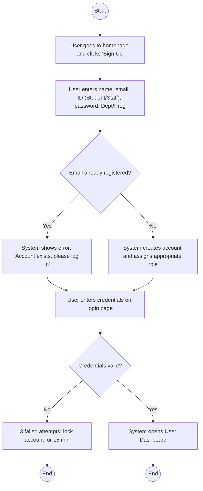
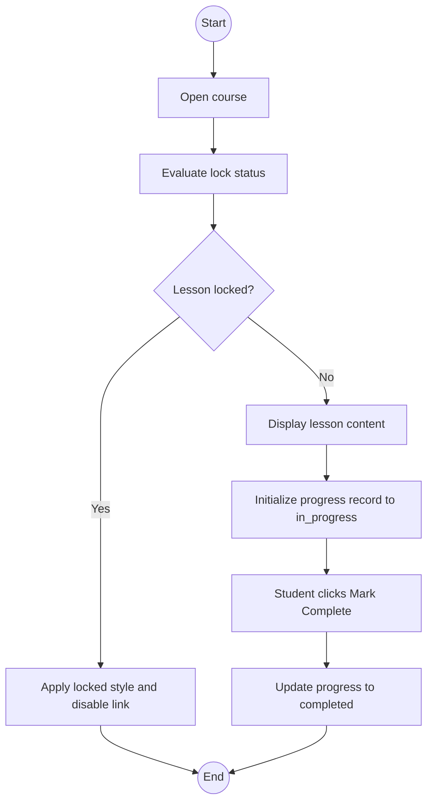
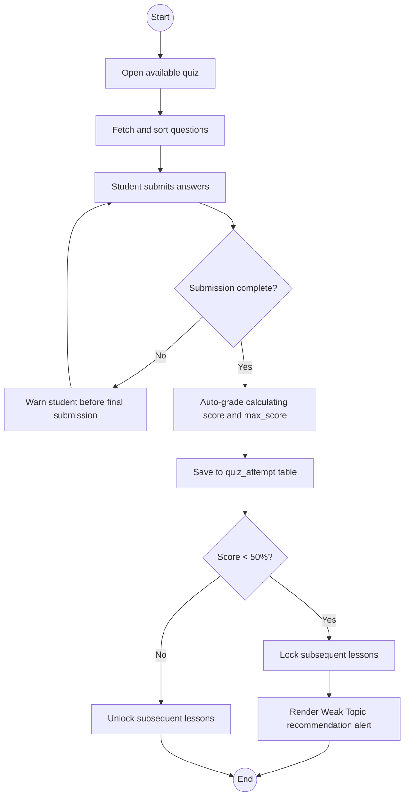
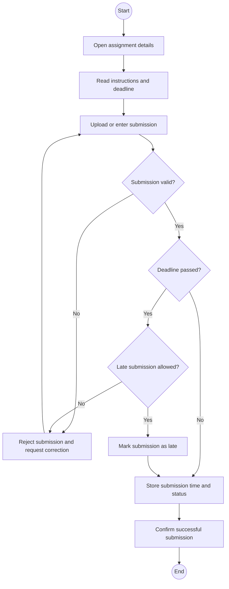
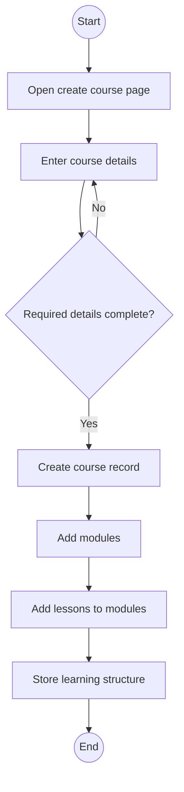
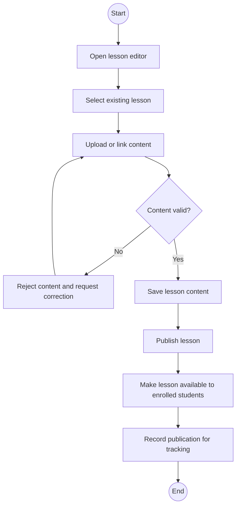
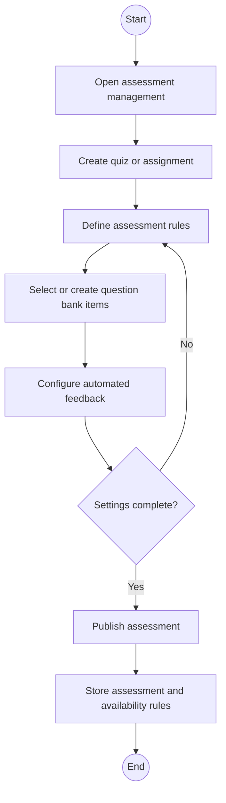
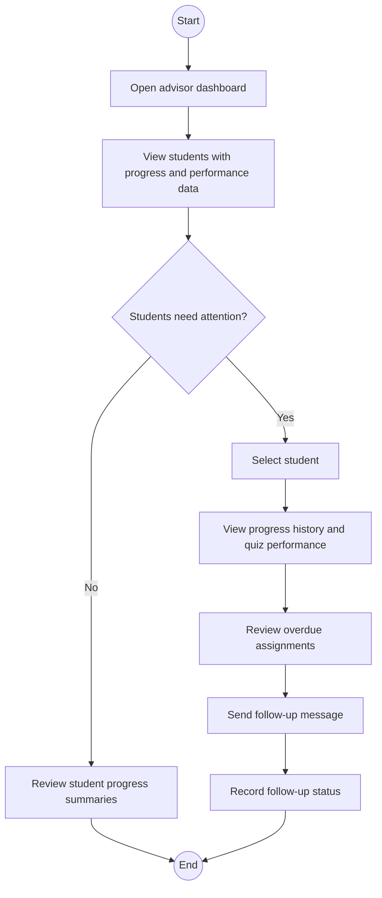
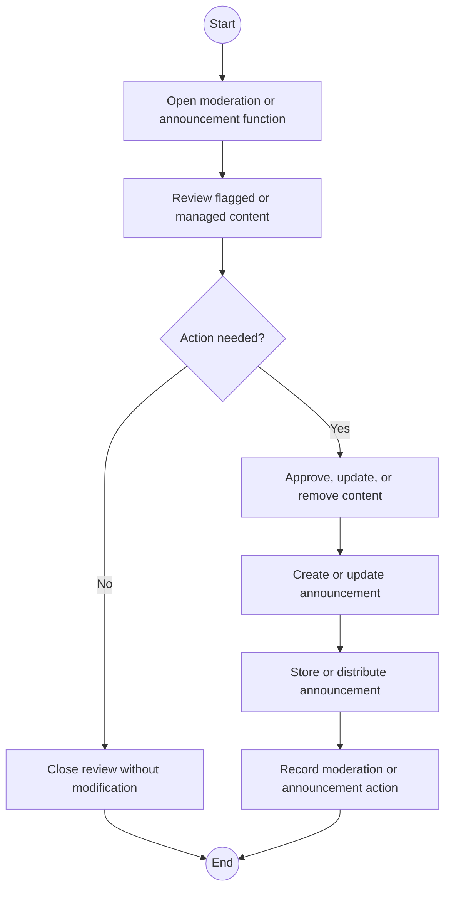

# QuestLearn Activity Diagrams (Diagram-Only)

This document contains only the activity diagrams for formal use cases UC-01 to UC-09.

## UC-01 Register Account and Login

## UC-02 Start Lesson

## UC-03 Attempt Quiz and Receive Automated Feedback

## UC-04 Submit Assignment

## UC-05 Create Course and Learning Structure

## UC-06 Publish Lesson Content

## UC-07 Create Assessment and Configure Feedback

## UC-08 View Advisor Dashboard and Follow Up

## UC-09 Moderate Content and Manage Announcements

