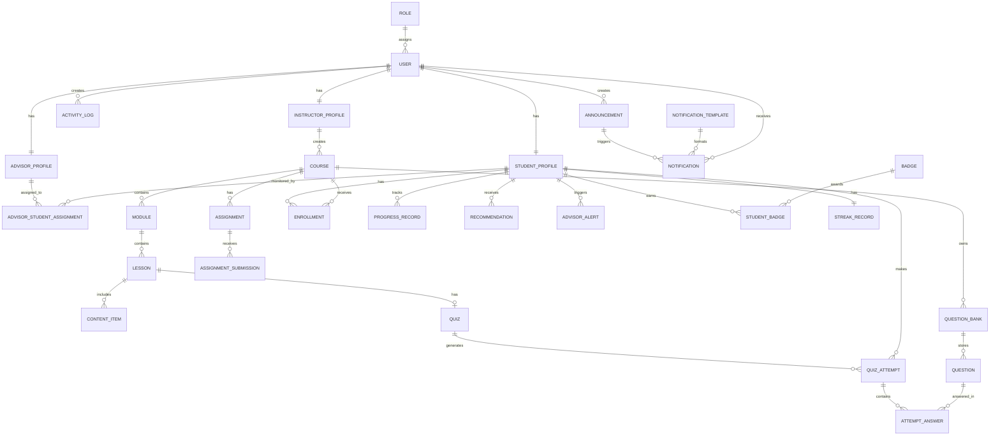
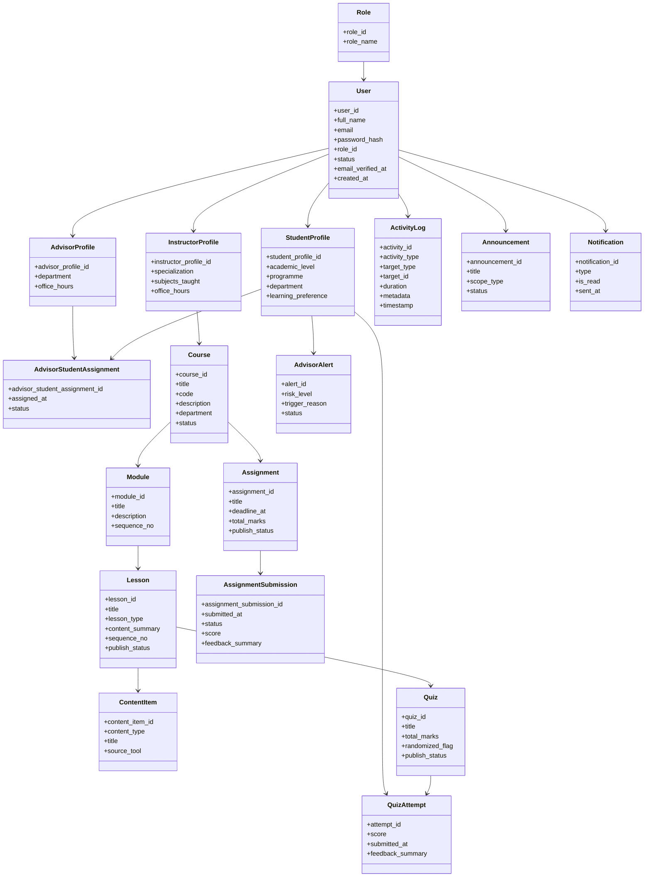

# QuestLearn ERD and UML Reference

## Overview

This document provides the main entities, attributes, and relationships for QuestLearn. It is intended to support ERD preparation for the academic project. The content is presented in diagram-ready text and Mermaid draft form for quick reuse.

For Part I scope control, ERD is the required system model diagram and class diagram is out of scope.

## 1. Core Entities

### 1. User

**Attributes:** `user_id`, `full_name`, `email`, `password_hash`, `role_id`, `status`, `email_verified_at`, `created_at`  
**Purpose:** Stores login and identity information for all platform users.

### 2. Role

**Attributes:** `role_id`, `role_name`  
**Purpose:** Supports role-based access control.  
**Examples:** `Student`, `Instructor`, `Academic Advisor`, `Admin`

### 3. StudentProfile

**Attributes:** `student_profile_id`, `user_id`, `academic_level`, `programme`, `department`, `learning_preference`  
**Purpose:** Stores student-specific academic and preference information.

### 4. InstructorProfile

**Attributes:** `instructor_profile_id`, `user_id`, `specialization`, `subjects_taught`, `office_hours`  
**Purpose:** Stores instructor-specific details.

### 5. AdvisorProfile

**Attributes:** `advisor_profile_id`, `user_id`, `department`, `office_hours`  
**Purpose:** Stores advisor-specific details.

### 6. AdvisorStudentAssignment

**Attributes:** `advisor_student_assignment_id`, `advisor_id`, `student_id`, `assigned_at`, `status`  
**Purpose:** Maps academic advisors to assigned students for monitoring and follow-up.

### 7. Course

**Attributes:** `course_id`, `instructor_id`, `title`, `code`, `description`, `department`, `status`  
**Purpose:** Represents a course created and managed by an instructor.

### 8. Module

**Attributes:** `module_id`, `course_id`, `title`, `description`, `sequence_no`  
**Purpose:** Divides a course into smaller learning units.

### 9. Lesson

**Attributes:** `lesson_id`, `module_id`, `title`, `lesson_type`, `content_summary`, `sequence_no`, `publish_status`  
**Purpose:** Represents a lesson inside a module.

### 10. ContentItem

**Attributes:** `content_item_id`, `lesson_id`, `content_type`, `title`, `file_url`, `embed_url`, `source_tool`  
**Purpose:** Stores lesson assets such as video, reading file, or H5P/Lumi activity.

### 11. Enrollment

**Attributes:** `enrollment_id`, `student_id`, `course_id`, `enrolled_at`  
**Purpose:** Maps students to courses.

### 12. Quiz

**Attributes:** `quiz_id`, `lesson_id`, `title`, `total_marks`, `randomized_flag`, `publish_status`  
**Purpose:** Represents a quiz attached to a lesson.

### 13. Assignment

**Attributes:** `assignment_id`, `course_id`, `lesson_id`, `title`, `description`, `deadline_at`, `total_marks`, `publish_status`  
**Purpose:** Represents an assignment that students must submit within a course.

### 14. AssignmentSubmission

**Attributes:** `assignment_submission_id`, `assignment_id`, `student_id`, `submitted_at`, `submission_url`, `status`, `score`, `feedback_summary`  
**Purpose:** Stores student assignment submissions, submission status, and evaluation details.

### 15. QuestionBank

**Attributes:** `bank_id`, `course_id`, `topic`, `difficulty_level`  
**Purpose:** Groups questions for reuse and randomized quiz generation.

### 16. Question

**Attributes:** `question_id`, `bank_id`, `question_type`, `prompt`, `correct_answer`, `explanation`  
**Purpose:** Stores individual questions and feedback notes.

### 17. QuizAttempt

**Attributes:** `attempt_id`, `quiz_id`, `student_id`, `score`, `submitted_at`, `feedback_summary`  
**Purpose:** Stores a student's submitted quiz attempt.

### 18. AttemptAnswer

**Attributes:** `answer_id`, `attempt_id`, `question_id`, `student_answer`, `is_correct`  
**Purpose:** Stores answers for each question in a quiz attempt.

### 19. ProgressRecord

**Attributes:** `progress_id`, `student_id`, `lesson_id`, `completion_status`, `completion_percentage`, `updated_at`  
**Purpose:** Tracks lesson-level or module-level progress.

### 20. ActivityLog

**Attributes:** `activity_id`, `user_id`, `activity_type`, `target_type`, `target_id`, `duration`, `metadata`, `timestamp`  
**Purpose:** Tracks user actions such as page visits, lesson opening, video viewing, interactive content usage, and quiz attempts.

### 21. Recommendation

**Attributes:** `recommendation_id`, `student_id`, `topic`, `recommendation_type`, `message`, `generated_at`  
**Purpose:** Stores rule-based next-step learning suggestions.

### 22. AdvisorAlert

**Attributes:** `alert_id`, `student_id`, `advisor_id`, `risk_level`, `trigger_reason`, `status`, `created_at`  
**Purpose:** Stores early warning alerts for students who may need intervention.

### 23. Announcement

**Attributes:** `announcement_id`, `created_by_user_id`, `title`, `message`, `scope_type`, `target_scope_id`, `published_at`, `status`  
**Purpose:** Stores platform or course announcements managed by instructors or admins.

### 24. NotificationTemplate

**Attributes:** `notification_template_id`, `name`, `type`, `subject_template`, `body_template`, `status`  
**Purpose:** Stores reusable notification content managed by admins.

### 25. Notification

**Attributes:** `notification_id`, `user_id`, `announcement_id`, `notification_template_id`, `title`, `message`, `type`, `is_read`, `sent_at`  
**Purpose:** Stores reminders, announcements, feedback notices, score announcements, and alerts.

### 26. Badge

**Attributes:** `badge_id`, `name`, `description`, `rule_type`  
**Purpose:** Defines available gamification badges.

### 27. StudentBadge

**Attributes:** `student_badge_id`, `student_id`, `badge_id`, `awarded_at`  
**Purpose:** Stores badge awards for students.

### 28. StreakRecord

**Attributes:** `streak_record_id`, `student_id`, `current_streak`, `longest_streak`, `updated_at`  
**Purpose:** Tracks consistency-based motivation indicators.

## 2. Main Relationships

The following relationships are the most important ones to show in the ERD:

- `Role` 1..* `User`
- `User` 1..1 `StudentProfile`
- `User` 1..1 `InstructorProfile`
- `User` 1..1 `AdvisorProfile`
- `AdvisorProfile` 1..* `AdvisorStudentAssignment`
- `StudentProfile` 1..* `AdvisorStudentAssignment`
- `InstructorProfile` 1..* `Course`
- `Course` 1..* `Module`
- `Module` 1..* `Lesson`
- `Lesson` 1..* `ContentItem`
- `Lesson` 0..1 `Quiz`
- `Course` 1..* `Assignment`
- `Assignment` 1..* `AssignmentSubmission`
- `Course` 1..* `QuestionBank`
- `QuestionBank` 1..* `Question`
- `Quiz` *..* `Question` through a quiz-question bridge if needed
- `StudentProfile` *..* `Course` through `Enrollment`
- `StudentProfile` 1..* `QuizAttempt`
- `QuizAttempt` 1..* `AttemptAnswer`
- `StudentProfile` 1..* `ProgressRecord`
- `User` 1..* `ActivityLog`
- `StudentProfile` 1..* `Recommendation`
- `StudentProfile` 1..* `AdvisorAlert`
- `User` 1..* `Announcement`
- `NotificationTemplate` 1..* `Notification`
- `Announcement` 0..* `Notification`
- `User` 1..* `Notification`
- `StudentProfile` 1..* `StudentBadge`
- `Badge` 1..* `StudentBadge`
- `StudentProfile` 1..1 `StreakRecord`

## 3. Diagram-Ready Entity Grouping

### Identity and Access

- `Role`
- `User`
- `StudentProfile`
- `InstructorProfile`
- `AdvisorProfile`
- `AdvisorStudentAssignment`

### Learning Structure

- `Course`
- `Module`
- `Lesson`
- `ContentItem`
- `Enrollment`

### Assessment and Performance

- `Quiz`
- `Assignment`
- `AssignmentSubmission`
- `QuestionBank`
- `Question`
- `QuizAttempt`
- `AttemptAnswer`
- `ProgressRecord`

### Support and Analytics

- `ActivityLog`
- `Recommendation`
- `AdvisorAlert`
- `Announcement`
- `NotificationTemplate`
- `Notification`

### Motivation Support

- `Badge`
- `StudentBadge`
- `StreakRecord`

## 4. Integration Notes

QuestLearn is intended to use shared data across the full workflow rather than isolated modules. Activity tracking supports engagement analytics and advisor alerts. Quiz attempts and assignment submissions support performance summaries, feedback, and recommendations. Advisor-student assignment connects alerts to specific academic advisors. Announcements and notification templates support delivery of deadlines, new content updates, and score announcements.

## 5. Mermaid Draft - ERD

## 6. Archived Mermaid Draft - Expanded Class Diagram (Out of Scope for Part I)

