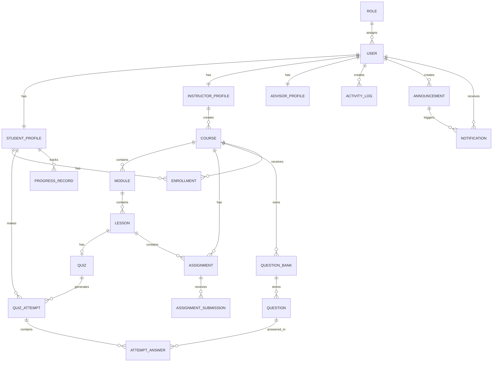
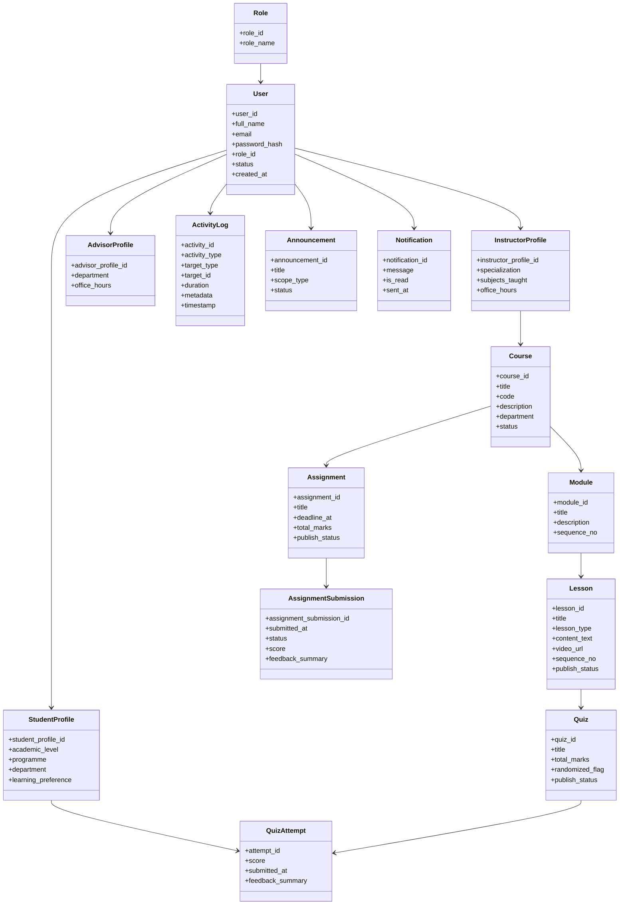

# QuestLearn ERD and UML Reference

## Overview

This document provides the main entities, attributes, and relationships for QuestLearn. It is intended to support ERD preparation for the academic project. The content is presented in diagram-ready text and Mermaid draft form for quick reuse.

For Part I scope control, ERD is the required system model diagram and class diagram is out of scope.

## Corrections Applied (summary)

- Marked `StudentProfile.user_id`, `InstructorProfile.user_id`, and `AdvisorProfile.user_id` as `FK + UNIQUE` (one profile row per user).
- Added missing `course_id` FK to `Enrollment` and added `student_profile_id` FK to `AssignmentSubmission`.
- Added `student_profile_id` FK to `QuizAttempt` and `question_id` FK to `AttemptAnswer`.
- Added `lesson_id` FK to `ProgressRecord` (optional context-level progress).
- Added `created_by_user_id` FK to `Announcement`.
- Added `user_id` and `announcement_id` FKs to `Notification`.

These corrections are applied to the repository ERD XML (`part-i/ERD-UML.drawio.xml`) so the diagram now includes the missing FK columns and explicitly documents unique profile constraints.

## 1. Core Entities

### 1. User

**Attributes:** `user_id`, `full_name`, `email`, `password_hash`, `role_id`, `status`, `created_at`  
**Purpose:** Stores login and identity information for all platform users.

### 2. Role

**Attributes:** `role_id`, `role_name`  
**Purpose:** Supports role-based access control.  
**Examples:** `Student`, `Instructor`, `Academic Advisor`, `Admin`

### 3. StudentProfile

**Attributes:** `student_profile_id`, `user_id`, `academic_level`, `programme`, `department`, `learning_preference`  
**Purpose:** Stores student-specific academic and preference information.

### 4. InstructorProfile

**Attributes:** `instructor_profile_id`, `user_id`, `specialization`, `subjects_taught`, `office_hours`  
**Purpose:** Stores instructor-specific details.

### 5. AdvisorProfile

**Attributes:** `advisor_profile_id`, `user_id`, `department`, `office_hours`  
**Purpose:** Stores advisor-specific details for student monitoring and follow-up.

### 6. Course

**Attributes:** `course_id`, `instructor_profile_id` (FK), `title`, `code`, `description`, `department`, `status`  
**Purpose:** Represents a course created and managed by an instructor.

### 7. Module

**Attributes:** `module_id`, `course_id`, `title`, `description`, `sequence_no`  
**Purpose:** Divides a course into smaller learning units.

### 8. Lesson

**Attributes:** `lesson_id`, `module_id`, `title`, `lesson_type`, `content_text`, `video_url`, `sequence_no`, `publish_status`  
**Purpose:** Represents a lesson inside a module. Lesson content such as reading material and embedded video is stored directly within the lesson record.

### 9. Enrollment

**Attributes:** `enrollment_id`, `student_profile_id` (FK), `course_id` (FK), `enrolled_at`  
**Purpose:** Maps students to courses.

### 10. Quiz

**Attributes:** `quiz_id`, `lesson_id`, `title`, `total_marks`, `randomized_flag`, `publish_status`  
**Purpose:** Represents a quiz attached to a lesson.

### 11. Assignment

**Attributes:** `assignment_id`, `course_id` (FK), `lesson_id` (FK, optional if assignment is lesson-linked), `title`, `description`, `deadline_at`, `total_marks`, `publish_status`  
**Purpose:** Represents an assignment that students must submit within a course.

### 12. AssignmentSubmission

**Attributes:** `assignment_submission_id`, `assignment_id` (FK), `student_profile_id` (FK), `submitted_at`, `submission_url`, `status`, `score`, `feedback_summary`  
**Purpose:** Stores student assignment submissions, submission status, and evaluation details.

### 13. QuestionBank

**Attributes:** `bank_id`, `course_id`, `topic`, `difficulty_level`  
**Purpose:** Groups questions for reuse and randomized quiz generation.

### 14. Question

**Attributes:** `question_id`, `bank_id`, `question_type`, `prompt`, `correct_answer`, `explanation`  
**Purpose:** Stores individual questions and feedback notes.

### 15. QuizAttempt

**Attributes:** `attempt_id`, `quiz_id` (FK), `student_profile_id` (FK), `score`, `submitted_at`, `feedback_summary`  
**Purpose:** Stores a student's submitted quiz attempt.

### 16. AttemptAnswer

**Attributes:** `answer_id`, `attempt_id`, `question_id`, `student_answer`, `is_correct`  
**Purpose:** Stores answers for each question in a quiz attempt.

### 17. ProgressRecord

**Attributes:** `progress_id`, `student_profile_id` (FK), `lesson_id` (FK), `completion_status`, `completion_percentage`, `updated_at`  
**Purpose:** Tracks lesson-level or module-level progress.

### 18. ActivityLog

**Attributes:** `activity_id`, `user_id`, `activity_type`, `target_type`, `target_id`, `duration`, `metadata`, `timestamp`  
**Purpose:** Tracks user actions such as page visits, lesson opening, video viewing, and quiz attempts.

### 19. Announcement

**Attributes:** `announcement_id`, `created_by_user_id`, `title`, `message`, `scope_type`, `target_scope_id`, `published_at`, `status`  
**Purpose:** Stores platform or course announcements managed by instructors or admins.

### 20. Notification

**Attributes:** `notification_id`, `user_id`, `announcement_id`, `message`, `is_read`, `sent_at`  
**Purpose:** Stores in-app notifications such as deadline reminders, new content alerts, and quiz score announcements.

## 2. Main Relationships

The following relationships are the most important ones to show in the ERD:

- `Role` 1..\* `User`
- `User` 1..1 `StudentProfile`
- `User` 1..1 `InstructorProfile`
- `User` 1..1 `AdvisorProfile`
- `InstructorProfile` 1..\* `Course`
- `Course` 1..\* `Module`
- `Module` 1..\* `Lesson`
- `Lesson` 0..1 `Quiz`
- `Course` 1..\* `Assignment`
- `Lesson` 0..\* `Assignment`
- `Assignment` 1..\* `AssignmentSubmission`
- `Course` 1..\* `QuestionBank`
- `QuestionBank` 1..\* `Question`
- `Quiz` _.._ `Question` through a quiz-question bridge if needed
- `StudentProfile` _.._ `Course` through `Enrollment`
- `StudentProfile` 1..\* `QuizAttempt`
- `QuizAttempt` 1..\* `AttemptAnswer`
- `StudentProfile` 1..\* `ProgressRecord`
- `User` 1..\* `ActivityLog`
- `User` 1..\* `Announcement`
- `Announcement` 0..\* `Notification`
- `User` 1..\* `Notification`

### 2.1 PK/FK Constraint Notes

- `StudentProfile.user_id`, `InstructorProfile.user_id`, and `AdvisorProfile.user_id` should be `FK + UNIQUE` so each user has at most one profile of each type.
- `Enrollment` and similar bridge tables should keep their own PK, but also enforce a unique pair on the linked FK columns to avoid duplicate links.
- If `Assignment.lesson_id` stays in the model, the ERD should also show the `Lesson` to `Assignment` relationship.

## 3. Diagram-Ready Entity Grouping

### Identity and Access

- `Role`
- `User`
- `StudentProfile`
- `InstructorProfile`
- `AdvisorProfile`

### Learning Structure

- `Course`
- `Module`
- `Lesson`
- `Enrollment`

### Assessment and Performance

- `Quiz`
- `Assignment`
- `AssignmentSubmission`
- `QuestionBank`
- `Question`
- `QuizAttempt`
- `AttemptAnswer`
- `ProgressRecord`

### Support and Analytics

- `ActivityLog`
- `Announcement`
- `Notification`

## 4. Integration Notes

QuestLearn is intended to use shared data across the full workflow rather than isolated modules. Activity tracking supports engagement analytics and advisor dashboards. Quiz attempts and assignment submissions support performance summaries and automated feedback. Advisors can review students in their department using progress and activity data. Announcements and notifications support delivery of deadlines, new content updates, and score announcements.

## 5. Mermaid Draft - ERD

## 6. Archived Mermaid Draft - Expanded Class Diagram (Out of Scope for Part I)

