# QuestLearn Use Cases

## Overview

This document provides the use case reference for QuestLearn. It is written to support both academic report writing and UML diagram preparation. The content includes a full role-based use case list, formal use case descriptions, and process-flow drafts that can later be redrawn as submission-grade UML and activity diagrams.

## 1. Full Use Case List

### 1.1 Student Use Cases

1. Register account
2. Log in
3. Log out
4. Manage profile
5. View enrolled courses
6. View course modules
7. View lessons
8. Start lesson
9. Watch embedded video
10. Attempt quiz
11. Submit assignment
12. Receive automated feedback
13. View quiz history
14. View assignment status
15. View module completion progress
16. View recommended next steps
17. Review weak topics
18. View grades and assessment history
19. Receive notifications

### 1.2 Instructor Use Cases

1. Register account
2. Log in
3. Manage instructor profile
4. Create course
5. Edit course details
6. Create module
7. Create lesson
8. Upload video content
9. Add reading content
10. Create quiz
11. Create assignment
12. Build question bank
13. Randomize assessment questions
14. Configure automated feedback
15. Publish lesson
16. Publish module
17. Update course content
18. Review assignment submissions
19. View student attempts
20. View class performance analytics
21. View course engagement analytics
22. Send course announcements

### 1.3 Academic Advisor Use Cases

1. Log in
2. View department students
3. View student progress summary
4. View quiz performance trends
5. View overdue assignments
6. View student learning history summary
7. Send advisory message
8. Monitor follow-up status

### 1.4 Admin Use Cases

1. Log in
2. Manage users
3. Assign roles
4. Approve instructor accounts
5. Manage departments or programmes
6. Moderate learning content
7. Manage announcements
8. View platform-wide analytics
9. Deactivate account
10. Reactivate account
11. Reset user password

## 2. Core Use Cases for the Main Diagram

These are the main use cases to prioritize in the final UML use case diagram:

- Register account
- Log in
- Manage profile
- Start lesson
- Attempt quiz
- Submit assignment
- View progress
- Create course
- Create lesson
- Upload learning content
- Create assignment
- View department students
- Manage users
- Manage announcements

## 3. Diagram-Ready Actor Mapping

### Student

- Register account
- Log in
- Manage profile
- Start lesson
- Attempt quiz
- Submit assignment
- Receive automated feedback
- View progress
- View recommended next steps
- Receive notifications

### Instructor

- Register account
- Log in
- Manage instructor profile
- Create course
- Create lesson
- Upload learning content
- Create quiz
- Create assignment
- Configure automated feedback
- View analytics
- Send course announcements

### Academic Advisor

- Log in
- View department students
- View progress summary
- Review overdue assignments
- Send advisory message

### Admin

- Log in
- Manage users
- Assign roles
- Approve instructor accounts
- Moderate learning content
- Manage announcements
- Reset user password

## 4. Formal Use Case Descriptions

### UC-01 Register Account and Login

**Primary Actor:** Student or Instructor  
**Trigger:** The user selects the registration function.  
**Precondition:** The user does not already have an active account.  
**Main Flow:**

1. The user opens the registration page.
2. The user enters required account information (name, email, student/staff ID, password, programme).
3. The system checks whether the email is already registered.
4. If the email is not registered, the system creates the account and assigns the appropriate role.
5. The user enters credentials on the login page.
6. The system validates the credentials and opens the user dashboard.

**Alternate Flow:**

1. If the email is already registered, the system shows an error and directs the user to log in.
2. If the credentials are invalid after 3 attempts, the system locks the account for 15 minutes.

**Postcondition:** The account is created and the user is logged in to their role-appropriate dashboard.

### UC-02 Start Lesson

**Primary Actor:** Student  
**Trigger:** The student selects a lesson from an enrolled course.  
**Precondition:** The student is logged in and enrolled in the selected course.  
**Main Flow:**

1. The student opens a course.
2. The system evaluates module locking status; if the previous lesson's quiz score is >= 50%, the current lesson is unlocked.
3. The student selects an available lesson.
4. The system initializes a `progress_record` row with `completion_status = 'in_progress'` and a baseline percentage.
5. The system displays lesson content, which may include reading material, YouTube embeds, or H5P/Lumi iframes.
6. The student clicks the "Mark Complete" toggle.
7. The system updates the `progress_record` status to `completed` and percentage to `100`.

**Alternate Flow:**

1. If the lesson falls sequentially after a quiz where the student scored < 50%, the system disables the lesson link, applies a locked style, and prevents access.
2. If the lesson is unpublished, the system informs the student that access is not currently available.

**Postcondition:** The lesson access event is stored in `progress_record` for tracking and analytics.

### UC-03 Attempt Quiz and Receive Automated Feedback

**Primary Actor:** Student  
**Trigger:** The student opens an available lesson quiz.  
**Precondition:** The student is logged in and the selected quiz is available.  
**Main Flow:**

1. The student starts the quiz.
2. The system fetches and sorts the questions by `sequence_no`.
3. The student submits answers.
4. The system auto-grades the attempt, calculating `score` and `max_score`, and saves it to the `quiz_attempt` table.
5. The system calculates the percentage. If the percentage is < 50%, the system flags the module as containing a Weak Topic, restricts access to subsequent lessons, and renders a "Weak Topic Detected" recommendation alert banner.
6. If the score is >= 50%, the system unlocks the next module sequences.

**Alternate Flow:**

1. If the quiz submission is incomplete, the system warns the student before final submission.

**Postcondition:** The attempt result is saved for performance analysis, and the course module locking state is dynamically updated based on the score.

### UC-04 Submit Assignment

**Primary Actor:** Student  
**Trigger:** The student opens an active assignment.  
**Precondition:** The student is logged in, enrolled in the course, and the assignment deadline has not passed unless late submission is allowed.  
**Main Flow:**

1. The student opens the assignment details page.
2. The system displays assignment instructions, deadline, and submission rules.
3. The student uploads or submits the required work.
4. The system validates the submission.
5. The system records the submission time and status.
6. The system confirms successful assignment submission.

**Alternate Flow:**

1. If the file format or submission data is invalid, the system rejects the submission and requests correction.
2. If the deadline has passed, the system either blocks submission or marks it as late according to configured rules.

**Postcondition:** The assignment submission is stored for instructor review and student history.

### UC-05 Create Course and Learning Structure

**Primary Actor:** Instructor  
**Trigger:** The instructor selects the create course function.  
**Precondition:** The instructor account is active and approved.  
**Main Flow:**

1. The instructor opens the create course page.
2. The instructor enters course details such as title, code, department, and description.
3. The system creates the course record.
4. The instructor adds modules to the course.
5. The instructor adds lessons to each module.
6. The system stores the learning structure for later content publishing and student access.

**Alternate Flow:**

1. If required course details are missing, the system requests correction before saving.

**Postcondition:** The course structure is available for content, quiz, and assignment setup.

### UC-06 Publish Lesson Content

**Primary Actor:** Instructor  
**Trigger:** The instructor opens the lesson editor.  
**Precondition:** A course, module, and lesson already exist.  
**Main Flow:**

1. The instructor selects a lesson.
2. The instructor uploads or links reading material and video content.
3. The instructor saves lesson content.
4. The instructor publishes the lesson.
5. The system makes the lesson available to enrolled students.
6. The system records content publication for notification and analytics purposes.

**Alternate Flow:**

1. If uploaded or embedded content is invalid, the system rejects the content and requests correction.

**Postcondition:** Students can access the published lesson and the system can notify affected users.

### UC-07 Create Assessment and Configure Feedback

**Primary Actor:** Instructor  
**Trigger:** The instructor opens an assessment management function.  
**Precondition:** The instructor has an active course and lesson or assignment target.  
**Main Flow:**

1. The instructor creates a quiz or assignment.
2. The instructor defines assessment rules such as question type, deadline, and marking configuration.
3. The instructor selects or creates question bank items for quizzes.
4. The instructor configures automated feedback for objective questions.
5. The instructor publishes the assessment.
6. The system stores the assessment and makes it available according to course rules.

**Alternate Flow:**

1. If assessment settings are incomplete, the system blocks publishing until the required fields are completed.

**Postcondition:** The assessment is available for student completion and later analytics.

### UC-08 View Advisor Dashboard and Follow Up

**Primary Actor:** Academic Advisor  
**Trigger:** The advisor opens the dashboard.  
**Precondition:** The advisor is logged in and has students in their department.  
**Main Flow:**

1. The advisor opens the advisor dashboard (`/advisor/students`).
2. The system queries the `advisor_student_assignment` table to fetch only the students directly assigned to this advisor.
3. The system displays these students along with progress summaries, quiz scores, overdue work, and active `advisor_alert` signals.
4. The advisor selects an at-risk student.
5. The advisor reviews the student's performance data and alert triggers.
6. The advisor authors a follow-up advisory message, optionally linking an `instructor_profile_id`.
7. The system records the message in `advisor_follow_up` and updates the alert status to resolved.

**Alternate Flow:**

1. If no students require attention, the advisor can still review student progress summaries.

**Postcondition:** The advisor has current information for follow-up and the follow-up action is recorded.

### UC-09 Moderate Content and Manage Announcements

**Primary Actor:** Admin  
**Trigger:** The admin opens a moderation or announcement function.  
**Precondition:** The admin is logged in.  
**Main Flow:**

1. The admin opens the Admin Dashboard (`/admin/users`).
2. The system queries the `user` table for accounts with `account_status = 'pending'`.
3. The admin reviews the pending Instructor or Advisor registrations.
4. The admin clicks "Approve" (updating status to `active`) or "Decline" (removing or suspending the account).
5. The system records this oversight operation in the `moderation_action` table.

**Alternate Flow:**

1. If content does not require moderation changes, the admin closes the review without modification.
2. If a user requests a password reset, the admin selects the user, resets the password to a temporary default value, and the user must change their password upon next login.

**Postcondition:** Moderation, announcement, and password reset actions are stored and can affect user notifications, content availability, or account access.

## 5. Process-Flow Drafts

### 5.1 Registration and Login Flow

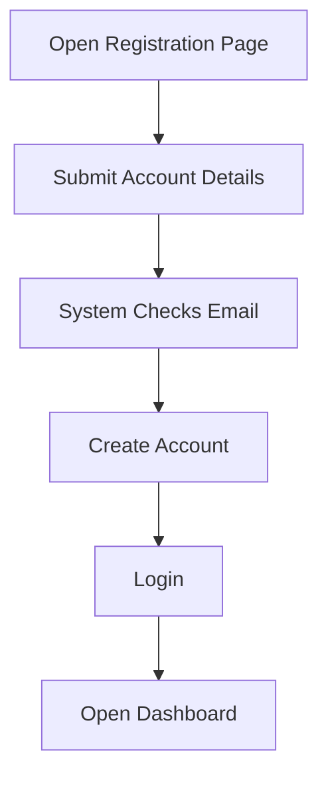

### 5.2 Student Lesson and Quiz Flow

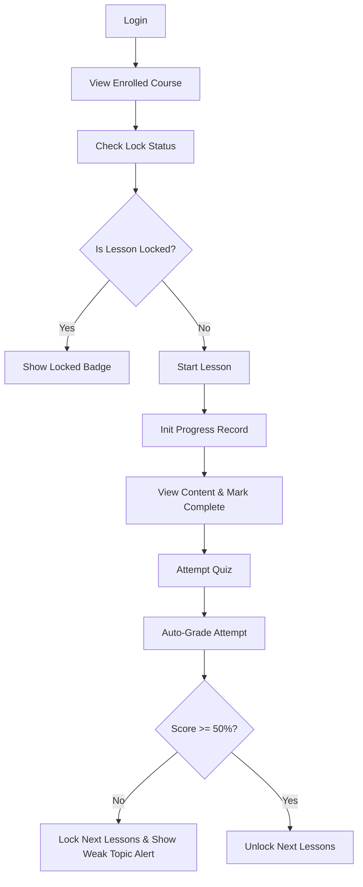

### 5.3 Assignment Submission Flow

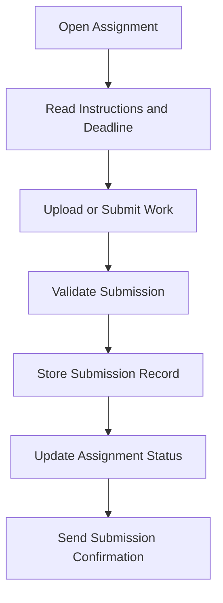

### 5.4 Instructor Content and Assessment Setup Flow

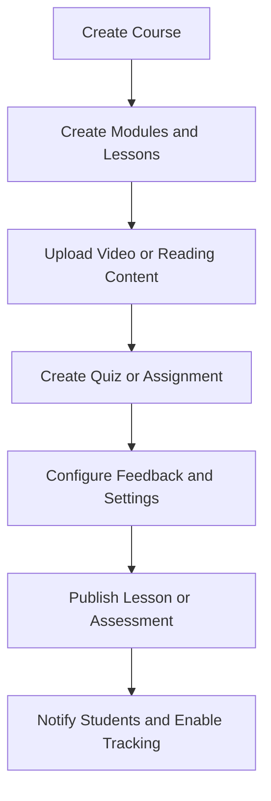

### 5.5 Advisor Review and Follow-Up Flow

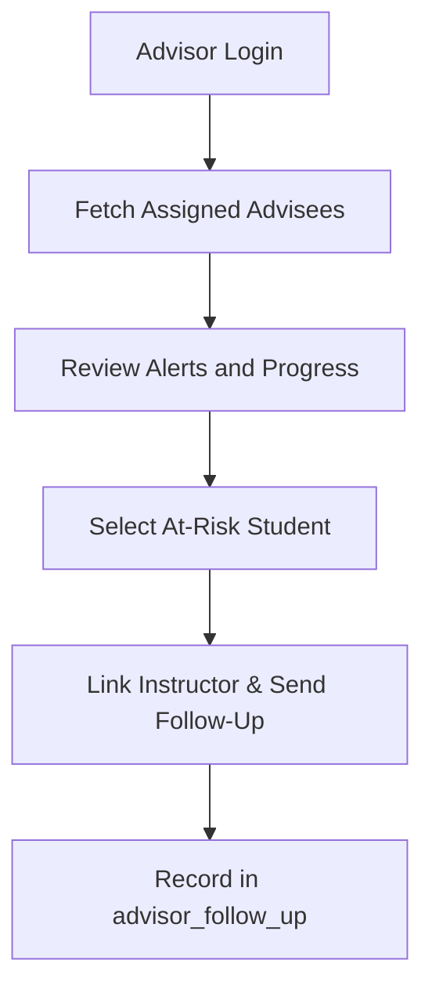

### 5.6 Admin Moderation and Announcement Flow

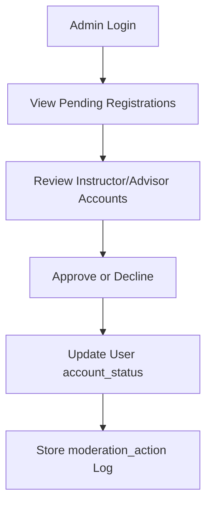

## 6. Activity Diagrams for Formal Use Cases

### UC-01 Register Account and Login

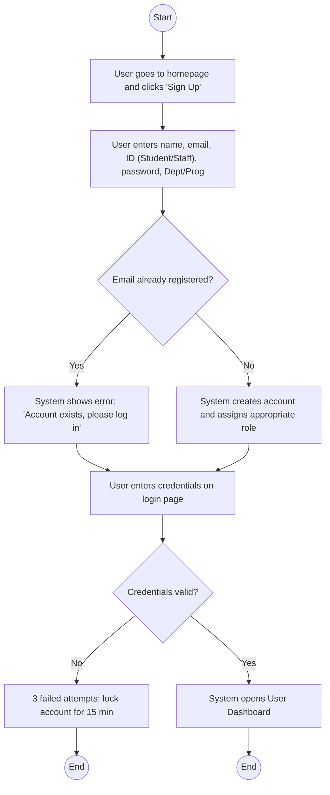

### UC-02 Start Lesson

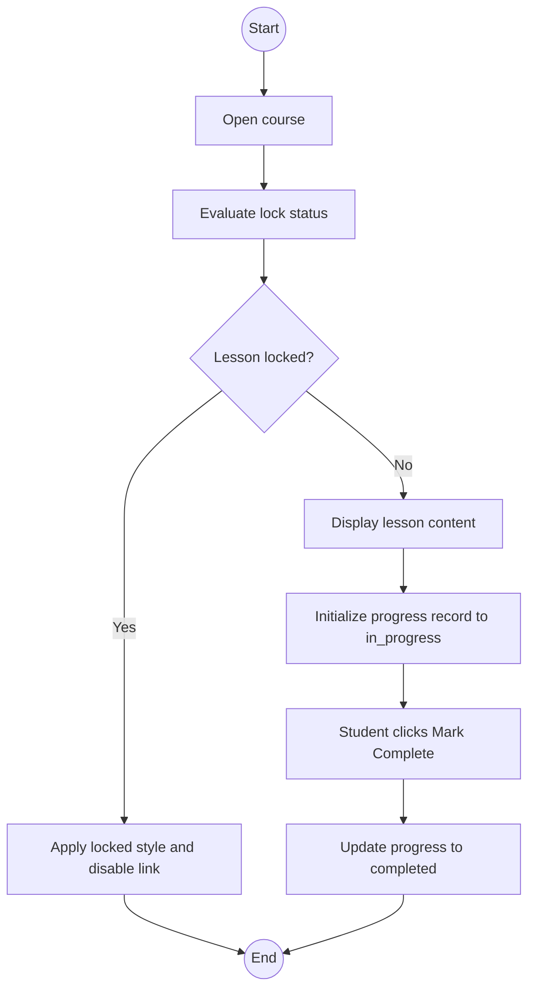

### UC-03 Attempt Quiz and Receive Automated Feedback

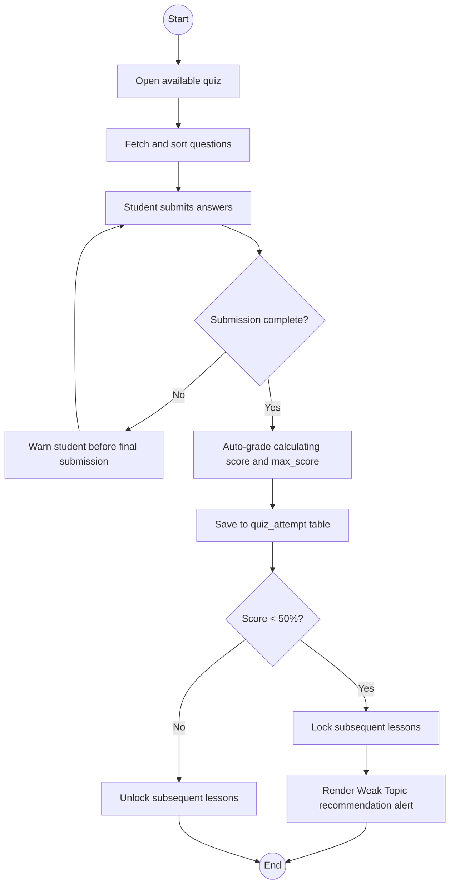

### UC-04 Submit Assignment

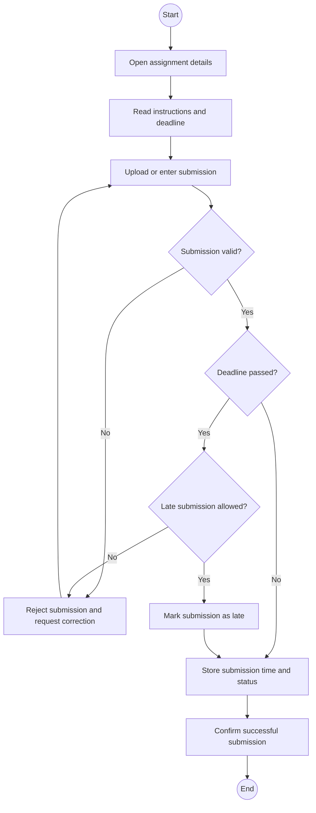

### UC-05 Create Course and Learning Structure

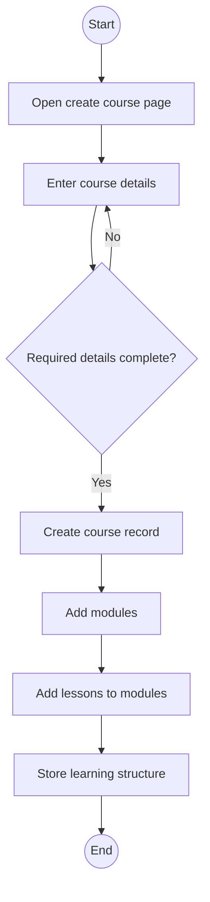

### UC-06 Publish Lesson Content

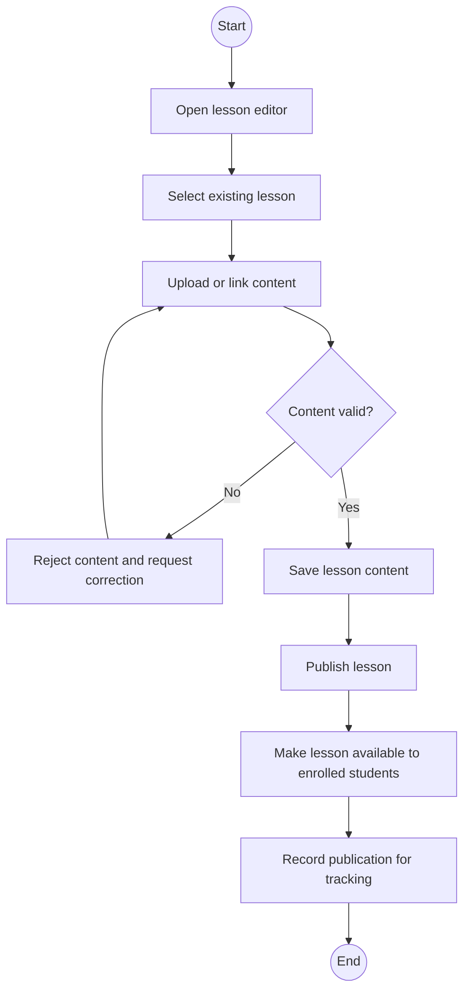

### UC-07 Create Assessment and Configure Feedback

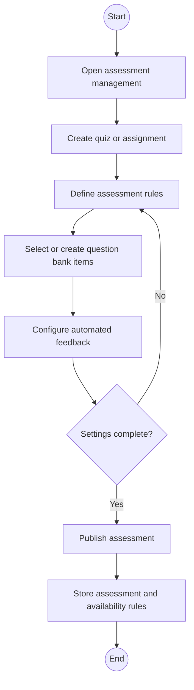

### UC-08 View Advisor Dashboard and Follow Up

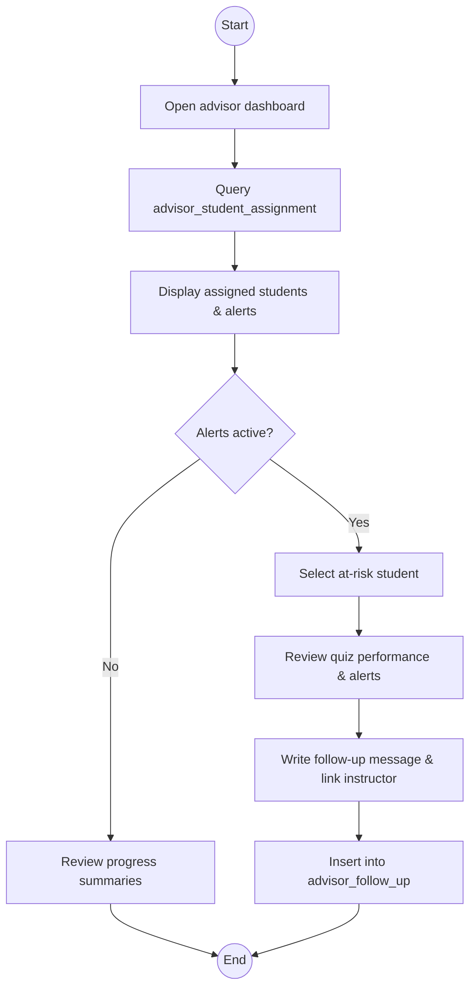

### UC-09 Moderate Content and Manage Announcements

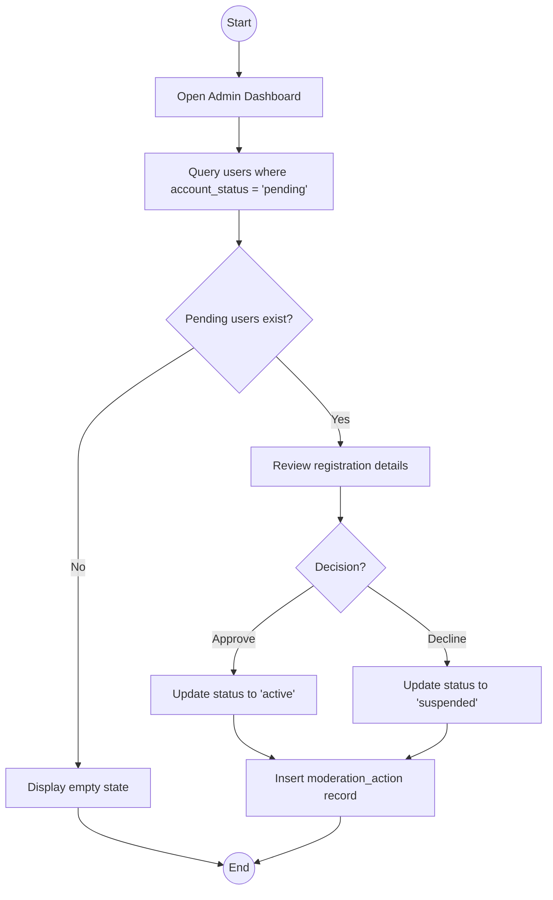
