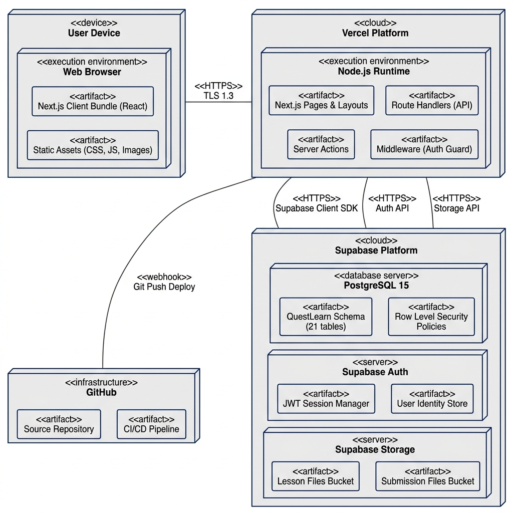

# Software Design Specification for QuestLearn System

**Version 2.0**

**Tutorial Section: TT7L**

**Group No.: 5**

| Name | Student # | |
| --- | --- | --- |
| See Wing Kit | 261UC240PJ | |
| Aziel Tan Zheng Chuan | 261UC240LY | |
| Vincent Lock Chun Kit | 261UC2406W | |
| Soo Kian Rong | 261UC26145 | |

| | |
| --- | --- |
| **Date:** | 04/05/2026 |

---

# Contents

- [Revisions](#revisions)
- [1 System Overview](#1-system-overview)
  - [1.1 Description](#11-description)
  - [1.2 Actors](#12-actors)
  - [1.3 Assumptions and Dependencies](#13-assumptions-and-dependencies)
  - [1.4 Use Case Diagram](#14-use-case-diagram)
- [2 Use Cases](#2-use-cases)
  - [2.1 Use Case Diagram](#21-use-case-diagram)
  - [2.2 Student Use Cases](#22-student-use-cases)
    - [2.2.1 UC-01 Register Account and Login](#221-uc-01-register-account-and-login)
    - [2.2.2 UC-02 Start Lesson](#222-uc-02-start-lesson)
    - [2.2.3 UC-03 Attempt Quiz and Receive Automated Feedback](#223-uc-03-attempt-quiz-and-receive-automated-feedback)
    - [2.2.4 UC-04 Submit Assignment](#224-uc-04-submit-assignment)
  - [2.3 Instructor Use Cases](#23-instructor-use-cases)
    - [2.3.1 UC-05 Create Course and Learning Structure](#231-uc-05-create-course-and-learning-structure)
    - [2.3.2 UC-06 Publish Lesson Content](#232-uc-06-publish-lesson-content)
    - [2.3.3 UC-07 Create Assessment and Configure Feedback](#233-uc-07-create-assessment-and-configure-feedback)
  - [2.4 Advisor Use Cases](#24-advisor-use-cases)
    - [2.4.1 UC-08 View Advisor Dashboard and Follow Up](#241-uc-08-view-advisor-dashboard-and-follow-up)
  - [2.5 Admin Use Cases](#25-admin-use-cases)
    - [2.5.1 UC-09 Moderate Content and Manage Announcements](#251-uc-09-moderate-content-and-manage-announcements)
- [3 Data Design](#3-data-design)
  - [3.1 Design Class Diagram / ERD](#31-design-class-diagram--erd)
  - [3.2 Data Dictionary](#32-data-dictionary)
  - [3.3 Data Structures](#33-data-structures)
    - [3.3.1 Identity and Access Group](#331-identity-and-access-group)
    - [3.3.2 Learning Structure Group](#332-learning-structure-group)
    - [3.3.3 Assessment and Performance Group](#333-assessment-and-performance-group)
    - [3.3.4 Support and Analytics Group](#334-support-and-analytics-group)
  - [3.4 Entity Lifecycle States](#34-entity-lifecycle-states)
- [4 Architecture Design](#4-architecture-design)
  - [4.1 Software Architecture](#41-software-architecture)
    - [4.1.1 Subsystem 1 — Authentication and User Management](#411-subsystem-1--authentication-and-user-management)
    - [4.1.2 Subsystem 2 — Course and Content Management](#412-subsystem-2--course-and-content-management)
    - [4.1.3 Subsystem 3 — Grading, Progress, and Analytics](#413-subsystem-3--grading-progress-and-analytics)
    - [4.1.4 Subsystem 4 — Notifications, Advisor Support, and Admin](#414-subsystem-4--notifications-advisor-support-and-admin)
- [5 Interface Design](#5-interface-design)
  - [5.1 Main Screens](#51-main-screens)
  - [5.2 Subsystem 1 Screens — Authentication and User Management](#52-subsystem-1-screens--authentication-and-user-management)
  - [5.3 Subsystem 2 Screens — Course and Content Management](#53-subsystem-2-screens--course-and-content-management)
  - [5.4 Subsystem 3 Screens — Grading, Progress, and Analytics](#54-subsystem-3-screens--grading-progress-and-analytics)
  - [5.5 Subsystem 4 Screens — Notifications, Advisor, and Admin](#55-subsystem-4-screens--notifications-advisor-and-admin)
- [6 Component Design](#6-component-design)
  - [6.1 Main Components](#61-main-components)
    - [6.1.1 Component 1 — GradingService (Auto-Grading Algorithm)](#611-component-1--gradingservice-auto-grading-algorithm)
  - [6.2 Component Processing Workflows (Activity Diagrams)](#62-component-processing-workflows-activity-diagrams)
- [7 Deployment Design](#7-deployment-design)
  - [7.1 Deployment Diagram](#71-deployment-diagram)
- [Summary](#summary)
- [References](#references)

---

# Revisions

| Version | Primary Author(s) | Description of Version | Date Completed |
| --- | --- | --- | --- |
| 1.0 | All members | SRS — Part I (Project Planning / Requirements Analysis) | 01/05/2026 |
| 2.0 | All members | SDS — Part II (Design / Architecture / Interfaces / Database) | [fill in] |

---

# 1 System Overview

## 1.1 Description

QuestLearn is a Smart Interactive Learning System that combines microlearning principles, interactive content delivery, formative assessment, progress analytics, and advisor-oriented early alert support. The system enables students to engage in guided learning sprints, receive immediate quiz feedback with weak-topic detection, and track their progress through role-appropriate dashboards. Instructors create and manage course structures with embedded video and reading content, while academic advisors monitor student performance for early intervention. Administrators oversee platform-wide user management, content moderation, and announcements.

The major process groups and their relationships are summarised in the following table.

| Actors | Major Processes |
| --- | --- |
| Student | Register account, log in, manage profile, start lesson, attempt quiz, submit assignment, view progress and grades, receive automated feedback and recommendations, receive notifications |
| Instructor | Register account, log in, manage instructor profile, create and publish courses, modules, lessons, create quizzes and assignments, configure automated feedback, view engagement and performance analytics |
| Academic Advisor | Log in, view department students, review progress summaries and quiz performance, review overdue assignments, send advisory follow-up |
| Admin | Log in, manage users and roles, approve instructor accounts, reset user passwords, moderate learning content, manage announcements, view platform analytics |

## 1.2 Actors

The system supports four primary actor types. The actor definitions and their associated use cases are identical to those documented in Part I, Section 2.2.

- **Student** — Engages with learning content, completes assessments, and tracks progress.
- **Instructor** — Creates and manages course content, assessments, and reviews analytics.
- **Academic Advisor** — Monitors department students and follows up with at-risk learners.
- **Admin** — Manages platform users, moderates content, and creates announcements.

## 1.3 Assumptions and Dependencies

The assumptions and dependencies established in Part I remain valid for Part II. The following additional design-phase assumptions apply:

1. The system is deployed as a web application accessible through modern browsers (Chrome, Firefox, Edge, Safari).
2. Video content is hosted externally (YouTube) and embedded via IFrame API; the system does not host video files directly.
3. The prototype uses a single PostgreSQL database instance; production scaling considerations (read replicas, sharding) are out of scope.
4. Assignment submissions are stored as file uploads on the local file system for the prototype; cloud storage (AWS S3) would be used in production.
5. Email notifications are implemented via SMTP; the prototype may use a local SMTP testing tool (e.g., Mailtrap) rather than a production email service.

## 1.4 Use Case Diagram

> TO DO: Insert the exported UML use case diagram here (same diagram as Part I, unchanged).

---

# 2 Use Cases

## 2.1 Use Case Diagram

> TO DO: Insert the exported UML use case diagram here (same diagram as Section 1.4, referenced or re-inserted).

## 2.2 Student Use Cases

### 2.2.1 UC-01 Register Account and Login
The registration and login process allows a new user to create an account and authenticate with the system.

**Sequence Diagram (SD-01):**
This sequence shows the registration and authentication flow. The user submits account details, Supabase Auth validates the credentials, the matching QuestLearn profile is loaded, and an authenticated session is established for role-based access. Full alternate flows are documented in [Sequence-Diagrams.md](./Sequence-Diagrams.md).

> TO DO: Insert exported sequence diagram for SD-01.

### 2.2.2 UC-02 Start Lesson
The lesson access process allows an enrolled student to navigate to a lesson, view content, and have their engagement tracked.

### 2.2.3 UC-03 Attempt Quiz and Receive Automated Feedback
The quiz attempt process includes question display, answer submission, auto-grading, weak-topic detection, and feedback presentation.

**Sequence Diagram (SD-02):**
This sequence shows the quiz attempt flow including question display, answer submission, auto-grading, weak-topic detection, feedback generation, and notification delivery. Full details are documented in [Sequence-Diagrams.md](./Sequence-Diagrams.md).

> TO DO: Insert exported sequence diagram for SD-02.

### 2.2.4 UC-04 Submit Assignment
The assignment submission process includes validation, deadline checking, late submission handling, and confirmation.

## 2.3 Instructor Use Cases

### 2.3.1 UC-05 Create Course and Learning Structure
The course creation process allows an instructor to build a hierarchical course structure with modules and lessons.

**Sequence Diagram (SD-03):**
This sequence shows the instructor flow for creating a course structure (course → module → lesson) and publishing content with student notification. Full details are documented in [Sequence-Diagrams.md](./Sequence-Diagrams.md).

> TO DO: Insert exported sequence diagram for SD-03.

### 2.3.2 UC-06 Publish Lesson Content
The content publishing process allows an instructor to upload materials and make a lesson available to enrolled students.

### 2.3.3 UC-07 Create Assessment and Configure Feedback
The assessment configuration process covers quiz and assignment creation with question bank integration and feedback setup.

## 2.4 Advisor Use Cases

### 2.4.1 UC-08 View Advisor Dashboard and Follow Up
The advisor monitoring process allows an academic advisor to review student progress and send follow-up messages.

**Sequence Diagram (SD-04):**
This sequence shows the advisor monitoring flow including department student listing, progress summary review, and follow-up message delivery. Full details are documented in [Sequence-Diagrams.md](./Sequence-Diagrams.md).

> TO DO: Insert exported sequence diagram for SD-04.

## 2.5 Admin Use Cases

### 2.5.1 UC-09 Moderate Content and Manage Announcements
The admin moderation process covers content review, announcement management, and password reset operations.

**Sequence Diagram (SD-05):**
This sequence shows the admin workflow for user account approval, content moderation, and announcement creation with notification broadcasting. Full details are documented in [Sequence-Diagrams.md](./Sequence-Diagrams.md).

> TO DO: Insert exported sequence diagram for SD-05.

---

# 3 Data Design

## 3.1 Design Class Diagram / ERD

The QuestLearn data model consists of 21 entities organised into four logical groups. The Entity-Relationship Diagram below shows all entities, their attributes, primary keys, foreign keys, and relationships.

> TO DO: Insert exported ERD diagram from ERD-UML.drawio.xml.

The schema uses Third Normal Form (3NF) to ensure data integrity and minimise redundancy. Separate profile tables (`student_profile`, `instructor_profile`, `advisor_profile`) are linked to the base `user` table through unique foreign keys, which avoids sparse columns and supports role-specific queries.

The complete SQL DDL schema is provided in [Database-Schema.sql](./Database-Schema.sql).

## 3.2 Data Dictionary

The following data dictionary summarises all entities, their key attributes, data types, and constraints. The full attribute details are documented in [Database-Design.md](./Database-Design.md).

| Entity | Key Attributes | Type | Purpose |
| --- | --- | --- | --- |
| role | role_id (PK), role_name | Lookup | Stores system roles (Student, Instructor, Academic Advisor, Admin) |
| user | user_id (PK), role_id (FK), email (UNIQUE), password_hash, account_status | Core | Login and identity for all platform users |
| student_profile | student_profile_id (PK), user_id (FK+UNIQUE), academic_level, programme, department, learning_preference | Profile | Student-specific academic information |
| instructor_profile | instructor_profile_id (PK), user_id (FK+UNIQUE), specialization, subjects_taught, office_hours | Profile | Instructor-specific teaching information |
| advisor_profile | advisor_profile_id (PK), user_id (FK+UNIQUE), department, office_hours | Profile | Advisor-specific details |
| course | course_id (PK), instructor_profile_id (FK), course_code (UNIQUE), course_title, status | Core | Courses created by instructors |
| module | module_id (PK), course_id (FK), module_title, sequence_no | Structure | Subdivisions of a course |
| lesson | lesson_id (PK), module_id (FK), lesson_title, lesson_type, content_text, video_url, publish_status | Structure | Individual lessons with content |
| enrollment | enrollment_id (PK), student_profile_id (FK), course_id (FK) | Bridge | Student-course many-to-many relationship |
| quiz | quiz_id (PK), lesson_id (FK), quiz_title, total_marks, randomized, publish_status | Assessment | Quizzes linked to lessons |
| assignment | assignment_id (PK), course_id (FK), lesson_id (FK, optional), assignment_title, deadline, total_marks | Assessment | Course assignments with deadlines |
| assignment_submission | submission_id (PK), assignment_id (FK), student_profile_id (FK), status, score, feedback | Performance | Student assignment submissions |
| question_bank | question_bank_id (PK), course_id (FK), bank_name | Assessment | Reusable question collections |
| question | question_id (PK), question_bank_id (FK), question_type, prompt, correct_answer, explanation, difficulty | Assessment | Individual questions with feedback |
| quiz_question | quiz_question_id (PK), quiz_id (FK), question_id (FK) | Bridge | Quiz-question many-to-many relationship |
| quiz_attempt | attempt_id (PK), quiz_id (FK), student_profile_id (FK), score, feedback_summary | Performance | Student quiz attempt records |
| attempt_answer | attempt_answer_id (PK), attempt_id (FK), question_id (FK), student_answer, is_correct | Performance | Per-question answers in a quiz attempt |
| progress_record | progress_record_id (PK), student_profile_id (FK), lesson_id (FK), completion_status, percentage | Tracking | Lesson-level progress tracking |
| activity_log | activity_log_id (PK), user_id (FK), activity_type, target_type, target_id, duration_seconds, metadata (JSONB) | Analytics | User engagement event records |
| announcement | announcement_id (PK), user_id (FK), title, message, scope, status | Communication | Platform or course announcements |
| notification | notification_id (PK), user_id (FK), announcement_id (FK, nullable), message, is_read | Communication | In-app notifications |

## 3.3 Data Structures

### 3.3.1 Identity and Access Group

This group manages authentication, roles, and role-specific profiles. The `user` table stores shared identity information while the three profile tables store role-specific attributes. The `role` table enforces the four permitted roles through a CHECK constraint.

**Key relationships:** `role` 1→∗ `user`, `user` 1→1 `student_profile`, `user` 1→1 `instructor_profile`, `user` 1→1 `advisor_profile`.

### 3.3.2 Learning Structure Group

This group manages the course content hierarchy. Courses are owned by instructors and contain modules, which contain lessons. Enrollment maps students to courses.

**Key relationships:** `instructor_profile` 1→∗ `course`, `course` 1→∗ `module`, `module` 1→∗ `lesson`, `student_profile` ∗→∗ `course` through `enrollment`.

### 3.3.3 Assessment and Performance Group

This group manages quizzes, assignments, question banks, grading, and progress tracking. The `quiz_question` bridge table supports randomised question selection from reusable banks.

**Key relationships:** `lesson` 1→0..1 `quiz`, `course` 1→∗ `assignment`, `question_bank` 1→∗ `question`, `quiz` ∗→∗ `question` through `quiz_question`, `quiz` 1→∗ `quiz_attempt`, `quiz_attempt` 1→∗ `attempt_answer`.

### 3.3.4 Support and Analytics Group

This group manages activity logging, announcements, and notifications. The `activity_log` uses a generic structure with JSONB metadata to support variable event types without schema changes.

**Key relationships:** `user` 1→∗ `activity_log`, `user` 1→∗ `announcement`, `announcement` 1→∗ `notification`, `user` 1→∗ `notification`.

## 3.4 Entity Lifecycle States

The following state transition diagrams define the valid lifecycles for key system entities. Full state descriptions are documented in [State-Diagrams.md](./State-Diagrams.md).

### 3.4.1 User Account States
States: Pending → Active → Suspended → Deactivated
> TO DO: Insert exported state diagram for ST-01.

### 3.4.2 Course States
States: Draft → Published → Active → Completed → Archived
> TO DO: Insert exported state diagram for ST-02.

### 3.4.3 Quiz States
States: Draft → Published → Active → Closed → Archived
> TO DO: Insert exported state diagram for ST-03.

### 3.4.4 Assignment Submission States
States: Not Started → In Progress → Submitted → Under Review → Graded → Returned
> TO DO: Insert exported state diagram for ST-04.

### 3.4.5 Enrollment States
States: Enrolled → Active → Completed / Withdrawn
> TO DO: Insert exported state diagram for ST-05.

---

# 4 Architecture Design

## 4.1 Software Architecture

QuestLearn adopts a four-layer architecture: Presentation, Application Logic, Data and Security, and External Integration. The selected stack is Next.js with Supabase and Vercel, matching the README direction for the prototype. This architecture keeps the application realistic for Part III because the team can use one framework for the user interface and controlled server-side workflows, while Supabase provides authentication, PostgreSQL storage, row-level authorization, and file storage.

> TO DO: Insert exported architecture layer diagram.

The system is divided into subsystems assigned to team members as follows:

| Subsystem | Team Member |
| --- | --- |
| Authentication and User Management (Supabase Auth, profile management, role access) | See Wing Kit |
| Course and Content Management (course, lesson, content item, assessment workflows) | Aziel Tan Zheng Chuan |
| Grading, Progress, and Analytics (quiz feedback, progress, dashboard analytics) | Vincent Lock Chun Kit |
| Notifications, Advisor Support, and Admin (alerts, follow-up, moderation, audit) | Soo Kian Rong |

### 4.1.1 Subsystem 1 — Authentication and User Management

This subsystem handles registration and login through Supabase Auth, profile management for all roles, and role-based access through profile tables and Row Level Security policies. It manages the `user`, `role`, `student_profile`, `instructor_profile`, and `advisor_profile` entities.

### 4.1.2 Subsystem 2 — Course and Content Management

This subsystem handles course creation, module and lesson management, content publishing workflows, enrollment, quiz and assignment creation, and question bank management. It manages the `course`, `module`, `lesson`, `enrollment`, `quiz`, `assignment`, `question_bank`, `question`, and `quiz_question` entities.

### 4.1.3 Subsystem 3 — Grading, Progress, and Analytics

This subsystem handles quiz auto-grading, score calculation, feedback generation, weak-topic detection, lesson progress tracking, and engagement analytics. It manages the `quiz_attempt`, `attempt_answer`, `assignment_submission`, `progress_record`, and `activity_log` entities.

### 4.1.4 Subsystem 4 — Notifications, Advisor Support, and Admin

This subsystem handles notification creation and delivery, advisor dashboard data aggregation, advisor alerts, follow-up workflow, admin user management, content moderation, announcement broadcasting, and audit logging. It manages `advisor_alert`, `advisor_follow_up`, `announcement`, `notification`, `moderation_action`, and `audit_log` entities and aggregates data from other subsystems.

Full architecture details are documented in [Architecture-Design.md](./Architecture-Design.md). Technology stack justifications are in [Technology-Stack.md](./Technology-Stack.md).

---

# 5 Interface Design

## 5.1 Main Screens

The system includes 14 key screens covering all actor workflows. Each screen uses a consistent layout with role-based navigation sidebar, responsive design for desktop and mobile viewports, and the Material UI component library.

> TO DO: Insert wireframe or mockup for each screen.

| # | Screen | Primary Actor | Related Use Cases |
| --- | --- | --- | --- |
| 1 | Login / Registration | All | UC-01 |
| 2 | Student Dashboard | Student | UC-02, UC-03 |
| 3 | Course Page | Student | UC-02, UC-05 |
| 4 | Lesson Viewer | Student | UC-02, UC-06 |
| 5 | Quiz Interface | Student | UC-03 |
| 6 | Quiz Results and Feedback | Student | UC-03 |
| 7 | Grades and Progress | Student | UC-03, UC-04 |
| 8 | Instructor Dashboard | Instructor | UC-05, UC-07 |
| 9 | Course Management | Instructor | UC-05, UC-06 |
| 10 | Assessment Creation | Instructor | UC-07 |
| 11 | Advisor Dashboard | Academic Advisor | UC-08 |
| 12 | Admin Panel | Admin | UC-09 |
| 13 | Notification Inbox | All | All |
| 14 | Profile Settings | All | UC-01 |

Detailed screen descriptions are documented in [Interface-Design.md](./Interface-Design.md).

## 5.2 Subsystem 1 Screens — Authentication and User Management

Screens: Login/Registration Page (Screen 1), Profile Settings (Screen 14), Admin User Management (Screen 12 — Users tab).

## 5.3 Subsystem 2 Screens — Course and Content Management

Screens: Course Page (Screen 3), Lesson Viewer (Screen 4), Instructor Course Management (Screen 9), Assessment Creation (Screen 10).

## 5.4 Subsystem 3 Screens — Grading, Progress, and Analytics

Screens: Quiz Interface (Screen 5), Quiz Results and Feedback (Screen 6), Grades and Progress (Screen 7), Student Dashboard progress section (Screen 2), Instructor Dashboard analytics section (Screen 8).

## 5.5 Subsystem 4 Screens — Notifications, Advisor, and Admin

Screens: Notification Inbox (Screen 13), Advisor Dashboard (Screen 11), Admin Panel (Screen 12 — Content and Announcements tabs).

---

# 6 Component Design

## 6.1 Main Components

The following table maps the main software components to their respective subsystems.

| Component | Subsystem | Technology | Description |
| --- | --- | --- | --- |
| Auth Routes / Actions | Subsystem 1 | Next.js + Supabase Auth | Handles registration, login, and session-aware profile loading |
| Role Access Helpers | Subsystem 1 | Next.js + Supabase RLS | Checks user role and profile permissions |
| Course Actions | Subsystem 2 | Next.js + Supabase PostgreSQL | Course, module, lesson, and content item operations |
| Assessment Actions | Subsystem 2 | Next.js + Supabase PostgreSQL | Quiz, assignment, and question bank operations |
| Grading Service | Subsystem 3 | Next.js server-side logic | Auto-grading engine with weak-topic detection |
| Progress Service | Subsystem 3 | Next.js + Supabase PostgreSQL | Lesson completion tracking and dashboard data |
| Analytics Service | Subsystem 3 | Supabase PostgreSQL | Activity logging and engagement metrics |
| Notification Service | Subsystem 4 | Supabase PostgreSQL | Notification creation and delivery |
| Advisor Actions | Subsystem 4 | Next.js + Supabase PostgreSQL | Advisor alerts, dashboard summaries, and follow-up records |
| Admin Audit Actions | Subsystem 4 | Next.js + Supabase PostgreSQL | Moderation actions, announcements, and audit logs |

### 6.1.1 Component 1 — GradingService (Auto-Grading Algorithm)

The auto-grading component processes a submitted quiz attempt using the following algorithm:

```
FUNCTION autoGradeQuizAttempt(studentId, quizId, answers[])
    CREATE quiz_attempt record
    SET totalScore = 0
    SET maxScore = 0

    FOR EACH answer IN answers
        GET question FROM database WHERE question_id = answer.questionId
        SET maxScore = maxScore + question.points

        IF question.type == "mcq" OR question.type == "fill_in_blank"
            IF LOWER(answer.value) == LOWER(question.correctAnswer)
                SET isCorrect = TRUE
                SET pointsEarned = question.points
            ELSE
                SET isCorrect = FALSE
                SET pointsEarned = 0
            END IF
        ELSE  // short_answer — mark for manual review
            SET isCorrect = NULL
            SET pointsEarned = 0
        END IF

        SET totalScore = totalScore + pointsEarned
        STORE attempt_answer(attemptId, questionId, answer.value, isCorrect, pointsEarned)
    END FOR

    UPDATE quiz_attempt SET score = totalScore, max_score = maxScore

    // Weak-topic detection
    SET incorrectAnswers = SELECT answers WHERE isCorrect = FALSE
    SET weakTopics = GROUP incorrectAnswers BY question.questionBank.topic
    SET feedbackSummary = GENERATE feedback from weakTopics

    UPDATE quiz_attempt SET feedback_summary = feedbackSummary
    RETURN { score: totalScore, maxScore, feedback: feedbackSummary, weakTopics }
END FUNCTION
```

## 6.2 Component Processing Workflows (Activity Diagrams)

The following activity diagrams describe the processing flow for the underlying use cases that drive component actions, illustrating detailed execution flows, decision points, and alternate branches.

### 6.2.1 UC-01 Register Account and Login
The registration and login process allows a new user to create an account and authenticate with the system.

> TO DO: Insert exported activity diagram for UC-01 from Activity-Diagrams_UC-01.drawio.xml.

### 6.2.2 UC-02 Start Lesson
The lesson access process allows an enrolled student to navigate to a lesson, view content, and have their engagement tracked.

> TO DO: Insert exported activity diagram for UC-02 from Activity-Diagrams_UC-02.drawio.xml.

### 6.2.3 UC-03 Attempt Quiz and Receive Automated Feedback
The quiz attempt process includes question display, answer submission, auto-grading, weak-topic detection, and feedback presentation.

> TO DO: Insert exported activity diagram for UC-03 from Activity-Diagrams_UC-03.drawio.xml.

### 6.2.4 UC-04 Submit Assignment
The assignment submission process includes validation, deadline checking, late submission handling, and confirmation.

> TO DO: Insert exported activity diagram for UC-04 from Activity-Diagrams_UC-04.drawio.xml.

### 6.2.5 UC-05 Create Course and Learning Structure
The course creation process allows an instructor to build a hierarchical course structure with modules and lessons.

> TO DO: Insert exported activity diagram for UC-05 from Activity-Diagrams_UC-05.drawio.xml.

### 6.2.6 UC-06 Publish Lesson Content
The content publishing process allows an instructor to upload materials and make a lesson available to enrolled students.

> TO DO: Insert exported activity diagram for UC-06 from Activity-Diagrams_UC-06.drawio.xml.

### 6.2.7 UC-07 Create Assessment and Configure Feedback
The assessment configuration process covers quiz and assignment creation with question bank integration and feedback setup.

> TO DO: Insert exported activity diagram for UC-07 from Activity-Diagrams_UC-07.drawio.xml.

### 6.2.8 UC-08 View Advisor Dashboard and Follow Up
The advisor monitoring process allows an academic advisor to review student progress and send follow-up messages.

> TO DO: Insert exported activity diagram for UC-08 from Activity-Diagrams_UC-08.drawio.xml.

### 6.2.9 UC-09 Moderate Content and Manage Announcements
The admin moderation process covers content review, announcement management, and password reset operations.

> TO DO: Insert exported activity diagram for UC-09 from Activity-Diagrams_UC-09.drawio.xml.

---

# 7 Deployment Design

## 7.1 Deployment Diagram

The QuestLearn prototype is deployed using Vercel for the Next.js application and Supabase for managed backend services. The UML deployment diagram below shows the physical deployment topology, including all nodes, execution environments, artifacts, and communication paths.

**Figure 7.1: QuestLearn UML Deployment Diagram**



### Deployment Nodes and Artifacts

| Node | Stereotype | Artifacts Deployed |
| --- | --- | --- |
| **User Device** | `<<device>>` | Web Browser (execution environment) |
| Web Browser | `<<execution environment>>` | Next.js Client Bundle (React), Static Assets (CSS, JS, Images) |
| **Vercel Platform** | `<<cloud>>` | Node.js Runtime (execution environment) |
| Node.js Runtime | `<<execution environment>>` | Next.js Pages & Layouts, Route Handlers (API), Server Actions, Middleware (Auth Guard) |
| **Supabase Platform** | `<<cloud>>` | PostgreSQL 15, Supabase Auth, Supabase Storage |
| PostgreSQL 15 | `<<database server>>` | QuestLearn Schema (21 tables), Row Level Security Policies |
| Supabase Auth | `<<server>>` | JWT Session Manager, User Identity Store |
| Supabase Storage | `<<server>>` | Lesson Files Bucket, Submission Files Bucket |
| **GitHub** | `<<infrastructure>>` | Source Repository, CI/CD Pipeline |

### Communication Paths

| From | To | Protocol | Purpose |
| --- | --- | --- | --- |
| User Device | Vercel Platform | `<<HTTPS>>` TLS 1.3 | Browser requests pages and API endpoints |
| Vercel (Node.js) | Supabase PostgreSQL | `<<HTTPS>>` Supabase Client SDK | Database queries via server-side Supabase client |
| Vercel (Node.js) | Supabase Auth | `<<HTTPS>>` Auth API | User registration, login, and session verification |
| Vercel (Node.js) | Supabase Storage | `<<HTTPS>>` Storage API | File uploads and downloads for lessons and submissions |
| GitHub | Vercel Platform | `<<webhook>>` Git Push Deploy | Automated deployment on push to main branch |

| Component | Platform | Responsibility |
| --- | --- | --- |
| Next.js App | Vercel | Pages, route handlers, server actions, and UI rendering |
| Supabase Auth | Supabase | Registration, login, sessions, and authenticated identity |
| Supabase PostgreSQL | Supabase | Relational database for all project entities |
| Supabase Storage | Supabase | Lesson files, assignment submissions, and media assets |
| Supabase RLS Policies | Supabase/PostgreSQL | Role-based row access rules |

The deployment workflow uses GitHub for source control and Vercel for preview and production deployments. Pull requests can generate preview builds, while merges to the main branch can deploy the production build connected to the configured Supabase project.

---

# Summary

This Software Design Specification translates the QuestLearn requirements from Part I into a complete, implementable technical design. The database schema provides normalised storage for the main academic entities with appropriate constraints and indexes. The four-layer Next.js and Supabase architecture supports all functional requirements and three innovations: weak-topic detection, advisor early alerts, and activity-based analytics. Five sequence diagrams and five state transition diagrams verify the correctness of critical user flows and entity lifecycles. The interface design covers 14 screens across all four actor roles. The component design includes pseudocode for the auto-grading algorithm. The deployment architecture uses Vercel and Supabase for a realistic prototype path.

The design is ready for prototype implementation in Part III.

---

# References

1. QuestLearn Part I SRS (Part I_Group5_QuestLearn.md), Version 1.0
2. PostgreSQL 16 Documentation. https://www.postgresql.org/docs/16/
3. Next.js Documentation. https://nextjs.org/docs
4. Supabase Documentation. https://supabase.com/docs
5. Supabase Auth Documentation. https://supabase.com/docs/guides/auth
6. Supabase Row Level Security Documentation. https://supabase.com/docs/guides/database/postgres/row-level-security
7. Supabase Storage Documentation. https://supabase.com/docs/guides/storage
8. React Documentation. https://react.dev/
9. UML Sequence Diagram Reference. https://www.uml-diagrams.org/sequence-diagrams.html
10. UML State Machine Diagram Reference. https://www.uml-diagrams.org/state-machine-diagrams.html
