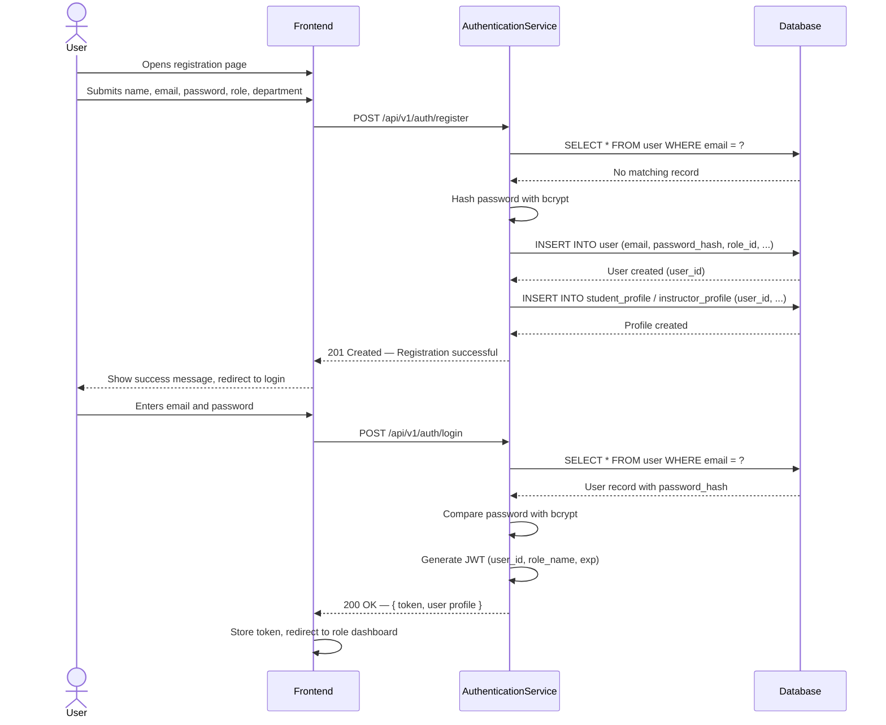
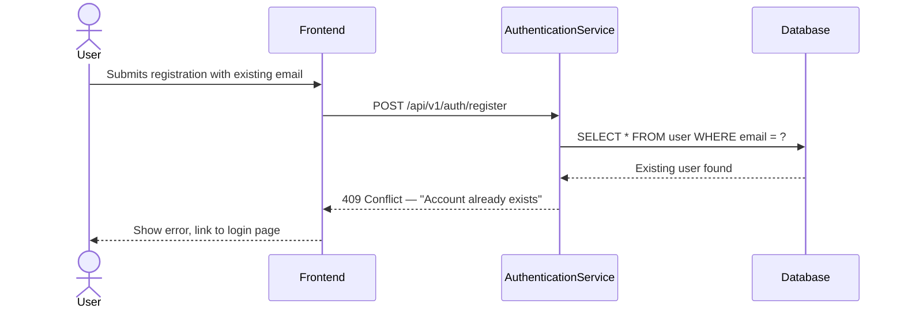
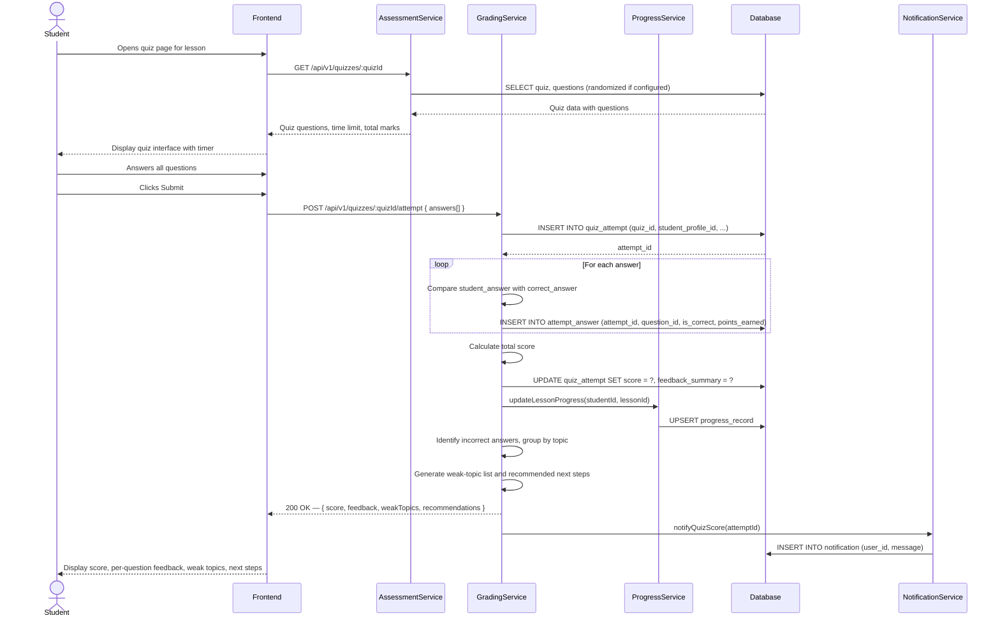
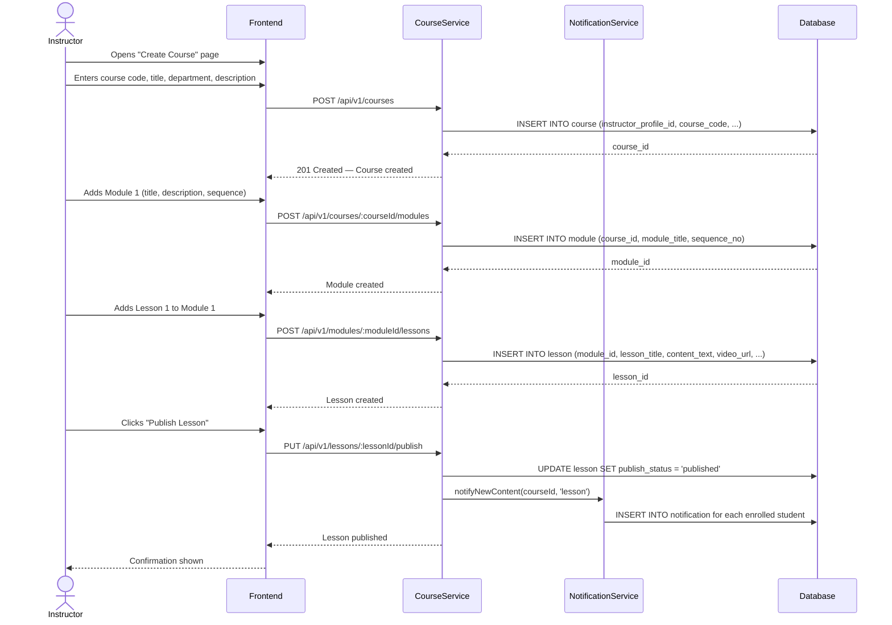
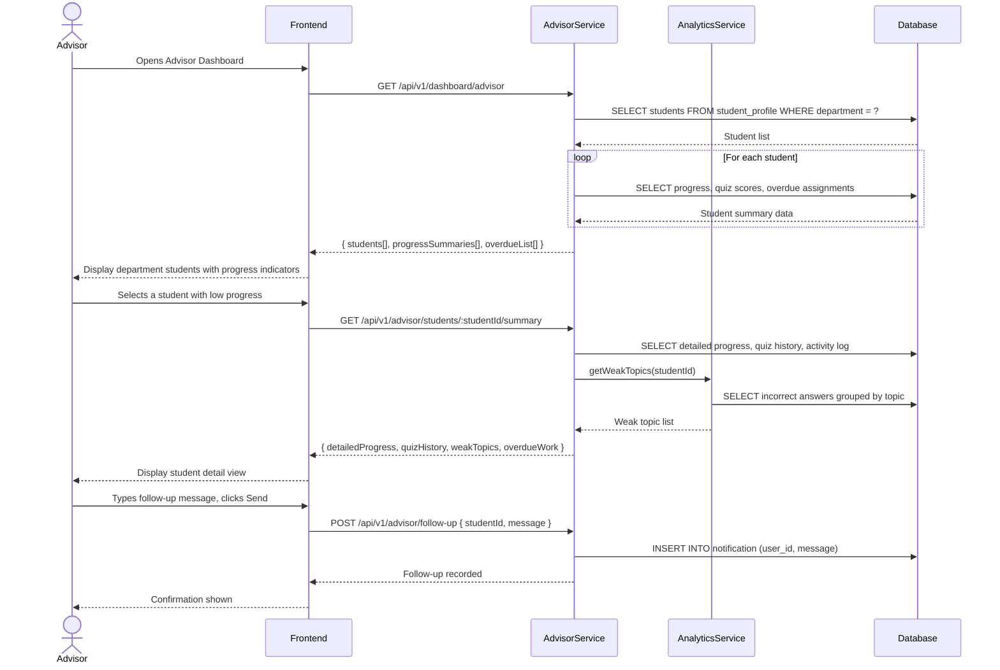
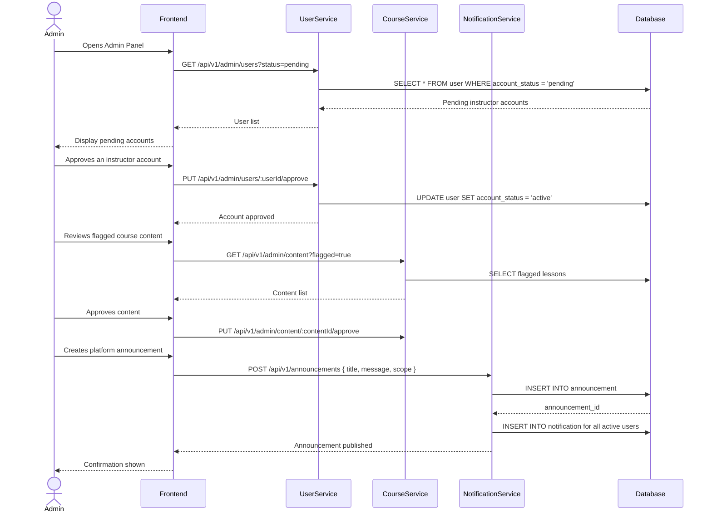

# Part II — Sequence Diagrams

This document provides sequence diagrams for the five critical user flows in QuestLearn. Each diagram shows the interaction between the actor, frontend components, backend services, and the database. These diagrams are provided in Mermaid syntax for traceability and should be redrawn in draw.io for the final submission.

---

## SD-01: User Registration and Login

This sequence covers UC-01. The user registers a new account and then logs in to receive a JWT token for subsequent requests.

**Alternate Flow — Duplicate Email:**

---

## SD-02: Student Quiz Attempt with Auto-Grading and Feedback

This sequence covers UC-03. A student attempts a quiz, receives auto-graded results, and views weak-topic feedback.

---

## SD-03: Instructor Creates Course Content

This sequence covers UC-05 and UC-06. An instructor creates a course structure and publishes lesson content.

---

## SD-04: Advisor Reviews Student Progress and Follows Up

This sequence covers UC-08. An academic advisor reviews their department students and sends a follow-up message to a struggling student.

---

## SD-05: Admin Moderates Content and Manages Announcements

This sequence covers UC-09. An admin reviews platform content, manages user accounts, and creates an announcement.

---

## Drawing Instructions

For the final Part II submission, these Mermaid diagrams should be redrawn in draw.io using proper UML sequence diagram notation:

1. Use lifeline boxes for each participant
2. Use solid arrows for synchronous calls
3. Use dashed arrows for return messages
4. Use activation bars to show processing time
5. Use `alt` fragments for alternate flows
6. Add diagram titles and figure numbers
7. Export as PNG at 300 DPI for report insertion
