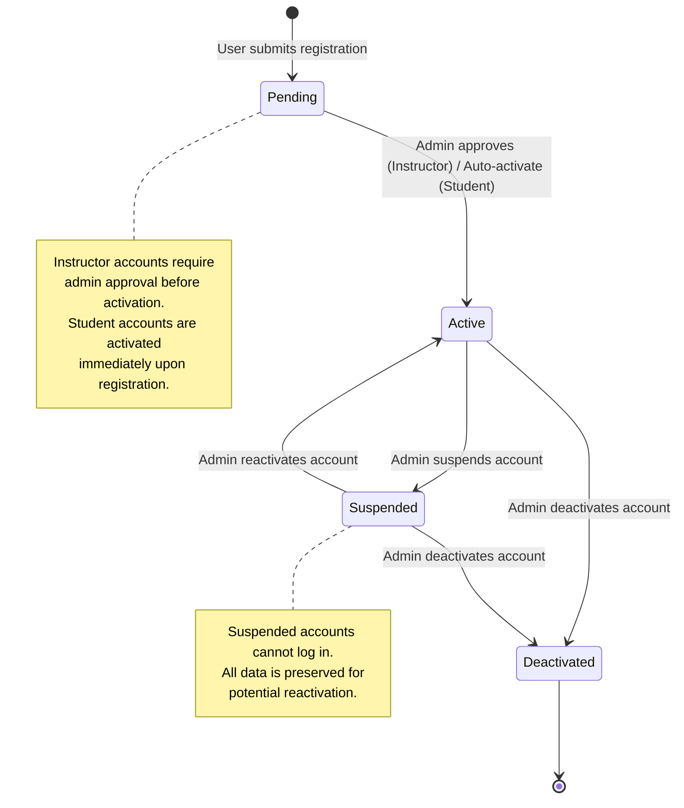
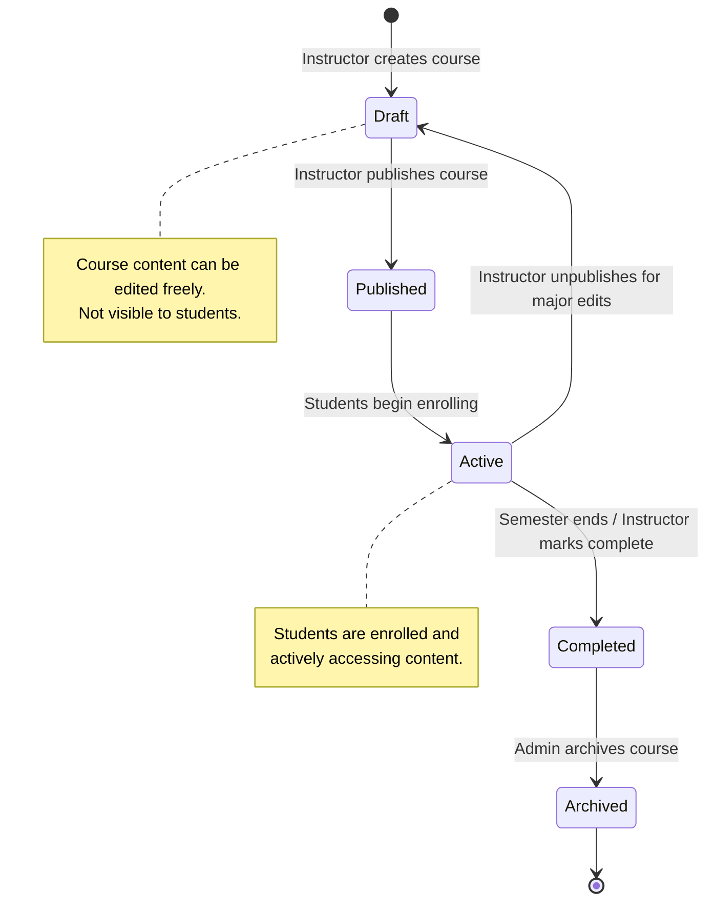
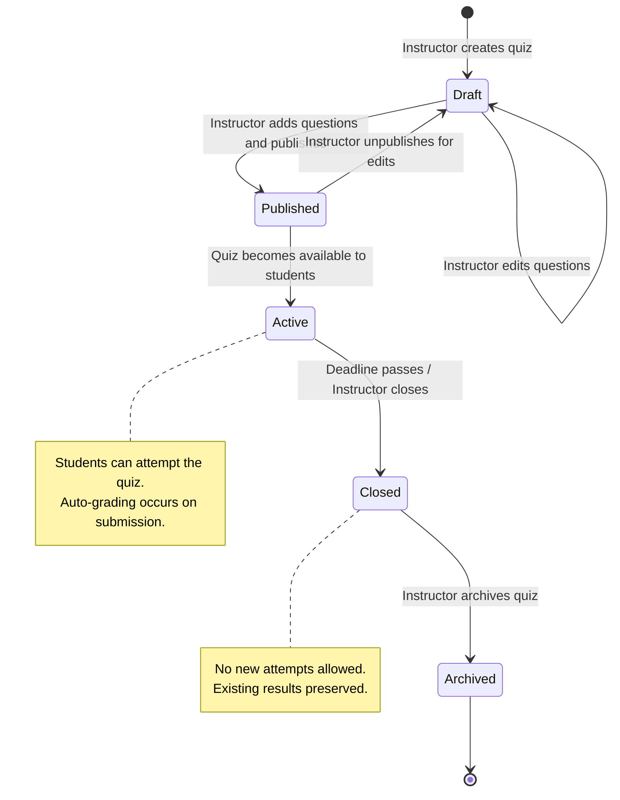
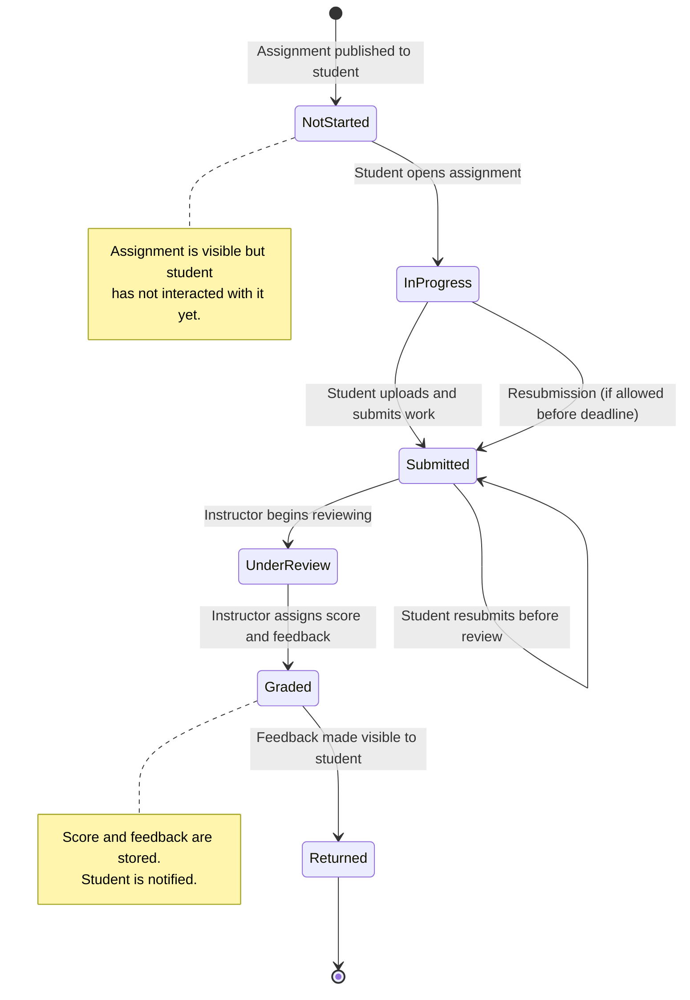
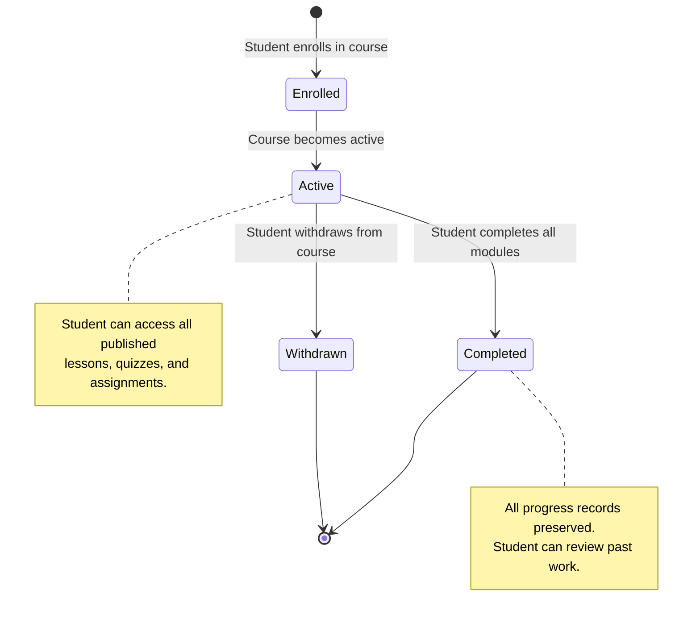
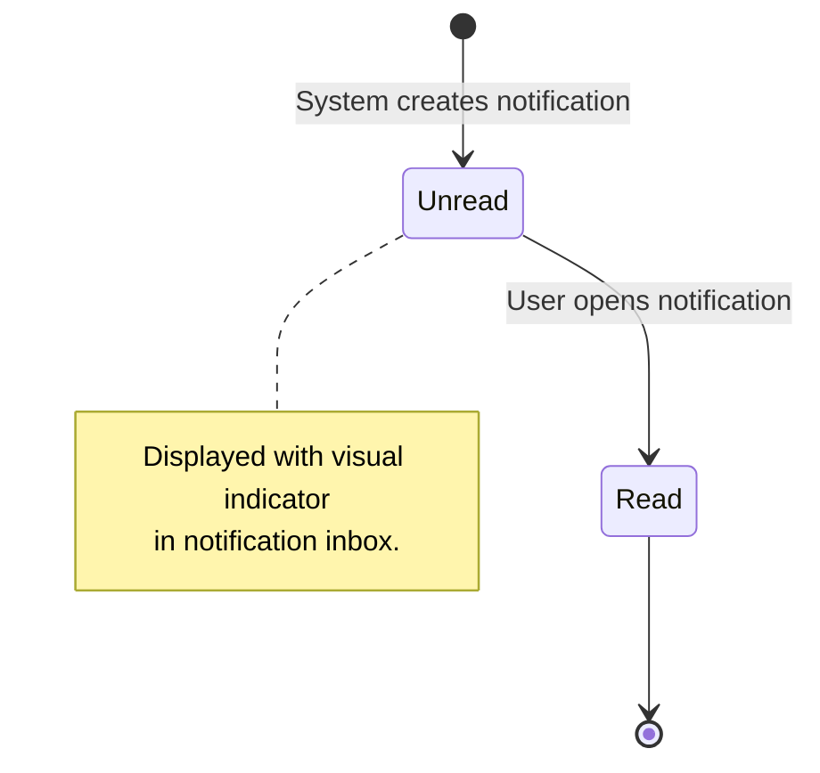

# Part II — State Transition Diagrams

This document provides state transition diagrams for five key entities in QuestLearn. Each diagram defines the valid states, transitions, and trigger events for the entity. These diagrams are provided in Mermaid `stateDiagram-v2` syntax and should be redrawn in draw.io for the final submission.

---

## ST-01: User Account States

This diagram describes the lifecycle of a user account from creation to potential deactivation.

**State Descriptions:**

| State | Description | Allowed Actions |
|-------|-------------|-----------------|
| Pending | Account created, awaiting activation | Cannot log in |
| Active | Account fully operational | Full role-based access |
| Suspended | Temporarily disabled by admin | Cannot log in, data preserved |
| Deactivated | Permanently disabled | Cannot log in, terminal state |

**Transitions:**

| From | To | Trigger | Actor |
|------|-----|---------|-------|
| [Initial] | Pending | User submits registration form | User |
| Pending | Active | Admin approves instructor / Auto for students | Admin / System |
| Active | Suspended | Admin suspends for policy violation | Admin |
| Suspended | Active | Admin lifts suspension | Admin |
| Active | Deactivated | Admin permanently disables account | Admin |
| Suspended | Deactivated | Admin permanently disables suspended account | Admin |

---

## ST-02: Course States

This diagram describes the lifecycle of a course from initial creation to archival.

**State Descriptions:**

| State | Description | Student Visibility |
|-------|-------------|-------------------|
| Draft | Being created or edited by instructor | Not visible |
| Published | Content finalized, ready for enrollment | Visible in catalog |
| Active | Students enrolled and accessing content | Full access |
| Completed | Course period ended, read-only for students | View-only |
| Archived | Removed from active listings | Not visible |

---

## ST-03: Quiz States

This diagram describes the lifecycle of a quiz from creation to archival.

**State Descriptions:**

| State | Description | Student Action |
|-------|-------------|---------------|
| Draft | Being configured by instructor | Cannot see or attempt |
| Published | Questions finalized, settings locked | Can see but may not attempt yet |
| Active | Open for student attempts | Can attempt quiz |
| Closed | No longer accepting attempts | Can view past results only |
| Archived | Removed from active listings | Cannot access |

---

## ST-04: Assignment Submission States

This diagram describes the lifecycle of a single student's assignment submission.

**State Descriptions:**

| State | Description | Student Action | Instructor Action |
|-------|-------------|---------------|-------------------|
| Not Started | Assignment visible, no interaction | Can view instructions | — |
| In Progress | Student working on submission | Can upload/edit | — |
| Submitted | Work submitted, awaiting review | Can view submission | Can begin review |
| Under Review | Instructor reviewing submission | Waiting | Reviewing and scoring |
| Graded | Score and feedback assigned | — | Can adjust if needed |
| Returned | Feedback visible to student | Can view feedback | — |

---

## ST-05: Enrollment States

This diagram describes the lifecycle of a student's enrollment in a course.

**State Descriptions:**

| State | Description | Access Level |
|-------|-------------|-------------|
| Enrolled | Registered for course, not yet started | Limited (view course info) |
| Active | Actively participating in course | Full access to content |
| Completed | All modules finished | Read-only access |
| Withdrawn | Student left the course | No access |

---

## ST-06: Notification States

This diagram describes the simple lifecycle of a notification.

---

## Drawing Instructions

For the final Part II submission, these Mermaid diagrams should be redrawn in draw.io using proper UML state machine notation:

1. Use rounded rectangles for states
2. Use filled black circle for initial state
3. Use filled black circle with outer ring for final state
4. Label all transitions with trigger events
5. Use notes for guard conditions where applicable
6. Add diagram titles and figure numbers
7. Export as PNG at 300 DPI for report insertion
