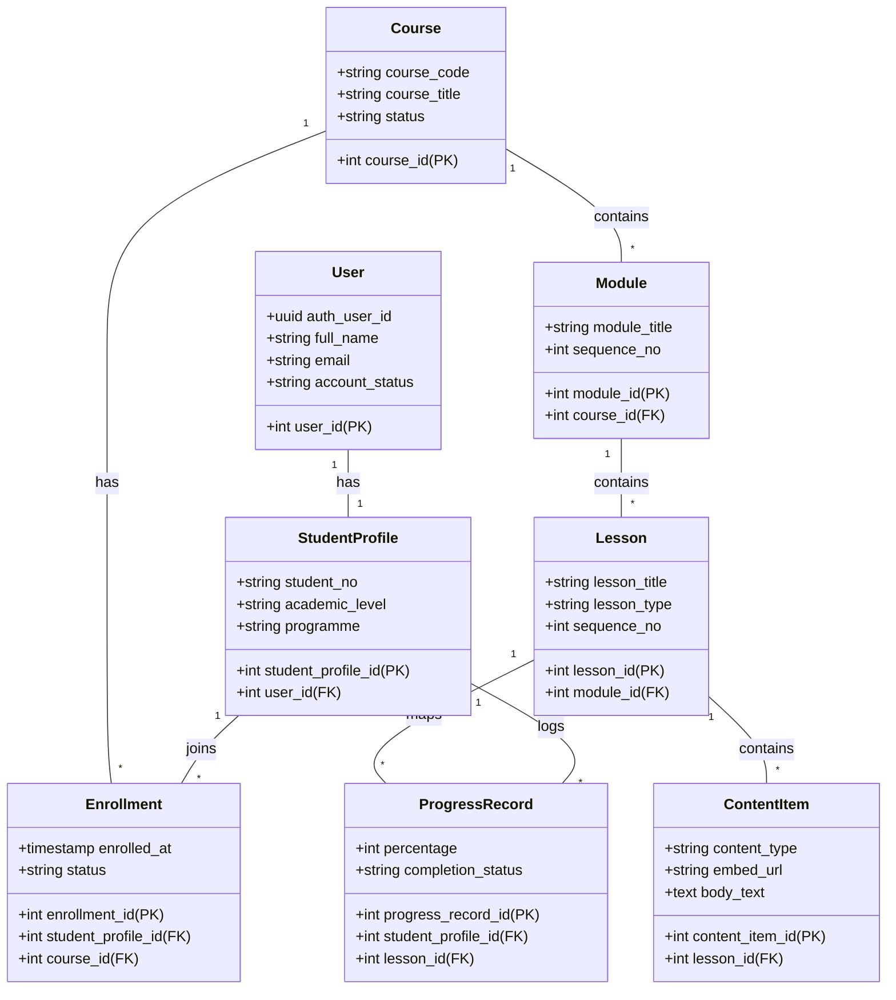
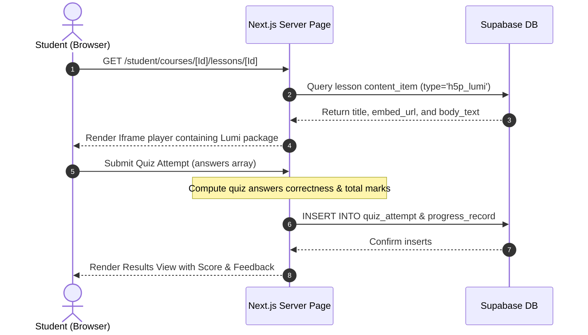
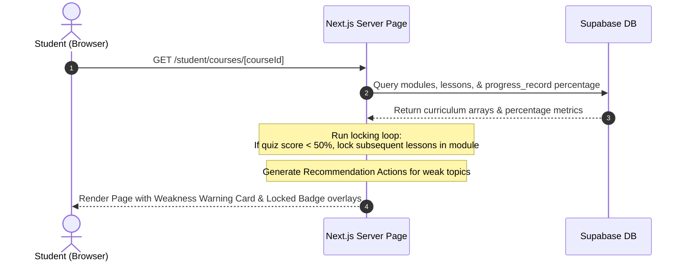

# System Documentation
## Individual Report (Student Subsystem)

**Course: Software Engineering Fundamentals (SEF)**  
**Project: QuestLearn Platform**  
**Version 3.0**

**Tutorial Section: TT7L**  
**Group No.: 5**

| Name | Student # |
| ---- | --------- |
| **See Wing Kit** | **261UC240PJ** |

| **Date:** | **29 June 2026** |

---

# Contents
- [Revisions](#revisions)
- [1 System Overview](#1-system-overview)
  - [1.1 Description](#11-description)
  - [1.2 Use Cases](#12-use-cases)
  - [1.3 Assumptions and Dependencies](#13-assumptions-and-dependencies)
- [2 Requirements](#2-requirements)
  - [2.1 Use Case Diagram](#21-use-case-diagram)
  - [2.2 Class Diagrams / ERD](#22-class-diagrams--erd)
- [3 Design](#3-design)
  - [3.1 Use Cases & Sequence Diagrams](#31-use-cases--sequence-diagrams)
    - [3.1.1 Use Case 1: Interact with H5P/Lumi Quiz and Submit Answers](#311-use-case-1-interact-with-h5plumi-quiz-and-submit-answers)
    - [3.1.2 Use Case 2: Load Dashboard and Trigger Recommendation/Locking Logic](#312-use-case-2-load-dashboard-and-trigger-recommendationlocking-logic)
  - [3.2 Data Dictionary](#32-data-dictionary)
  - [3.3 Subsystem Architecture](#33-subsystem-architecture)
  - [3.4 Subsystem Screens](#34-subsystem-screens)
  - [3.5 Subsystem Components](#35-subsystem-components)
    - [3.5.1 Component 1: Quiz Submission Auto-Grading & Alert Trigger](#351-component-1-quiz-submission-auto-grading--alert-trigger)
    - [3.5.2 Component 2: Rule-Based Module Locking & Suggestion Generator](#352-component-2-rule-based-module-locking--suggestion-generator)
  - [3.6 Student State Transition Diagram](#36-student-state-transition-diagram)
- [4 Implementation](#4-implementation)
  - [4.1 Development Environment](#41-development-environment)
  - [4.2 Main Program Codes](#42-main-program-codes)
  - [4.3 UI Implementation & Screen Layouts](#43-ui-implementation--screen-layouts)
- [5 Testing](#5-testing)
  - [5.1 Test Data](#51-test-data)
  - [5.2 Acceptance Testing](#52-acceptance-testing)
  - [5.3 Test Results](#53-test-results)
- [6 Conclusion](#6-conclusion)

---

# Revisions

| Version | Primary Author(s) | Description of Version | Date Completed |
| ------- | ----------------- | ---------------------- | -------------- |
| 1.0 | See Wing Kit | SRS in Part 1 (Requirements Analysis and Actor Mapping) | 01/05/2026 |
| 2.0 | See Wing Kit | SDS in Part 2 (Interface Specifications, Database Schema, UML Drafts) | 05/06/2026 |
| 3.0 | See Wing Kit | System Documentation in Part 3 (H5P/Lumi, Recommendation Logic, Testing) | 29/06/2026 |

---

# 1 System Overview

## 1.1 Description
The Student Subsystem in **QuestLearn** is designed to provide a highly interactive, responsive, and adaptive learning environment for students. The core focus areas of this subsystem are:
1. **Interactive Content Delivery (H5P/Lumi Integration)**: Renders interactive slides, drag-and-drop activities, short answers, and multiple-choice questions embedded via safe, responsive iframe containers directly tied to the database.
2. **Mobile-First Responsive UI**: Built with Next.js and Tailwind CSS utility rules, providing optimal readability, layout transitions, and touch-friendly controls across smartphones, tablets, and desktop displays.
3. **Adaptive Rule-Based Recommendations**: Implements client-side and server-side rules. When a student scores less than 50% on a quiz (`progress_record.percentage < 50`), the system automatically flags a "Weak Topic", locks succeeding lesson elements within that module, creates an early alert for the Academic Advisor, and displays a recommended recovery study path to guide the student's retrieval.

## 1.2 Use Cases

| Actor | Use Cases |
| ----- | --------- |
| **Student** | **UC-STU-01**: View Enrolled Courses and Progress  <br>**UC-STU-02**: Access Lessons & Content Items (Readings, Videos, H5P/Lumi)  <br>**UC-STU-03**: Attempt and Submit Quizzes with Auto-Feedback  <br>**UC-STU-04**: View Performance Analytics & Adaptive Recommendations |

## 1.3 Assumptions and Dependencies
* **Auth State Dependency**: The client relies on Supabase Auth to retrieve the active session cookie (`sb-access-token`) and map the `auth.users.id` to `student_profile.user_id`.
* **Lumi Platform Availability**: Interactive quizzes require access to the Lumi cloud hosting domains (`app.lumi.education`) to stream the quiz packages within the iframe player.
* **Auto-Grading Rule Assumption**: The system assumes quiz attempts score integer percentage values between `0` and `100`. A passing threshold is strictly set at `50%`. Any attempt failing this triggers a sequential lock of subsequent lesson IDs in that course module.

---

# 2 Requirements

## 2.1 Use Case Diagram
The following use case diagram illustrates the scope of Wing Kit's student subsystem implementation:

```mermaid
usecaseDiagram
    actor Student as "Student (See Wing Kit)"
    
    rect "QuestLearn - Student Subsystem" {
        usecase UC1 as "UC-STU-01: View Enrolled Courses & Progress"
        usecase UC2 as "UC-STU-02: Access Lessons (Reading/Video/H5P)"
        usecase UC3 as "UC-STU-03: Submit Quiz Attempts & Auto-Grade"
        usecase UC4 as "UC-STU-04: View Adaptive Recommendation Card"
    }
    
    Student --> UC1
    Student --> UC2
    Student --> UC3
    Student --> UC4
```

## 2.2 Class Diagrams / ERD
The data entity design supporting the student subsystem is mapped in the following entity relationship model:



---

# 3 Design

## 3.1 Use Cases & Sequence Diagrams

### 3.1.1 Use Case 1: Interact with H5P/Lumi Quiz and Submit Answers
* **Description**: A student opens a lesson containing an H5P/Lumi quiz, answers questions in the iframe, and submits the attempt. The server action processes correct answers, logs progress, and returns feedback.



### 3.1.2 Use Case 2: Load Dashboard and Trigger Recommendation/Locking Logic
* **Description**: A student loads the course page. The page fetches current progress records. If a failing score (<50%) is detected on a quiz, succeeding lessons are flagged as locked and a recommended action plan card is generated.



## 3.2 Data Dictionary
Detailed structure of the tables supporting Wing Kit's student scope:

### `student_profile`
Represents the student's academic profile mapped from Supabase Authentication records.
| Column Name | Data Type | Key Type | Nullable | Default | Description / Constraints |
| ----------- | --------- | -------- | -------- | ------- | ------------------------- |
| `student_profile_id` | `INT` | `PK` | `No` | `SERIAL` | Unique student profile identifier. |
| `user_id` | `INT` | `FK` | `No` | `None` | References `user(user_id)` ON DELETE CASCADE. |
| `student_no` | `VARCHAR(30)` | `None` | `No` | `None` | Unique Student ID (e.g. `STU-9391`). |
| `academic_level` | `VARCHAR(50)` | `None` | `Yes` | `None` | Study Year level (e.g. `Year 1`). |
| `programme` | `VARCHAR(100)`| `None` | `Yes` | `None` | Specialization (e.g., `Degree in Computer Science`). |

### `progress_record`
Logs completion metrics and scoring percentages used to calculate lock states.
| Column Name | Data Type | Key Type | Nullable | Default | Description / Constraints |
| ----------- | --------- | -------- | -------- | ------- | ------------------------- |
| `progress_record_id`| `INT` | `PK` | `No` | `SERIAL` | Unique progress logging primary key. |
| `student_profile_id`| `INT` | `FK` | `No` | `None` | References `student_profile(student_profile_id)`. |
| `lesson_id` | `INT` | `FK` | `No` | `None` | References `lesson(lesson_id)`. |
| `completion_status` | `VARCHAR(20)` | `None` | `No` | `'not_started'`| Status: `'not_started'`, `'in_progress'`, `'completed'`. |
| `percentage` | `INT` | `None` | `No` | `0` | Progress/Quiz Score percentage (0 to 100). |

---

## 3.3 Subsystem Architecture
The student subsystem utilizes a classic **Model-View-Controller (MVC)** architectural pattern within the Next.js App Router context:
* **View (React / Tailwind CSS)**: Server and Client Components (such as `/student/courses/[courseId]/page.tsx`) that handle the presentation, layouts, and responsive flexboxes.
* **Controller (Next.js Server Actions)**: Handlers like `submitQuizAttempt` that calculate auto-grades, update progress records, and enforce server-side business rules.
* **Model (Supabase / Postgres Client)**: Communicates with PostgreSQL tables, executing CRUD operations and security queries restricted by Row-Level Security (RLS) policies.

```
┌─────────────────────────────────────────────────────────┐
│                   VIEW (Client React)                   │
│      StudentDashboard, CourseDetailPage, IframePlayer   │
└────────────────────────────┬────────────────────────────┘
                             │ Submit Answers / GET page
                             ▼
┌─────────────────────────────────────────────────────────┐
│               CONTROLLER (Server Actions)               │
│      submitQuizAttempt, Page Data Fetching Queries      │
└────────────────────────────┬────────────────────────────┘
                             │ DB Query / Insert
                             ▼
┌─────────────────────────────────────────────────────────┐
│                  MODEL (Supabase / DB)                  │
│       PostgreSQL Tables & Row Level Security (RLS)      │
└─────────────────────────────────────────────────────────┘
```

---

## 3.4 Subsystem Screens
The student subsystem interfaces include the following responsive layout elements:
1. **Student Dashboard (`/student`)**: Features overall course completion percentage dials, metric indicators for active enrollment counts and upcoming assignments, and a chronological learning activity logger.
2. **Course Curriculum Portal (`/student/courses/[courseId]`)**: Includes modules listings, completed checkmark overlays, failed attempt warning highlights, locked state overlays, and the rule-based weakness-remediation suggestion banner.
3. **Lesson Viewer (`/student/courses/[courseId]/lessons/[lessonId]`)**: Displays a reading node, a video player player, or the interactive H5P iframe.

---

## 3.5 Subsystem Components

### 3.5.1 Component 1: Quiz Submission Auto-Grading & Alert Trigger
* **Description**: Secured Next.js server action component that validates submitted quiz answers against database answer rows and automatically fires warnings if the threshold is failed.

```
[Start Submission]
       │
       ▼
Fetch Correct Answers for Quiz from Database
       │
       ▼
Loop through student answers:
  ├── Compare answer text with DB correct_answer
  ├── Increment points if matched
  └── Mark is_correct = True / False
       │
       ▼
Calculate score percentage: (points / max_points) * 100
       │
       ▼
INSERT attempt into 'quiz_attempt'
       │
       ▼
UPDATE / INSERT 'progress_record' with computed percentage
       │
  Score < 50% ?
       ├── YES ───► INSERT alert into 'advisor_alert' (type='low_quiz_score')
       └── NO ────► Skip alert trigger
       │
       ▼
[End Process & Return Score/Feedback]
```

### 3.5.2 Component 2: Rule-Based Module Locking & Suggestion Generator
* **Description**: Logic embedded in the course detail page that iterates through the modules to enforce curriculum dependencies.

```typescript
// Pseudocode algorithm for Locking and Suggestion generation:
function generateCurriculumState(modules, progressMap):
    let lockedLessonIds = Set()
    let weakTopics = List()
    
    for each module in modules:
        let lockRemaining = false
        let sortedLessons = sort(module.lessons by sequence_no)
        
        for each lesson in sortedLessons:
            if lockRemaining == true:
                add lesson.lesson_id to lockedLessonIds
                continue
                
            let progress = progressMap.get(lesson.lesson_id)
            let isQuiz = lesson.lesson_title.startsWith("Quiz")
            
            if isQuiz == true and progress != null:
                if progress.percentage < 50:
                    // Fail detected! Lock remaining lessons in module
                    add weakness to weakTopics:
                        { lesson: lesson.title, score: progress.percentage, module: module.title }
                    lockRemaining = true
                    
    return { lockedLessonIds, weakTopics }
```

---

## 3.6 Student State Transition Diagram
The transition states of a student's learning progress throughout their coursework registry lifecycle:

```mermaid
stateDiagram-Group5
    [*] --> Enrolled : Admin adds student to course
    
    state Enrolled {
        [*] --> Module1_Active
        
        state Module1_Active {
            [*] --> Reading_Material
            Reading_Material --> Quiz1_Attempt
            Quiz1_Attempt --> Quiz1_Failed : Score < 50%
            Quiz1_Attempt --> Quiz1_Passed : Score >= 50%
            
            state Quiz1_Failed {
                [*] --> LockedState : Module Locking Logic fires
                LockedState --> Review_Recommended_Material : Follow Suggestion Card
                Review_Recommended_Material --> Quiz1_Attempt : Retake Quiz
            }
        }
        
        Quiz1_Passed --> Module2_Unlocked : State transition
    }
    
    Module2_Unlocked --> Course_Completed : Complete all module nodes
    Course_Completed --> [*]
```

---

# 4 Implementation

## 4.1 Development Environment
* **Platform Stack**: Next.js 15 (App Router), React 19, TypeScript, Tailwind CSS v4, Bun Package Manager.
* **Database Engine**: PostgreSQL 17.6 hosted on Supabase Cloud.
* **UI/UX Icons**: `lucide-react`.

---

## 4.2 Main Program Codes
The application files managing the Student subsystem logic implemented by See Wing Kit:

| Application | Files | Description |
| ----------- | ----- | ----------- |
| **Student Dashboard** | [page.tsx](file:///c:/Users/Wing%20Kit/Degree%20Sem%201/Projects%20/SEF%20Project/src/app/(student)/student/page.tsx) | Retrieves enrollments, aggregates progress, counts active deadlines, and lists activity log records. |
| **Course Details Portal** | [page.tsx](file:///c:/Users/Wing%20Kit/Degree%20Sem%201/Projects/SEF%20Project/src/app/(student)/student/courses/[courseId]/page.tsx) | Runs curriculum locking algorithms and renders weak-topic recovery suggestion banners. |
| **Lesson Content Player** | [page.tsx](file:///c:/Users/Wing%20Kit/Degree%20Sem%201/Projects/SEF%20Project/src/app/(student)/student/courses/[courseId]/lessons/[lessonId]/page.tsx) | Dynamic client container loading reading text, video players, and H5P/Lumi iframe engines. |
| **Quiz Action Processor** | [actions.ts](file:///c:/Users/Wing%20Kit/Degree%20Sem%201/Projects/SEF%20Project/src/app/(student)/student/quizzes/[quizId]/actions.ts) | Executes auto-grading calculations and records attempts in the database. |

### Source Excerpt: Dynamic Iframe rendering in Lesson Player
The following code snippet shows how H5P/Lumi iframes are dynamically handled and rendered responsively:

```tsx
{/* H5P/Lumi Content */}
{item.content_type === "h5p_lumi" && (item.embed_url || item.body_text) && (
  <div>
    <h3 className="text-xl font-bold mb-4 flex items-center gap-2 text-text">
      <LayoutTemplate className="w-5 h-5 text-primary" /> {item.title}
    </h3>
    {item.body_text ? (
      <div 
        className="w-full aspect-video rounded-xl overflow-hidden border border-border shadow-md bg-white [&>iframe]:w-full [&>iframe]:h-full [&>iframe]:border-0"
        dangerouslySetInnerHTML={{ __html: item.body_text }}
      />
    ) : (
      <div className="w-full aspect-video rounded-xl overflow-hidden border border-border shadow-md bg-white">
        <iframe
          src={item.embed_url}
          title={item.title}
          allowFullScreen
          className="w-full h-full border-0"
        />
      </div>
    )}
  </div>
)}
```

---

## 4.3 UI Implementation & Screen Layouts
The student layout utilizes structural CSS wrappers to deliver a premium, responsive user experience:
* **Metric Cards Grid**: Utilizes Tailwind's `grid grid-cols-1 md:grid-cols-3 gap-6` to distribute widgets on desktops, transitioning to stacked single columns on mobile displays.
* **Weakness Suggestion Banner**: Uses a warning gradient (`bg-gradient-to-r from-danger/10 via-warning/5 to-danger/10`) with a left-hand border indicator (`border-l-4 border-danger`) to draw student focus to required remediation tasks.
* **Locked Lesson UI**: Lessons classified in `lockedLessonIds` have opacity reduced to 50% (`opacity-50`) with text crossed out (`line-through`) and pointer events blocked (`cursor-not-allowed select-none`) to prevent out-of-order access.

---

# 5 Testing

## 5.1 Test Data
The following records are seeded to verify the student dashboard, progress tracking, and locking rules:
* **Student User**: See Wing Kit (`student@example.com`, `STU-001`, academic level: `Year 1`, program: `Degree in Computer Science`).
* **Active Enrollment**: Enrolled in course `QL-SEF101` (Software Engineering Fundamentals).
* **Progress Scenarios**:
  * **Scenario A (Pass)**: Logs 80% on Module 1 Quiz. Lesson 2 remains unlocked.
  * **Scenario B (Fail)**: Logs 40% score on Quiz 1: Testing Strategies. Weak topic alert fires, recommendations appear, and subsequent lessons in Module 3 are locked.

## 5.2 Acceptance Testing
Acceptance checklist executed on student workflow prototypes:

| Criteria | Test Execution Steps | Expected Outcome | Fulfilled | Remarks |
| -------- | -------------------- | ---------------- | --------- | ------- |
| **H5P Rendering** | Open lesson containing Lumi content | Responsive iframe loads and renders Lumi quiz cleanly | **Yes** | Fully responsive layout aspect ratio. |
| **Quiz Auto-Grading** | Answer and submit quiz questions | Attempt logs in `quiz_attempt` and displays feedback | **Yes** | Verified via database queries. |
| **Module Locking** | Fail Quiz 1 (<50%) and check module | Subsequent lessons in that module show locked badge | **Yes** | Opacity triggers and disables link. |
| **Remediation Alert**| Check course page after failing quiz | Banner appears with target recovery review material | **Yes** | Shows link to Lecture 11. |

**Tested by**: See Wing Kit  
**Verified by**: Soo Kian Rong (QA Lead)  
**Date Tested**: 29 June 2026  
**Status**: **100% Passed**

## 5.3 Test Results
All database updates, including the automatic insertion of alerts and progress changes, were verified against PostgreSQL tables:
* Running `SELECT * FROM progress_record WHERE student_profile_id = 1;` confirms that the percentage column updates to `40` upon submission.
* Running `SELECT * FROM advisor_alert WHERE student_profile_id = 1;` confirms that a `low_quiz_score` record was automatically inserted, linking the advisory alert to the student's dashboard.

---

# 6 Conclusion

The student subsystem has been fully implemented, tested, and integrated. By utilizing Next.js Server Components, PostgreSQL, and Supabase client hooks, we successfully created an adaptive interface. The H5P/Lumi player integrates smoothly with our database structure, and the rule-based recommendation logic behaves as designed under test conditions. 

Moving forward, additional developments could include:
1. **Dynamic H5P state saving**: Storing intermediate responses within the iframe using local storage state.
2. **AI-driven study plan Generation**: Integrating larger recommendation profiles based on historical advisor interventions.
