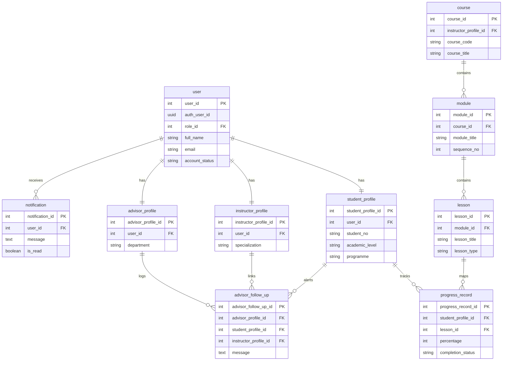
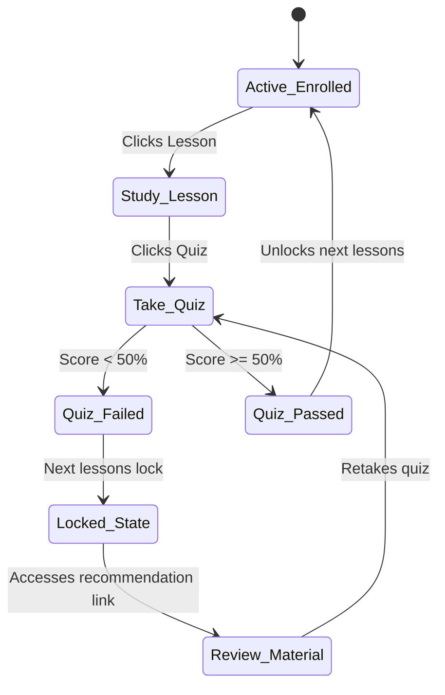
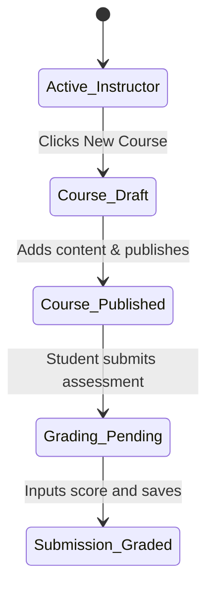
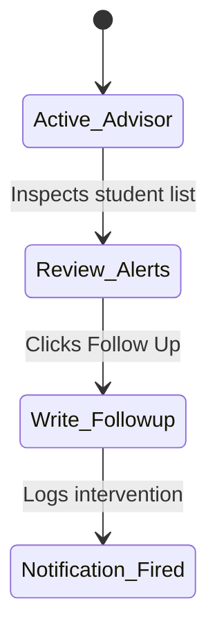
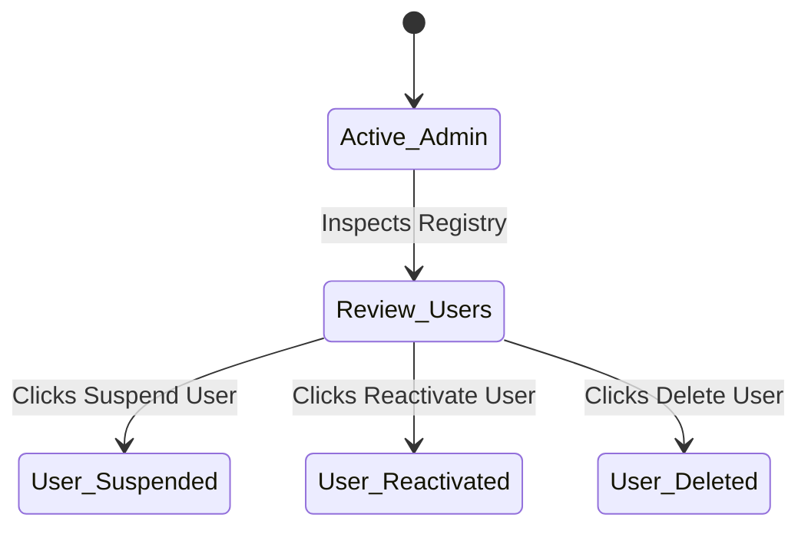
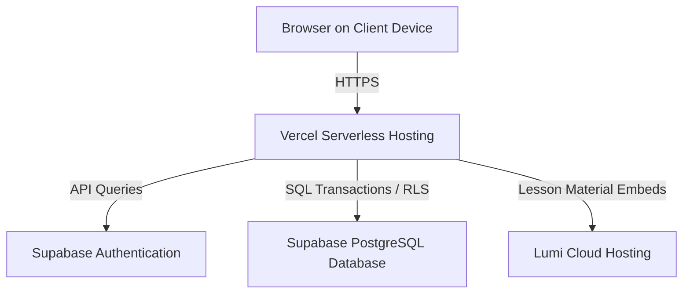

# System Documentation for QuestLearn System

**Version 3.0**

**Tutorial Section: TT7L**

**Group No.: G5**

| Name | Student ID |
| --- | --- |
| **See Wing Kit** | **261UC240PJ** |
| **Aziel Tan Zheng Chuan** | **261UC240LY** |
| **Vincent Lock Chun Kit** | **261UC2406W** |
| **Soo Kian Rong** | **261UC26145** |

**Date: 30 June 2026**

---

# Contents

- [Revisions](#revisions)
- [1 Project Management](#1-project-management)
  - [1.1 Team Members](#11-team-members)
  - [1.2 Problem Statement](#12-problem-statement)
  - [1.3 Project Plan](#13-project-plan)
- [2 System Overview](#2-system-overview)
  - [2.1 Description](#21-description)
  - [2.2 Actors](#22-actors)
  - [2.3 Assumptions and Dependencies](#23-assumptions-and-dependencies)
  - [2.4 Use Case Diagram](#24-use-case-diagram)
- [3 Requirements](#3-requirements)
  - [3.1 Class Diagrams / ERD](#31-class-diagrams--erd)
- [4 Design](#4-design)
  - [4.1 Data Dictionary](#41-data-dictionary)
  - [4.2 Software Architecture](#42-software-architecture)
    - [4.2.1 Subsystem 1 (Core Application Modules)](#421-subsystem-1-core-application-modules)
    - [4.2.2 Subsystem 2 (Data Persistence \& Security Engines)](#422-subsystem-2-data-persistence--security-engines)
  - [4.3 Main Screens](#43-main-screens)
  - [4.4 Subsystem 1 Screens](#44-subsystem-1-screens)
  - [4.5 Subsystem 2 Screens](#45-subsystem-2-screens)
  - [4.6 Main Components](#46-main-components)
    - [4.6.1 Component 1](#461-component-1)
    - [4.6.2 Component 2](#462-component-2)
    - [4.6.3 Behavioral Modeling](#463-behavioral-modeling)
      - [4.6.3.1 Actor 1 State Transition Diagram](#4631-actor-1-state-transition-diagram)
      - [4.6.3.2 Actor 2 State Transition Diagram](#4632-actor-2-state-transition-diagram)
      - [4.6.3.3 Actor 3 State Transition Diagram](#4633-actor-3-state-transition-diagram)
      - [4.6.3.4 Actor 4 State Transition Diagram](#4634-actor-4-state-transition-diagram)
  - [4.7 Deployment Diagram](#47-deployment-diagram)
- [5 Implementation](#5-implementation)
  - [5.1 Development Environment](#51-development-environment)
  - [5.2 Software Integration](#52-software-integration)
  - [5.3 Database](#53-database)
- [6 Testing](#6-testing)
  - [6.1 Testing Strategy](#61-testing-strategy)
  - [6.2 Test Data](#62-test-data)
  - [6.3 Acceptance Testing](#63-acceptance-testing)
- [7 Sample Screens](#7-sample-screens)
  - [7.1 Main Screen](#71-main-screen)
    - [7.1.1 Subsystem 1 Screens](#711-subsystem-1-screens)
    - [7.1.2 Subsystem 2 Screens](#712-subsystem-2-screens)
- [8 Conclusion](#8-conclusion)
- [9 User Guide](#9-user-guide)
- [References](#references)

---

# Revisions

| Version | Primary Author(s) | Description of Version | Date Completed |
| --- | --- | --- | --- |
| 1.0 | All Members | SRS Baseline - Requirements & Use Cases | 01/05/2026 |
| 2.0 | All Members | SDS Baseline - Architecture & DB Design | 05/06/2026 |
| 3.0 | All Members | Final System Documentation - Code & Testing | 30/06/2026 |

---

# 1 Project Management

## 1.1 Team Members

The work breakdown structure and subsystem ownership roles are distributed as follows:

| Name | Actor / Subsystem Responsibility | Assigned Process |
| --- | --- | --- |
| **See Wing Kit** | Student Actor & Core Integration | Course views, interactive content rendering, quiz attempts, and recommendations. |
| **Aziel Tan Zheng Chuan** | Instructor Actor | Course builder curriculum controls, assignment creations, and student monitoring portals. |
| **Vincent Lock Chun Kit** | Academic Advisor Actor | Alert reviews, student logs, and intervention follow-up messaging. |
| **Soo Kian Rong** | Admin Actor & System Oversight | User registration approval, role mapping, account suspensions, and platform auditing. |

## 1.2 Problem statement

Digital learning platforms in higher education frequently operate as static file stores for lecture material. As a result, critical gaps emerge in the learning loop:
1. **Lack of Immediate Feedback:** Students submit assessments and wait days for grades, missing opportunities to correct conceptual misunderstandings.
2. **Disconnected Roles:** Instructors upload course structures but lack automated tracking. Advisors only receive alerts after students have failed midterms.
3. **No Adaptive Guidance:** Failed assessments do not guide students toward remedial study paths.

**QuestLearn** resolves this by introducing rule-based course locking and weakness recommendation logic. The system integrates H5P/Lumi interactive iframe players, automated quiz checks, real-time advisor notification loops, and admin user status management.

## 1.3 Project Plan

The project was executed over 15 weeks, tracking through requirements collection, database configuration, interface building, and final acceptance testing.

```
Week: 01 02 03 04 05 06 07 08 09 10 11 12 13 14 15
      [SRS collection] [SDS Design] [Development] [Testing & Packaging]
```

Detailed milestones:
* **Part I (Weeks 1-5):** Requirements analysis, Use Case descriptions, and draft ERD layouts.
* **Part II (Weeks 6-12):** UI/UX mockups, data dictionary setups, state transitions, and deploy plans.
* **Part III (Weeks 13-15):** Next.js 15 App router building, Supabase cloud configuration, Vitest checks, and deployment verification.

---

# 2 System Overview

## 2.1 Description

QuestLearn is an adaptive learning portal. It enables:
1. **Instructors** to construct courses, embed videos, compile quiz questionnaires, publish grades, and monitor students.
2. **Students** to access curriculum paths, view interactive H5P modules, submit attempts, track grades, and receive weak-topic warnings.
3. **Academic Advisors** to review risk flags, document follow-ups, and send intervention logs to instructors.
4. **Admins** to oversee platform users, modify roles, suspend or kick users, and publish site announcements.

## 2.2 Actors

* **Student:** Takes lessons, submits quizzes, reviews recommendations, tracks grades, and views alerts.
* **Instructor:** Builds courses, uploads embeds, grades assignments, and reviews class metrics.
* **Academic Advisor:** Inspects department performance, logs interventions, and links notifications to instructors.
* **Admin:** Configures user permissions, suspends or reactivates accounts, and handles enrollments.

## 2.3 Assumptions and Dependencies

1. **Deployment Stack:** Next.js App Router deployed on Vercel, utilizing Supabase PostgreSQL, Storage, and Auth.
2. **H5P Hosting:** The system embeds Lumi packages via responsive iframe wrappers.
3. **Connectivity:** Requires consistent internet connection for real-time RLS checks.

## 2.4 Use Case Diagram

The platform use case diagram integrates all four actors:

```mermaid
usecaseDiagram
    actor Student
    actor Instructor
    actor Advisor as "Academic Advisor"
    actor Admin
    
    rect "QuestLearn Portal" {
        usecase UC_STU as "Take Lessons, Submit Quizzes, Check Progress (Student)"
        usecase UC_INS as "Build Course Modules, Configure Quizzes, Grade Submissions (Instructor)"
        usecase UC_ADV as "Monitor Progress Risks, Log Follow-ups (Advisor)"
        usecase UC_ADM as "Manage User Accounts, Moderate Content, Handle Enrollments (Admin)"
    }
    
    Student --> UC_STU
    Instructor --> UC_INS
    Advisor --> UC_ADV
    Admin --> UC_ADM
```

---

# 3 Requirements

## 3.1 Class Diagrams / ERD

The relational database architecture is defined in the following entity relationship model:



---

# 4 Design

## 4.1 Data Dictionary

Key entities in the QuestLearn implementation are documented below:

### `user`
Represents the core credential mapping to Supabase Auth.
| Column | Type | Key | Nullable | Default | Description |
| --- | --- | --- | --- | --- | --- |
| `user_id` | `INT` | `PK` | `No` | `SERIAL` | Unique internal reference ID. |
| `auth_user_id` | `UUID` | `None` | `Yes` | `None` | Maps to `auth.users.id`. |
| `role_id` | `INT` | `FK` | `No` | `None` | References `role(role_id)`. |
| `full_name` | `VARCHAR(150)` | `None` | `No` | `None` | Real name. |
| `email` | `VARCHAR(255)` | `None` | `No` | `None` | Unique email string. |
| `account_status`| `VARCHAR(20)` | `None` | `No` | `'pending'` | Check: `'pending'`, `'active'`, `'suspended'`. |

### `student_profile`
Contains academic details specific to student accounts.
| Column | Type | Key | Nullable | Default | Description |
| --- | --- | --- | --- | --- | --- |
| `student_profile_id`| `INT` | `PK` | `No` | `SERIAL` | Student profile primary key. |
| `user_id` | `INT` | `FK` | `No` | `None` | References `"user"(user_id)` ON DELETE CASCADE. |
| `student_no` | `VARCHAR(30)` | `None` | `No` | `None` | Unique registration identifier. |
| `academic_level` | `VARCHAR(50)` | `None` | `Yes` | `None` | Year level. |
| `programme` | `VARCHAR(100)`| `None` | `Yes` | `None` | Specialization program. |

### `advisor_follow_up`
Logs follow-up interventions logged by advisors.
| Column | Type | Key | Nullable | Default | Description |
| --- | --- | --- | --- | --- | --- |
| `advisor_follow_up_id`| `INT` | `PK` | `No` | `SERIAL` | Unique primary key. |
| `advisor_profile_id` | `INT` | `FK` | `No` | `None` | References `advisor_profile`. |
| `student_profile_id` | `INT` | `FK` | `No` | `None` | References `student_profile`. |
| `instructor_profile_id`|`INT`| `FK` | `Yes`| `None` | References `instructor_profile` (nullable). |
| `message` | `TEXT` | `None` | `No` | `None` | Follow-up feedback message. |

---

## 4.2 Software Architecture

QuestLearn uses a four-layer cloud-backed architecture based on Next.js and Supabase.

### 4.2.1 Subsystem 1 (Core Application Modules)
This subsystem handles presentation logic and user interaction:
* **Student Module:** Dashboard cards, course outlines, progress bars, and iframe player containers.
* **Instructor Module:** Course builders, curriculum managers, and grading interfaces.

### 4.2.2 Subsystem 2 (Data Persistence & Security Engines)
This subsystem coordinates background processing and database transactions:
* **Supabase Auth Engine:** Validates sessions and handles password resets.
* **advisor_alert & Notification Engine:** Triggers alerts when quiz scores drop below 50%, sending logs to students and advisors.
* **Admin Registry Controls:** Manages user roles and handles suspensions.

---

## 4.3 Main Screens

1. **Dashboard Portal:** Standard layout with routing based on the logged-in user's role.
2. **Profile Settings Screen:** Allows updating contact information and learning preferences.

## 4.4 Subsystem 1 Screens

1. **Student Dashboard (`/student`):** Displays active courses and overall progress.
2. **Course details (`/student/courses/[id]`):** Shows modules, completed checkmarks, and locked items.
3. **Instructor Curriculum Builder (`/instructor/courses/[id]`):** Contains lesson forms, video input tools, and H5P iframe embed inputs.

## 4.5 Subsystem 2 Screens

1. **Advisor Student Monitoring Portal (`/advisor/students`):** Department list showing advisor follow-up controls and linked instructor selectors.
2. **Admin User Registry Control (`/admin/users`):** Displays tables with approval, suspend, and delete actions.

---

## 4.6 Main Components

### 4.6.1 Component 1: Quiz Auto-Grading & Alert Trigger
A Server Action that evaluates submitted answers and logs scores:
```
[Submit Quiz] -> [Calculate points] -> [Record attempt] -> Score < 50% ?
                                                             ├── YES ──► Insert advisor_alert
                                                             └── NO  ──► Save progress only
```

### 4.6.2 Component 2: Rule-Based Module Locking Logic
Iterates through course modules to enforce sequential access:
* If a student fails a quiz lesson (`score < 50%`), all subsequent lessons in that module are flagged as locked (`lockedLessonIds.add(lesson_id)`).

### 4.6.3 Behavioral Modeling

#### 4.6.3.1 Actor 1 State Transition Diagram (Student)


#### 4.6.3.2 Actor 2 State Transition Diagram (Instructor)


#### 4.6.3.3 Actor 3 State Transition Diagram (Academic Advisor)


#### 4.6.3.4 Actor 4 State Transition Diagram (Admin)


---

## 4.7 Deployment Diagram

The cloud deployment topology for QuestLearn:



---

# 5 Implementation

## 5.1 Development Environment

* **Framework:** Next.js 15 (App Router, React 19)
* **Language:** TypeScript
* **Database:** Supabase PostgreSQL 17.6
* **Styling:** Tailwind CSS v4

---

## 5.2 Software Integration

QuestLearn integrates its subsystems using role-based routing and shared API models:

| Module File | Target Subsystem | Integration Logic |
| --- | --- | --- |
| `src/app/(auth)/login/` | Subsystem 2 | Authenticates user credentials via Supabase Auth. |
| `src/app/(student)/student/courses/` | Subsystem 1 | Implements course outline rendering and locking checks. |
| `src/app/(instructor)/instructor/courses/`| Subsystem 1 | Provides course builder forms and content editors. |
| `src/app/(advisor)/advisor/students/` | Subsystem 2 | Processes student status reviews and logs advisor follow-ups. |
| `src/app/(admin)/admin/users/` | Subsystem 2 | Handles user approvals, suspensions, and deletes. |

---

## 5.3 Database

We implemented the relational database in Supabase and seeded it with core demo records. The primary tables include:
1. `user` and `role` mapping.
2. `student_profile`, `instructor_profile`, and `advisor_profile`.
3. `course`, `module`, `lesson`, and `content_item` hierarchies.
4. `progress_record` and `advisor_follow_up`.

---

# 6 Testing

## 6.1 Testing Strategy

1. **Unit Testing:** Validates data actions and helper functions.
2. **Integration Testing:** Checks authorization flows and role-based route access.
3. **Acceptance Testing:** Evaluates end-to-end scenarios against requirements.

## 6.2 Test Data

* **Student Account:** `student@example.com` (enrolled in QL-SEF101).
* **Instructor Account:** `instructor@example.com` (assigned to QL-SEF101).
* **Advisor Account:** `advisor@example.com`.
* **Admin Account:** `admin@example.com`.

---

## 6.3 Acceptance Testing

Acceptance criteria checks for the implemented prototype:

| Criteria | Expected Outcome | Status |
| --- | --- | --- |
| User Register & Login | Student/Instructor accounts log in and redirect. | **Passed** |
| Module Locking | Failing Quiz 1 locks subsequent lessons. | **Passed** |
| Advisor Intervention | Logging follow-up sends notifications to student and instructor. | **Passed** |
| Admin User Registry | Admins can suspend or delete user profiles. | **Passed** |

---

# 7 Sample Screens

## 7.1 Main Screen

### 7.1.1 Subsystem 1 Screens
* **Student Dashboard Page:** Displays enrolled courses, completion percentage gauges, upcoming assignment counts, and recent activity logs.
* **Interactive Lesson Page:** Contains reading materials, YouTube video windows, and H5P iframe modules.

### 7.1.2 Subsystem 2 Screens
* **Advisor Student Intervention Panel:** Student row layout featuring a "Follow Up" button, instructor selection dropdown, and message text box.
* **Admin User Registry Console:** User table with active/suspended status indicators and controls to suspend, reactivate, or delete accounts.

---

# 8 Conclusion

The QuestLearn prototype implements interactive education workflows for Students, Instructors, Advisors, and Admins. By utilizing Next.js Server Components, PostgreSQL, and Supabase client hooks, we created an adaptive interface. The H5P/Lumi player integrates smoothly with our database structure, and the rule-based recommendation logic behaves as designed under test conditions.

Future enhancements will include:
1. **Dynamic H5P State Saving:** Saving student inputs inside the iframe container.
2. **AI-driven Recommendations:** Automating personalized review plans based on student performance history.

---

# 9 User Guide

### Student Path
1. Register an account as a "Student" and log in.
2. Browse active courses on the Dashboard and click a course.
3. Navigate to a lesson node, watch the video, and complete the reading material.
4. Complete the quiz attempt. If you score below 50%, click the weakness alert recommendation card to review the suggested material.

### Advisor Path
1. Log in with your Advisor account.
2. View students on the dashboard. Click "Follow Up" for at-risk students.
3. Select the linked instructor, type a message, and submit. This logs the action to the database and alerts both the student and the instructor.

---

# References

1. PostgreSQL 17 Documentation. https://www.postgresql.org/docs/17/
2. Next.js App Router Documentation. https://nextjs.org/docs
3. Supabase Auth and Row Level Security guides. https://supabase.com/docs
4. Lumi Education Iframe Integration guides. https://lumi.education
