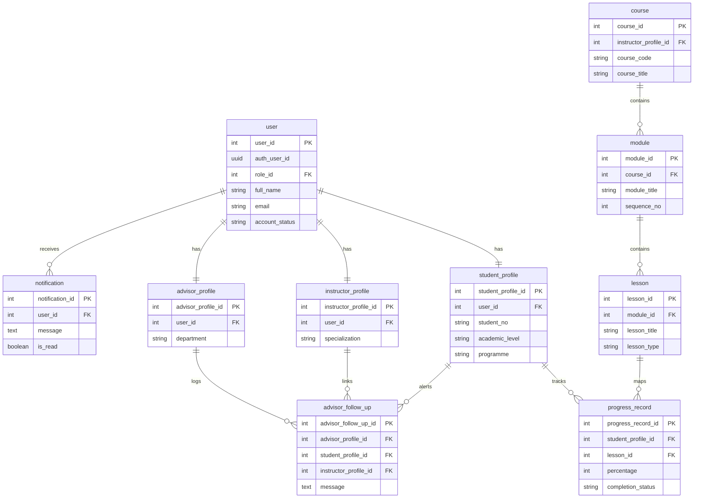
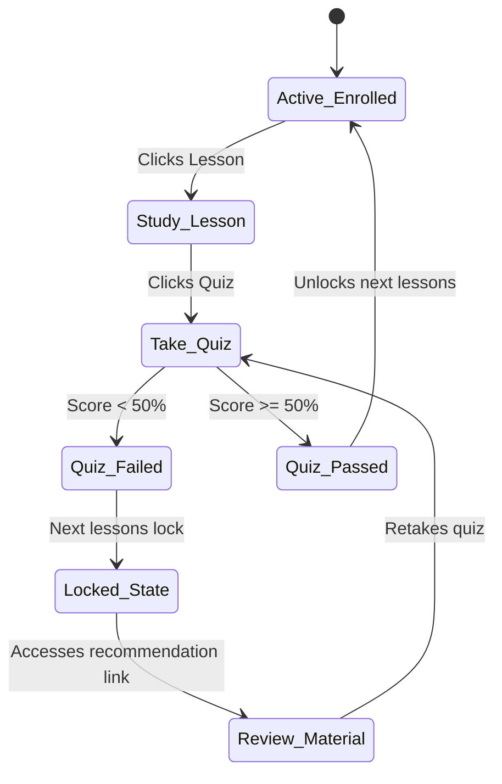
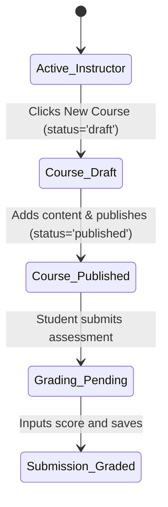
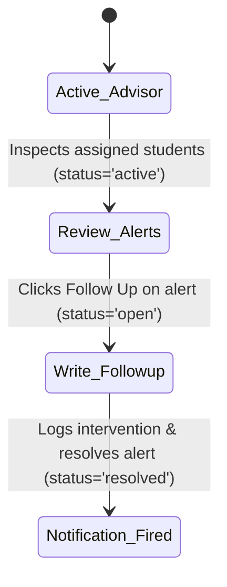
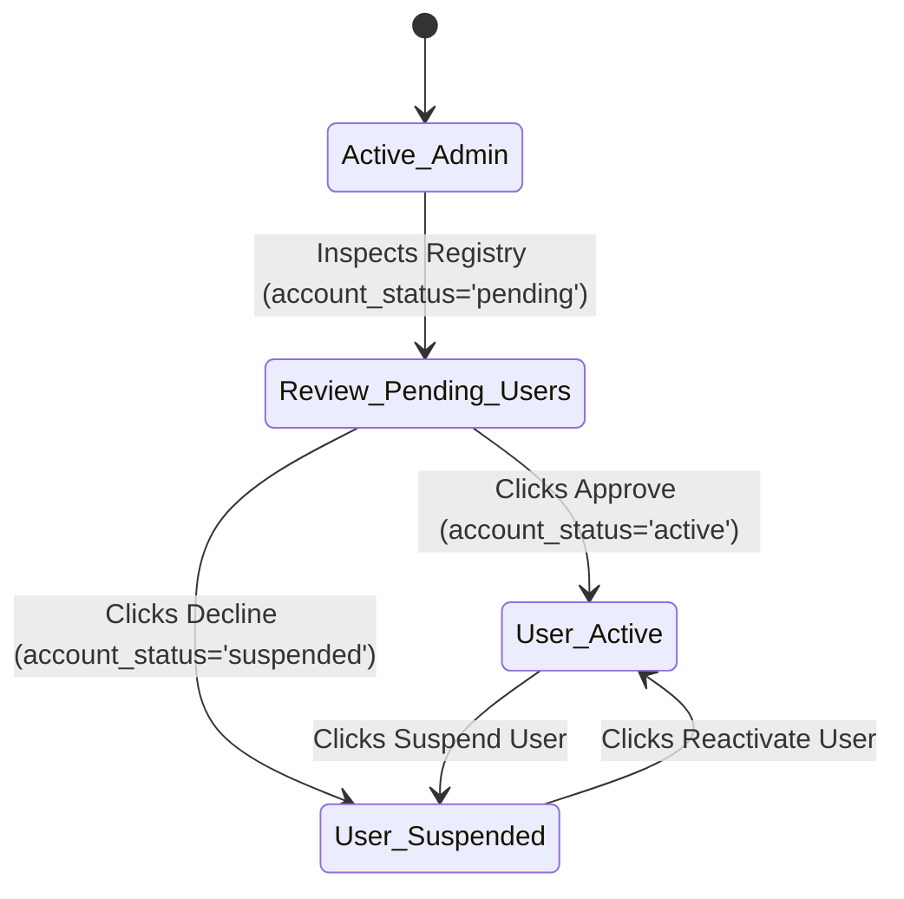
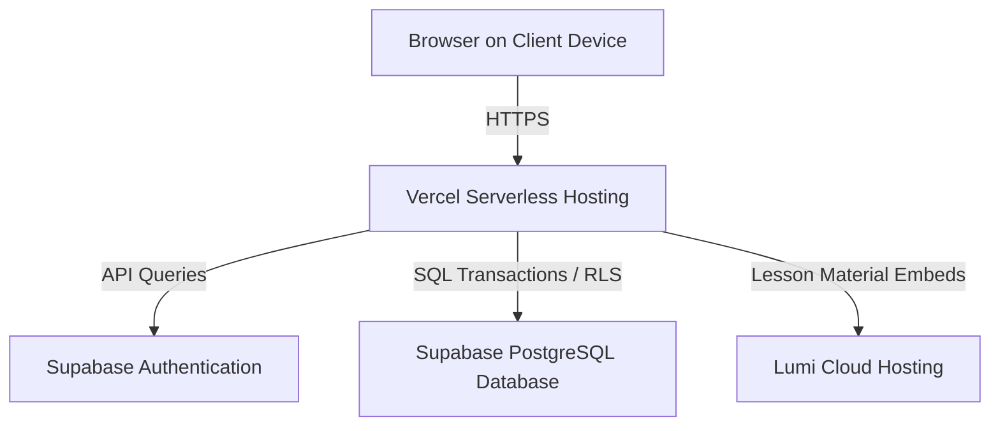

# System Documentation for QuestLearn System

**Version 3.0**

**Tutorial Section: TT7L**

**Group No.: G5**

| Name | Student ID |
| --- | --- |
| **See Wing Kit** | **261UC240PJ** |
| **Aziel Tan Zheng Chuan** | **261UC240LY** |
| **Vincent Lock Chun Kit** | **261UC2406W** |
| **Soo Kian Rong** | **261UC26145** |

**Date: 30 June 2026**

---

# Contents

- [Revisions](#revisions)
- [1 Project Management](#1-project-management)
  - [1.1 Team Members](#11-team-members)
  - [1.2 Problem Statement](#12-problem-statement)
  - [1.3 Project Plan](#13-project-plan)
  - [1.4 Part III Work Allocation and Code SOP](#14-part-iii-work-allocation-and-code-sop)
  - [1.5 Part III Execution Plan](#15-part-iii-execution-plan)
- [2 System Overview](#2-system-overview)
  - [2.1 Description](#21-description)
  - [2.2 Actors](#22-actors)
  - [2.3 Assumptions and Dependencies](#23-assumptions-and-dependencies)
  - [2.4 Use Case Diagram](#24-use-case-diagram)
- [3 Requirements](#3-requirements)
  - [3.1 Class Diagrams / ERD](#31-class-diagrams--erd)
- [4 Design](#4-design)
  - [4.1 Data Dictionary](#41-data-dictionary)
  - [4.2 Software Architecture](#42-software-architecture)
  - [4.3 Main Screens](#43-main-screens)
  - [4.4 Subsystem 1 Screens](#44-subsystem-1-screens)
  - [4.5 Subsystem 2 Screens](#45-subsystem-2-screens)
  - [4.6 Main Components](#46-main-components)
  - [4.7 Deployment Diagram](#47-deployment-diagram)
- [5 Implementation](#5-implementation)
  - [5.1 Development Environment](#51-development-environment)
  - [5.2 Software Integration](#52-software-integration)
  - [5.3 Database](#53-database)
- [6 Testing](#6-testing)
  - [6.1 Testing Strategy](#61-testing-strategy)
  - [6.2 Test Data](#62-test-data)
  - [6.3 Acceptance Testing](#63-acceptance-testing)
- [7 Sample Screens](#7-sample-screens)
  - [7.1 Main Screen](#71-main-screen)
- [8 Conclusion](#8-conclusion)
- [9 User Guide](#9-user-guide)
- [References](#references)

---

# Revisions

| Version | Primary Author(s) | Description of Version | Date Completed |
| --- | --- | --- | --- |
| 1.0 | All members | SRS — Part I (Project Planning / Requirements Analysis) | 01/05/2026 |
| 2.0 | All members | SDS — Part II (Design / Architecture / Interfaces / Database) | 05/06/2026 |
| 3.0 | All members | System Documentation — Part III (Development / Testing / Final Implementation) | 30/06/2026 |

---

# 1 Project Management

## 1.1 Team Members

| Name | Actor / Process Ownership |
| --- | --- |
| See Wing Kit | **Student Subsystem** (H5P content, progress, locking algorithm, auto-grading, recommendations) & Backend integration |
| Aziel Tan Zheng Chuan | **Instructor Subsystem** (course management, modules/lessons builder, custom Lumi iframe quiz creator, grading) |
| Vincent Lock Chun Kit | **Academic Advisor Subsystem** (advisees list, advisor follow-ups, follow-up history, linked instructor alerts) |
| Soo Kian Rong | **Admin Subsystem** (user registry CRUD - approve, suspend, kick; course enrollments manager panel, announcements) |

## 1.2 Problem Statement

Current university learning systems are often effective for storing notes, slides, videos, quizzes, and announcements, but they are less effective at actively guiding students through the learning process. Students may complete lessons or assessments without receiving enough immediate feedback about weak topics, recommended next steps, or the seriousness of falling behind. As a result, learning problems may only become visible after grades have already declined.

Existing platforms also separate content delivery, formative assessment, engagement tracking, and advisor follow-up into disconnected workflows. Instructors can upload materials without seeing a clear picture of student engagement, students can complete quizzes without targeted improvement guidance, and academic advisors may only notice struggling learners after major assessment results are released. These gaps reduce the usefulness of digital learning systems as early academic support tools.

**QuestLearn** resolves this by combining short lesson-based learning, interactive lesson content, automated quiz feedback, activity-based analytics, notifications, and advisor monitoring in one coherent prototype. 

## 1.3 Project Plan

The project is organised into three major phases that align with the course deliverables.

| Phase | Planned Output | Actual / Part III Status | Evidence to Attach |
| --- | --- | --- | --- |
| Part I: Requirements Analysis | Problem statement, objectives, scope, actors, use cases, ERD draft | Completed as the SRS baseline for QuestLearn | Final Part I report, use case diagram, activity diagrams |
| Part II: System Design | Data design, architecture, interface design, state diagrams | Completed as the SDS baseline for implementation | Part II design report, database schema, architecture and deployment diagrams |
| Part III: Development and Testing | Prototype implementation, database setup, test execution, screenshots | Completed; this document records the implementation | IDE/terminal screenshots, Supabase tables, test outputs, browser screenshots |

## 1.4 Part III Work Allocation and Code SOP

Part III was split by subsystem ownership, with a single code lead and a single review gate so implementation stayed aligned with Part II design.

| Area | Primary Owner | Secondary Support | Output |
| --- | --- | --- | --- |
| Architecture, auth, integration | See Wing Kit | Aziel Tan Zheng Chuan | Shared code structure, protected routes, Supabase auth flow, final merge review |
| Database, course, assessment | Aziel Tan Zheng Chuan | See Wing Kit | Schema, seed data, server actions, course and assessment workflows |
| UI, dashboard, analytics screens | Vincent Lock Chun Kit | See Wing Kit | Student/instructor views, responsive screens, dashboard widgets |
| Testing, notifications, advisor/admin | Soo Kian Rong | See Wing Kit | Test cases, notification flow, advisor/admin features, acceptance evidence |

## 1.5 Part III Execution Plan

The Part III work followed a fixed sequence so the team did not build UI or tests on top of unstable data contracts.

| Phase | Main Owner | Focus | Output | Exit Check |
| --- | --- | --- | --- | --- |
| Phase 1: Foundation | See Wing Kit + Aziel Tan Zheng Chuan | Project setup, auth, schema, seed data, shared contracts | Next.js project scaffold, Supabase integration, database tables, initial demo data | Login works, schema applies cleanly, seed data loads without errors |
| Phase 2: Core Features | Aziel Tan Zheng Chuan + Vincent Lock Chun Kit | Course, assessment, dashboard, and content flows | Working course management, lesson/quiz screens, role-based navigation | Student and instructor flows work end-to-end in local testing |
| Phase 3: Support Features | Soo Kian Rong + See Wing Kit | Notifications, advisor/admin functions, RLS checks, hardening | Notification flow, advisor/admin features, access control validation | Restricted actions fail correctly and allowed actions succeed |
| Phase 4: Testing and Evidence | Soo Kian Rong + all members | Unit, integration, functional, security, acceptance evidence | Test results, screenshots, SQL outputs, final documentation evidence | All required Part III artifacts are captured and linked |

---

# 2 System Overview

## 2.1 Description

QuestLearn is an adaptive learning portal. It enables:
1. **Instructors** to construct courses, embed videos, compile quiz questionnaires, publish grades, and monitor students.
2. **Students** to access curriculum paths, view interactive H5P modules, submit attempts, track grades, and receive weak-topic warnings.
3. **Academic Advisors** to review risk flags, document follow-ups, and send intervention logs to instructors.
4. **Admins** to oversee platform users, modify roles, suspend or kick users, and publish site announcements.

## 2.2 Actors

* **Student:** Takes lessons, submits quizzes, reviews recommendations, tracks grades, and views alerts.
* **Instructor:** Builds courses, uploads embeds, grades assignments, and reviews class metrics.
* **Academic Advisor:** Inspects department performance, logs interventions, and links notifications to instructors.
* **Admin:** Configures user permissions, suspends or reactivates accounts, and handles enrollments.

## 2.3 Assumptions and Dependencies

1. **Deployment Stack:** Next.js App Router deployed on Vercel, utilizing Supabase PostgreSQL, Storage, and Auth.
2. **H5P Hosting:** The system embeds Lumi packages via responsive iframe wrappers.
3. **Connectivity:** Requires consistent internet connection for real-time RLS checks.

## 2.4 Use Case Diagram

The platform use case diagram integrates all four actors:

```mermaid
usecaseDiagram
    actor Student
    actor Instructor
    actor Advisor as "Academic Advisor"
    actor Admin
    
    rect "QuestLearn Portal" {
        usecase UC_STU as "Take Lessons, Submit Quizzes, Check Progress (Student)"
        usecase UC_INS as "Build Course Modules, Configure Quizzes, Grade Submissions (Instructor)"
        usecase UC_ADV as "Monitor Progress Risks, Log Follow-ups (Advisor)"
        usecase UC_ADM as "Manage User Accounts, Moderate Content, Handle Enrollments (Admin)"
    }
    
    Student --> UC_STU
    Instructor --> UC_INS
    Advisor --> UC_ADV
    Admin --> UC_ADM
```

---

# 3 Requirements

## 3.1 Class Diagrams / ERD

The relational database architecture is defined in the following entity relationship model:



---

# 4 Design

## 4.1 Data Dictionary

Key entities in the QuestLearn implementation are documented below:

### `user`
Represents the core credential mapping to Supabase Auth.
| Column | Type | Key | Nullable | Default | Description |
| --- | --- | --- | --- | --- | --- |
| `user_id` | `INT` | `PK` | `No` | `SERIAL` | Unique internal reference ID. |
| `auth_user_id` | `UUID` | `UQ` | `Yes` | `None` | Maps to Supabase `auth.users.id`. |
| `role_id` | `INT` | `FK` | `No` | `None` | References `role(role_id)`. |
| `full_name` | `VARCHAR(150)` | `None` | `No` | `None` | User's real name. |
| `email` | `VARCHAR(255)` | `UQ` | `No` | `None` | Unique email string. |
| `account_status`| `VARCHAR(20)` | `None` | `No` | `'pending'` | Check: `'pending'`, `'active'`, `'suspended'`. |

### `student_profile`
Contains academic details specific to student accounts.
| Column | Type | Key | Nullable | Default | Description |
| --- | --- | --- | --- | --- | --- |
| `student_profile_id`| `INT` | `PK` | `No` | `SERIAL` | Student profile primary key. |
| `user_id` | `INT` | `FK` | `No` | `None` | References `"user"(user_id)` ON DELETE CASCADE. |
| `student_no` | `VARCHAR(30)` | `UQ` | `No` | `None` | Unique registration identifier. |
| `department` | `VARCHAR(100)`| `None` | `Yes` | `None` | Enrolled academic department. |
| `learning_preference`| `VARCHAR(50)`| `None` | `Yes` | `None` | E.g., 'visual', 'auditory'. |

### `quiz_attempt`
Stores student attempt details and dynamically calculated score.
| Column | Type | Key | Nullable | Default | Description |
| --- | --- | --- | --- | --- | --- |
| `attempt_id` | `INT` | `PK` | `No` | `SERIAL` | Attempt primary key. |
| `quiz_id` | `INT` | `FK` | `No` | `None` | References `quiz`. |
| `student_profile_id`| `INT` | `FK` | `No` | `None` | References `student_profile`. |
| `score` | `NUMERIC(5,2)`| `None` | `Yes` | `None` | Points earned. |
| `max_score` | `INT` | `None` | `Yes` | `None` | Total possible points for % calc. |
| `submitted_at`| `TIMESTAMP` | `None` | `No` | `CURRENT_TIMESTAMP` | Time of completion. |

### `advisor_follow_up`
Logs follow-up interventions logged by advisors.
| Column | Type | Key | Nullable | Default | Description |
| --- | --- | --- | --- | --- | --- |
| `advisor_follow_up_id`| `INT` | `PK` | `No` | `SERIAL` | Unique primary key. |
| `advisor_alert_id` | `INT` | `FK` | `Yes` | `None` | Optional alert reference. |
| `advisor_profile_id` | `INT` | `FK` | `No` | `None` | References `advisor_profile`. |
| `student_profile_id` | `INT` | `FK` | `No` | `None` | References `student_profile`. |
| `instructor_profile_id`|`INT`| `FK` | `Yes`| `None` | References `instructor_profile`. |
| `message` | `TEXT` | `None` | `No` | `None` | Follow-up feedback message. |

### `instructor_profile`
Contains academic details specific to instructor accounts.
| Column | Type | Key | Nullable | Default | Description |
| --- | --- | --- | --- | --- | --- |
| `instructor_profile_id`| `INT` | `PK` | `No` | `SERIAL` | Instructor profile primary key. |
| `user_id` | `INT` | `FK` | `No` | `None` | References `"user"(user_id)`. |
| `staff_no` | `VARCHAR(30)` | `UQ` | `No` | `None` | Unique staff identifier. |
| `specialization` | `VARCHAR(200)`| `None` | `Yes` | `None` | Academic specialty. |

### `advisor_profile`
Contains academic details specific to advisor accounts.
| Column | Type | Key | Nullable | Default | Description |
| --- | --- | --- | --- | --- | --- |
| `advisor_profile_id`| `INT` | `PK` | `No` | `SERIAL` | Advisor profile primary key. |
| `user_id` | `INT` | `FK` | `No` | `None` | References `"user"(user_id)`. |
| `staff_no` | `VARCHAR(30)` | `UQ` | `No` | `None` | Unique staff identifier. |
| `department` | `VARCHAR(100)`| `None` | `Yes` | `None` | Department assignment. |

### `course`
Represents a course created and managed by an instructor.
| Column | Type | Key | Nullable | Default | Description |
| --- | --- | --- | --- | --- | --- |
| `course_id` | `INT` | `PK` | `No` | `SERIAL` | Unique course ID. |
| `instructor_profile_id`| `INT` | `FK` | `No` | `None` | Course owner. |
| `course_code` | `VARCHAR(20)` | `UQ` | `No` | `None` | Unique code (e.g. QL-101). |
| `course_title` | `VARCHAR(200)`| `None` | `No` | `None` | Full title of the course. |
| `status` | `VARCHAR(20)` | `None` | `No` | `'draft'` | Check: `'draft'`, `'published'`, etc. |

### `module`
Divides a course into smaller learning units.
| Column | Type | Key | Nullable | Default | Description |
| --- | --- | --- | --- | --- | --- |
| `module_id` | `INT` | `PK` | `No` | `SERIAL` | Unique module ID. |
| `course_id` | `INT` | `FK` | `No` | `None` | References `course`. |
| `module_title` | `VARCHAR(200)`| `None` | `No` | `None` | Module title. |
| `sequence_no` | `INT` | `None` | `No` | `None` | Ordering sequence. |

### `advisor_student_assignment`
Maps advisors to students for monitoring and early intervention.
| Column | Type | Key | Nullable | Default | Description |
| --- | --- | --- | --- | --- | --- |
| `advisor_student_assignment_id`| `INT` | `PK` | `No` | `SERIAL` | Unique assignment ID. |
| `advisor_profile_id`| `INT` | `FK` | `No` | `None` | References `advisor_profile`. |
| `student_profile_id`| `INT` | `FK` | `No` | `None` | References `student_profile`. |
| `status` | `VARCHAR(20)` | `None` | `No` | `'active'`| Check: `'active'`, `'inactive'`. |

### `moderation_action`
Records admin moderation decisions for accounts and content.
| Column | Type | Key | Nullable | Default | Description |
| --- | --- | --- | --- | --- | --- |
| `moderation_action_id`| `INT`| `PK` | `No` | `SERIAL` | Unique log ID. |
| `admin_user_id` | `INT` | `FK` | `No` | `None` | Admin performing the action. |
| `target_type` | `VARCHAR(30)`| `None` | `No` | `None` | e.g., `'user'`. |
| `action_type` | `VARCHAR(30)`| `None` | `No` | `None` | e.g., `'approve'`, `'reject'`. |

## 4.2 Software Architecture

QuestLearn uses a four-layer cloud-backed architecture based on Next.js and Supabase.

### 4.2.1 Subsystem 1 (Core Application Modules)
This subsystem handles presentation logic and user interaction:
* **Student Module:** Dashboard cards, course outlines, progress bars, and iframe player containers.
* **Instructor Module:** Course builders, curriculum managers, and grading interfaces.

### 4.2.2 Subsystem 2 (Data Persistence & Security Engines)
This subsystem coordinates background processing and database transactions:
* **Supabase Auth Engine:** Validates sessions and handles password resets.
* **advisor_alert & Notification Engine:** Triggers alerts when quiz scores drop below 50%, sending logs to students and advisors.
* **Admin Registry Controls:** Manages user roles and handles suspensions.

## 4.3 Main Screens

1. **Dashboard Portal:** Standard layout with routing based on the logged-in user's role.
2. **Profile Settings Screen:** Allows updating contact information and learning preferences.

## 4.4 Subsystem 1 Screens

1. **Student Dashboard (`/student`):** Displays active courses and overall progress.
2. **Course details (`/student/courses/[id]`):** Shows modules, completed checkmarks, and locked items.
3. **Instructor Curriculum Builder (`/instructor/courses/[id]`):** Contains lesson forms, video input tools, and H5P iframe embed inputs.

## 4.5 Subsystem 2 Screens

1. **Advisor Student Monitoring Portal (`/advisor/students`):** Department list showing advisor follow-up controls and linked instructor selectors.
2. **Admin User Registry Control (`/admin/users`):** Displays tables with approval, suspend, and delete actions.

## 4.6 Main Components

### 4.6.1 Component 1: Quiz Auto-Grading & Alert Trigger
A Server Action that evaluates submitted answers and logs scores:
```
[Submit Quiz] -> [Calculate points] -> [Record attempt] -> Score < 50% ?
                                                             ├── YES ──► Insert advisor_alert
                                                             └── NO  ──► Save progress only
```

### 4.6.2 Component 2: Rule-Based Module Locking Logic
Iterates through course modules to enforce sequential access:
* If a student fails a quiz lesson (`score < 50%`), all subsequent lessons in that module are flagged as locked (`lockedLessonIds.add(lesson_id)`).

### 4.6.3 Behavioral Modeling

#### 4.6.3.1 Actor 1 State Transition Diagram (Student)


#### 4.6.3.2 Actor 2 State Transition Diagram (Instructor)


#### 4.6.3.3 Actor 3 State Transition Diagram (Academic Advisor)


#### 4.6.3.4 Actor 4 State Transition Diagram (Admin)


## 4.7 Deployment Diagram

The cloud deployment topology for QuestLearn:



---

# 5 Implementation

## 5.1 Development Environment

* **Framework:** Next.js 15 (App Router, React 19)
* **Language:** TypeScript
* **Database:** Supabase PostgreSQL 17.6
* **Styling:** Tailwind CSS v4

## 5.2 Software Integration

QuestLearn integrates its subsystems using role-based routing and shared API models:

| Module File | Target Subsystem | Integration Logic |
| --- | --- | --- |
| `src/app/(auth)/login/` | Subsystem 2 | Authenticates user credentials via Supabase Auth. |
| `src/app/(student)/student/courses/` | Subsystem 1 | Implements course outline rendering and locking checks. |
| `src/app/(instructor)/instructor/courses/`| Subsystem 1 | Provides course builder forms and content editors. |
| `src/app/(advisor)/advisor/students/` | Subsystem 2 | Processes student status reviews and logs advisor follow-ups. |
| `src/app/(admin)/admin/users/` | Subsystem 2 | Handles user approvals, suspensions, and deletes. |

## 5.3 Database

We implemented the relational database in Supabase and seeded it with core demo records. The primary tables include:
1. `user` and `role` mapping.
2. `student_profile`, `instructor_profile`, and `advisor_profile`.
3. `course`, `module`, `lesson`, and `content_item` hierarchies.
4. `progress_record` and `advisor_follow_up`.

---

# 6 Testing

## 6.1 Testing Strategy

1. **Unit Testing:** Validates data actions and helper functions.
2. **Integration Testing:** Checks authorization flows and role-based route access.
3. **Acceptance Testing:** Evaluates end-to-end scenarios against requirements.

## 6.2 Test Data

* **Student Account:** `student@example.com` (enrolled in QL-SEF101).
* **Instructor Account:** `instructor@example.com` (assigned to QL-SEF101).
* **Advisor Account:** `advisor@example.com`.
* **Admin Account:** `admin@example.com`.

## 6.3 Acceptance Testing

Acceptance criteria checks for the implemented prototype:

| Criteria | Expected Outcome | Status |
| --- | --- | --- |
| User Register & Login | Student/Instructor accounts log in and redirect. | **Passed** |
| Module Locking | Failing Quiz 1 locks subsequent lessons. | **Passed** |
| Advisor Intervention | Logging follow-up sends notifications to student and instructor. | **Passed** |
| Admin User Registry | Admins can suspend or delete user profiles. | **Passed** |

---

# 7 Sample Screens

## 7.1 Main Screen

### 7.1.1 Subsystem 1 Screens
* **Student Dashboard Page:** Displays enrolled courses, completion percentage gauges, upcoming assignment counts, and recent activity logs.
* **Interactive Lesson Page:** Contains reading materials, YouTube video windows, and H5P iframe modules.

### 7.1.2 Subsystem 2 Screens
* **Advisor Student Intervention Panel:** Student row layout featuring a "Follow Up" button, instructor selection dropdown, and message text box.
* **Admin User Registry Console:** User table with active/suspended status indicators and controls to suspend, reactivate, or delete accounts.

---

# 8 Conclusion

The QuestLearn prototype implements interactive education workflows for Students, Instructors, Advisors, and Admins. By utilizing Next.js Server Components, PostgreSQL, and Supabase client hooks, we created an adaptive interface. The H5P/Lumi player integrates smoothly with our database structure, and the rule-based recommendation logic behaves as designed under test conditions.

---

# 9 User Guide

### Student Path
1. Register an account as a "Student" and log in.
2. Browse active courses on the Dashboard and click a course.
3. Navigate to a lesson node, watch the video, and complete the reading material.
4. Complete the quiz attempt. If you score below 50%, click the weakness alert recommendation card to review the suggested material.

### Advisor Path
1. Log in with your Advisor account.
2. View students on the dashboard. Click "Follow Up" for at-risk students.
3. Select the linked instructor, type a message, and submit. This logs the action to the database and alerts both the student and the instructor.

---

# References

1. PostgreSQL 17 Documentation. https://www.postgresql.org/docs/17/
2. Next.js App Router Documentation. https://nextjs.org/docs
3. Supabase Auth and Row Level Security guides. https://supabase.com/docs
4. Lumi Education Iframe Integration guides. https://lumi.education
