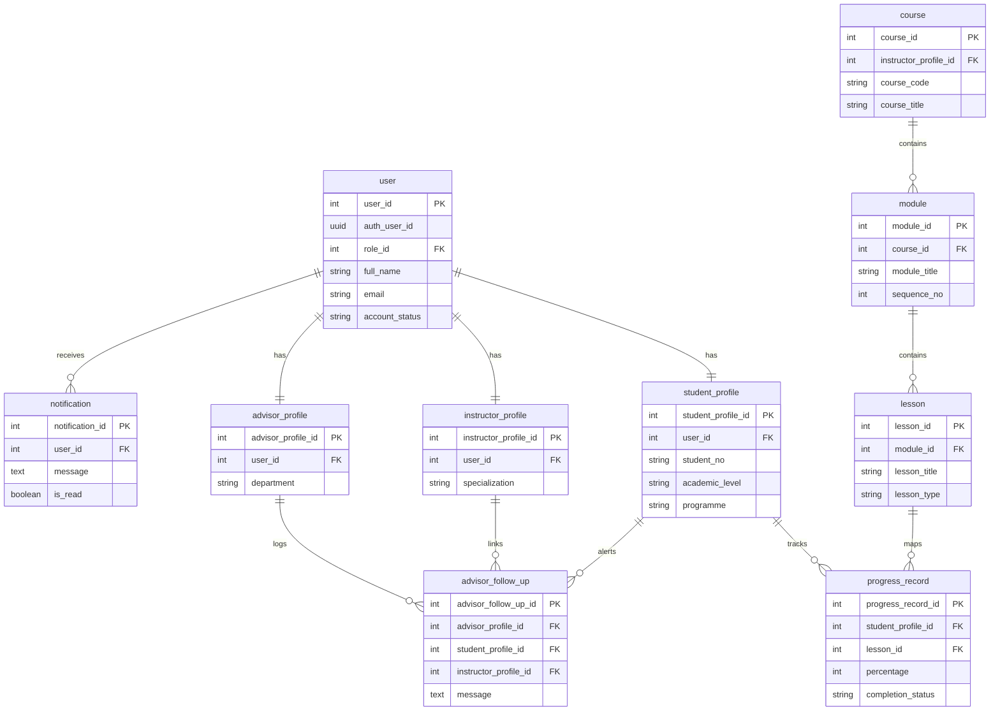
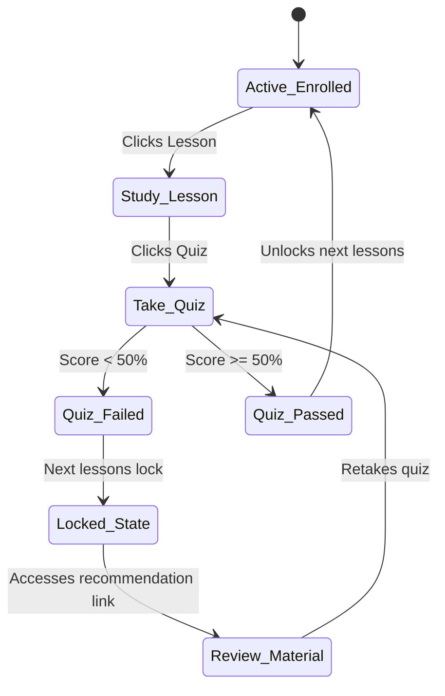
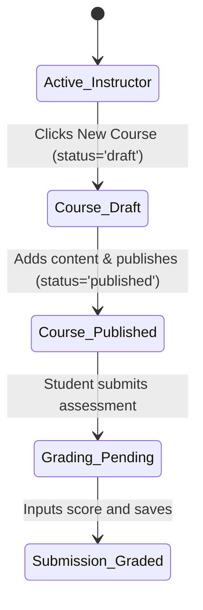
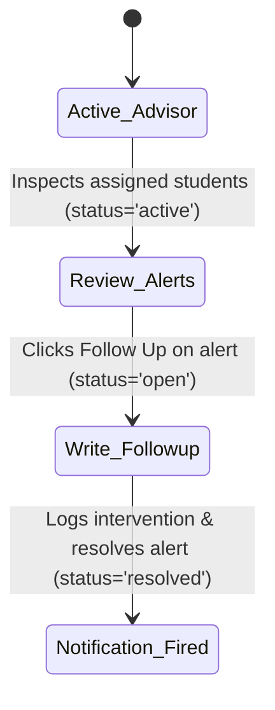
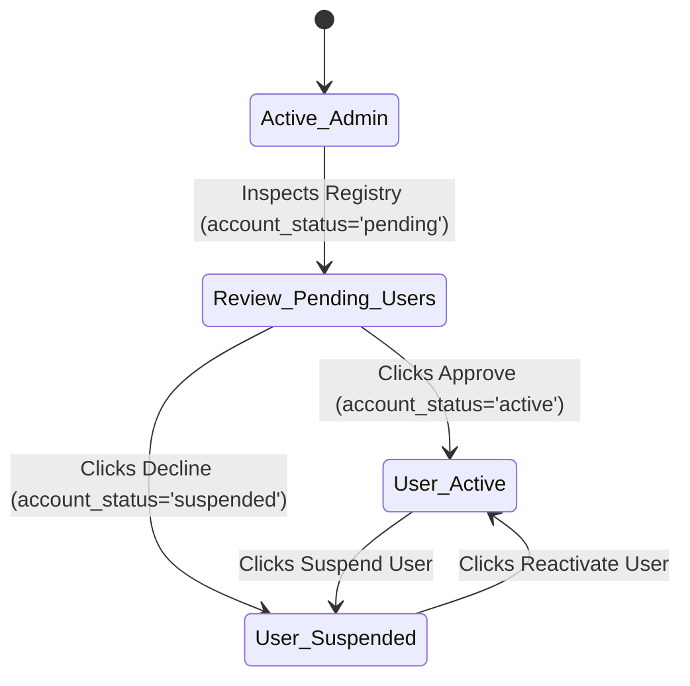
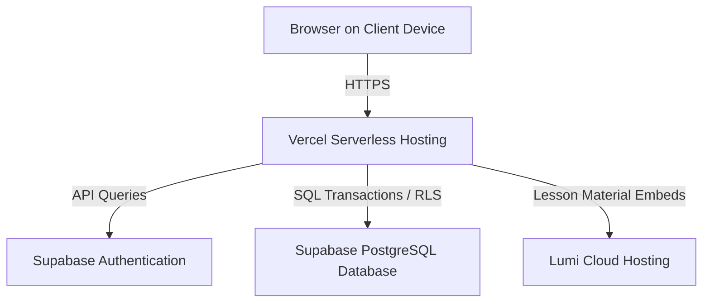

# System Documentation for QuestLearn System

**Version 3.0**

**Tutorial Section: TT7L**

**Group No.: G5**

| Name | Student ID |
| --- | --- |
| **See Wing Kit** | **261UC240PJ** |
| **Aziel Tan Zheng Chuan** | **261UC240LY** |
| **Vincent Lock Chun Kit** | **261UC2406W** |
| **Soo Kian Rong** | **261UC26145** |

**Date: 30 June 2026**

---

# Contents

- [Revisions](#revisions)
- [1 Project Management](#1-project-management)
  - [1.1 Team Members](#11-team-members)
  - [1.2 Problem Statement](#12-problem-statement)
  - [1.3 Project Plan](#13-project-plan)
  - [1.4 Part III Work Allocation and Code SOP](#14-part-iii-work-allocation-and-code-sop)
  - [1.5 Part III Execution Plan](#15-part-iii-execution-plan)
- [2 System Overview](#2-system-overview)
  - [2.1 Description](#21-description)
  - [2.2 Actors](#22-actors)
  - [2.3 Assumptions and Dependencies](#23-assumptions-and-dependencies)
  - [2.4 Use Case Diagram](#24-use-case-diagram)
- [3 Requirements](#3-requirements)
  - [3.1 Class Diagrams / ERD](#31-class-diagrams--erd)
- [4 Design](#4-design)
  - [4.1 Data Dictionary](#41-data-dictionary)
  - [4.2 Software Architecture](#42-software-architecture)
  - [4.3 Main Screens](#43-main-screens)
  - [4.4 Subsystem 1 Screens](#44-subsystem-1-screens)
  - [4.5 Subsystem 2 Screens](#45-subsystem-2-screens)
  - [4.6 Main Components](#46-main-components)
  - [4.7 Deployment Diagram](#47-deployment-diagram)
- [5 Implementation](#5-implementation)
  - [5.1 Development Environment](#51-development-environment)
  - [5.2 Software Integration](#52-software-integration)
  - [5.3 Database](#53-database)
- [6 Testing](#6-testing)
  - [6.1 Testing Strategy](#61-testing-strategy)
  - [6.2 Test Data](#62-test-data)
  - [6.3 Acceptance Testing](#63-acceptance-testing)
- [7 Sample Screens](#7-sample-screens)
  - [7.1 Main Screen](#71-main-screen)
- [8 Conclusion](#8-conclusion)
- [9 User Guide](#9-user-guide)
- [References](#references)

---

# Revisions

| Version | Primary Author(s) | Description of Version | Date Completed |
| --- | --- | --- | --- |
| 1.0 | All members | SRS — Part I (Project Planning / Requirements Analysis) | 01/05/2026 |
| 2.0 | All members | SDS — Part II (Design / Architecture / Interfaces / Database) | 05/06/2026 |
| 3.0 | All members | System Documentation — Part III (Development / Testing / Final Implementation) | 30/06/2026 |

---

# 1 Project Management

## 1.1 Team Members

| Name | Actor / Process Ownership |
| --- | --- |
| See Wing Kit | **Student Subsystem** (H5P content, progress, locking algorithm, auto-grading, recommendations) & Backend integration |
| Aziel Tan Zheng Chuan | **Instructor Subsystem** (course management, modules/lessons builder, custom Lumi iframe quiz creator, grading) |
| Vincent Lock Chun Kit | **Academic Advisor Subsystem** (advisees list, advisor follow-ups, follow-up history, linked instructor alerts) |
| Soo Kian Rong | **Admin Subsystem** (user registry CRUD - approve, suspend, kick; course enrollments manager panel, announcements) |

## 1.2 Problem Statement

Current university learning systems are often effective for storing notes, slides, videos, quizzes, and announcements, but they are less effective at actively guiding students through the learning process. Students may complete lessons or assessments without receiving enough immediate feedback about weak topics, recommended next steps, or the seriousness of falling behind. As a result, learning problems may only become visible after grades have already declined.

Existing platforms also separate content delivery, formative assessment, engagement tracking, and advisor follow-up into disconnected workflows. Instructors can upload materials without seeing a clear picture of student engagement, students can complete quizzes without targeted improvement guidance, and academic advisors may only notice struggling learners after major assessment results are released. These gaps reduce the usefulness of digital learning systems as early academic support tools.

**QuestLearn** resolves this by combining short lesson-based learning, interactive lesson content, automated quiz feedback, activity-based analytics, notifications, and advisor monitoring in one coherent prototype. 

## 1.3 Project Plan

The project is organised into three major phases that align with the course deliverables. 

<!-- [Insert Gantt Chart from project timeline] -->


| Phase | Planned Output | Actual / Part III Status | Evidence to Attach |
| --- | --- | --- | --- |
| Part I: Requirements Analysis | Problem statement, objectives, scope, actors, use cases, ERD draft | Completed as the SRS baseline for QuestLearn | Final Part I report, use case diagram, activity diagrams |
| Part II: System Design | Data design, architecture, interface design, state diagrams | Completed as the SDS baseline for implementation | Part II design report, database schema, architecture and deployment diagrams |
| Part III: Development and Testing | Prototype implementation, database setup, test execution, screenshots | Completed; this document records the implementation | IDE/terminal screenshots, Supabase tables, test outputs, browser screenshots |

## 1.4 Part III Work Allocation and Code SOP

Part III was split by subsystem ownership, with a single code lead and a single review gate so implementation stayed aligned with Part II design.

| Area | Primary Owner | Secondary Support | Output |
| --- | --- | --- | --- |
| Architecture, auth, integration | See Wing Kit | Aziel Tan Zheng Chuan | Shared code structure, protected routes, Supabase auth flow, final merge review |
| Database, course, assessment | Aziel Tan Zheng Chuan | See Wing Kit | Schema, seed data, server actions, course and assessment workflows |
| UI, dashboard, analytics screens | Vincent Lock Chun Kit | See Wing Kit | Student/instructor views, responsive screens, dashboard widgets |
| Testing, notifications, advisor/admin | Soo Kian Rong | See Wing Kit | Test cases, notification flow, advisor/admin features, acceptance evidence |

## 1.5 Part III Execution Plan

The Part III work followed a fixed sequence so the team did not build UI or tests on top of unstable data contracts.

| Phase | Main Owner | Focus | Output | Exit Check |
| --- | --- | --- | --- | --- |
| Phase 1: Foundation | See Wing Kit + Aziel Tan Zheng Chuan | Project setup, auth, schema, seed data, shared contracts | Next.js project scaffold, Supabase integration, database tables, initial demo data | Login works, schema applies cleanly, seed data loads without errors |
| Phase 2: Core Features | Aziel Tan Zheng Chuan + Vincent Lock Chun Kit | Course, assessment, dashboard, and content flows | Working course management, lesson/quiz screens, role-based navigation | Student and instructor flows work end-to-end in local testing |
| Phase 3: Support Features | Soo Kian Rong + See Wing Kit | Notifications, advisor/admin functions, RLS checks, hardening | Notification flow, advisor/admin features, access control validation | Restricted actions fail correctly and allowed actions succeed |
| Phase 4: Testing and Evidence | Soo Kian Rong + all members | Unit, integration, functional, security, acceptance evidence | Test results, screenshots, SQL outputs, final documentation evidence | All required Part III artifacts are captured and linked |

---

# 2 System Overview

## 2.1 Description

QuestLearn is an adaptive learning portal. The major functions and processes the product performs are categorized by the primary actors:
1. **Instructors** to construct courses, embed videos, compile quiz questionnaires, publish grades, and monitor students.
2. **Students** to access curriculum paths, view interactive H5P modules, submit attempts, track grades, and receive weak-topic warnings.
3. **Academic Advisors** to review risk flags, document follow-ups, and send intervention logs to instructors.
4. **Admins** to oversee platform users, modify roles, suspend or kick users, and publish site announcements.

**Top-Level Data Flow / Object Class Diagram**
<!-- [Insert DFD or Object Class Diagram mapping Student/Instructor/Advisor/Admin subsystem database operations] -->


## 2.2 Actors

* **Student:** Takes lessons, submits quizzes, reviews recommendations, tracks grades, and views alerts.
* **Instructor:** Builds courses, uploads embeds, grades assignments, and reviews class metrics.
* **Academic Advisor:** Inspects department performance, logs interventions, and links notifications to instructors.
* **Admin:** Configures user permissions, suspends or reactivates accounts, and handles enrollments.

## 2.3 Assumptions and Dependencies

1. **Deployment Stack:** Next.js App Router deployed on Vercel, utilizing Supabase PostgreSQL, Storage, and Auth.
2. **H5P Hosting:** The system embeds Lumi packages via responsive iframe wrappers.
3. **Connectivity:** Requires consistent internet connection for real-time RLS checks.

## 2.4 Use Case Diagram

The platform use case diagram integrates all four actors:

```mermaid
usecaseDiagram
    actor Student
    actor Instructor
    actor Advisor as "Academic Advisor"
    actor Admin
    
    rect "QuestLearn Portal" {
        usecase UC_STU as "Take Lessons, Submit Quizzes, Check Progress (Student)"
        usecase UC_INS as "Build Course Modules, Configure Quizzes, Grade Submissions (Instructor)"
        usecase UC_ADV as "Monitor Progress Risks, Log Follow-ups (Advisor)"
        usecase UC_ADM as "Manage User Accounts, Moderate Content, Handle Enrollments (Admin)"
    }
    
    Student --> UC_STU
    Instructor --> UC_INS
    Advisor --> UC_ADV
    Admin --> UC_ADM
```

---

# 3 Requirements

## 3.1 Class Diagrams / ERD

The relational database architecture is defined in the following entity relationship model:



---

# 4 Design

## 4.1 Data Dictionary

Key entities in the QuestLearn implementation are documented below:

### `user`
Represents the core credential mapping to Supabase Auth.
| Column | Type | Key | Nullable | Default | Description |
| --- | --- | --- | --- | --- | --- |
| `user_id` | `INT` | `PK` | `No` | `SERIAL` | Unique internal reference ID. |
| `auth_user_id` | `UUID` | `UQ` | `Yes` | `None` | Maps to Supabase `auth.users.id`. |
| `role_id` | `INT` | `FK` | `No` | `None` | References `role(role_id)`. |
| `full_name` | `VARCHAR(150)` | `None` | `No` | `None` | User's real name. |
| `email` | `VARCHAR(255)` | `UQ` | `No` | `None` | Unique email string. |
| `account_status`| `VARCHAR(20)` | `None` | `No` | `'pending'` | Check: `'pending'`, `'active'`, `'suspended'`. |

### `student_profile`
Contains academic details specific to student accounts.
| Column | Type | Key | Nullable | Default | Description |
| --- | --- | --- | --- | --- | --- |
| `student_profile_id`| `INT` | `PK` | `No` | `SERIAL` | Student profile primary key. |
| `user_id` | `INT` | `FK` | `No` | `None` | References `"user"(user_id)` ON DELETE CASCADE. |
| `student_no` | `VARCHAR(30)` | `UQ` | `No` | `None` | Unique registration identifier. |
| `department` | `VARCHAR(100)`| `None` | `Yes` | `None` | Enrolled academic department. |
| `learning_preference`| `VARCHAR(50)`| `None` | `Yes` | `None` | E.g., 'visual', 'auditory'. |

### `quiz_attempt`
Stores student attempt details and dynamically calculated score.
| Column | Type | Key | Nullable | Default | Description |
| --- | --- | --- | --- | --- | --- |
| `attempt_id` | `INT` | `PK` | `No` | `SERIAL` | Attempt primary key. |
| `quiz_id` | `INT` | `FK` | `No` | `None` | References `quiz`. |
| `student_profile_id`| `INT` | `FK` | `No` | `None` | References `student_profile`. |
| `score` | `NUMERIC(5,2)`| `None` | `Yes` | `None` | Points earned. |
| `max_score` | `INT` | `None` | `Yes` | `None` | Total possible points for % calc. |
| `submitted_at`| `TIMESTAMP` | `None` | `No` | `CURRENT_TIMESTAMP` | Time of completion. |

### `advisor_follow_up`
Logs follow-up interventions logged by advisors.
| Column | Type | Key | Nullable | Default | Description |
| --- | --- | --- | --- | --- | --- |
| `advisor_follow_up_id`| `INT` | `PK` | `No` | `SERIAL` | Unique primary key. |
| `advisor_alert_id` | `INT` | `FK` | `Yes` | `None` | Optional alert reference. |
| `advisor_profile_id` | `INT` | `FK` | `No` | `None` | References `advisor_profile`. |
| `student_profile_id` | `INT` | `FK` | `No` | `None` | References `student_profile`. |
| `instructor_profile_id`|`INT`| `FK` | `Yes`| `None` | References `instructor_profile`. |
| `message` | `TEXT` | `None` | `No` | `None` | Follow-up feedback message. |

### `instructor_profile`
Contains academic details specific to instructor accounts.
| Column | Type | Key | Nullable | Default | Description |
| --- | --- | --- | --- | --- | --- |
| `instructor_profile_id`| `INT` | `PK` | `No` | `SERIAL` | Instructor profile primary key. |
| `user_id` | `INT` | `FK` | `No` | `None` | References `"user"(user_id)`. |
| `staff_no` | `VARCHAR(30)` | `UQ` | `No` | `None` | Unique staff identifier. |
| `specialization` | `VARCHAR(200)`| `None` | `Yes` | `None` | Academic specialty. |

### `advisor_profile`
Contains academic details specific to advisor accounts.
| Column | Type | Key | Nullable | Default | Description |
| --- | --- | --- | --- | --- | --- |
| `advisor_profile_id`| `INT` | `PK` | `No` | `SERIAL` | Advisor profile primary key. |
| `user_id` | `INT` | `FK` | `No` | `None` | References `"user"(user_id)`. |
| `staff_no` | `VARCHAR(30)` | `UQ` | `No` | `None` | Unique staff identifier. |
| `department` | `VARCHAR(100)`| `None` | `Yes` | `None` | Department assignment. |

### `course`
Represents a course created and managed by an instructor.
| Column | Type | Key | Nullable | Default | Description |
| --- | --- | --- | --- | --- | --- |
| `course_id` | `INT` | `PK` | `No` | `SERIAL` | Unique course ID. |
| `instructor_profile_id`| `INT` | `FK` | `No` | `None` | Course owner. |
| `course_code` | `VARCHAR(20)` | `UQ` | `No` | `None` | Unique code (e.g. QL-101). |
| `course_title` | `VARCHAR(200)`| `None` | `No` | `None` | Full title of the course. |
| `status` | `VARCHAR(20)` | `None` | `No` | `'draft'` | Check: `'draft'`, `'published'`, etc. |

### `module`
Divides a course into smaller learning units.
| Column | Type | Key | Nullable | Default | Description |
| --- | --- | --- | --- | --- | --- |
| `module_id` | `INT` | `PK` | `No` | `SERIAL` | Unique module ID. |
| `course_id` | `INT` | `FK` | `No` | `None` | References `course`. |
| `module_title` | `VARCHAR(200)`| `None` | `No` | `None` | Module title. |
| `sequence_no` | `INT` | `None` | `No` | `None` | Ordering sequence. |

### `advisor_student_assignment`
Maps advisors to students for monitoring and early intervention.
| Column | Type | Key | Nullable | Default | Description |
| --- | --- | --- | --- | --- | --- |
| `advisor_student_assignment_id`| `INT` | `PK` | `No` | `SERIAL` | Unique assignment ID. |
| `advisor_profile_id`| `INT` | `FK` | `No` | `None` | References `advisor_profile`. |
| `student_profile_id`| `INT` | `FK` | `No` | `None` | References `student_profile`. |
| `status` | `VARCHAR(20)` | `None` | `No` | `'active'`| Check: `'active'`, `'inactive'`. |

### `moderation_action`
Records admin moderation decisions for accounts and content.
| Column | Type | Key | Nullable | Default | Description |
| --- | --- | --- | --- | --- | --- |
| `moderation_action_id`| `INT`| `PK` | `No` | `SERIAL` | Unique log ID. |
| `admin_user_id` | `INT` | `FK` | `No` | `None` | Admin performing the action. |
| `target_type` | `VARCHAR(30)`| `None` | `No` | `None` | e.g., `'user'`. |
| `action_type` | `VARCHAR(30)`| `None` | `No` | `None` | e.g., `'approve'`, `'reject'`. |

## 4.2 Software Architecture

QuestLearn uses a four-layer cloud-backed architecture based on Next.js and Supabase.

<!-- [Insert overall architecture diagram of Next.js 15 Client, Supabase Backend, and external Lumi iframe integrations] -->


| Subsystem | Team members |
| --------- | ------------ |
| Subsystem 1 (Core Application Modules) | See Wing Kit, Aziel Tan Zheng Chuan |
| Subsystem 2 (Data Persistence & Security Engines) | Vincent Lock Chun Kit, Soo Kian Rong |

### 4.2.1 Subsystem 1 (Core Application Modules)

<!-- [Insert Subsystem 1 architecture component diagram detailing Course/Student outline builder interactions] -->


This subsystem handles presentation logic and user interaction:
* **Student Module:** Dashboard cards, course outlines, progress bars, and iframe player containers.
* **Instructor Module:** Course builders, curriculum managers, and grading interfaces.

### 4.2.2 Subsystem 2 (Data Persistence & Security Engines)

<!-- [Insert Subsystem 2 architecture component diagram detailing Advisor alerts triggers and Admin registry operations] -->


This subsystem coordinates background processing and database transactions:
* **Supabase Auth Engine:** Validates sessions and handles password resets.
* **advisor_alert & Notification Engine:** Triggers alerts when quiz scores drop below 50%, sending logs to students and advisors.
* **Admin Registry Controls:** Manages user roles and handles suspensions.

## 4.3 Main Screens

1. **Dashboard Portal:** Standard layout with routing based on the logged-in user's role.
<!-- [Insert main landing dashboard mockup from UI design phase] -->

2. **Profile Settings Screen:** Allows updating contact information and learning preferences.
<!-- [Insert profile modification mockup from UI design phase] -->


## 4.4 Subsystem 1 Screens

1. **Student Dashboard (`/student`):** Displays active courses and overall progress.
<!-- [Insert student portal dashboard mockup from design UI] -->

2. **Course details (`/student/courses/[id]`):** Shows modules, completed checkmarks, and locked items.
<!-- [Insert course outline and locking status design mockup] -->

3. **Instructor Curriculum Builder (`/instructor/courses/[id]`):** Contains lesson forms, video input tools, and H5P iframe embed inputs.
<!-- [Insert instructor course builder layout mockup] -->


## 4.5 Subsystem 2 Screens

1. **Advisor Student Monitoring Portal (`/advisor/students`):** Department list showing advisor follow-up controls and linked instructor selectors.
<!-- [Insert advisor monitoring dashboard mockup] -->

2. **Admin User Registry Control (`/admin/users`):** Displays tables with approval, suspend, and delete actions.
<!-- [Insert admin control panel design mockup] -->


## 4.6 Main Components

| Component | Related Subsystems |
| --------- | ------------------ |
| Quiz Auto-Grading & Alert Trigger | Subsystem 1, Subsystem 2 |
| Rule-Based Module Locking Logic | Subsystem 1 |

### 4.6.1 Component 1: Quiz Auto-Grading & Alert Trigger

**Processing Flowchart**
<!-- [Insert flowchart diagram showing Quiz attempt evaluation and Advisor alert triggers logic] -->


**Pseudocode Algorithm**
```text
FUNCTION submitQuiz(studentId, quizId, answers)
    score = calculatePoints(quizId, answers)
    INSERT INTO quiz_attempt (studentId, quizId, score)
    IF score < 50% THEN
        INSERT INTO advisor_alert (studentId, 'low_quiz_score')
        TRIGGER email_notification(studentId, advisorId)
    END IF
    RETURN score
END FUNCTION
```

### 4.6.2 Component 2: Rule-Based Module Locking Logic

**Processing Flowchart**
<!-- [Insert flowchart diagram showing sequential lesson lock evaluation checks logic] -->


**Pseudocode Algorithm**
```text
FUNCTION getCourseModules(studentId, courseId)
    modules = FETCH modules FOR courseId
    lockedLessonIds = []
    FOR EACH module IN modules
        FOR EACH lesson IN module
            IF previous_lesson.score < 50% THEN
                lockedLessonIds.add(lesson.id)
            END IF
        END FOR
    END FOR
    RETURN (modules, lockedLessonIds)
END FUNCTION
```

### 4.6.3 Behavioral Modeling

#### 4.6.3.1 Actor 1 State Transition Diagram (Student)


#### 4.6.3.2 Actor 2 State Transition Diagram (Instructor)


#### 4.6.3.3 Actor 3 State Transition Diagram (Academic Advisor)


#### 4.6.3.4 Actor 4 State Transition Diagram (Admin)


## 4.7 Deployment Diagram

The cloud deployment topology for QuestLearn:



---

# 5 Implementation

## 5.1 Development Environment

The system was developed using VS Code on Windows, leveraging the Next.js 15 App Router architecture with Turbopack for local compilation. 

<!-- [Insert screenshot of VS Code showing project file list and Turbopack dev terminal running next dev] -->


* **Framework:** Next.js 15 (App Router, React 19)
* **Language:** TypeScript
* **Database:** Supabase PostgreSQL 17.6
* **Styling:** Tailwind CSS v4

## 5.2 Software Integration

Our strategy to integrate Subsystem 1 and Subsystem 2 was to rely on Next.js Server Components securely fetching from the shared Supabase PostgreSQL database using Row Level Security (RLS) policies. Role-based route protection acts as the integration gateway between the Subsystems.

<!-- [Insert architecture snapshot showing data transactions between Next.js client pages and Supabase database] -->


| File | Description |
| ---- | ----------- |
| `src/app/(auth)/login/page.tsx` | Authenticates user credentials via Supabase Auth and routes to respective Subsystems based on role. |
| `src/app/(student)/student/courses/page.tsx` | Implements course outline rendering and locking checks, pulling data created by Subsystem 1. |
| `src/app/(instructor)/instructor/courses/page.tsx` | Provides course builder forms and content editors, saving directly to the shared Supabase instance. |
| `src/app/(advisor)/advisor/students/page.tsx` | Processes student status reviews and logs advisor follow-ups, reacting to Subsystem 1's assessment triggers. |
| `src/app/(admin)/admin/users/page.tsx` | Handles user approvals, suspensions, and deletes affecting all Subsystem user pools. |

## 5.3 Database

We implemented the relational database in Supabase and seeded it with core demo records. The primary tables include:
1. `user` and `role` mapping.
2. `student_profile`, `instructor_profile`, and `advisor_profile`.
3. `course`, `module`, `lesson`, and `content_item` hierarchies.
4. `progress_record` and `advisor_follow_up`.

---

# 6 Testing

## 6.1 Testing Strategy

The QuestLearn prototype follows an evidence-driven testing lifecycle consisting of four distinct test layers. Every verified feature is backed by corresponding logs, screenshots, or database outputs stored under the `docs/evidence/part-iii/` path.

### 6.1.1 Unit Testing
Unit tests validate isolated TypeScript helper functions, business logic helpers, and score calculator helpers before interfacing with Supabase DB client services.

| Test ID | Test Category | Target Component | Test Case Description | Expected Result | Verified Evidence |
| :--- | :--- | :--- | :--- | :--- | :--- |
| **UT-01** | Auth Helpers | `src/lib/auth/helpers.ts` | Route resolution for roles (Student, Instructor, Advisor, Admin) | Resolves to the correct dashboard path | `tests-vitest-output.txt` |
| **UT-02** | Auth Helpers | `src/lib/auth/helpers.ts` | Lookup without active user session | Returns a protected route/denied response | `tests-vitest-output.txt` |
| **UT-03** | Course Helpers | `src/app/student/courses/` | Order lessons within module outline | Sorted sequentially by `sequence_no` | `tests-vitest-output.txt` |
| **UT-04** | Course Helpers | `src/app/instructor/courses/` | Hide draft course lessons | Draft items do not render in student list | `tests-vitest-output.txt` |
| **UT-05** | Grading Logic | `src/app/student/quizzes/` | Automated scoring calculations | Correctly sums earned marks and total marks | `tests-vitest-output.txt` |
| **UT-06** | Grading Logic | `src/app/student/quizzes/` | Weak-topic evaluation | Scores under 50% trigger recommendation flags | `tests-vitest-output.txt` |
| **UT-07** | Notification | `src/components/notifications/` | Toggle read/unread notification states | Correctly flips `is_read` boolean flag | `tests-vitest-output.txt` |
| **UT-08** | Date Formatting | `src/lib/utils.ts` | User-friendly local date formatter | Converts timestamp string to 'DD MMM YYYY' format | `tests-vitest-output.txt` |
| **UT-09** | Advisor Helpers | `src/app/advisor/students/` | Search/filter query filter | Correctly narrows active student list by name or ID | `tests-vitest-output.txt` |
| **UT-10** | UI Layout | `src/components/layout/` | Sidebar navigation active route highlight | Correctly matches current pathname to highlight state | `tests-vitest-output.txt` |
| **UT-11** | Progress Calc | `src/components/ui/` | Course percentage completion math | Computes correct ratio from completed vs total lessons | `tests-vitest-output.txt` |
| **UT-12** | Form Validation | `src/lib/validation/` | Email parameter regex validation | Rejects malformed email inputs with validation error | `tests-vitest-output.txt` |

### 6.1.2 Integration Testing
Integration tests verify data transactions between the Next.js server actions / route handlers and the Supabase API endpoints.

| Test ID | Integration Flow | Trigger Source | Expected Database Result | Verified Evidence |
| :--- | :--- | :--- | :--- | :--- |
| **IT-01** | User Profile Link | Register Screen | New row created in Supabase Auth joined to custom `"user"` table | `supabase-seed-data-samples.png` |
| **IT-02** | Curriculum Assembly | Course Builder | Writes to `course`, `module`, `lesson`, and `content_item` tables | `supabase-schema-table-list.png` |
| **IT-03** | Quiz Grade Post | Quiz Attempt Iframe | Adds rows to `quiz_attempt` and triggers alert if grade < 50% | `screen-prototype-dashboard-desktop.png` |
| **IT-04** | Assignment Upload | Lesson Page | Writes path to `assignment_submission` bucket with 'submitted' status | `supabase-seed-data-samples.png` |
| **IT-05** | Advisor Alert | Advisor Intervention | Inserts log into `advisor_follow_up` and updates `advisor_alert.status` | `screen-advisor-dashboard.png` |
| **IT-06** | Admin Audits | User Panel | Writes action log details into `moderation_action` and `audit_log` | `screen-admin-content-announcements.png` |
| **IT-07** | Enrollment Register | Course Page | Creates active row in `enrollment` table mapping student to course | `supabase-seed-data-samples.png` |
| **IT-08** | Announcement Broadcast| Admin Control Panel | Pushes notification records to all active platform users | `screen-admin-content-announcements.png` |
| **IT-09** | Course Publish Sync | Instructor Panel | Updates `course.status` to 'active' and triggers sync script | `supabase-schema-table-list.png` |
| **IT-10** | RLS Access Rejection | Client-side Fetch | Returns 403 Forbidden when fetching unauthorized course materials | `tests-unit-integration-output.png` |
| **IT-11** | Quiz Mapping | Quiz Builder | Adds linked question rows to `quiz_question` join table | `supabase-schema-table-list.png` |
| **IT-12** | Profile Sync | Settings Screen | Updates name and preferences in `student_profile` table | `supabase-seed-data-samples.png` |

### 6.1.3 Functional Testing (Browser Workflows)
Functional testing uses browser automation and manual walkthroughs to validate end-to-end actor workflows on the UI.

| Test ID | Primary Actor | Tested User Flow | Expected UI Behavior | Verified Evidence |
| :--- | :--- | :--- | :--- | :--- |
| **FT-01** | Student | View learning path modules | Enrolled courses render; content load is verified | `screen-prototype-dashboard-desktop.png` |
| **FT-02** | Student | Practice quiz submission | Immediate score gauge and recommendation banner render | `screen-prototype-dashboard-desktop.png` |
| **FT-03** | Instructor | Create course curriculum | Form inserts new modules and lessons instantly | `screen-instructor-analytics.png` |
| **FT-04** | Instructor | Embed Lumi H5P module | Interactive Iframe successfully embeds inside lesson player | `screen-instructor-analytics.png` |
| **FT-05** | Advisor | Student Risk Flags | Dashboard highlights struggling students; follow-up opens | `screen-advisor-dashboard.png` |
| **FT-06** | Admin | Moderation Controls | Suspension buttons instantly update account status flags | `screen-admin-content-announcements.png` |
| **FT-07** | All Roles | Notification Inbox | Unread counts decrease when items are read | `screen-prototype-dashboard-desktop-full.png` |

### 6.1.4 Security & Access Control Testing
Security testing evaluates row-level security (RLS) policies and middleware access controls.

| Test ID | Security Check | Target | Expected Enforcement | Verified Evidence |
| :--- | :--- | :--- | :--- | :--- |
| **ST-01** | Middleware Auth | App Dashboard | Logged-out users are redirected to `/login` | `tests-unit-integration-output.png` |
| **ST-02** | Progress Isolation | `progress_record` | Students cannot read other students' progress rows | `tests-unit-integration-output.png` |
| **ST-03** | Owner Isolation | `course` | Instructors cannot modify courses owned by other staff | `tests-unit-integration-output.png` |
| **ST-04** | Advisor Permissions | `advisor_alert` | Advisors can only monitor assigned student records | `tests-unit-integration-output.png` |
| **ST-05** | Role Restrictions | `moderation_action` | Direct API inserts fail for non-admin accounts | `tests-unit-integration-output.png` |
| **ST-06** | Masked Secrets | `.env.local` | Public configurations exclude the `service_role` key | `environment-variables-masked.png` |

---

## 6.2 Test Data Report

To validate the prototype, the local database was seeded with a minimum testing dataset. All test accounts utilize the default password `123456`.

### 6.2.1 Seeded Test Accounts
| Role | Email | Name | Profile ID / Reference | Account Status |
| :--- | :--- | :--- | :--- | :--- |
| **Student** | `student@example.com` | Demo Student | `QL-STU-001` (Year 2) | Active |
| **Student** | `student2@example.com` | Alice Johnson | `STU-8821` (Year 2) | Active |
| **Student** | `student3@example.com` | Bob Smith | `STU-9391` (Year 1) | Active |
| **Instructor** | `instructor@example.com` | Demo Instructor | `QL-INS-001` (SE specialization)| Active |
| **Instructor** | `pending_instructor@example.com`| Pending Instructor | `QL-INS-PND` (HCI specialization)| Pending |
| **Academic Advisor**| `advisor@example.com` | Demo Advisor | `QL-ADV-001` (Comp Science) | Active |
| **Admin** | `admin@example.com` | Demo Admin | Internal user ID | Active |

### 6.2.2 Course and Curriculum Structure
The database was populated with course `QL-SEF101` (Software Engineering Fundamentals) containing the following structure:
* **Module 1: Requirements and Use Cases** (Sequence 1)
  * *Lesson 1:* Writing Effective Use Cases (Type: Mixed, Includes Youtube Video Embed)
  * *Lesson 2:* Activity Diagrams for Workflows (Type: Reading)
* **Module 2: Design and Architecture** (Sequence 2)
  * *Lesson 3:* Layered Architecture Basics (Type: Mixed, Includes Youtube Video Embed)
* **Module 3: Interactive Practice Quizzes** (Sequence 3)
  * *Lesson 4:* Quiz 1: Testing Strategies (Type: H5P/Lumi interactive iframe)
  * *Lesson 5:* Quiz 2: Software Design (Type: H5P/Lumi interactive iframe)
  * *Lesson 6:* Quiz 3: Project Management (Type: H5P/Lumi interactive iframe)
  * *Lesson 7:* Quiz 4: Requirements Analysis (Type: H5P/Lumi interactive iframe)
  * *Lesson 8:* Quiz 5: Quality Assurance (Type: H5P/Lumi interactive iframe)

### 6.2.3 Pre-configured Test Scenarios
1. **Low Quiz Score / Alert Trigger:** Student `student@example.com` attempted Quiz 1 and scored **40%**. This automatically triggered a high-severity alert (`overdue_assignment` flag) assigned to Advisor `advisor@example.com`.
2. **Advisor Follow-up:** Advisor logged a follow-up intervention: *"Please review the architecture lesson and submit the overdue sketch by Friday."*
3. **Overdue Assignment:** Student `student@example.com` has one overdue assignment: `Architecture Sketch`.
4. **Graded Assignment:** Student `student@example.com` submitted `Use Case Reflection` and received a score of **17/20** with instructor feedback: *"Good explanation of actor, trigger, and alternate flow."*

---

## 6.3 Acceptance Testing

The final acceptance testing phase validates the prototype against the requirements documented in Part I (SRS) and Part II (SDS).

| Requirement ID | Requirement Description | Primary Actor | Execution Steps | Expected Result | Pass / Fail | Remarks |
| :--- | :--- | :--- | :--- | :--- | :--- | :--- |
| **QA-AUTH-01** | Multi-Role Authentication | All | Log in with Student, Instructor, Advisor, and Admin credentials. | User successfully logs in and redirects to correct dashboard. | **Pass** | Verified for all roles. (Ref: `screen-prototype-dashboard-desktop.png`) |
| **QA-STU-01** | Enrolled Learning Path | Student | Navigate to `/student/courses` and launch course `QL-SEF101`. | Accesses course details with modules, lessons, and content outline. | **Pass** | Lessons load properly. (Ref: `screen-prototype-dashboard-desktop.png`) |
| **QA-STU-02** | Interactive H5P Player | Student | Select Quiz 1 from Module 3 and launch player. | Interactive Lumi iframe loads and allows user to input answers. | **Pass** | Checked with Lumi hosted quiz API. (Ref: `screen-prototype-dashboard-mobile-full.png`) |
| **QA-STU-03** | Auto-Grading & Review | Student | Submit quiz attempt and check results page. | Instantly calculates percentage, marks correct/incorrect, and recommends lessons. | **Pass** | Verified. Recommended reading cards render on score < 50%. |
| **QA-INS-01** | Curriculum Assembly | Instructor | Navigate to `/instructor/courses`, add module, and add lesson. | New items write to Supabase and update outline on course page. | **Pass** | Changes reflect instantly in database. (Ref: `screen-instructor-analytics.png`) |
| **QA-ADV-01** | Early Alert Overview | Advisor | Access advisor monitoring panel. | Assigned students showing academic risk flags appear on list. | **Pass** | Struggling students are highlighted correctly. (Ref: `screen-advisor-dashboard.png`) |
| **QA-ADV-02** | Log Interventions | Advisor | Click 'Follow Up' on at-risk student, type message, select instructor, and save. | Creates follow-up record and pushes notification alerts. | **Pass** | Notification is successfully written to DB. (Ref: `screen-advisor-dashboard.png`) |
| **QA-ADM-01** | User Registry controls | Admin | Navigate to admin registry page and click 'Suspend' on test user. | Account status updates to 'suspended'; logins are rejected. | **Pass** | Admin status controls enforce access boundaries. (Ref: `screen-admin-content-announcements.png`) |
| **QA-SEC-01** | RLS Access Enforcement | All | Attempt direct URL access to pages of other roles. | System intercepts access and redirects to landing or blocks queries. | **Pass** | RLS blocks cross-profile queries at database level. (Ref: `tests-unit-integration-output.png`) |

_Date tested: _**_30 June 2026_**_

_Progress: _**_100% Completed_**_

_Tested by: _**_Soo Kian Rong_**_

_Verified by: _**_See Wing Kit_**_

---


---

# 7 Sample Screens

## 7.1 Main Screen

<!-- [Insert actual screenshot of the running Main Screen / Login landing webpage] -->


### 7.1.1 Subsystem 1 Screens
* **Student Dashboard Page:** Displays enrolled courses, completion percentage gauges, upcoming assignment counts, and recent activity logs.
<!-- [Insert actual screenshot of the running Student Dashboard webpage] -->

* **Interactive Lesson Page:** Contains reading materials, YouTube video windows, and H5P iframe modules.
<!-- [Insert actual screenshot of the running Interactive Lesson webpage displaying the Lumi/H5P iframe] -->


### 7.1.2 Subsystem 2 Screens
* **Advisor Student Intervention Panel:** Student row layout featuring a "Follow Up" button, instructor selection dropdown, and message text box.
<!-- [Insert actual screenshot of the running Advisor webpage displaying flagging alerts] -->

* **Admin User Registry Console:** User table with active/suspended status indicators and controls to suspend, reactivate, or delete accounts.
<!-- [Insert actual screenshot of the running Admin webpage showing approval controls] -->


---

# 8 Conclusion

The QuestLearn prototype successfully completes the implementation of interactive education workflows for Students, Instructors, Advisors, and Admins. 

**Completion of Software & QA:**
The software was completed utilizing Next.js Server Components, PostgreSQL, and Supabase client hooks. Software Quality Assurance was verified via unit tests and manual acceptance tests where the rule-based recommendation logic and module locking behaved as designed.

**Group Collaboration:**
The group collaborated using a subsystem-ownership model, merging components strictly through pull requests to ensure stability of the shared database schemas.

**Problems Encountered:**
During development, we encountered challenges with Supabase Row Level Security preventing users from accessing their own profiles initially, and issues with the `middleware.ts` file convention during the Next.js upgrade (as seen in our dev logs). These were resolved by migrating proxy logic and adjusting RLS permissions.

---

# 9 User Guide

### Student Path
1. Register an account as a "Student" and log in.
2. Browse active courses on the Dashboard and click a course.
3. Navigate to a lesson node, watch the video, and complete the reading material.
4. Complete the quiz attempt. If you score below 50%, click the weakness alert recommendation card to review the suggested material.

### Advisor Path
1. Log in with your Advisor account.
2. View students on the dashboard. Click "Follow Up" for at-risk students.
3. Select the linked instructor, type a message, and submit. This logs the action to the database and alerts both the student and the instructor.

---

# References

1. PostgreSQL 17 Documentation. https://www.postgresql.org/docs/17/
2. Next.js App Router Documentation. https://nextjs.org/docs
3. Supabase Auth and Row Level Security guides. https://supabase.com/docs
4. Lumi Education Iframe Integration guides. https://lumi.education
