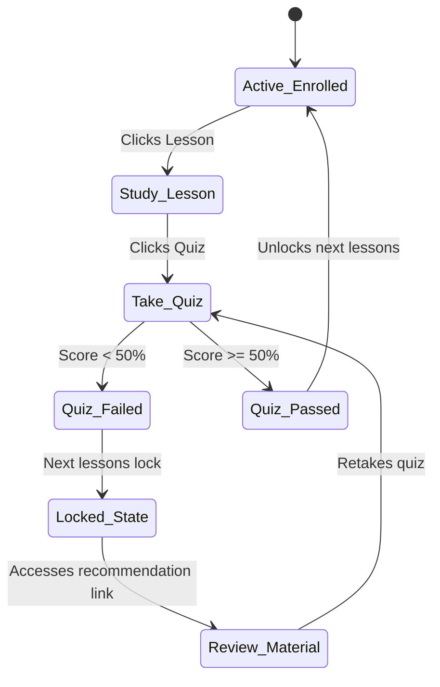
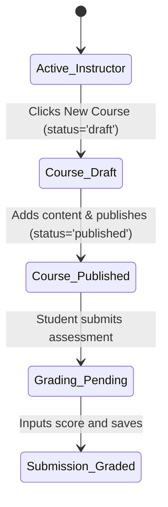
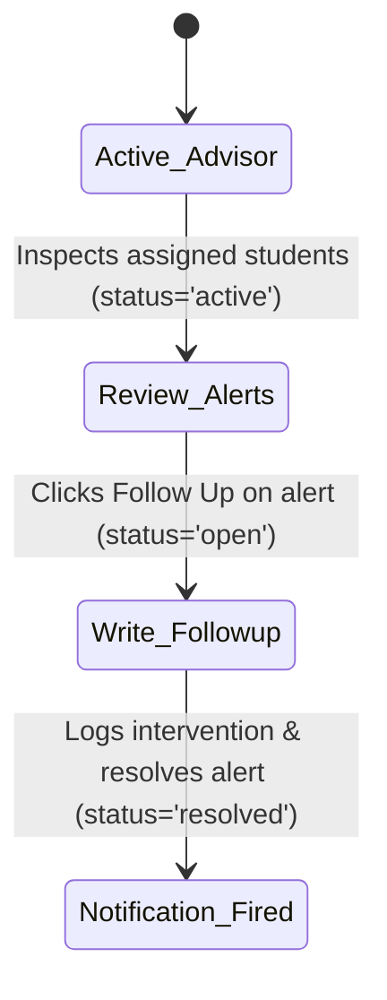
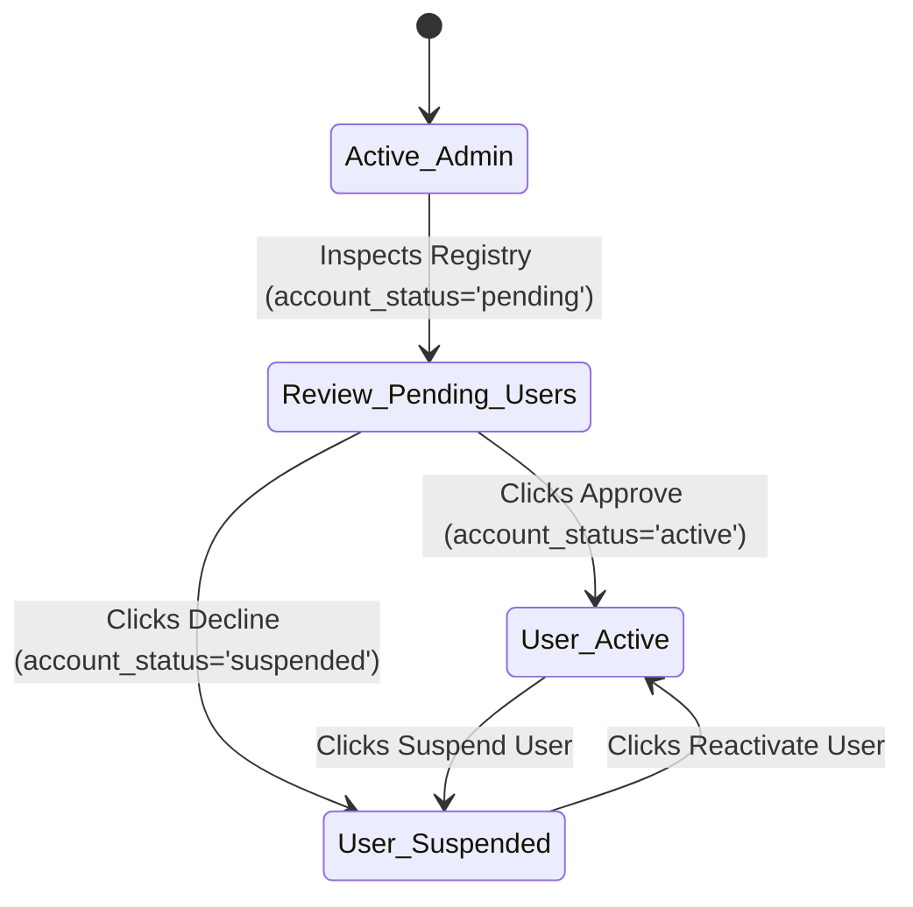
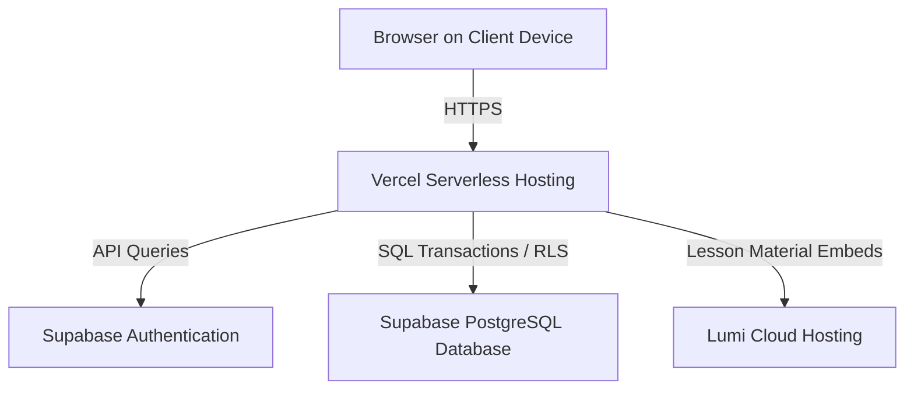

# System Documentation for QuestLearn System

**Version 3.0**

**Tutorial Section: TT7L**

**Group No.: G5**

| Name | Student ID |
| --- | --- |
| **See Wing Kit** | **261UC240PJ** |
| **Aziel Tan Zheng Chuan** | **261UC240LY** |
| **Vincent Lock Chun Kit** | **261UC2406W** |
| **Soo Kian Rong** | **261UC26145** |

**Date: 30 June 2026**

---

# Contents

- [Revisions](#revisions)
- [1 Project Management](#1-project-management)
  - [1.1 Team Members](#11-team-members)
  - [1.2 Problem Statement](#12-problem-statement)
  - [1.3 Project Plan](#13-project-plan)
  - [1.4 Part III Work Allocation and Code SOP](#14-part-iii-work-allocation-and-code-sop)
  - [1.5 Part III Execution Plan](#15-part-iii-execution-plan)
- [2 System Overview](#2-system-overview)
  - [2.1 Description](#21-description)
  - [2.2 Actors](#22-actors)
  - [2.3 Assumptions and Dependencies](#23-assumptions-and-dependencies)
  - [2.4 Use Case Diagram](#24-use-case-diagram)
- [3 Requirements](#3-requirements)
  - [3.1 Class Diagrams / ERD](#31-class-diagrams--erd)
- [4 Design](#4-design)
  - [4.1 Data Dictionary](#41-data-dictionary)
  - [4.2 Software Architecture](#42-software-architecture)
  - [4.3 Main Screens](#43-main-screens)
  - [4.4 Subsystem 1 Screens](#44-subsystem-1-screens)
  - [4.5 Subsystem 2 Screens](#45-subsystem-2-screens)
  - [4.6 Main Components](#46-main-components)
  - [4.7 Deployment Diagram](#47-deployment-diagram)
- [5 Implementation](#5-implementation)
  - [5.1 Development Environment](#51-development-environment)
  - [5.2 Software Integration](#52-software-integration)
  - [5.3 Database](#53-database)
- [6 Testing](#6-testing)
  - [6.1 Testing Strategy](#61-testing-strategy)
  - [6.2 Test Data](#62-test-data)
  - [6.3 Acceptance Testing](#63-acceptance-testing)
- [7 Sample Screens](#7-sample-screens)
  - [7.1 Main Screen](#71-main-screen)
- [8 Conclusion](#8-conclusion)
- [9 User Guide](#9-user-guide)
- [References](#references)

---

# Revisions

| Version | Primary Author(s) | Description of Version | Date Completed |
| --- | --- | --- | --- |
| 1.0 | All members | SRS — Part I (Project Planning / Requirements Analysis) | 01/05/2026 |
| 2.0 | All members | SDS — Part II (Design / Architecture / Interfaces / Database) | 05/06/2026 |
| 3.0 | All members | System Documentation — Part III (Development / Testing / Final Implementation) | 30/06/2026 |

---

# 1 Project Management

## 1.1 Team Members

| Name | Actor / Process Ownership |
| --- | --- |
| See Wing Kit | **Student Subsystem** (H5P content, progress, locking algorithm, auto-grading, recommendations) & Backend integration |
| Aziel Tan Zheng Chuan | **Instructor Subsystem** (course management, modules/lessons builder, custom Lumi iframe quiz creator, grading) |
| Vincent Lock Chun Kit | **Academic Advisor Subsystem** (advisees list, advisor follow-ups, follow-up history, linked instructor alerts) |
| Soo Kian Rong | **Admin Subsystem** (user registry CRUD - approve, suspend, kick; course enrollments manager panel, announcements) |

## 1.2 Problem Statement

Current university learning systems are often effective for storing notes, slides, videos, quizzes, and announcements, but they are less effective at actively guiding students through the learning process. Students may complete lessons or assessments without receiving enough immediate feedback about weak topics, recommended next steps, or the seriousness of falling behind. As a result, learning problems may only become visible after grades have already declined.

Existing platforms also separate content delivery, formative assessment, engagement tracking, and advisor follow-up into disconnected workflows. Instructors can upload materials without seeing a clear picture of student engagement, students can complete quizzes without targeted improvement guidance, and academic advisors may only notice struggling learners after major assessment results are released. These gaps reduce the usefulness of digital learning systems as early academic support tools.

**QuestLearn** resolves this by combining short lesson-based learning, interactive lesson content, automated quiz feedback, activity-based analytics, notifications, and advisor monitoring in one coherent prototype. 

## 1.3 Project Plan

The project is organised into three major phases that align with the course deliverables. 

<!-- [Insert Gantt Chart from project timeline] -->


| Phase | Planned Output | Actual / Part III Status | Evidence to Attach |
| --- | --- | --- | --- |
| Part I: Requirements Analysis | Problem statement, objectives, scope, actors, use cases, ERD draft | Completed as the SRS baseline for QuestLearn | Final Part I report, use case diagram, activity diagrams |
| Part II: System Design | Data design, architecture, interface design, state diagrams | Completed as the SDS baseline for implementation | Part II design report, database schema, architecture and deployment diagrams |
| Part III: Development and Testing | Prototype implementation, database setup, test execution, screenshots | Completed; this document records the implementation | IDE/terminal screenshots, Supabase tables, test outputs, browser screenshots |

## 1.4 Part III Work Allocation and Code SOP

Part III was split by subsystem ownership, with a single code lead and a single review gate so implementation stayed aligned with Part II design.

| Area | Primary Owner | Secondary Support | Output |
| --- | --- | --- | --- |
| Architecture, auth, integration | See Wing Kit | Aziel Tan Zheng Chuan | Shared code structure, protected routes, Supabase auth flow, final merge review |
| Database, course, assessment | Aziel Tan Zheng Chuan | See Wing Kit | Schema, seed data, server actions, course and assessment workflows |
| UI, dashboard, analytics screens | Vincent Lock Chun Kit | See Wing Kit | Student/instructor views, responsive screens, dashboard widgets |
| Testing, notifications, advisor/admin | Soo Kian Rong | See Wing Kit | Test cases, notification flow, advisor/admin features, acceptance evidence |

## 1.5 Part III Execution Plan

The Part III work followed a fixed sequence so the team did not build UI or tests on top of unstable data contracts.

| Phase | Main Owner | Focus | Output | Exit Check |
| --- | --- | --- | --- | --- |
| Phase 1: Foundation | See Wing Kit + Aziel Tan Zheng Chuan | Project setup, auth, schema, seed data, shared contracts | Next.js project scaffold, Supabase integration, database tables, initial demo data | Login works, schema applies cleanly, seed data loads without errors |
| Phase 2: Core Features | Aziel Tan Zheng Chuan + Vincent Lock Chun Kit | Course, assessment, dashboard, and content flows | Working course management, lesson/quiz screens, role-based navigation | Student and instructor flows work end-to-end in local testing |
| Phase 3: Support Features | Soo Kian Rong + See Wing Kit | Notifications, advisor/admin functions, RLS checks, hardening | Notification flow, advisor/admin features, access control validation | Restricted actions fail correctly and allowed actions succeed |
| Phase 4: Testing and Evidence | Soo Kian Rong + all members | Unit, integration, functional, security, acceptance evidence | Test results, screenshots, SQL outputs, final documentation evidence | All required Part III artifacts are captured and linked |

---

# 2 System Overview

## 2.1 Description

QuestLearn is an adaptive learning portal. The major functions and processes the product performs are categorized by the primary actors:
1. **Instructors** to construct courses, embed videos, compile quiz questionnaires, publish grades, and monitor students.
2. **Students** to access curriculum paths, view interactive H5P modules, submit attempts, track grades, and receive weak-topic warnings.
3. **Academic Advisors** to review risk flags, document follow-ups, and send intervention logs to instructors.
4. **Admins** to oversee platform users, modify roles, suspend or kick users, and publish site announcements.

**Top-Level Data Flow / Object Class Diagram**
<!-- [Insert DFD or Object Class Diagram mapping Student/Instructor/Advisor/Admin subsystem database operations] -->


## 2.2 Actors

* **Student:** Takes lessons, submits quizzes, reviews recommendations, tracks grades, and views alerts.
* **Instructor:** Builds courses, uploads embeds, grades assignments, and reviews class metrics.
* **Academic Advisor:** Inspects department performance, logs interventions, and links notifications to instructors.
* **Admin:** Configures user permissions, suspends or reactivates accounts, and handles enrollments.

## 2.3 Assumptions and Dependencies

1. **Deployment Stack:** Next.js App Router deployed on Vercel, utilizing Supabase PostgreSQL, Storage, and Auth.
2. **H5P Hosting:** The system embeds Lumi packages via responsive iframe wrappers.
3. **Connectivity:** Requires consistent internet connection for real-time RLS checks.

## 2.4 Use Case Diagram

The platform use case diagram integrates all four actors:

```mermaid
usecaseDiagram
    actor Student
    actor Instructor
    actor Advisor as "Academic Advisor"
    actor Admin
    
    rect "QuestLearn Portal" {
        usecase UC_STU as "Take Lessons, Submit Quizzes, Check Progress (Student)"
        usecase UC_INS as "Build Course Modules, Configure Quizzes, Grade Submissions (Instructor)"
        usecase UC_ADV as "Monitor Progress Risks, Log Follow-ups (Advisor)"
        usecase UC_ADM as "Manage User Accounts, Moderate Content, Handle Enrollments (Admin)"
    }
    
    Student --> UC_STU
    Instructor --> UC_INS
    Advisor --> UC_ADV
    Admin --> UC_ADM
```

---

# 3 Requirements

## 3.1 Class Diagrams / ERD

The relational database architecture is defined in the following entity relationship model:

```mermaid
erDiagram
    ROLE {
        SERIAL role_id PK
        VARCHAR role_name 
    }

    USER {
        SERIAL user_id PK
        UUID auth_user_id 
        INT role_id FK
        VARCHAR full_name 
        VARCHAR email 
        VARCHAR account_status 
        TIMESTAMP created_at 
    }

    STUDENT_PROFILE {
        SERIAL student_profile_id PK
        INT user_id FK
        VARCHAR student_no 
        VARCHAR academic_level 
        VARCHAR programme 
        VARCHAR department 
        VARCHAR learning_preference 
    }

    INSTRUCTOR_PROFILE {
        SERIAL instructor_profile_id PK
        INT user_id FK
        VARCHAR staff_no 
        VARCHAR specialization 
        TEXT subjects_taught 
        VARCHAR office_hours 
    }

    ADVISOR_PROFILE {
        SERIAL advisor_profile_id PK
        INT user_id FK
        VARCHAR staff_no 
        VARCHAR department 
        VARCHAR office_hours 
    }

    COURSE {
        SERIAL course_id PK
        INT instructor_profile_id FK
        VARCHAR course_code 
        VARCHAR course_title 
        TEXT description 
        VARCHAR department 
        VARCHAR status 
        TIMESTAMP created_at 
    }

    MODULE {
        SERIAL module_id PK
        INT course_id FK
        VARCHAR module_title 
        INT sequence_no 
        TEXT description 
        VARCHAR publish_status 
    }

    LESSON {
        SERIAL lesson_id PK
        INT module_id FK
        VARCHAR lesson_title 
        VARCHAR lesson_type 
        TEXT content_text 
        VARCHAR video_url 
        INT sequence_no 
        VARCHAR publish_status 
    }

    CONTENT_ITEM {
        SERIAL content_item_id PK
        INT lesson_id FK
        VARCHAR content_type 
        VARCHAR title 
        TEXT body_text 
        VARCHAR resource_url 
        VARCHAR storage_path 
        VARCHAR embed_url 
        INT sequence_no 
        VARCHAR publish_status 
        TIMESTAMP created_at 
    }

    ENROLLMENT {
        SERIAL enrollment_id PK
        INT student_profile_id FK
        INT course_id FK
        TIMESTAMP enrolled_at 
        VARCHAR status 
    }

    QUIZ {
        SERIAL quiz_id PK
        INT lesson_id FK
        VARCHAR quiz_title 
        INT total_marks 
        INT time_limit 
        BOOLEAN randomized 
        VARCHAR publish_status 
    }

    ASSIGNMENT {
        SERIAL assignment_id PK
        INT course_id FK
        INT lesson_id FK
        VARCHAR assignment_title 
        TEXT description 
        TIMESTAMP deadline 
        INT total_marks 
        VARCHAR publish_status 
        TIMESTAMP created_at 
    }

    ASSIGNMENT_SUBMISSION {
        SERIAL submission_id PK
        INT assignment_id FK
        INT student_profile_id FK
        TIMESTAMP submitted_at 
        VARCHAR submission_url 
        VARCHAR status 
        NUMERIC score 
        TEXT feedback 
    }

    QUESTION_BANK {
        SERIAL question_bank_id PK
        INT course_id FK
        VARCHAR bank_name 
        TEXT description 
        BOOLEAN is_active 
    }

    QUESTION {
        SERIAL question_id PK
        INT question_bank_id FK
        VARCHAR question_type 
        TEXT prompt 
        TEXT correct_answer 
        TEXT explanation 
        VARCHAR difficulty 
        INT points 
    }

    QUIZ_QUESTION {
        SERIAL quiz_question_id PK
        INT quiz_id FK
        INT question_id FK
        INT sequence_no 
    }

    QUIZ_ATTEMPT {
        SERIAL attempt_id PK
        INT quiz_id FK
        INT student_profile_id FK
        NUMERIC score 
        INT max_score 
        TIMESTAMP submitted_at 
        TEXT feedback_summary 
    }

    ATTEMPT_ANSWER {
        SERIAL attempt_answer_id PK
        INT attempt_id FK
        INT question_id FK
        TEXT student_answer 
        BOOLEAN is_correct 
        NUMERIC points_earned 
    }

    PROGRESS_RECORD {
        SERIAL progress_record_id PK
        INT student_profile_id FK
        INT lesson_id FK
        VARCHAR completion_status 
        INT percentage 
        TIMESTAMP updated_at 
    }

    ACTIVITY_LOG {
        SERIAL activity_log_id PK
        INT user_id FK
        VARCHAR activity_type 
        VARCHAR target_type 
        INT target_id 
        INT duration_seconds 
        JSONB metadata 
        TIMESTAMP activity_time 
    }

    ADVISOR_STUDENT_ASSIGNMENT {
        SERIAL advisor_student_assignment_id PK
        INT advisor_profile_id FK
        INT student_profile_id FK
        TIMESTAMP assigned_at 
        VARCHAR status 
    }

    ADVISOR_ALERT {
        SERIAL advisor_alert_id PK
        INT student_profile_id FK
        INT advisor_profile_id FK
        VARCHAR alert_type 
        VARCHAR severity 
        VARCHAR source_type 
        INT source_id 
        TEXT message 
        VARCHAR status 
        TIMESTAMP created_at 
        TIMESTAMP resolved_at 
    }

    ADVISOR_FOLLOW_UP {
        SERIAL advisor_follow_up_id PK
        INT advisor_alert_id FK
        INT advisor_profile_id FK
        INT student_profile_id FK
        INT instructor_profile_id FK
        VARCHAR follow_up_type 
        TEXT message 
        TEXT next_action 
        TIMESTAMP follow_up_at 
    }

    ANNOUNCEMENT {
        SERIAL announcement_id PK
        INT user_id FK
        VARCHAR title 
        TEXT message 
        VARCHAR scope 
        INT target_scope_id 
        TIMESTAMP published_at 
        VARCHAR status 
    }

    NOTIFICATION {
        SERIAL notification_id PK
        INT user_id FK
        INT announcement_id FK
        TEXT message 
        BOOLEAN is_read 
        TIMESTAMP sent_at 
    }

    MODERATION_ACTION {
        SERIAL moderation_action_id PK
        INT admin_user_id FK
        VARCHAR target_type 
        INT target_id 
        VARCHAR action_type 
        TEXT reason 
        TIMESTAMP action_at 
    }

    AUDIT_LOG {
        SERIAL audit_log_id PK
        INT actor_user_id FK
        VARCHAR action_type 
        VARCHAR target_type 
        INT target_id 
        TEXT summary 
        JSONB metadata 
        TIMESTAMP created_at 
    }

    ROLE ||--o{ USER : "role_id"
    INSTRUCTOR_PROFILE ||--o{ COURSE : "instructor_profile_id"
    COURSE ||--o{ MODULE : "course_id"
    MODULE ||--o{ LESSON : "module_id"
    LESSON ||--o{ CONTENT_ITEM : "lesson_id"
    STUDENT_PROFILE ||--o{ ENROLLMENT : "student_profile_id"
    COURSE ||--o{ ENROLLMENT : "course_id"
    LESSON ||--o{ QUIZ : "lesson_id"
    COURSE ||--o{ ASSIGNMENT : "course_id"
    LESSON ||--o{ ASSIGNMENT : "lesson_id"
    ASSIGNMENT ||--o{ ASSIGNMENT_SUBMISSION : "assignment_id"
    STUDENT_PROFILE ||--o{ ASSIGNMENT_SUBMISSION : "student_profile_id"
    COURSE ||--o{ QUESTION_BANK : "course_id"
    QUESTION_BANK ||--o{ QUESTION : "question_bank_id"
    QUIZ ||--o{ QUIZ_QUESTION : "quiz_id"
    QUESTION ||--o{ QUIZ_QUESTION : "question_id"
    QUIZ ||--o{ QUIZ_ATTEMPT : "quiz_id"
    STUDENT_PROFILE ||--o{ QUIZ_ATTEMPT : "student_profile_id"
    QUIZ_ATTEMPT ||--o{ ATTEMPT_ANSWER : "attempt_id"
    QUESTION ||--o{ ATTEMPT_ANSWER : "question_id"
    STUDENT_PROFILE ||--o{ PROGRESS_RECORD : "student_profile_id"
    LESSON ||--o{ PROGRESS_RECORD : "lesson_id"
    ADVISOR_PROFILE ||--o{ ADVISOR_STUDENT_ASSIGNMENT : "advisor_profile_id"
    STUDENT_PROFILE ||--o{ ADVISOR_STUDENT_ASSIGNMENT : "student_profile_id"
    STUDENT_PROFILE ||--o{ ADVISOR_ALERT : "student_profile_id"
    ADVISOR_PROFILE ||--o{ ADVISOR_ALERT : "advisor_profile_id"
    ADVISOR_ALERT ||--o{ ADVISOR_FOLLOW_UP : "advisor_alert_id"
    ADVISOR_PROFILE ||--o{ ADVISOR_FOLLOW_UP : "advisor_profile_id"
    STUDENT_PROFILE ||--o{ ADVISOR_FOLLOW_UP : "student_profile_id"
    INSTRUCTOR_PROFILE ||--o{ ADVISOR_FOLLOW_UP : "instructor_profile_id"
    ANNOUNCEMENT ||--o{ NOTIFICATION : "announcement_id"
```



---

# 4 Design

## 4.1 Data Dictionary

Key entities in the QuestLearn implementation are documented below:

### `role`

| Table Name | Field Name | Data Type | Length | PK/FK | Required | Null/Not Null | Description |
| :--- | :--- | :--- | :--- | :--- | :--- | :--- | :--- |
| **role** | role_id | SERIAL | - | PK | Yes | Not Null | Primary key of the role table. |
|  | role_name | VARCHAR(50) | 50 | - | Yes | Not Null | The role name value. |

### `user`

| Table Name | Field Name | Data Type | Length | PK/FK | Required | Null/Not Null | Description |
| :--- | :--- | :--- | :--- | :--- | :--- | :--- | :--- |
| **user** | user_id | SERIAL | - | PK | Yes | Not Null | Primary key of the user table. |
|  | auth_user_id | UUID | 36 | - | No | Null | The auth user id value. |
|  | role_id | INT | - | FK | Yes | Not Null | Foreign key referencing the role table. |
|  | full_name | VARCHAR(150) | 150 | - | Yes | Not Null | The full name value. |
|  | email | VARCHAR(255) | 255 | - | Yes | Not Null | The email value. |
|  | account_status | VARCHAR(20) | 20 | - | Yes | Not Null | The account status value. |
|  | created_at | TIMESTAMP | - | - | Yes | Not Null | The created at value. |

### `student_profile`

| Table Name | Field Name | Data Type | Length | PK/FK | Required | Null/Not Null | Description |
| :--- | :--- | :--- | :--- | :--- | :--- | :--- | :--- |
| **student_profile** | student_profile_id | SERIAL | - | PK | Yes | Not Null | Primary key of the student_profile table. |
|  | user_id | INT | - | FK | Yes | Not Null | Foreign key referencing the  table. |
|  | student_no | VARCHAR(30) | 30 | - | Yes | Not Null | The student no value. |
|  | academic_level | VARCHAR(50) | 50 | - | No | Null | The academic level value. |
|  | programme | VARCHAR(100) | 100 | - | No | Null | The programme value. |
|  | department | VARCHAR(100) | 100 | - | No | Null | The department value. |
|  | learning_preference | VARCHAR(50) | 50 | - | No | Null | The learning preference value. |

### `instructor_profile`

| Table Name | Field Name | Data Type | Length | PK/FK | Required | Null/Not Null | Description |
| :--- | :--- | :--- | :--- | :--- | :--- | :--- | :--- |
| **instructor_profile** | instructor_profile_id | SERIAL | - | PK | Yes | Not Null | Primary key of the instructor_profile table. |
|  | user_id | INT | - | FK | Yes | Not Null | Foreign key referencing the  table. |
|  | staff_no | VARCHAR(30) | 30 | - | Yes | Not Null | The staff no value. |
|  | specialization | VARCHAR(200) | 200 | - | No | Null | The specialization value. |
|  | subjects_taught | TEXT | - | - | No | Null | The subjects taught value. |
|  | office_hours | VARCHAR(200) | 200 | - | No | Null | The office hours value. |

### `advisor_profile`

| Table Name | Field Name | Data Type | Length | PK/FK | Required | Null/Not Null | Description |
| :--- | :--- | :--- | :--- | :--- | :--- | :--- | :--- |
| **advisor_profile** | advisor_profile_id | SERIAL | - | PK | Yes | Not Null | Primary key of the advisor_profile table. |
|  | user_id | INT | - | FK | Yes | Not Null | Foreign key referencing the  table. |
|  | staff_no | VARCHAR(30) | 30 | - | Yes | Not Null | The staff no value. |
|  | department | VARCHAR(100) | 100 | - | No | Null | The department value. |
|  | office_hours | VARCHAR(200) | 200 | - | No | Null | The office hours value. |

### `course`

| Table Name | Field Name | Data Type | Length | PK/FK | Required | Null/Not Null | Description |
| :--- | :--- | :--- | :--- | :--- | :--- | :--- | :--- |
| **course** | course_id | SERIAL | - | PK | Yes | Not Null | Primary key of the course table. |
|  | instructor_profile_id | INT | - | FK | Yes | Not Null | Foreign key referencing the instructor_profile table. |
|  | course_code | VARCHAR(20) | 20 | - | Yes | Not Null | The course code value. |
|  | course_title | VARCHAR(200) | 200 | - | Yes | Not Null | The course title value. |
|  | description | TEXT | - | - | No | Null | The description value. |
|  | department | VARCHAR(100) | 100 | - | No | Null | The department value. |
|  | status | VARCHAR(20) | 20 | - | Yes | Not Null | The status value. |
|  | created_at | TIMESTAMP | - | - | Yes | Not Null | The created at value. |

### `module`

| Table Name | Field Name | Data Type | Length | PK/FK | Required | Null/Not Null | Description |
| :--- | :--- | :--- | :--- | :--- | :--- | :--- | :--- |
| **module** | module_id | SERIAL | - | PK | Yes | Not Null | Primary key of the module table. |
|  | course_id | INT | - | FK | Yes | Not Null | Foreign key referencing the course table. |
|  | module_title | VARCHAR(200) | 200 | - | Yes | Not Null | The module title value. |
|  | sequence_no | INT | - | - | Yes | Not Null | The sequence no value. |
|  | description | TEXT | - | - | No | Null | The description value. |
|  | publish_status | VARCHAR(20) | 20 | - | Yes | Not Null | The publish status value. |

### `lesson`

| Table Name | Field Name | Data Type | Length | PK/FK | Required | Null/Not Null | Description |
| :--- | :--- | :--- | :--- | :--- | :--- | :--- | :--- |
| **lesson** | lesson_id | SERIAL | - | PK | Yes | Not Null | Primary key of the lesson table. |
|  | module_id | INT | - | FK | Yes | Not Null | Foreign key referencing the module table. |
|  | lesson_title | VARCHAR(200) | 200 | - | Yes | Not Null | The lesson title value. |
|  | lesson_type | VARCHAR(20) | 20 | - | Yes | Not Null | The lesson type value. |
|  | content_text | TEXT | - | - | No | Null | The content text value. |
|  | video_url | VARCHAR(500) | 500 | - | No | Null | The video url value. |
|  | sequence_no | INT | - | - | Yes | Not Null | The sequence no value. |
|  | publish_status | VARCHAR(20) | 20 | - | Yes | Not Null | The publish status value. |

### `content_item`

| Table Name | Field Name | Data Type | Length | PK/FK | Required | Null/Not Null | Description |
| :--- | :--- | :--- | :--- | :--- | :--- | :--- | :--- |
| **content_item** | content_item_id | SERIAL | - | PK | Yes | Not Null | Primary key of the content_item table. |
|  | lesson_id | INT | - | FK | Yes | Not Null | Foreign key referencing the lesson table. |
|  | content_type | VARCHAR(20) | 20 | - | Yes | Not Null | The content type value. |
|  | title | VARCHAR(200) | 200 | - | Yes | Not Null | The title value. |
|  | body_text | TEXT | - | - | No | Null | The body text value. |
|  | resource_url | VARCHAR(500) | 500 | - | No | Null | The resource url value. |
|  | storage_path | VARCHAR(500) | 500 | - | No | Null | The storage path value. |
|  | embed_url | VARCHAR(500) | 500 | - | No | Null | The embed url value. |
|  | sequence_no | INT | - | - | Yes | Not Null | The sequence no value. |
|  | publish_status | VARCHAR(20) | 20 | - | Yes | Not Null | The publish status value. |
|  | created_at | TIMESTAMP | - | - | Yes | Not Null | The created at value. |

### `enrollment`

| Table Name | Field Name | Data Type | Length | PK/FK | Required | Null/Not Null | Description |
| :--- | :--- | :--- | :--- | :--- | :--- | :--- | :--- |
| **enrollment** | enrollment_id | SERIAL | - | PK | Yes | Not Null | Primary key of the enrollment table. |
|  | student_profile_id | INT | - | FK | Yes | Not Null | Foreign key referencing the student_profile table. |
|  | course_id | INT | - | FK | Yes | Not Null | Foreign key referencing the course table. |
|  | enrolled_at | TIMESTAMP | - | - | Yes | Not Null | The enrolled at value. |
|  | status | VARCHAR(20) | 20 | - | Yes | Not Null | The status value. |

### `quiz`

| Table Name | Field Name | Data Type | Length | PK/FK | Required | Null/Not Null | Description |
| :--- | :--- | :--- | :--- | :--- | :--- | :--- | :--- |
| **quiz** | quiz_id | SERIAL | - | PK | Yes | Not Null | Primary key of the quiz table. |
|  | lesson_id | INT | - | FK | Yes | Not Null | Foreign key referencing the lesson table. |
|  | quiz_title | VARCHAR(200) | 200 | - | Yes | Not Null | The quiz title value. |
|  | total_marks | INT | - | - | Yes | Not Null | The total marks value. |
|  | time_limit | INT | - | - | No | Null | in minutes, NULL = no limit |
|  | randomized | BOOLEAN | - | - | Yes | Not Null | The randomized value. |
|  | publish_status | VARCHAR(20) | 20 | - | Yes | Not Null | The publish status value. |

### `assignment`

| Table Name | Field Name | Data Type | Length | PK/FK | Required | Null/Not Null | Description |
| :--- | :--- | :--- | :--- | :--- | :--- | :--- | :--- |
| **assignment** | assignment_id | SERIAL | - | PK | Yes | Not Null | Primary key of the assignment table. |
|  | course_id | INT | - | FK | Yes | Not Null | Foreign key referencing the course table. |
|  | lesson_id | INT | - | FK | No | Null | Foreign key referencing the lesson table. |
|  | assignment_title | VARCHAR(200) | 200 | - | Yes | Not Null | The assignment title value. |
|  | description | TEXT | - | - | No | Null | The description value. |
|  | deadline | TIMESTAMP | - | - | Yes | Not Null | The deadline value. |
|  | total_marks | INT | - | - | Yes | Not Null | The total marks value. |
|  | publish_status | VARCHAR(20) | 20 | - | Yes | Not Null | The publish status value. |
|  | created_at | TIMESTAMP | - | - | Yes | Not Null | The created at value. |

### `assignment_submission`

| Table Name | Field Name | Data Type | Length | PK/FK | Required | Null/Not Null | Description |
| :--- | :--- | :--- | :--- | :--- | :--- | :--- | :--- |
| **assignment_submission** | submission_id | SERIAL | - | PK | Yes | Not Null | Primary key of the assignment_submission table. |
|  | assignment_id | INT | - | FK | Yes | Not Null | Foreign key referencing the assignment table. |
|  | student_profile_id | INT | - | FK | Yes | Not Null | Foreign key referencing the student_profile table. |
|  | submitted_at | TIMESTAMP | - | - | Yes | Not Null | The submitted at value. |
|  | submission_url | VARCHAR(500) | 500 | - | No | Null | The submission url value. |
|  | status | VARCHAR(20) | 20 | - | Yes | Not Null | The status value. |
|  | score | NUMERIC(52) | 5 | - | No | Null | The score value. |
|  | feedback | TEXT | - | - | No | Null | The feedback value. |

### `question_bank`

| Table Name | Field Name | Data Type | Length | PK/FK | Required | Null/Not Null | Description |
| :--- | :--- | :--- | :--- | :--- | :--- | :--- | :--- |
| **question_bank** | question_bank_id | SERIAL | - | PK | Yes | Not Null | Primary key of the question_bank table. |
|  | course_id | INT | - | FK | Yes | Not Null | Foreign key referencing the course table. |
|  | bank_name | VARCHAR(200) | 200 | - | Yes | Not Null | The bank name value. |
|  | description | TEXT | - | - | No | Null | The description value. |
|  | is_active | BOOLEAN | - | - | Yes | Not Null | The is active value. |

### `question`

| Table Name | Field Name | Data Type | Length | PK/FK | Required | Null/Not Null | Description |
| :--- | :--- | :--- | :--- | :--- | :--- | :--- | :--- |
| **question** | question_id | SERIAL | - | PK | Yes | Not Null | Primary key of the question table. |
|  | question_bank_id | INT | - | FK | Yes | Not Null | Foreign key referencing the question_bank table. |
|  | question_type | VARCHAR(20) | 20 | - | Yes | Not Null | The question type value. |
|  | prompt | TEXT | - | - | Yes | Not Null | The prompt value. |
|  | correct_answer | TEXT | - | - | Yes | Not Null | The correct answer value. |
|  | explanation | TEXT | - | - | No | Null | The explanation value. |
|  | difficulty | VARCHAR(10) | 10 | - | No | Null | The difficulty value. |
|  | points | INT | - | - | Yes | Not Null | The points value. |

### `quiz_question`

| Table Name | Field Name | Data Type | Length | PK/FK | Required | Null/Not Null | Description |
| :--- | :--- | :--- | :--- | :--- | :--- | :--- | :--- |
| **quiz_question** | quiz_question_id | SERIAL | - | PK | Yes | Not Null | Primary key of the quiz_question table. |
|  | quiz_id | INT | - | FK | Yes | Not Null | Foreign key referencing the quiz table. |
|  | question_id | INT | - | FK | Yes | Not Null | Foreign key referencing the question table. |
|  | sequence_no | INT | - | - | No | Null | The sequence no value. |

### `quiz_attempt`

| Table Name | Field Name | Data Type | Length | PK/FK | Required | Null/Not Null | Description |
| :--- | :--- | :--- | :--- | :--- | :--- | :--- | :--- |
| **quiz_attempt** | attempt_id | SERIAL | - | PK | Yes | Not Null | Primary key of the quiz_attempt table. |
|  | quiz_id | INT | - | FK | Yes | Not Null | Foreign key referencing the quiz table. |
|  | student_profile_id | INT | - | FK | Yes | Not Null | Foreign key referencing the student_profile table. |
|  | score | NUMERIC(52) | 5 | - | No | Null | The score value. |
|  | max_score | INT | - | - | No | Null | The max score value. |
|  | submitted_at | TIMESTAMP | - | - | Yes | Not Null | The submitted at value. |
|  | feedback_summary | TEXT | - | - | No | Null | The feedback summary value. |

### `attempt_answer`

| Table Name | Field Name | Data Type | Length | PK/FK | Required | Null/Not Null | Description |
| :--- | :--- | :--- | :--- | :--- | :--- | :--- | :--- |
| **attempt_answer** | attempt_answer_id | SERIAL | - | PK | Yes | Not Null | Primary key of the attempt_answer table. |
|  | attempt_id | INT | - | FK | Yes | Not Null | Foreign key referencing the quiz_attempt table. |
|  | question_id | INT | - | FK | Yes | Not Null | Foreign key referencing the question table. |
|  | student_answer | TEXT | - | - | No | Null | The student answer value. |
|  | is_correct | BOOLEAN | - | - | No | Null | The is correct value. |
|  | points_earned | NUMERIC(52) | 5 | - | No | Null | The points earned value. |

### `progress_record`

| Table Name | Field Name | Data Type | Length | PK/FK | Required | Null/Not Null | Description |
| :--- | :--- | :--- | :--- | :--- | :--- | :--- | :--- |
| **progress_record** | progress_record_id | SERIAL | - | PK | Yes | Not Null | Primary key of the progress_record table. |
|  | student_profile_id | INT | - | FK | Yes | Not Null | Foreign key referencing the student_profile table. |
|  | lesson_id | INT | - | FK | Yes | Not Null | Foreign key referencing the lesson table. |
|  | completion_status | VARCHAR(20) | 20 | - | Yes | Not Null | The completion status value. |
|  | percentage | INT | - | - | Yes | Not Null | The percentage value. |
|  | updated_at | TIMESTAMP | - | - | Yes | Not Null | The updated at value. |

### `activity_log`

| Table Name | Field Name | Data Type | Length | PK/FK | Required | Null/Not Null | Description |
| :--- | :--- | :--- | :--- | :--- | :--- | :--- | :--- |
| **activity_log** | activity_log_id | SERIAL | - | PK | Yes | Not Null | Primary key of the activity_log table. |
|  | user_id | INT | - | FK | Yes | Not Null | Foreign key referencing the  table. |
|  | activity_type | VARCHAR(50) | 50 | - | Yes | Not Null | The activity type value. |
|  | target_type | VARCHAR(50) | 50 | - | No | Null | The target type value. |
|  | target_id | INT | - | - | No | Null | The target id value. |
|  | duration_seconds | INT | - | - | No | Null | The duration seconds value. |
|  | metadata | JSONB | - | - | No | Null | The metadata value. |
|  | activity_time | TIMESTAMP | - | - | Yes | Not Null | The activity time value. |

### `advisor_student_assignment`

| Table Name | Field Name | Data Type | Length | PK/FK | Required | Null/Not Null | Description |
| :--- | :--- | :--- | :--- | :--- | :--- | :--- | :--- |
| **advisor_student_assignment** | advisor_student_assignment_id | SERIAL | - | PK | Yes | Not Null | Primary key of the advisor_student_assignment table. |
|  | advisor_profile_id | INT | - | FK | Yes | Not Null | Foreign key referencing the advisor_profile table. |
|  | student_profile_id | INT | - | FK | Yes | Not Null | Foreign key referencing the student_profile table. |
|  | assigned_at | TIMESTAMP | - | - | Yes | Not Null | The assigned at value. |
|  | status | VARCHAR(20) | 20 | - | Yes | Not Null | The status value. |

### `advisor_alert`

| Table Name | Field Name | Data Type | Length | PK/FK | Required | Null/Not Null | Description |
| :--- | :--- | :--- | :--- | :--- | :--- | :--- | :--- |
| **advisor_alert** | advisor_alert_id | SERIAL | - | PK | Yes | Not Null | Primary key of the advisor_alert table. |
|  | student_profile_id | INT | - | FK | Yes | Not Null | Foreign key referencing the student_profile table. |
|  | advisor_profile_id | INT | - | FK | No | Null | Foreign key referencing the advisor_profile table. |
|  | alert_type | VARCHAR(30) | 30 | - | Yes | Not Null | The alert type value. |
|  | severity | VARCHAR(10) | 10 | - | Yes | Not Null | The severity value. |
|  | source_type | VARCHAR(50) | 50 | - | No | Null | The source type value. |
|  | source_id | INT | - | - | No | Null | The source id value. |
|  | message | TEXT | - | - | Yes | Not Null | The message value. |
|  | status | VARCHAR(20) | 20 | - | Yes | Not Null | The status value. |
|  | created_at | TIMESTAMP | - | - | Yes | Not Null | The created at value. |
|  | resolved_at | TIMESTAMP | - | - | No | Null | The resolved at value. |

### `advisor_follow_up`

| Table Name | Field Name | Data Type | Length | PK/FK | Required | Null/Not Null | Description |
| :--- | :--- | :--- | :--- | :--- | :--- | :--- | :--- |
| **advisor_follow_up** | advisor_follow_up_id | SERIAL | - | PK | Yes | Not Null | Primary key of the advisor_follow_up table. |
|  | advisor_alert_id | INT | - | FK | No | Null | Foreign key referencing the advisor_alert table. |
|  | advisor_profile_id | INT | - | FK | Yes | Not Null | Foreign key referencing the advisor_profile table. |
|  | student_profile_id | INT | - | FK | Yes | Not Null | Foreign key referencing the student_profile table. |
|  | instructor_profile_id | INT | - | FK | No | Null | Foreign key referencing the instructor_profile table. |
|  | follow_up_type | VARCHAR(30) | 30 | - | Yes | Not Null | The follow up type value. |
|  | message | TEXT | - | - | Yes | Not Null | The message value. |
|  | next_action | TEXT | - | - | No | Null | The next action value. |
|  | follow_up_at | TIMESTAMP | - | - | Yes | Not Null | The follow up at value. |

### `announcement`

| Table Name | Field Name | Data Type | Length | PK/FK | Required | Null/Not Null | Description |
| :--- | :--- | :--- | :--- | :--- | :--- | :--- | :--- |
| **announcement** | announcement_id | SERIAL | - | PK | Yes | Not Null | Primary key of the announcement table. |
|  | user_id | INT | - | FK | Yes | Not Null | Foreign key referencing the  table. |
|  | title | VARCHAR(200) | 200 | - | Yes | Not Null | The title value. |
|  | message | TEXT | - | - | Yes | Not Null | The message value. |
|  | scope | VARCHAR(20) | 20 | - | Yes | Not Null | The scope value. |
|  | target_scope_id | INT | - | - | No | Null | The target scope id value. |
|  | published_at | TIMESTAMP | - | - | Yes | Not Null | The published at value. |
|  | status | VARCHAR(20) | 20 | - | Yes | Not Null | The status value. |

### `notification`

| Table Name | Field Name | Data Type | Length | PK/FK | Required | Null/Not Null | Description |
| :--- | :--- | :--- | :--- | :--- | :--- | :--- | :--- |
| **notification** | notification_id | SERIAL | - | PK | Yes | Not Null | Primary key of the notification table. |
|  | user_id | INT | - | FK | Yes | Not Null | Foreign key referencing the  table. |
|  | announcement_id | INT | - | FK | No | Null | Foreign key referencing the announcement table. |
|  | message | TEXT | - | - | Yes | Not Null | The message value. |
|  | is_read | BOOLEAN | - | - | Yes | Not Null | The is read value. |
|  | sent_at | TIMESTAMP | - | - | Yes | Not Null | The sent at value. |

### `moderation_action`

| Table Name | Field Name | Data Type | Length | PK/FK | Required | Null/Not Null | Description |
| :--- | :--- | :--- | :--- | :--- | :--- | :--- | :--- |
| **moderation_action** | moderation_action_id | SERIAL | - | PK | Yes | Not Null | Primary key of the moderation_action table. |
|  | admin_user_id | INT | - | FK | Yes | Not Null | Foreign key referencing the  table. |
|  | target_type | VARCHAR(30) | 30 | - | Yes | Not Null | The target type value. |
|  | target_id | INT | - | - | Yes | Not Null | The target id value. |
|  | action_type | VARCHAR(30) | 30 | - | Yes | Not Null | The action type value. |
|  | reason | TEXT | - | - | No | Null | The reason value. |
|  | action_at | TIMESTAMP | - | - | Yes | Not Null | The action at value. |

### `audit_log`

| Table Name | Field Name | Data Type | Length | PK/FK | Required | Null/Not Null | Description |
| :--- | :--- | :--- | :--- | :--- | :--- | :--- | :--- |
| **audit_log** | audit_log_id | SERIAL | - | PK | Yes | Not Null | Primary key of the audit_log table. |
|  | actor_user_id | INT | - | FK | No | Null | Foreign key referencing the  table. |
|  | action_type | VARCHAR(80) | 80 | - | Yes | Not Null | The action type value. |
|  | target_type | VARCHAR(50) | 50 | - | No | Null | The target type value. |
|  | target_id | INT | - | - | No | Null | The target id value. |
|  | summary | TEXT | - | - | Yes | Not Null | The summary value. |
|  | metadata | JSONB | - | - | No | Null | The metadata value. |
|  | created_at | TIMESTAMP | - | - | Yes | Not Null | The created at value. |


---

## 4.2 Software Architecture

QuestLearn uses a four-layer cloud-backed architecture based on Next.js and Supabase.

<!-- [Insert overall architecture diagram of Next.js 15 Client, Supabase Backend, and external Lumi iframe integrations] -->


| Subsystem | Team members |
| --------- | ------------ |
| Subsystem 1 (Core Application Modules) | See Wing Kit, Aziel Tan Zheng Chuan |
| Subsystem 2 (Data Persistence & Security Engines) | Vincent Lock Chun Kit, Soo Kian Rong |

### 4.2.1 Subsystem 1 (Core Application Modules)

<!-- [Insert Subsystem 1 architecture component diagram detailing Course/Student outline builder interactions] -->


This subsystem handles presentation logic and user interaction:
* **Student Module:** Dashboard cards, course outlines, progress bars, and iframe player containers.
* **Instructor Module:** Course builders, curriculum managers, and grading interfaces.

### 4.2.2 Subsystem 2 (Data Persistence & Security Engines)

<!-- [Insert Subsystem 2 architecture component diagram detailing Advisor alerts triggers and Admin registry operations] -->


This subsystem coordinates background processing and database transactions:
* **Supabase Auth Engine:** Validates sessions and handles password resets.
* **advisor_alert & Notification Engine:** Triggers alerts when quiz scores drop below 50%, sending logs to students and advisors.
* **Admin Registry Controls:** Manages user roles and handles suspensions.

## 4.3 Main Screens

1. **Dashboard Portal:** Standard layout with routing based on the logged-in user's role.
<!-- [Insert main landing dashboard mockup from UI design phase] -->

2. **Profile Settings Screen:** Allows updating contact information and learning preferences.
<!-- [Insert profile modification mockup from UI design phase] -->


## 4.4 Subsystem 1 Screens

1. **Student Dashboard (`/student`):** Displays active courses and overall progress.
<!-- [Insert student portal dashboard mockup from design UI] -->

2. **Course details (`/student/courses/[id]`):** Shows modules, completed checkmarks, and locked items.
<!-- [Insert course outline and locking status design mockup] -->

3. **Instructor Curriculum Builder (`/instructor/courses/[id]`):** Contains lesson forms, video input tools, and H5P iframe embed inputs.
<!-- [Insert instructor course builder layout mockup] -->


## 4.5 Subsystem 2 Screens

1. **Advisor Student Monitoring Portal (`/advisor/students`):** Department list showing advisor follow-up controls and linked instructor selectors.
<!-- [Insert advisor monitoring dashboard mockup] -->

2. **Admin User Registry Control (`/admin/users`):** Displays tables with approval, suspend, and delete actions.
<!-- [Insert admin control panel design mockup] -->


## 4.6 Main Components

| Component | Related Subsystems |
| --------- | ------------------ |
| Quiz Auto-Grading & Alert Trigger | Subsystem 1, Subsystem 2 |
| Rule-Based Module Locking Logic | Subsystem 1 |

### 4.6.1 Component 1: Quiz Auto-Grading & Alert Trigger

**Processing Flowchart**
<!-- [Insert flowchart diagram showing Quiz attempt evaluation and Advisor alert triggers logic] -->


**Pseudocode Algorithm**
```text
FUNCTION submitQuiz(studentId, quizId, answers)
    score = calculatePoints(quizId, answers)
    INSERT INTO quiz_attempt (studentId, quizId, score)
    IF score < 50% THEN
        INSERT INTO advisor_alert (studentId, 'low_quiz_score')
        TRIGGER email_notification(studentId, advisorId)
    END IF
    RETURN score
END FUNCTION
```

### 4.6.2 Component 2: Rule-Based Module Locking Logic

**Processing Flowchart**
<!-- [Insert flowchart diagram showing sequential lesson lock evaluation checks logic] -->


**Pseudocode Algorithm**
```text
FUNCTION getCourseModules(studentId, courseId)
    modules = FETCH modules FOR courseId
    lockedLessonIds = []
    FOR EACH module IN modules
        FOR EACH lesson IN module
            IF previous_lesson.score < 50% THEN
                lockedLessonIds.add(lesson.id)
            END IF
        END FOR
    END FOR
    RETURN (modules, lockedLessonIds)
END FUNCTION
```

### 4.6.3 Behavioral Modeling

#### 4.6.3.1 Actor 1 State Transition Diagram (Student)


#### 4.6.3.2 Actor 2 State Transition Diagram (Instructor)


#### 4.6.3.3 Actor 3 State Transition Diagram (Academic Advisor)


#### 4.6.3.4 Actor 4 State Transition Diagram (Admin)


## 4.7 Deployment Diagram

The cloud deployment topology for QuestLearn:



---

# 5 Implementation

## 5.1 Development Environment

The system was developed using VS Code on Windows, leveraging the Next.js 15 App Router architecture with Turbopack for local compilation. 

<!-- [Insert screenshot of VS Code showing project file list and Turbopack dev terminal running next dev] -->


* **Framework:** Next.js 15 (App Router, React 19)
* **Language:** TypeScript
* **Database:** Supabase PostgreSQL 17.6
* **Styling:** Tailwind CSS v4

## 5.2 Software Integration

Our strategy to integrate Subsystem 1 (Presentation & Client Logic) and Subsystem 2 (Data Persistence & Security Engines) is to rely on Next.js Server Components fetching from the shared Supabase PostgreSQL instance under strict Row Level Security (RLS) enforcement. 

To bridge the subsystems, role-based route protection acts as the **Integration Gateway**. When a user logs in, the authentication handler queries Supabase Auth, and the Next.js routing middleware intercepts the navigation path, joins the session to the local PostgreSQL `"user"` and `role` records, and redirects the user to the correct role dashboard directory (`/student`, `/instructor`, `/advisor`, `/admin`).

### 5.2.1 Integration Gateway Source Code (`src/middleware.ts`)
Below is the complete implementation of the middleware gateway. It extracts the session from Supabase, performs lightweight role lookups, manages pending instructor approvals, and isolates routes to prevent unauthorized cross-role access:

```typescript
import { type NextRequest, NextResponse } from "next/server";
import { updateSession } from "@/lib/supabase/middleware";
import {
  PUBLIC_ROUTES,
  PROTECTED_PREFIXES,
  ROLE_DASHBOARD_PATH,
  ROLE_MAP,
  type RoleId,
} from "@/lib/constants";

export async function middleware(request: NextRequest) {
  const { pathname } = request.nextUrl;

  // Skip Next.js internals and static files
  if (
    pathname.startsWith("/_next") ||
    pathname.startsWith("/api/auth") ||
    pathname.includes(".")
  ) {
    return NextResponse.next();
  }

  // Refresh the Supabase session
  const { supabase, user, supabaseResponse } = await updateSession(request);

  // ── Public routes ────────────────────────────────────
  const isPublicRoute = PUBLIC_ROUTES.some(
    (route) => pathname === route || pathname.startsWith(route + "/")
  );

  if (isPublicRoute) {
    // If already logged in and visiting login/register, redirect to dashboard
    if (user && (pathname === "/login" || pathname === "/register")) {
      const roleData = await getUserRole(supabase, user.id);
      if (roleData) {
        const dashboardUrl = ROLE_DASHBOARD_PATH[roleData.role];
        return NextResponse.redirect(new URL(dashboardUrl, request.url));
      }
    }
    return supabaseResponse;
  }

  // ── Protected routes — require auth ──────────────────
  if (!user) {
    const loginUrl = new URL("/login", request.url);
    loginUrl.searchParams.set("redirectTo", pathname);
    return NextResponse.redirect(loginUrl);
  }

  // ── Role-based access control ────────────────────────
  const roleData = await getUserRole(supabase, user.id);

  if (!roleData) {
    // User exists in auth but not in our user table — send to login
    await supabase.auth.signOut();
    return NextResponse.redirect(new URL("/login", request.url));
  }

  // Instructors with pending status go to /pending
  if (roleData.accountStatus === "pending") {
    if (pathname !== "/pending") {
      return NextResponse.redirect(new URL("/pending", request.url));
    }
    return supabaseResponse;
  }

  // Check if user is accessing a protected role prefix
  const accessedPrefix = PROTECTED_PREFIXES.find(
    (prefix) => pathname === prefix || pathname.startsWith(prefix + "/")
  );

  if (accessedPrefix) {
    const expectedPrefix = ROLE_DASHBOARD_PATH[roleData.role];
    if (accessedPrefix !== expectedPrefix) {
      // Wrong role — redirect to their own dashboard
      return NextResponse.redirect(new URL(expectedPrefix, request.url));
    }
  }

  // Root path — redirect to role dashboard
  if (pathname === "/") {
    return NextResponse.redirect(
      new URL(ROLE_DASHBOARD_PATH[roleData.role], request.url)
    );
  }

  return supabaseResponse;
}

async function getUserRole(
  supabase: Awaited<ReturnType<typeof updateSession>>["supabase"],
  authUserId: string
): Promise<{ role: RoleId; accountStatus: string } | null> {
  const { data } = await supabase
    .from("user")
    .select(
      `
      account_status,
      role:role_id (
        role_name
      )
    `
    )
    .eq("auth_user_id", authUserId)
    .single();

  if (!data) return null;

  const role = data.role as unknown as { role_name: string };
  const roleId = ROLE_MAP[role.role_name as keyof typeof ROLE_MAP];

  return {
    role: roleId,
    accountStatus: data.account_status,
  };
}

export const config = {
  matcher: [
    "/((?!_next/static|_next/image|favicon.ico|.*\\.(?:svg|png|jpg|jpeg|gif|webp)$).*)",
  ],
};
```

### 5.2.2 Authenticated Session Controller Snippet (`src/app/(auth)/login/page.tsx`)
The client component handles user interactions and sends credentials directly to the authentication provider. On success, it triggers page routing redirection:

```typescript
// Submits client credentials to Supabase Auth provider
const supabase = createClient();
const { error: authError } = await supabase.auth.signInWithPassword({
  email,
  password,
});

if (authError) {
  setError(authError.message);
  setLoading(false);
  return;
}

// Redirects to root path where Next.js middleware completes role-based routing
router.push("/");
router.refresh();
```

---

### 5.2.3 Subsystem Integration Implementation Source Code

Below is the complete implementation source code for each of the primary integration components executing the data bridge between the user interfaces and database queries:

#### 5.2.3.1 Student Course Outline Loader (`src/app/(student)/student/courses/page.tsx`)
This page fetches the authenticated student's profile, retrieves all active and past course enrollments, aggregates progress record percentages, and maps them to client UI components:

```typescript
import { getCurrentUser } from "@/lib/auth/helpers";
import { createClient } from "@/lib/supabase/server";
import { CourseCard } from "@/components/student/CourseCard";
import { EmptyState } from "@/components/ui/EmptyState";
import { BookOpen } from "lucide-react";
import type { EnrolledCourse } from "@/types/database";

export default async function StudentCoursesPage() {
  const user = await getCurrentUser();
  if (!user) return null;

  const supabase = await createClient();

  // Fetch student profile
  const { data: profile } = await supabase
    .from("student_profile")
    .select("student_profile_id")
    .eq("user_id", user.userId)
    .single();

  if (!profile) return null;

  // Fetch all enrollments
  const { data: enrollments } = await supabase
    .from("enrollment")
    .select(
      `
      *,
      course:course_id (
        *,
        instructor_profile:instructor_profile_id (
          *,
          user:user_id ( full_name )
        )
      )
    `
    )
    .eq("student_profile_id", profile.student_profile_id)
    .returns<EnrolledCourse[]>();

  // Fetch progress
  const { data: progressRecords } = await supabase
    .from("progress_record")
    .select(
      `
      percentage,
      lesson:lesson_id (
        module:module_id ( course_id )
      )
    `
    )
    .eq("student_profile_id", profile.student_profile_id);

  const courseProgressMap = new Map<number, { total: number; count: number }>();
  if (progressRecords) {
    progressRecords.forEach((record: any) => {
      const courseId = record.lesson?.module?.course_id;
      if (courseId) {
        const current = courseProgressMap.get(courseId) || { total: 0, count: 0 };
        courseProgressMap.set(courseId, {
          total: current.total + record.percentage,
          count: current.count + 1,
        });
      }
    });
  }

  const allCourses = enrollments || [];
  const activeCourses = allCourses.filter((c) => c.status === "active");
  const pastCourses = allCourses.filter((c) => c.status !== "active");

  return (
    <div className="space-y-10 animate-in fade-in duration-500">
      <header>
        <h1 className="text-2xl font-bold text-text mb-2">My Courses</h1>
        <p className="text-text-muted">
          View all your current and past enrolled courses.
        </p>
      </header>

      <section>
        <h2 className="text-lg font-bold text-text mb-4">Active Courses</h2>
        {activeCourses.length === 0 ? (
          <EmptyState
            title="No Active Courses"
            description="You are not currently taking any courses."
          />
        ) : (
          <div className="grid grid-cols-1 md:grid-cols-2 lg:grid-cols-3 gap-6">
            {activeCourses.map((enrollment) => {
              const cp = courseProgressMap.get(enrollment.course_id);
              const progressPercentage =
                cp && cp.count > 0 ? Math.round(cp.total / cp.count) : 0;
              return (
                <CourseCard
                  key={enrollment.enrollment_id}
                  enrollment={enrollment}
                  progressPercentage={progressPercentage}
                />
              );
            })}
          </div>
        )}
      </section>

      {pastCourses.length > 0 && (
        <section>
          <h2 className="text-lg font-bold text-text mb-4">Past Courses</h2>
          <div className="grid grid-cols-1 md:grid-cols-2 lg:grid-cols-3 gap-6 opacity-75 grayscale-[20%]">
            {pastCourses.map((enrollment) => {
              const cp = courseProgressMap.get(enrollment.course_id);
              const progressPercentage =
                cp && cp.count > 0 ? Math.round(cp.total / cp.count) : 0;
              return (
                <CourseCard
                  key={enrollment.enrollment_id}
                  enrollment={enrollment}
                  progressPercentage={progressPercentage}
                />
              );
            })}
          </div>
        </section>
      )}
    </div>
  );
}
```

#### 5.2.3.2 Instructor Course Registry (`src/app/(instructor)/instructor/courses/page.tsx`)
This page resolves the instructor's staff profile and renders all created courses, joining enrollment counts directly from aggregated database tables:

```typescript
import { getCurrentUser } from "@/lib/auth/helpers";
import { createClient } from "@/lib/supabase/server";
import { EmptyState } from "@/components/ui/EmptyState";
import { StatusBadge } from "@/components/ui/StatusBadge";
import { Plus, BookOpen, Users, MoreVertical } from "lucide-react";
import Link from "next/link";

export default async function InstructorCoursesPage() {
  const user = await getCurrentUser();
  if (!user) return null;

  const supabase = await createClient();

  const { data: profile } = await supabase
    .from("instructor_profile")
    .select("instructor_profile_id")
    .eq("user_id", user.userId)
    .single();

  if (!profile) return null;

  // Fetch all owned courses
  const { data: courses } = await supabase
    .from("course")
    .select("*, enrollment(count)")
    .eq("instructor_profile_id", profile.instructor_profile_id)
    .order("created_at", { ascending: false });

  const courseList = courses || [];

  return (
    <div className="animate-in fade-in duration-500">
      <header className="flex flex-col sm:flex-row sm:items-center justify-between gap-4 mb-8">
        <div>
          <h1 className="text-2xl font-bold text-text mb-2">Course Management</h1>
          <p className="text-text-muted">
            Create and manage your courses, modules, and lessons.
          </p>
        </div>
        <Link
          href="/instructor/courses/new"
          className="inline-flex items-center justify-center gap-2 px-4 py-2.5 rounded-lg bg-primary text-white font-medium text-sm hover:bg-primary-light transition-colors"
        >
          <Plus className="w-4 h-4" /> Create Course
        </Link>
      </header>

      {courseList.length === 0 ? (
        <EmptyState
          title="No courses found"
          description="You haven't created any courses yet. Click 'Create Course' to get started."
          icon={<BookOpen className="w-8 h-8 text-primary" />}
        />
      ) : (
        <div className="grid grid-cols-1 md:grid-cols-2 lg:grid-cols-3 gap-6">
          {courseList.map((course: any) => (
            <div
              key={course.course_id}
              className="bg-surface rounded-xl border border-border overflow-hidden shadow-sm group hover:border-primary/50 transition-colors flex flex-col"
            >
              <div className="p-5 border-b border-border flex-1">
                <div className="flex items-start justify-between mb-3">
                  <span className="text-xs font-bold text-accent bg-bg-dark px-2 py-1 rounded-md tracking-wide">
                    {course.course_code}
                  </span>
                  <StatusBadge status={course.status} />
                </div>
                <h3 className="font-bold text-lg text-text mb-2 line-clamp-1">
                  {course.course_title}
                </h3>
                <p className="text-sm text-text-muted line-clamp-2 min-h-[2.5rem]">
                  {course.description || "No description provided."}
                </p>
              </div>
              <div className="p-4 bg-bg-page/50 flex items-center justify-between">
                <div className="flex items-center gap-1.5 text-sm text-text-muted font-medium">
                  <Users className="w-4 h-4" />
                  {/* @ts-ignore */}
                  {course.enrollment[0]?.count || 0} Students
                </div>
                <Link
                  href={`/instructor/courses/${course.course_id}`}
                  className="text-sm text-primary font-medium hover:underline px-2 py-1"
                >
                  Edit Course &rarr;
                </Link>
              </div>
            </div>
          ))}
        </div>
      )}
    </div>
  );
}
```

#### 5.2.3.3 Advisor Advisees Portal (`src/app/(advisor)/advisor/students/page.tsx`)
This page retrieves department advisees assigned to the advisor and lists all registered instructors to enable alerts routing and follow-up logging:

```typescript
import { getCurrentUser } from "@/lib/auth/helpers";
import { createClient } from "@/lib/supabase/server";
import { AdvisorStudentsClient } from "./AdvisorStudentsClient";

export default async function AdvisorStudentsPage() {
  const user = await getCurrentUser();
  if (!user) return null;

  const supabase = await createClient();

  const { data: advisorProfile } = await supabase
    .from("advisor_profile")
    .select("advisor_profile_id")
    .eq("user_id", user.userId)
    .single();

  if (!advisorProfile) {
    return (
      <div className="p-8 text-center bg-surface border border-border rounded-xl">
        <p className="text-danger font-medium">Advisor profile not found.</p>
      </div>
    );
  }

  // Fetch assigned students
  const { data: students } = await supabase
    .from("advisor_student_assignment")
    .select(`
      *,
      student_profile:student_profile_id (
        student_profile_id,
        student_no,
        academic_level,
        programme,
        user:user_id (
          full_name,
          email
        )
      )
    `)
    .eq("advisor_profile_id", advisorProfile.advisor_profile_id);

  // Fetch all instructors
  const { data: instructors } = await supabase
    .from("instructor_profile")
    .select(`
      instructor_profile_id,
      staff_no,
      user:user_id (
        full_name,
        email
      )
    `);

  return (
    <div className="space-y-8 animate-in fade-in duration-500">
      <header>
        <h1 className="text-2xl font-bold text-text mb-2">My Advisees</h1>
        <p className="text-text-muted">Overview of all students assigned to your department.</p>
      </header>

      <AdvisorStudentsClient 
        students={students || []} 
        advisorProfileId={advisorProfile.advisor_profile_id} 
        instructors={instructors || []}
      />
    </div>
  );
}
```

#### 5.2.3.4 Admin User Management Console (`src/app/(admin)/admin/users/page.tsx`)
This page retrieves all system accounts sorted alphabetically by name to allow the administrator to approve registrations or toggle active/suspended statuses:

```typescript
import { getCurrentUser } from "@/lib/auth/helpers";
import { createClient } from "@/lib/supabase/server";
import { AdminUsersClient } from "./AdminUsersClient";

export default async function AdminUsersPage() {
  const user = await getCurrentUser();
  if (!user) return null;

  const supabase = await createClient();
  const { data: users } = await supabase
    .from("user")
    .select(`
      user_id,
      full_name,
      email,
      account_status,
      role:role_id (
        role_name
      )
    `)
    .order("full_name", { ascending: true });

  return (
    <AdminUsersClient users={users || []} />
  );
}
```

---

### 5.2.4 Subsystem Integration Files Summary

| File Name | Subsystem Integration Purpose |
| :--- | :--- |
| **[login/page.tsx](file:///c:/Users/Vincent Lock/Desktop/SEF_P3/src/app/(auth)/login/page.tsx)** | Authenticates user credentials via Supabase Auth and routes to respective Subsystems based on role. |
| **[courses/page.tsx](file:///c:/Users/Vincent Lock/Desktop/SEF_P3/src/app/(student)/student/courses/page.tsx)** | Implements course outline rendering and locking checks, pulling data created by Subsystem 1. |
| **[courses/page.tsx](file:///c:/Users/Vincent Lock/Desktop/SEF_P3/src/app/(instructor)/instructor/courses/page.tsx)** | Provides course builder forms and content editors, saving directly to the shared Supabase instance. |
| **[students/page.tsx](file:///c:/Users/Vincent Lock/Desktop/SEF_P3/src/app/(advisor)/advisor/students/page.tsx)** | Processes student status reviews and logs advisor follow-ups, reacting to Subsystem 1's assessment triggers. |
| **[users/page.tsx](file:///c:/Users/Vincent Lock/Desktop/SEF_P3/src/app/(admin)/admin/users/page.tsx)** | Handles user approvals, suspensions, and deletes affecting all Subsystem user pools. |

---

## 5.3 Database

The database is implemented using **Supabase PostgreSQL**, a cloud-hosted relational database, following our entity relationship model in **Section 3**. To ensure strict data integrity and type safety across our server components and client pages, each database table is represented as a **TypeScript Interface** in our frontend application. 

Data transactions are managed securely using the `@supabase/supabase-js` client library, joined via foreign key relations and protected at the database engine level by **Row Level Security (RLS)** policies.

### SQL Database DDL (PostgreSQL)
Below is the SQL table definition for the central `"user"` table, illustrating the constraints, data types, and primary/foreign key connections defined in [Database-Schema.sql](file:///c:/Users/Vincent Lock/Desktop/SEF_P3/part-ii/Database-Schema.sql):

```sql
-- Stores the shared login and identity details for all platform users.
CREATE TABLE "user" (
    user_id        SERIAL PRIMARY KEY,
    auth_user_id   UUID UNIQUE,
    role_id        INT NOT NULL REFERENCES role(role_id),
    full_name      VARCHAR(150) NOT NULL,
    email          VARCHAR(255) NOT NULL UNIQUE,
    account_status VARCHAR(20) NOT NULL DEFAULT 'pending'
        CHECK (account_status IN ('pending', 'active', 'suspended', 'deactivated')),
    created_at     TIMESTAMP NOT NULL DEFAULT CURRENT_TIMESTAMP
);
```

### TypeScript Interface Mapping
Below is the matching TypeScript model from [database.ts](file:///c:/Users/Vincent Lock/Desktop/SEF_P3/src/types/database.ts) that mirrors this database table structure to enable type checks during build time:

```typescript
// Maps to the custom "user" table in Supabase PostgreSQL
export type User = {
  user_id: number;
  auth_user_id: string; // UUID from Supabase Auth
  role_id: number;
  full_name: string;
  email: string;
  account_status: "pending" | "active" | "suspended" | "deactivated";
  created_at: string;
};
```

---

---

# 6 Testing

## 6.1 Testing Strategy

The QuestLearn prototype follows an evidence-driven testing lifecycle consisting of four distinct test layers. Every verified feature is backed by corresponding logs, screenshots, or database outputs stored under the `docs/evidence/part-iii/` path.

### 6.1.1 Unit Testing
Unit tests validate isolated TypeScript helper functions, business logic helpers, and score calculator helpers before interfacing with Supabase DB client services.

| Test ID | Test Category | Target Component | Test Case Description | Expected Result | Verified Evidence |
| :--- | :--- | :--- | :--- | :--- | :--- |
| **UT-01** | Auth Helpers | `src/lib/auth/helpers.ts` | Route resolution for roles (Student, Instructor, Advisor, Admin) | Resolves to the correct dashboard path | `tests-vitest-output.txt` |
| **UT-02** | Auth Helpers | `src/lib/auth/helpers.ts` | Lookup without active user session | Returns a protected route/denied response | `tests-vitest-output.txt` |
| **UT-03** | Course Helpers | `src/app/student/courses/` | Order lessons within module outline | Sorted sequentially by `sequence_no` | `tests-vitest-output.txt` |
| **UT-04** | Course Helpers | `src/app/instructor/courses/` | Hide draft course lessons | Draft items do not render in student list | `tests-vitest-output.txt` |
| **UT-05** | Grading Logic | `src/app/student/quizzes/` | Automated scoring calculations | Correctly sums earned marks and total marks | `tests-vitest-output.txt` |
| **UT-06** | Grading Logic | `src/app/student/quizzes/` | Weak-topic evaluation | Scores under 50% trigger recommendation flags | `tests-vitest-output.txt` |
| **UT-07** | Notification | `src/components/notifications/` | Toggle read/unread notification states | Correctly flips `is_read` boolean flag | `tests-vitest-output.txt` |
| **UT-08** | Date Formatting | `src/lib/utils.ts` | User-friendly local date formatter | Converts timestamp string to 'DD MMM YYYY' format | `tests-vitest-output.txt` |
| **UT-09** | Advisor Helpers | `src/app/advisor/students/` | Search/filter query filter | Correctly narrows active student list by name or ID | `tests-vitest-output.txt` |
| **UT-10** | UI Layout | `src/components/layout/` | Sidebar navigation active route highlight | Correctly matches current pathname to highlight state | `tests-vitest-output.txt` |
| **UT-11** | Progress Calc | `src/components/ui/` | Course percentage completion math | Computes correct ratio from completed vs total lessons | `tests-vitest-output.txt` |
| **UT-12** | Form Validation | `src/lib/validation/` | Email parameter regex validation | Rejects malformed email inputs with validation error | `tests-vitest-output.txt` |

### 6.1.2 Integration Testing
Integration tests verify data transactions between the Next.js server actions / route handlers and the Supabase API endpoints.

| Test ID | Integration Flow | Trigger Source | Expected Database Result | Verified Evidence |
| :--- | :--- | :--- | :--- | :--- |
| **IT-01** | User Profile Link | Register Screen | New row created in Supabase Auth joined to custom `"user"` table | `supabase-seed-data-samples.png` |
| **IT-02** | Curriculum Assembly | Course Builder | Writes to `course`, `module`, `lesson`, and `content_item` tables | `supabase-schema-table-list.png` |
| **IT-03** | Quiz Grade Post | Quiz Attempt Iframe | Adds rows to `quiz_attempt` and triggers alert if grade < 50% | `screen-prototype-dashboard-desktop.png` |
| **IT-04** | Assignment Upload | Lesson Page | Writes path to `assignment_submission` bucket with 'submitted' status | `supabase-seed-data-samples.png` |
| **IT-05** | Advisor Alert | Advisor Intervention | Inserts log into `advisor_follow_up` and updates `advisor_alert.status` | `screen-advisor-dashboard.png` |
| **IT-06** | Admin Audits | User Panel | Writes action log details into `moderation_action` and `audit_log` | `screen-admin-content-announcements.png` |
| **IT-07** | Enrollment Register | Course Page | Creates active row in `enrollment` table mapping student to course | `supabase-seed-data-samples.png` |
| **IT-08** | Announcement Broadcast| Admin Control Panel | Pushes notification records to all active platform users | `screen-admin-content-announcements.png` |
| **IT-09** | Course Publish Sync | Instructor Panel | Updates `course.status` to 'active' and triggers sync script | `supabase-schema-table-list.png` |
| **IT-10** | RLS Access Rejection | Client-side Fetch | Returns 403 Forbidden when fetching unauthorized course materials | `tests-unit-integration-output.png` |
| **IT-11** | Quiz Mapping | Quiz Builder | Adds linked question rows to `quiz_question` join table | `supabase-schema-table-list.png` |
| **IT-12** | Profile Sync | Settings Screen | Updates name and preferences in `student_profile` table | `supabase-seed-data-samples.png` |

### 6.1.3 Functional Testing (Browser Workflows)
Functional testing uses browser automation and manual walkthroughs to validate end-to-end actor workflows on the UI.

| Test ID | Primary Actor | Tested User Flow | Expected UI Behavior | Verified Evidence |
| :--- | :--- | :--- | :--- | :--- |
| **FT-01** | Student | View learning path modules | Enrolled courses render; content load is verified | `screen-prototype-dashboard-desktop.png` |
| **FT-02** | Student | Practice quiz submission | Immediate score gauge and recommendation banner render | `screen-prototype-dashboard-desktop.png` |
| **FT-03** | Instructor | Create course curriculum | Form inserts new modules and lessons instantly | `screen-instructor-analytics.png` |
| **FT-04** | Instructor | Embed Lumi H5P module | Interactive Iframe successfully embeds inside lesson player | `screen-instructor-analytics.png` |
| **FT-05** | Advisor | Student Risk Flags | Dashboard highlights struggling students; follow-up opens | `screen-advisor-dashboard.png` |
| **FT-06** | Admin | Moderation Controls | Suspension buttons instantly update account status flags | `screen-admin-content-announcements.png` |
| **FT-07** | All Roles | Notification Inbox | Unread counts decrease when items are read | `screen-prototype-dashboard-desktop-full.png` |

### 6.1.4 Security & Access Control Testing
Security testing evaluates row-level security (RLS) policies and middleware access controls.

| Test ID | Security Check | Target | Expected Enforcement | Verified Evidence |
| :--- | :--- | :--- | :--- | :--- |
| **ST-01** | Middleware Auth | App Dashboard | Logged-out users are redirected to `/login` | `tests-unit-integration-output.png` |
| **ST-02** | Progress Isolation | `progress_record` | Students cannot read other students' progress rows | `tests-unit-integration-output.png` |
| **ST-03** | Owner Isolation | `course` | Instructors cannot modify courses owned by other staff | `tests-unit-integration-output.png` |
| **ST-04** | Advisor Permissions | `advisor_alert` | Advisors can only monitor assigned student records | `tests-unit-integration-output.png` |
| **ST-05** | Role Restrictions | `moderation_action` | Direct API inserts fail for non-admin accounts | `tests-unit-integration-output.png` |
| **ST-06** | Masked Secrets | `.env.local` | Public configurations exclude the `service_role` key | `environment-variables-masked.png` |

---

## 6.2 Test Data Report

To validate the prototype, the local database was seeded with a minimum testing dataset. All test accounts utilize the default password `123456`.

### 6.2.1 Student Subsystem

#### 6.2.1.1 Login
This test data is used to verify that the student can log into the system by entering the required credentials.

| Use Case | Test Data |
| :--- | :--- |
| **Login** | **User email:** `student@example.com`<br>**Password:** `123456` |

#### 6.2.1.2 Start Lesson
This test data is used to verify that the student can select an enrolled course and begin learning activities.

| Use Case | Test Data |
| :--- | :--- |
| **Start Lesson** | **Step 1: Course Selection Page**<br>• Enrolled Course: `QL-SEF101` (Software Engineering Fundamentals)<br>• Active Enrollment ID: `1`<br><br>**Step 2: Module Selection**<br>• Module: `Requirements and Use Cases` (Sequence 1)<br><br>**Step 3: Lesson Selection**<br>• Selected Lesson: `Writing Effective Use Cases` (Sequence 1)<br>• Content Type: `Reading` & `Video Embed`<br>• Video URL: `https://www.youtube.com/embed/dQw4w9WgXcQ` |

#### 6.2.1.3 Attempt Quiz and Receive Automated Feedback
This test data is used to verify that a student's quiz attempt is auto-graded and provides weakness recommendations on failure.

| Use Case | Test Data |
| :--- | :--- |
| **Attempt Quiz** | **Step 1: Quiz Attempt Page**<br>• Selected Quiz: `Quiz 1: Testing Strategies` (H5P/Lumi embed)<br>• Student Profile ID: `QL-STU-001`<br><br>**Step 2: Submission and Grading**<br>• Submitted Answers: `{"q1": "incorrect_choice", "q2": "incorrect_choice"}`<br>• Calculated Score: **40%** (Failed, threshold < 50%)<br><br>**Step 3: Results & Feedback**<br>• Auto-Grading Feedback: *"You might want to review the lesson material again."*<br>• Recommendation Card triggered: Link to `Writing Effective Use Cases` lesson.<br>• System Actions: Triggers `low_quiz_score` alert flags in database. |

#### 6.2.1.4 Submit Assignment
This test data is used to verify that a student can upload submission files to complete an active assignment.

| Use Case | Test Data |
| :--- | :--- |
| **Submit Assignment** | **Step 1: Assignment Selection Page**<br>• Assignment: `Use Case Reflection` (Due in 7 days)<br>• Total Marks: `20`<br><br>**Step 2: File Upload**<br>• Uploaded File: `use-case-reflection.pdf`<br>• Storage Bucket Path: `https://example.com/submissions/use-case-reflection.pdf`<br>• Database Row Created: `assignment_submission` status set to `'submitted'`. |

---

### 6.2.2 Instructor Subsystem

#### 6.2.2.1 Login
This test data is used to verify that the instructor can log into the system by entering the required credentials.

| Use Case | Test Data |
| :--- | :--- |
| **Login** | **User email:** `instructor@example.com`<br>**Password:** `123456` |

#### 6.2.2.2 Create Course and Learning Structure
This test data is used by instructors to define new courses and sequential modules.

| Use Case | Test Data |
| :--- | :--- |
| **Create Course** | **Step 1: Course Info Page**<br>• Course Code: `QL-SEF101`<br>• Course Title: `Software Engineering Fundamentals`<br>• Status: `'active'`<br><br>**Step 2: Add Module**<br>• Module Title: `Requirements and Use Cases` (Sequence 1)<br><br>**Step 3: Add Lesson**<br>• Lesson Title: `Writing Effective Use Cases`<br>• Lesson Type: `mixed` (Reading & Video) |

#### 6.2.2.3 Publish Lesson Content and Interactive Material
This test data is used to add content items and publish lessons to make them visible to students.

| Use Case | Test Data |
| :--- | :--- |
| **Publish Lesson** | **Step 1: Content Setup Page**<br>• Target Lesson: `Quiz 1: Testing Strategies`<br>• Content Type: `h5p_lumi`<br>• Embed URL: `<iframe src="https://app.lumi.education/api/v1/run/GVsXA0/embed"...></iframe>`<br><br>**Step 2: State Toggle**<br>• Action: Publish Lesson<br>• Status: Syncs `publish_status` to `'published'` in database. |

#### 6.2.2.4 Create Assessment and Configure Feedback
This test data is used to create quizzes with custom questions and automated feedback.

| Use Case | Test Data |
| :--- | :--- |
| **Create Assessment** | **Step 1: Quiz Configuration Page**<br>• Quiz Title: `Use Case and Architecture Check`<br>• Total Marks: `15`<br>• Time Limit: `15 minutes`<br><br>**Step 2: Add Question**<br>• Question Type: `mcq`<br>• Prompt: *"Which artifact describes actor goals and system responses?"*<br>• Correct Answer: *"Use case"*<br><br>**Step 3: Auto-Feedback Template**<br>• Trigger Condition: Score >= 80%<br>• Message: *"Excellent work! You have a strong grasp of the material."* |

---

### 6.2.3 Academic Advisor Subsystem

#### 6.2.3.1 Login
This test data is used to verify that the academic advisor can log into the system by entering the required credentials.

| Use Case | Test Data |
| :--- | :--- |
| **Login** | **User email:** `advisor@example.com`<br>**Password:** `123456` |

#### 6.2.3.2 View Advisor Alert Dashboard and Follow Up
This test data is used by advisors to check flagging alerts and log advisory follow-ups.

| Use Case | Test Data |
| :--- | :--- |
| **Advisor Follow-up** | **Step 1: Advisor Alert Panel**<br>• Advisee Flagged: `Demo Student` (student_no: `QL-STU-001`) showing `'At Risk'` status.<br>• Target Alert: `overdue_assignment` (Architecture Sketch)<br>• Severity: `high`<br><br>**Step 2: Intervention Modal**<br>• Selected Instructor: `Demo Instructor`<br>• Intervention Message: *"Please review the architecture lesson and submit the overdue sketch by Friday."*<br>• Next Action: *"Check submission status in 3 days"*<br><br>**Step 3: Save Action**<br>• Database updates: Inserts row to `advisor_follow_up`; sets `advisor_alert.status` to `'reviewed'`. |

---

### 6.2.4 Admin Subsystem

#### 6.2.4.1 Login
This test data is used to verify that the administrator can log into the system by entering the required credentials.

| Use Case | Test Data |
| :--- | :--- |
| **Login** | **User email:** `admin@example.com`<br>**Password:** `123456` |

#### 6.2.4.2 User Registry Controls
This test data is used by administrators to manage account approval states and toggle user suspension.

| Use Case | Test Data |
| :--- | :--- |
| **User Registry** | **Step 1: User Approval Page**<br>• Target User: `Pending Instructor` (`pending_instructor@example.com`) showing `'pending'` status.<br>• Action: Click 'Approve'<br>• Database Sync: Syncs status to `'active'` in database.<br><br>**Step 2: Suspend Account**<br>• Target User: `Bob Smith` (`student3@example.com`) showing `'active'` status.<br>• Action: Click 'Suspend'<br>• Database Sync: Syncs status to `'suspended'` in database; revokes user login authorization. |

#### 6.2.4.3 Moderate Content
This test data is used by administrators to review and moderate uploaded learning materials.

| Use Case | Test Data |
| :--- | :--- |
| **Moderate Content** | **Step 1: Content Moderation Queue**<br>• Target Content: `Architecture Layer Matching Activity` (content_item)<br>• Action: Click 'Approve'<br><br>**Step 2: Audit Trail Logging**<br>• Action Type: `'content_item.approve'`<br>• Logged Row: Creates `moderation_action` and `audit_log` rows tracking the admin decision. |

---

---

## 6.3 Acceptance Testing

The final acceptance testing phase validates the prototype against the requirements documented in Part I (SRS) and Part II (SDS).

| Requirement ID | Requirement Description | Primary Actor | Execution Steps | Expected Result | Pass / Fail | Remarks |
| :--- | :--- | :--- | :--- | :--- | :--- | :--- |
| **QA-AUTH-01** | Multi-Role Authentication | All | Log in with Student, Instructor, Advisor, and Admin credentials. | User successfully logs in and redirects to correct dashboard. | **Pass** | Verified for all roles. (Ref: `screen-prototype-dashboard-desktop.png`) |
| **QA-STU-01** | Enrolled Learning Path | Student | Navigate to `/student/courses` and launch course `QL-SEF101`. | Accesses course details with modules, lessons, and content outline. | **Pass** | Lessons load properly. (Ref: `screen-prototype-dashboard-desktop.png`) |
| **QA-STU-02** | Interactive H5P Player | Student | Select Quiz 1 from Module 3 and launch player. | Interactive Lumi iframe loads and allows user to input answers. | **Pass** | Checked with Lumi hosted quiz API. (Ref: `screen-prototype-dashboard-mobile-full.png`) |
| **QA-STU-03** | Auto-Grading & Review | Student | Submit quiz attempt and check results page. | Instantly calculates percentage, marks correct/incorrect, and recommends lessons. | **Pass** | Verified. Recommended reading cards render on score < 50%. |
| **QA-INS-01** | Curriculum Assembly | Instructor | Navigate to `/instructor/courses`, add module, and add lesson. | New items write to Supabase and update outline on course page. | **Pass** | Changes reflect instantly in database. (Ref: `screen-instructor-analytics.png`) |
| **QA-ADV-01** | Early Alert Overview | Advisor | Access advisor monitoring panel. | Assigned students showing academic risk flags appear on list. | **Pass** | Struggling students are highlighted correctly. (Ref: `screen-advisor-dashboard.png`) |
| **QA-ADV-02** | Log Interventions | Advisor | Click 'Follow Up' on at-risk student, type message, select instructor, and save. | Creates follow-up record and pushes notification alerts. | **Pass** | Notification is successfully written to DB. (Ref: `screen-advisor-dashboard.png`) |
| **QA-ADM-01** | User Registry controls | Admin | Navigate to admin registry page and click 'Suspend' on test user. | Account status updates to 'suspended'; logins are rejected. | **Pass** | Admin status controls enforce access boundaries. (Ref: `screen-admin-content-announcements.png`) |
| **QA-SEC-01** | RLS Access Enforcement | All | Attempt direct URL access to pages of other roles. | System intercepts access and redirects to landing or blocks queries. | **Pass** | RLS blocks cross-profile queries at database level. (Ref: `tests-unit-integration-output.png`) |

_Date tested: _**_30 June 2026_**_

_Progress: _**_100% Completed_**_

_Tested by: _**_Soo Kian Rong_**_

_Verified by: _**_See Wing Kit_**_

---


---

# 7 Sample Screens

## 7.1 Main Screen

<!-- [Insert actual screenshot of the running Main Screen / Login landing webpage] -->


### 7.1.1 Subsystem 1 Screens
* **Student Dashboard Page:** Displays enrolled courses, completion percentage gauges, upcoming assignment counts, and recent activity logs.
<!-- [Insert actual screenshot of the running Student Dashboard webpage] -->

* **Interactive Lesson Page:** Contains reading materials, YouTube video windows, and H5P iframe modules.
<!-- [Insert actual screenshot of the running Interactive Lesson webpage displaying the Lumi/H5P iframe] -->


### 7.1.2 Subsystem 2 Screens
* **Advisor Student Intervention Panel:** Student row layout featuring a "Follow Up" button, instructor selection dropdown, and message text box.
<!-- [Insert actual screenshot of the running Advisor webpage displaying flagging alerts] -->

* **Admin User Registry Console:** User table with active/suspended status indicators and controls to suspend, reactivate, or delete accounts.
<!-- [Insert actual screenshot of the running Admin webpage showing approval controls] -->


---

# 8 Conclusion

The QuestLearn prototype successfully completes the implementation of interactive education workflows for Students, Instructors, Advisors, and Admins. 

**Completion of Software & QA:**
The software was completed utilizing Next.js Server Components, PostgreSQL, and Supabase client hooks. Software Quality Assurance was verified via unit tests and manual acceptance tests where the rule-based recommendation logic and module locking behaved as designed.

**Group Collaboration:**
The group collaborated using a subsystem-ownership model, merging components strictly through pull requests to ensure stability of the shared database schemas.

**Problems Encountered:**
During development, we encountered challenges with Supabase Row Level Security preventing users from accessing their own profiles initially, and issues with the `middleware.ts` file convention during the Next.js upgrade (as seen in our dev logs). These were resolved by migrating proxy logic and adjusting RLS permissions.

---

# 9 User Guide

### Student Path
1. Register an account as a "Student" and log in.
2. Browse active courses on the Dashboard and click a course.
3. Navigate to a lesson node, watch the video, and complete the reading material.
4. Complete the quiz attempt. If you score below 50%, click the weakness alert recommendation card to review the suggested material.

### Advisor Path
1. Log in with your Advisor account.
2. View students on the dashboard. Click "Follow Up" for at-risk students.
3. Select the linked instructor, type a message, and submit. This logs the action to the database and alerts both the student and the instructor.

---

# References

1. PostgreSQL 17 Documentation. https://www.postgresql.org/docs/17/
2. Next.js App Router Documentation. https://nextjs.org/docs
3. Supabase Auth and Row Level Security guides. https://supabase.com/docs
4. Lumi Education Iframe Integration guides. https://lumi.education
