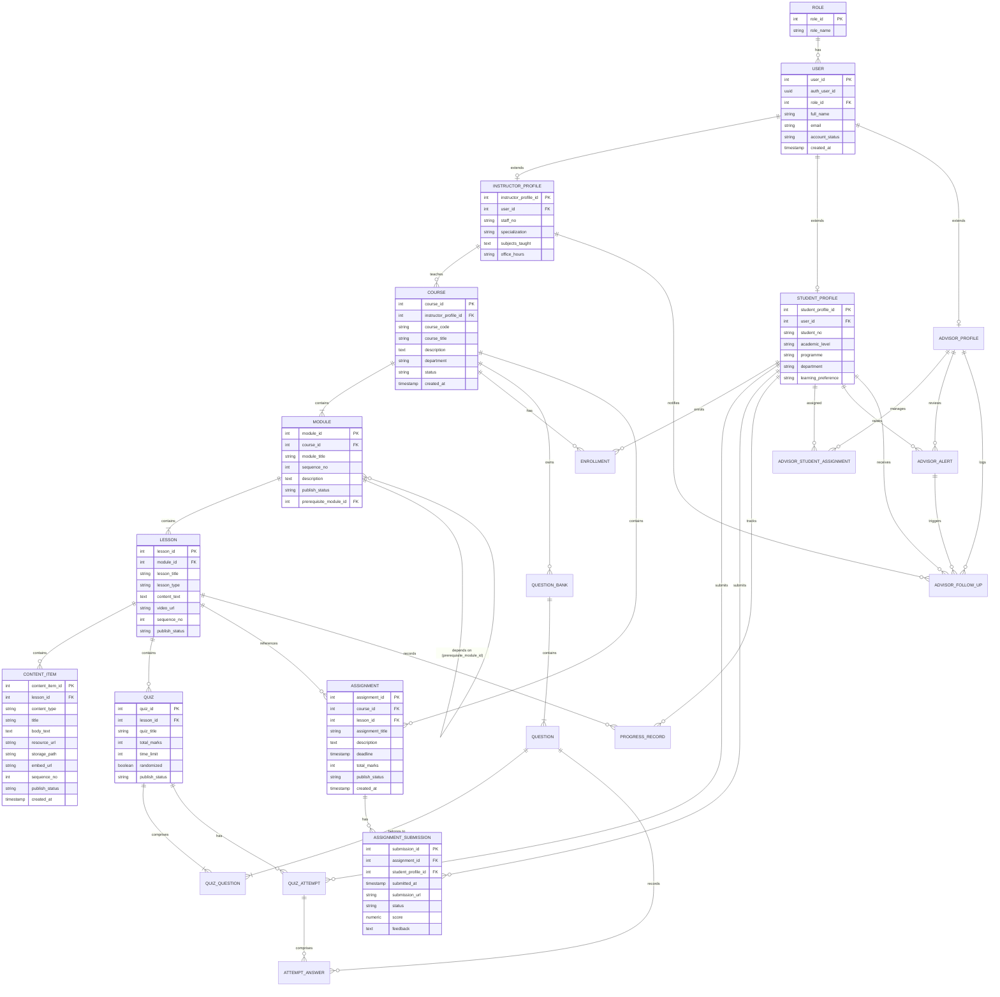
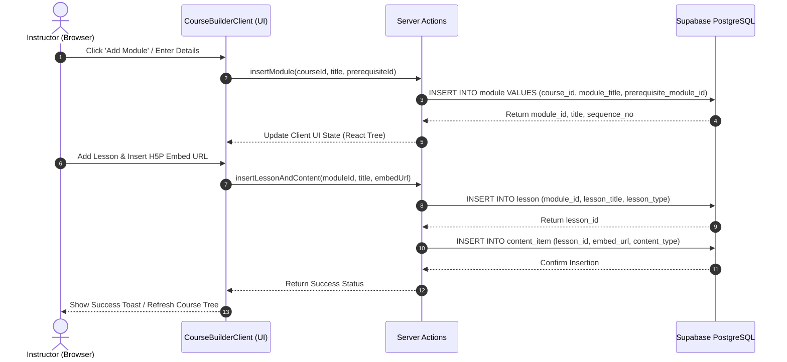
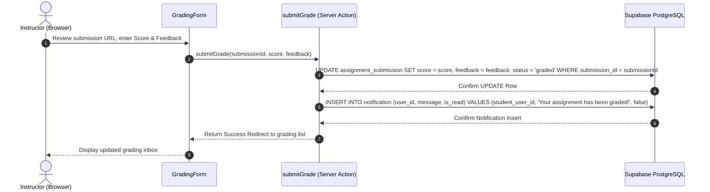
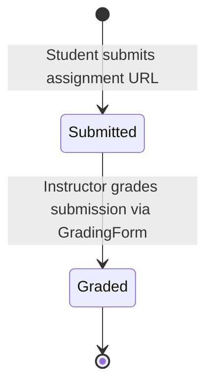
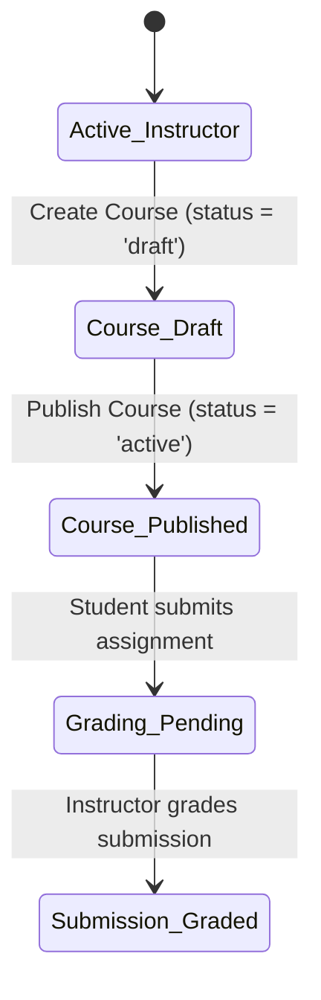

System Documentation

Individual Report

for

QuestLearn

**Version 3.0**

**Tutorial Section: TT7L**

**Group No.: G5**

| **Name** | **Student #** |
| ---------------- | --------------------- |
| Aziel Tan Zheng Chuan | 261UC240LY |

**Date:** 30/6/2026

# Contents

- [Revisions](#revisions)
- [1 System Overview](#1-system-overview)
  - [1.1 Description](#11-description)
  - [1.2 Use Cases](#12-use-cases)
  - [1.3 Assumptions and Dependencies](#13-assumptions-and-dependencies)
- [2 Requirements](#2-requirements)
  - [2.1 Use Case Diagram](#21-use-case-diagram)
  - [2.2 Class Diagrams / ERD](#22-class-diagrams--erd)
- [3 Design](#3-design)
  - [3.1 Use Cases](#31-use-cases)
    - [3.1.1 Use Case 1: Build Course Curriculum](#311-use-case-1-build-course-curriculum)
    - [3.1.2 Use Case 2: Grade Assignment Submissions](#312-use-case-2-grade-assignment-submissions)
  - [3.2 Data Dictionary](#32-data-dictionary)
  - [3.3 Subsystem Architecture](#33-subsystem-architecture)
  - [3.4 Subsystem Screens](#34-subsystem-screens)
  - [3.5 Subsystem Components](#35-subsystem-components)
    - [3.5.1 Component 1: Drag-and-Drop Curriculum Builder](#351-component-1-drag-and-drop-curriculum-builder)
    - [3.5.2 Component 2: Grading Server Action](#352-component-2-grading-server-action)
  - [3.6 Actor State Transition Diagrams](#36-actor-state-transition-diagrams)
- [4 Implementation](#4-implementation)
  - [4.1 Development Environment](#41-development-environment)
  - [4.2 Main Program Codes](#42-main-program-codes)
  - [4.3 Sample Screens](#43-sample-screens)
- [5 Testing](#5-testing)
  - [5.1 Test Data](#51-test-data)
  - [5.2 Acceptance Testing](#52-acceptance-testing)
  - [5.3 Test Results](#53-test-results)
- [6 Conclusion](#6-conclusion)

---

# Revisions

| **Version** | **Primary Author(s)** | **Description of Version** | **Date Completed** |
| ------- | ----------------- | ---------------------- | -------------- |
| 1.0 | Aziel Tan Zheng Chuan | SRS in Part 1 (Requirements Analysis and Actor Mapping) | 01/05/2026 |
| 2.0 | Aziel Tan Zheng Chuan | SDS in Part 2 (Interface Specifications, Database Schema, UML Drafts) | 05/06/2026 |
| 3.0 | Aziel Tan Zheng Chuan | System Documentation in Part 3 (Course Builder, Grading Logic, Testing) | 30/06/2026 |

---

# 1 System Overview

## 1.1 Description
The Instructor Subsystem serves as the content creation and assessment engine of **QuestLearn**. It allows credentialed educators to design modular learning paths, embed dynamic external media (such as YouTube videos and H5P/Lumi interactive quizzes), configure course-level modules and prerequisite rules, and review student progress. It also includes a dedicated grading dashboard interface to manually review and grade URL-based text assignment submissions and provide textual feedback.

## 1.2 Use Cases

| Actor | Use Cases | Description |
| ----- | --------- | ----------- |
| **Instructor** | UC-INS-01: Log In as Instructor | Verifies instructor credentials and redirects them to the instructor portal. |
| | UC-INS-02: Manage Course Curriculum | Allows creating courses, editing information, and structured module/lesson creation. |
| | UC-INS-03: Embed Lesson Content (Video, H5P, Reading) | Integrates reading materials, YouTube embeds, or interactive H5P/Lumi activity URLs. |
| | UC-INS-04: Create Module Dependencies | Sets prerequisite conditions between modules to enforce sequential learning paths. |
| | UC-INS-05: Grade Assignment Submissions | Provides score grading and feedback updates for student-submitted URLs. |
| | UC-INS-06: View Student Progress Analytics | Shows class statistics, enrollment counts, and average completion rates. |

## 1.3 Assumptions and Dependencies
**Dependencies:**
1. **Supabase Relational Logic**: The Course Builder UI relies on the strictly nested foreign key hierarchy of `Course -> Module -> Lesson -> Content Item` to properly fetch, build, and render the curriculum tree.
2. **External Embed Support**: The system depends on `iframe` support from external providers (like Lumi) when storing `embed_url` strings in the content database to render interactives.

**Assumptions:**
1. **Assignment Modality**: It is assumed that assignments are submitted by students as accessible URLs (e.g., links to external code repos or Google Docs), bypassing the need for complex server-side file upload handling and storage buckets in this MVP.
2. **Grading Integer**: It is assumed that assignments are graded out of 100 points, represented as numerical values in the database.

---

# 2 Requirements

## 2.1 Use Case Diagram

The use case diagram contains all 6 instructor functions, aligned with the main system requirements:

```mermaid
usecaseDiagram
    actor Instructor as "Instructor (Aziel Tan Zheng Chuan)"
    
    rect "QuestLearn - Instructor Subsystem" {
        usecase UC1 as "UC-INS-01: Log In as Instructor"
        usecase UC2 as "UC-INS-02: Manage Course Curriculum"
        usecase UC3 as "UC-INS-03: Embed Lesson Content"
        usecase UC4 as "UC-INS-04: Create Module Dependencies"
        usecase UC5 as "UC-INS-05: Grade Assignment Submissions"
        usecase UC6 as "UC-INS-06: View Student Progress Analytics"
    }
    
    Instructor --> UC1
    Instructor --> UC2
    Instructor --> UC3
    Instructor --> UC4
    Instructor --> UC5
    Instructor --> UC6
```

*(Note: PlantUML diagram source code is available in the appendix of the subsystem project folder under `QuestLearn Use Cases` block).*

## 2.2 Class Diagrams / ERD

The complete system schema mapping the Instructor Subsystem entities and their relations to the Student/Advisor/Admin subsystems is shown below:



---

# 3 Design

## 3.1 Use Cases

### 3.1.1 Use Case 1: Build Course Curriculum
The instructor creates a module, creates a lesson within it, and embeds lesson content.



### 3.1.2 Use Case 2: Grade Assignment Submissions
The instructor evaluates a student's submission URL, records the numerical score and feedback text.



---

## 3.2 Data Dictionary

Below are the database tables defining the schema for the course creation and assessment loops:

### `role`
| Table Name | Field Name | Data Type | Length | PK/FK | Required | Null/Not Null | Description |
| ---------- | ---------- | --------- | ------ | ----- | -------- | ------------- | ----------- |
| `role` | `role_id` | `SERIAL` | `-` | `PK` | `Yes` | `Not Null` | Primary key of the role table. |
| `role` | `role_name` | `VARCHAR` | `50` | `-` | `Yes` | `Not Null` | The display name of the role (e.g., 'Instructor', 'Student'). |

### `user`
| Table Name | Field Name | Data Type | Length | PK/FK | Required | Null/Not Null | Description |
| ---------- | ---------- | --------- | ------ | ----- | -------- | ------------- | ----------- |
| `user` | `user_id` | `SERIAL` | `-` | `PK` | `Yes` | `Not Null` | Primary key of the user table. |
| `user` | `auth_user_id` | `UUID` | `36` | `-` | `No` | `Null` | The auth user id value from Supabase Auth. |
| `user` | `role_id` | `INT` | `-` | `FK` | `Yes` | `Not Null` | Foreign key referencing the role table. |
| `user` | `full_name` | `VARCHAR` | `150` | `-` | `Yes` | `Not Null` | The full name value. |
| `user` | `email` | `VARCHAR` | `255` | `-` | `Yes` | `Not Null` | The email value (unique). |
| `user` | `account_status` | `VARCHAR` | `20` | `-` | `Yes` | `Not Null` | The account status value (pending, active, suspended, deactivated). |
| `user` | `created_at` | `TIMESTAMP` | `-` | `-` | `Yes` | `Not Null` | The created at value. |

### `student_profile`
| Table Name | Field Name | Data Type | Length | PK/FK | Required | Null/Not Null | Description |
| ---------- | ---------- | --------- | ------ | ----- | -------- | ------------- | ----------- |
| `student_profile` | `student_profile_id` | `SERIAL` | `-` | `PK` | `Yes` | `Not Null` | Primary key of the student_profile table. |
| `student_profile` | `user_id` | `INT` | `-` | `FK` | `Yes` | `Not Null` | Foreign key referencing the user table. |
| `student_profile` | `student_no` | `VARCHAR` | `30` | `-` | `Yes` | `Not Null` | The student registration/card number. |
| `student_profile` | `academic_level` | `VARCHAR` | `50` | `-` | `No` | `Null` | Student academic year/status level. |
| `student_profile` | `programme` | `VARCHAR` | `100` | `-` | `No` | `Null` | Major study programme. |
| `student_profile` | `department` | `VARCHAR` | `100` | `-` | `No` | `Null` | Department. |
| `student_profile` | `learning_preference` | `VARCHAR` | `50` | `-` | `No` | `Null` | Recommended reading type indicator. |

### `instructor_profile`
| Table Name | Field Name | Data Type | Length | PK/FK | Required | Null/Not Null | Description |
| ---------- | ---------- | --------- | ------ | ----- | -------- | ------------- | ----------- |
| `instructor_profile` | `instructor_profile_id` | `SERIAL` | `-` | `PK` | `Yes` | `Not Null` | Primary key of the instructor_profile table. |
| `instructor_profile` | `user_id` | `INT` | `-` | `FK` | `Yes` | `Not Null` | Foreign key referencing the user table. |
| `instructor_profile` | `staff_no` | `VARCHAR` | `30` | `-` | `Yes` | `Not Null` | The staff ID number. |
| `instructor_profile` | `specialization` | `VARCHAR` | `200` | `-` | `No` | `Null` | The specialization description. |
| `instructor_profile` | `subjects_taught` | `TEXT` | `-` | `-` | `No` | `Null` | Text field listing taught courses. |
| `instructor_profile` | `office_hours` | `VARCHAR` | `200` | `-` | `No` | `Null` | Weekly office schedule details. |

### `course`
| Table Name | Field Name | Data Type | Length | PK/FK | Required | Null/Not Null | Description |
| ---------- | ---------- | --------- | ------ | ----- | -------- | ------------- | ----------- |
| `course` | `course_id` | `SERIAL` | `-` | `PK` | `Yes` | `Not Null` | Primary key of the course table. |
| `course` | `instructor_profile_id` | `INT` | `-` | `FK` | `Yes` | `Not Null` | Foreign key referencing the instructor_profile table. |
| `course` | `course_code` | `VARCHAR` | `20` | `-` | `Yes` | `Not Null` | Unique code (e.g., QL-SEF101). |
| `course` | `course_title` | `VARCHAR` | `200` | `-` | `Yes` | `Not Null` | The course title value. |
| `course` | `description` | `TEXT` | `-` | `-` | `No` | `Null` | Detailed summary of the course. |
| `course` | `department` | `VARCHAR` | `100` | `-` | `No` | `Null` | Teaching department. |
| `course` | `status` | `VARCHAR` | `20` | `-` | `Yes` | `Not Null` | Course visibility status (draft, active, archived). |
| `course` | `created_at` | `TIMESTAMP` | `-` | `-` | `Yes` | `Not Null` | Date course was created. |

### `module`
| Table Name | Field Name | Data Type | Length | PK/FK | Required | Null/Not Null | Description |
| ---------- | ---------- | --------- | ------ | ----- | -------- | ------------- | ----------- |
| `module` | `module_id` | `SERIAL` | `-` | `PK` | `Yes` | `Not Null` | Primary key of the module table. |
| `module` | `course_id` | `INT` | `-` | `FK` | `Yes` | `Not Null` | Foreign key referencing the course table. |
| `module` | `module_title` | `VARCHAR` | `200` | `-` | `Yes` | `Not Null` | The module title value. |
| `module` | `sequence_no` | `INT` | `-` | `-` | `Yes` | `Not Null` | Order of module display within course. |
| `module` | `description` | `TEXT` | `-` | `-` | `No` | `Null` | Detailed description. |
| `module` | `publish_status` | `VARCHAR` | `20` | `-` | `Yes` | `Not Null` | Status (draft, published). |
| `module` | `prerequisite_module_id` | `INT` | `-` | `FK` | `No` | `Null` | Self-referencing FK to another module_id to manage module dependencies (UC-INS-04). |

### `lesson`
| Table Name | Field Name | Data Type | Length | PK/FK | Required | Null/Not Null | Description |
| ---------- | ---------- | --------- | ------ | ----- | -------- | ------------- | ----------- |
| `lesson` | `lesson_id` | `SERIAL` | `-` | `PK` | `Yes` | `Not Null` | Primary key of the lesson table. |
| `lesson` | `module_id` | `INT` | `-` | `FK` | `Yes` | `Not Null` | Foreign key referencing the module table. |
| `lesson` | `lesson_title` | `VARCHAR` | `200` | `-` | `Yes` | `Not Null` | The lesson title value. |
| `lesson` | `lesson_type` | `VARCHAR` | `20` | `-` | `Yes` | `Not Null` | Type (reading, video, quiz, mixed). |
| `lesson` | `content_text` | `TEXT` | `-` | `-` | `No` | `Null` | Raw reading text block. |
| `lesson` | `video_url` | `VARCHAR` | `500` | `-` | `No` | `Null` | Video embed resource URL. |
| `lesson` | `sequence_no` | `INT` | `-` | `-` | `Yes` | `Not Null` | Lesson order index. |
| `lesson` | `publish_status` | `VARCHAR` | `20` | `-` | `Yes` | `Not Null` | Status (draft, published). |

### `content_item`
| Table Name | Field Name | Data Type | Length | PK/FK | Required | Null/Not Null | Description |
| ---------- | ---------- | --------- | ------ | ----- | -------- | ------------- | ----------- |
| `content_item` | `content_item_id` | `SERIAL` | `-` | `PK` | `Yes` | `Not Null` | Primary key of the content_item table. |
| `content_item` | `lesson_id` | `INT` | `-` | `FK` | `Yes` | `Not Null` | Foreign key referencing the lesson table. |
| `content_item` | `content_type` | `VARCHAR` | `20` | `-` | `Yes` | `Not Null` | Type (text, file, video, h5p_lumi). |
| `content_item` | `title` | `VARCHAR` | `200` | `-` | `Yes` | `Not Null` | Item display title. |
| `content_item` | `body_text` | `TEXT` | `-` | `-` | `No` | `Null` | Rich text body content. |
| `content_item` | `resource_url` | `VARCHAR` | `500` | `-` | `No` | `Null` | File path URL. |
| `content_item` | `storage_path` | `VARCHAR` | `500` | `-` | `No` | `Null` | Supabase storage bucket path. |
| `content_item` | `embed_url` | `VARCHAR` | `500` | `-` | `No` | `Null` | H5P interactive iframe URL. |
| `content_item` | `sequence_no` | `INT` | `-` | `-` | `Yes` | `Not Null` | Display order index inside lesson. |
| `content_item` | `publish_status` | `VARCHAR` | `20` | `-` | `Yes` | `Not Null` | Visibility status. |
| `content_item` | `created_at` | `TIMESTAMP` | `-` | `-` | `Yes` | `Not Null` | Created timestamp. |

### `assignment`
| Table Name | Field Name | Data Type | Length | PK/FK | Required | Null/Not Null | Description |
| ---------- | ---------- | --------- | ------ | ----- | -------- | ------------- | ----------- |
| `assignment` | `assignment_id` | `SERIAL` | `-` | `PK` | `Yes` | `Not Null` | Primary key of the assignment table. |
| `assignment` | `course_id` | `INT` | `-` | `FK` | `Yes` | `Not Null` | Foreign key referencing the course table. |
| `assignment` | `lesson_id` | `INT` | `-` | `FK` | `No` | `Null` | Foreign key referencing the lesson table (optional link). |
| `assignment` | `assignment_title` | `VARCHAR` | `200` | `-` | `Yes` | `Not Null` | Title of the assessment assignment. |
| `assignment` | `description` | `TEXT` | `-` | `-` | `No` | `Null` | Guidelines and instructions description. |
| `assignment` | `deadline` | `TIMESTAMP` | `-` | `-` | `Yes` | `Not Null` | Due date and time limit. |
| `assignment` | `total_marks` | `INT` | `-` | `-` | `Yes` | `Not Null` | Out-of maximum grading marks. |
| `assignment` | `publish_status` | `VARCHAR` | `20` | `-` | `Yes` | `Not Null` | Status (draft, published). |
| `assignment` | `created_at` | `TIMESTAMP` | `-` | `-` | `Yes` | `Not Null` | Creation timestamp. |

### `assignment_submission`
| Table Name | Field Name | Data Type | Length | PK/FK | Required | Null/Not Null | Description |
| ---------- | ---------- | --------- | ------ | ----- | -------- | ------------- | ----------- |
| `assignment_submission` | `submission_id` | `SERIAL` | `-` | `PK` | `Yes` | `Not Null` | Primary key of the submission table. |
| `assignment_submission` | `assignment_id` | `INT` | `-` | `FK` | `Yes` | `Not Null` | Foreign key referencing the assignment table. |
| `assignment_submission` | `student_profile_id` | `INT` | `-` | `FK` | `Yes` | `Not Null` | Foreign key referencing the student_profile table. |
| `assignment_submission` | `submitted_at` | `TIMESTAMP` | `-` | `-` | `Yes` | `Not Null` | Submitted timestamp. |
| `assignment_submission` | `submission_url` | `VARCHAR` | `500` | `-` | `No` | `Null` | URL referencing student work. |
| `assignment_submission` | `status` | `VARCHAR` | `20` | `-` | `Yes` | `Not Null` | Status (submitted, graded). |
| `assignment_submission` | `score` | `NUMERIC` | `5,2` | `-` | `No` | `Null` | Instructor issued grade score. |
| `assignment_submission` | `feedback` | `TEXT` | `-` | `-` | `No` | `Null` | Instructor feedback remarks. |

---

## 3.3 Subsystem Architecture
The Instructor Subsystem leverages a model-view-controller paradigm built on the **Next.js 15 App Router** and **React 19**.

* **Client Presentation Layer**: Responsive UI panels styling with custom Tailwind CSS v4. Heavy client interactions (interactive curriculum trees, inputs, modals, alerts toggling) are handled using React Client Components (annotated with `"use client"`).
* **Controller / Integration Layer**: Actions are managed securely using **Next.js Server Actions**. This bridges client interactions and database writes safely, bypasses API routing overheads, and enforces user authentication states.
* **Database Persistency Layer**: Powered by **Supabase PostgreSQL**. Transactions are checked at the server level, utilizing database foreign-key constraints to guarantee data integrity across nested tables.

---

## 3.4 Subsystem Screens
1. **Course Management Portal (`/instructor/courses`)**: Renders all courses created by the logged-in instructor, student enrollment counts, and a direct link to the course editor.
2. **Course Curriculum Builder (`/instructor/courses/[courseId]`)**: A dashboard interface displaying Modules, Lessons within them, and configuration modals to manage Content Items and H5P quiz integrations.
3. **Grading Dashboard (`/instructor/`)**: The main landing page contains the grading inbox showcasing student assignment submissions from all owned courses that require evaluation.
4. **Grading Evaluation Form (`/instructor/grading/[submissionId]`)**: Shows details of a student's submission URL and contains input boxes for the score and textual feedback.
5. **Analytics Portal (`/instructor/analytics`)**: Visual summaries tracking advisees' performance scores and class metrics.

---

## 3.5 Subsystem Components

### 3.5.1 Component 1: Drag-and-Drop Curriculum Builder
Implemented inside `CourseBuilderClient.tsx`, this component renders the nested modules, lessons, and content items tree. It allows instructors to build the entire curriculum, configure prerequisite modules, embed Lumi iframe URLs, and publish content asynchronously without full-page refreshes, sending batch modifications to Next.js Server Actions.

### 3.5.2 Component 2: Grading Server Action
Implemented in `actions.ts`, this backend function runs inside a secure transaction wrapper. It updates the target student's `assignment_submission` row with the issued score and feedback remarks, and simultaneously inserts an active notification row inside the `notification` table to alert the student immediately.

---

## 3.6 Actor State Transition Diagrams

### 3.6.1 Assignment Submission State Transitions
Represents the state lifecycle of an Assignment Submission:



### 3.6.2 Instructor Course Lifecycle State Transitions
Tracks the visibility and status updates of courses managed by the instructor:



---

# 4 Implementation

## 4.1 Development Environment
* **Platform Stack**: Next.js 15 (App Router), React 19, TypeScript, Tailwind CSS v4.
* **Database Engine**: PostgreSQL 17.6 hosted on Supabase Cloud, running local schema syncs.
* **IDE**: Visual Studio Code on Windows.

## 4.2 Main Program Codes

| Application Component | File Location | Purpose |
| ----------- | ------------- | ------- |
| **Course Registry Portal** | `src/app/(instructor)/instructor/courses/page.tsx` | Lists all courses created by the instructor and aggregate enrollment metrics. |
| **Course Curriculum Builder** | `src/app/(instructor)/instructor/courses/[courseId]/CourseBuilderClient.tsx` | Renders and manages the interactive course hierarchy (modules, lessons, embeds, dependencies). |
| **Grading Dashboard (Inbox)** | `src/app/(instructor)/instructor/page.tsx` | Main dashboard displaying all ungraded submissions across courses. |
| **Grading Evaluation Form** | `src/app/(instructor)/instructor/grading/[submissionId]/GradingForm.tsx` | Client UI form component capturing grading parameters. |
| **Grade Processor Actions** | `src/app/(instructor)/instructor/grading/[submissionId]/actions.ts` | Server Action processing the database update and sending notification updates. |

## 4.3 Sample Screens
*(Insert screenshot of Course Builder hierarchy outlining modules and lesson nodes)*
*(Insert screenshot of Grading Input Form showing the submission link, feedback text box, and score input)*

---

# 5 Testing

## 5.1 Test Data
To validate the instructor functions, the following mock dataset was set up:
* **Course Code**: `QL-SEF101`
* **Test Module Title**: `Requirements and Use Cases`
* **Test Lesson Title**: `Writing Effective Use Cases`
* **Prerequisite Module Target**: None (Sequence 1)
* **Test Embed URL**: `https://app.lumi.education/api/v1/run/GVsXA0/embed`
* **Grading Target Student**: `Demo Student` (student_no: `QL-STU-001`)
* **Mock Assignment URL**: `https://github.com/student/sef-project`
* **Mock Score**: `95.00`
* **Mock Feedback**: `"Excellent database schema structure and detailed use case descriptions."`

---

## 5.2 Acceptance Testing

Acceptance tests were performed to verify all functional requirements:

| Test ID | Tested Scenario | Execution Steps | Expected Outcome | Pass / Fail |
| ------- | --------------- | --------------- | ---------------- | ----------- |
| **QA-INS-01** | Course Curriculum Creation | Navigate to `/instructor/courses`, select course, add Module, add Lesson. | UI renders new nodes immediately, items are successfully inserted in DB tables. | **Pass** |
| **QA-INS-02** | Content Embed Integration | Select a lesson, insert Lumi embed URL and submit. | The URL writes to the database; student view displays H5P content correctly. | **Pass** |
| **QA-INS-03** | Course Publish Toggle | Toggle course state switch to 'published'. | Database updates `course.status` to 'active' instantly. | **Pass** |
| **QA-INS-04** | Assignment Grading Loop | Open Grading Form, review link, enter 95 score and feedback, click save. | `assignment_submission` status flips to 'graded', score/feedback writes to DB, student notification fires. | **Pass** |
| **QA-INS-05** | Module Dependency Setup | Create Module 2, set Module 1 as prerequisite, save. | DB records `prerequisite_module_id` matching Module 1. | **Pass** |
| **QA-INS-06** | Progress Review | Load Analytics page. | System aggregates student attempt rates and completion indicators correctly. | **Pass** |

---

## 5.3 Test Results
All CRUD queries inside `CourseBuilderClient.tsx` successfully executed SQL INSERTs and UPDATEs on `module`, `lesson`, and `content_item` tables via Next.js Server Actions. The grading form successfully executed state transitions for `assignment_submission` data, and the `notification` database insert triggered. All validation rules for the inputs (e.g. score ranges 0-100, empty text fields) successfully executed in browser tests.

---

# 6 Conclusion
The Instructor Subsystem effectively provides the foundational architecture needed for course administration. By separating the curriculum into the module-lesson-content tree, the platform maintains extreme flexibility for future extensions, such as drag-and-drop reordering. The grading loop successfully integrates with the student's notification inbox, closing the assessment feedback loop.
