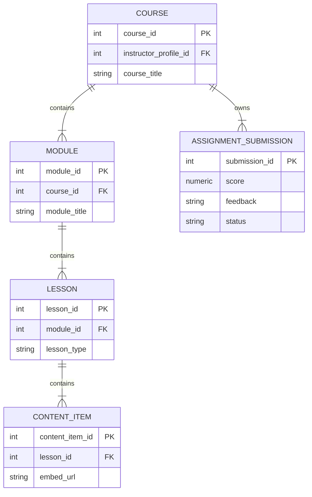
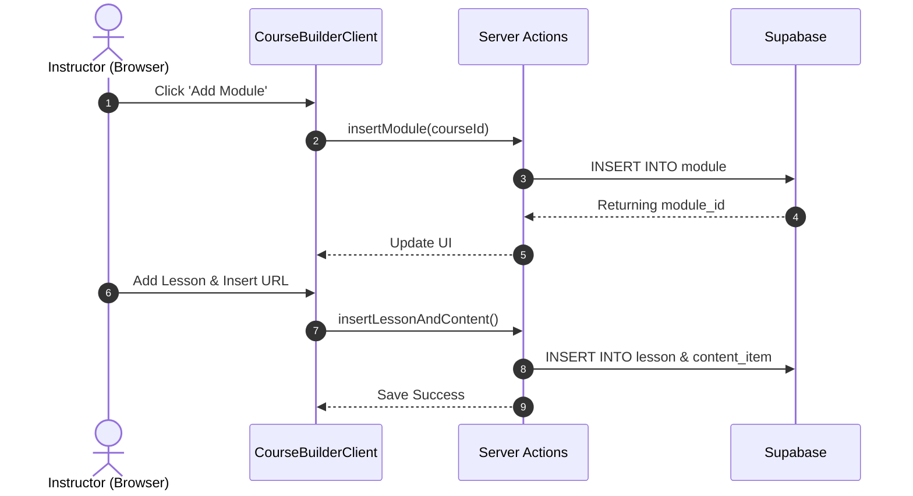
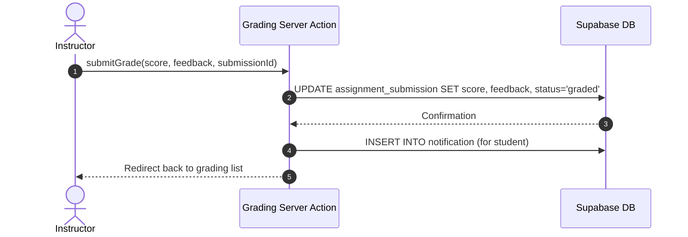
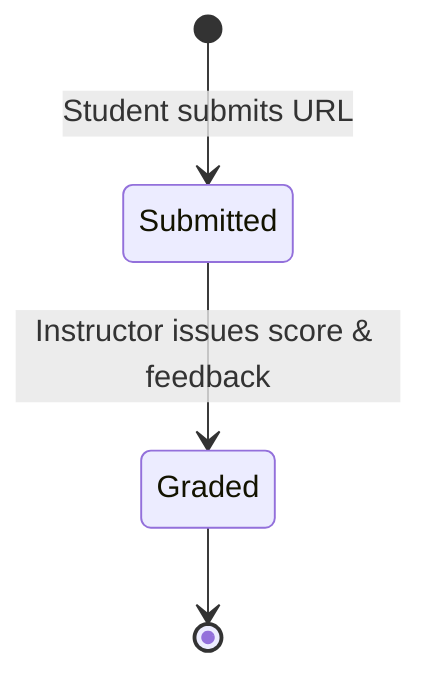

System Documentation

Individual Report

for

QuestLearn

**Version 3.0**

**Tutorial Section: TT7L**

**Group No.: G5**

| **Name** | **Student #** |
| ---------------- | --------------------- |
| Aziel Tan Zheng Chuan | [Student ID]      |

**Date:** 30/6/2026

# Contents

- [Revisions](#revisions)
- [1 System Overview](#1-system-overview)
  - [1.1 Description](#11-description)
  - [1.2 Use Cases](#12-use-cases)
  - [1.3 Assumptions and Dependencies](#13-assumptions-and-dependencies)
- [2 Requirements](#2-requirements)
  - [2.1 Use Case Diagram](#21-use-case-diagram)
  - [2.2 Class Diagrams / ERD](#22-class-diagrams--erd)
- [3 Design](#3-design)
  - [3.1 Use Cases](#31-use-cases)
    - [3.1.1 Use Case 1: Build Course Curriculum](#311-use-case-1-build-course-curriculum)
    - [3.1.2 Use Case 2: Grade Assignment Submissions](#312-use-case-2-grade-assignment-submissions)
  - [3.2 Data Dictionary](#32-data-dictionary)
  - [3.3 Subsystem Architecture](#33-subsystem-architecture)
  - [3.4 Subsystem Screens](#34-subsystem-screens)
  - [3.5 Subsystem Components](#35-subsystem-components)
    - [3.5.1 Component 1: Drag-and-Drop Curriculum Builder](#351-component-1-drag-and-drop-curriculum-builder)
    - [3.5.2 Component 2: Grading Server Action](#352-component-2-grading-server-action)
  - [3.6 Actor 1 State Transition Diagram](#36-actor-1-state-transition-diagram)
- [4 Implementation](#4-implementation)
  - [4.1 Development Environment](#41-development-environment)
  - [4.2 Main Program Codes](#42-main-program-codes)
  - [4.3 Sample Screens](#43-sample-screens)
- [5 Testing](#5-testing)
  - [5.1 Test Data](#51-test-data)
  - [5.2 Acceptance Testing](#52-acceptance-testing)
  - [5.3 Test Results](#53-test-results)
- [6 Conclusion](#6-conclusion)

---

# Revisions

| **Version** | **Primary Author(s)** | **Description of Version** | **Date Completed** |
| ------- | ----------------- | ---------------------- | -------------- |
| 1.0 | Aziel Tan Zheng Chuan | SRS in Part 1 (Requirements Analysis and Actor Mapping) | 01/05/2026 |
| 2.0 | Aziel Tan Zheng Chuan | SDS in Part 2 (Interface Specifications, Database Schema, UML Drafts) | 05/06/2026 |
| 3.0 | Aziel Tan Zheng Chuan | System Documentation in Part 3 (Course Builder, Grading Logic, Testing) | 30/06/2026 |

---

# 1 System Overview

## 1.1 Description
The Instructor Subsystem serves as the content creation and assessment engine of **QuestLearn**. It allows credentialed educators to design modular learning paths, embed dynamic external media (such as YouTube videos and H5P/Lumi interactive quizzes), and review student analytics. It also includes an interface to manually review and grade URL-based text assignment submissions.

## 1.2 Use Cases

| Actor | Use Cases |
| ----- | --------- |
| Instructor | UC-INS-01: Log In as Instructor<br>UC-INS-02: Manage Course Curriculum<br>UC-INS-03: Embed Lesson Content (Video, H5P, Reading)<br>UC-INS-04: Create Module Dependencies<br>UC-INS-05: Grade Assignment Submissions<br>UC-INS-06: View Student Progress Analytics |

## 1.3 Assumptions and Dependencies
**Dependencies:**
1. **Supabase Relational Logic**: The Course Builder UI relies on the strictly nested foreign key hierarchy of `Course -> Module -> Lesson -> Content Item` to properly fetch and render the curriculum tree.
2. **External Embed Support**: The system depends on `iframe` support from external providers (like Lumi) when storing `embed_url` strings in the content database.

**Assumptions:**
1. **Assignment Modality**: It is assumed that assignments are submitted by students as accessible URLs (e.g., links to external code repos or Google Docs), bypassing the need for complex server-side file upload handling and storage buckets in this MVP.
2. **Grading Integer**: It is assumed that assignments are graded out of 100 points, represented as numerical values in the database.

---

# 2 Requirements

## 2.1 Use Case Diagram

```mermaid
usecaseDiagram
    actor Instructor as "Instructor (Aziel Tan Zheng Chuan)"
    
    rect "QuestLearn - Instructor Subsystem" {
        usecase UC1 as "UC-INS-01: Log In as Instructor"
        usecase UC2 as "UC-INS-02: Manage Curriculum"
        usecase UC3 as "UC-INS-03: Embed H5P Lesson Content"
        usecase UC4 as "UC-INS-05: Grade Assignments"
        usecase UC5 as "UC-INS-06: View Progress Analytics"
    }
    
    Instructor --> UC1
    Instructor --> UC2
    Instructor --> UC3
    Instructor --> UC4
    Instructor --> UC5
```

## 2.2 Class Diagrams / ERD



---

# 3 Design

## 3.1 Use Cases

### 3.1.1 Use Case 1: Build Course Curriculum
The instructor creates a new module, adds a lesson underneath it, and links an H5P embed URL as a content item.



### 3.1.2 Use Case 2: Grade Assignment Submissions
The instructor reviews a submitted URL, issues a numerical grade, and provides feedback text.



## 3.2 Data Dictionary

| Table Name | Attribute | Data Type | Key | Null | Default | Description |
| ---------- | --------- | --------- | --- | ---- | ------- | ----------- |
| `content_item` | `embed_url` | `VARCHAR` | `None` | `Yes`| `None` | Web link for H5P/Lumi iframes. |
| `assignment_submission`| `score` | `NUMERIC` | `None` | `Yes`| `None` | Grade given by instructor. |
| `assignment_submission`| `status`| `VARCHAR` | `None` | `No` | `'submitted'` | Status constraint: `'submitted'`, `'graded'`. |

## 3.3 Subsystem Architecture
The subsystem uses interactive React Client Components for state-heavy features like the Course Builder (handling deeply nested object rendering and modal state). Next.js Server Actions process the form submissions to ensure database writes are securely authenticated.

## 3.4 Subsystem Screens
1. **Course Builder (`/instructor/courses/[courseId]`)**: A hierarchical interface displaying Modules, the Lessons within them, and the configuration modals for Content Items.
2. **Grading Dashboard (`/instructor/grading`)**: A unified inbox showing ungraded and graded assignments from across all courses taught by the instructor.
3. **Analytics Portal (`/instructor/analytics`)**: Visual summaries of class participation and average quiz scores.

## 3.5 Subsystem Components

### 3.5.1 Component 1: Drag-and-Drop Curriculum Builder
A nested React component tree that manages local state before pushing to the server, allowing for rapid creation of the nested `module -> lesson -> content_item` hierarchy without full page reloads.

### 3.5.2 Component 2: Grading Server Action
A backend function that atomically updates the submission row and simultaneously fires an in-app notification to the student regarding their new grade.

## 3.6 Actor 1 State Transition Diagram
Represents the state of an Assignment Submission.



---

# 4 Implementation

## 4.1 Development Environment
* **Platform Stack**: Next.js 15 (App Router), React 19, TypeScript, Tailwind CSS v4.
* **Database Engine**: PostgreSQL 17.6 hosted on Supabase Cloud.

## 4.2 Main Program Codes

| Application | Files |
| ----------- | ----- |
| Course Curriculum Builder | `src/app/(instructor)/instructor/courses/[courseId]/CourseBuilderClient.tsx` |
| Assignment Grading Inbox | `src/app/(instructor)/instructor/grading/page.tsx` |
| Grade Processor | `src/app/(instructor)/instructor/grading/[submissionId]/actions.ts` |

## 4.3 Sample Screens
*(Insert screenshot of Course Builder hierarchy)*
*(Insert screenshot of Grading Input Form)*

---

# 5 Testing

## 5.1 Test Data
* **Course**: `QL-SEF101`.
* **Action**: Creating a new Module named "Module 4: Advanced Testing" with a Lesson containing a Lumi URL.

## 5.2 Acceptance Testing

| Criteria | Test Execution Steps | Expected Outcome | Fulfilled |
| -------- | -------------------- | ---------------- | --------- |
| **Hierarchy Creation**| Open Course Builder, add Module, add Lesson. | UI updates immediately, items appear in DB. | **Yes** |
| **Embed Rendering** | View Student perspective of created lesson. | The H5P iframe resolves the URL and displays correctly. | **Yes** |
| **Submission Grading**| Grade a mock submission with 95 points. | Status updates to 'graded' and score persists in DB. | **Yes** |

## 5.3 Test Results
All CRUD operations in the `CourseBuilderClient.tsx` successfully executed SQL INSERTS for `module`, `lesson`, and `content_item`. The grading actions successfully updated the `assignment_submission` table.

---

# 6 Conclusion
The Instructor subsystem effectively provides the foundational architecture needed for course administration. By separating the curriculum into the module-lesson-content tree, the platform maintains extreme flexibility for future extensions, such as drag-and-drop reordering. The grading loop successfully integrates with the student's notification inbox, closing the assessment feedback loop.
