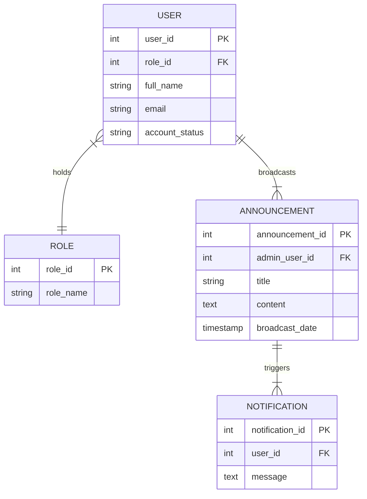
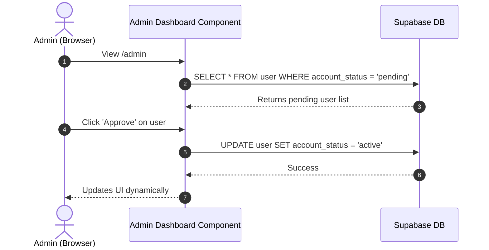
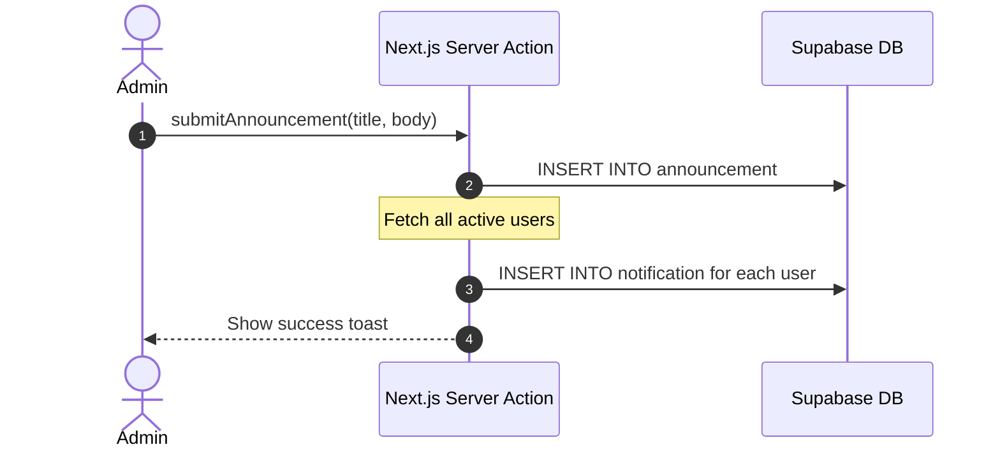
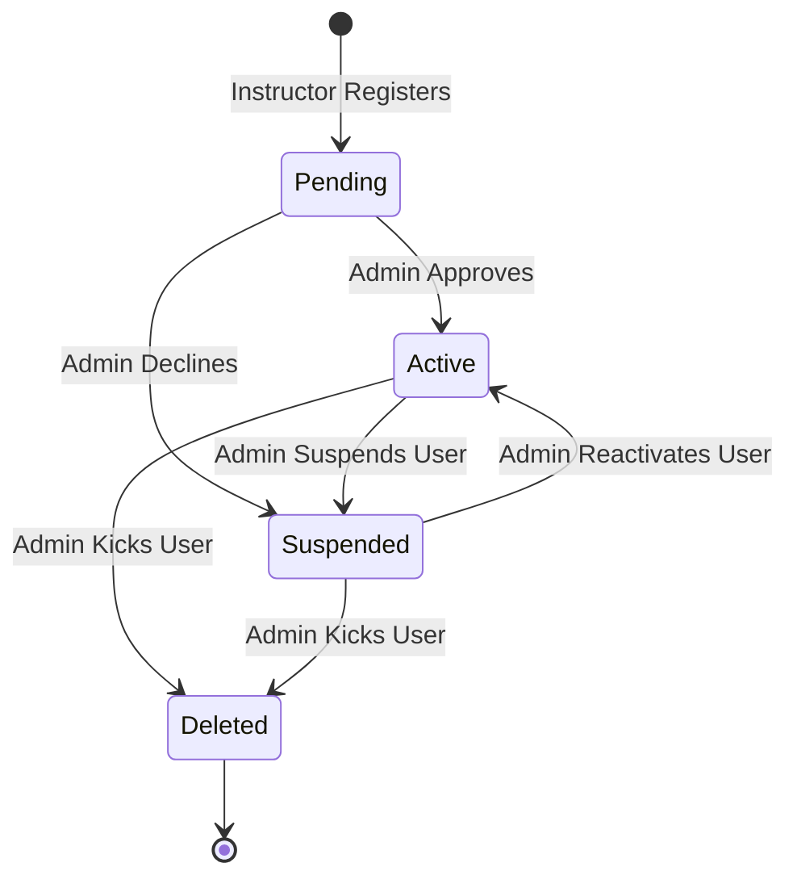

System Documentation

Individual Report

for

QuestLearn

**Version 3.0**

**Tutorial Section: TT7L**

**Group No.: G5**

| **Name** | **Student #** |
| ---------------- | --------------------- |
| Soo Kian Rong    | [Student ID]          |

**Date:** 30/6/2026

# Contents

- [Revisions](#revisions)
- [1 System Overview](#1-system-overview)
  - [1.1 Description](#11-description)
  - [1.2 Use Cases](#12-use-cases)
  - [1.3 Assumptions and Dependencies](#13-assumptions-and-dependencies)
- [2 Requirements](#2-requirements)
  - [2.1 Use Case Diagram](#21-use-case-diagram)
  - [2.2 Class Diagrams / ERD](#22-class-diagrams--erd)
- [3 Design](#3-design)
  - [3.1 Use Cases](#31-use-cases)
    - [3.1.1 Use Case 1: Approve Pending Instructors](#311-use-case-1-approve-pending-instructors)
    - [3.1.2 Use Case 2: Broadcast Global Announcements](#312-use-case-2-broadcast-global-announcements)
  - [3.2 Data Dictionary](#32-data-dictionary)
  - [3.3 Subsystem Architecture](#33-subsystem-architecture)
  - [3.4 Subsystem Screens](#34-subsystem-screens)
  - [3.5 Subsystem Components](#35-subsystem-components)
    - [3.5.1 Component 1: Approval Workflow](#351-component-1-approval-workflow)
    - [3.5.2 Component 2: User Access Suspension](#352-component-2-user-access-suspension)
  - [3.6 Actor 1 State Transition Diagram](#36-actor-1-state-transition-diagram)
- [4 Implementation](#4-implementation)
  - [4.1 Development Environment](#41-development-environment)
  - [4.2 Main Program Codes](#42-main-program-codes)
  - [4.3 Sample Screens](#43-sample-screens)
- [5 Testing](#5-testing)
  - [5.1 Test Data](#51-test-data)
  - [5.2 Acceptance Testing](#52-acceptance-testing)
  - [5.3 Test Results](#53-test-results)
- [6 Conclusion](#6-conclusion)

---

# Revisions

| **Version** | **Primary Author(s)** | **Description of Version** | **Date Completed** |
| ------- | ----------------- | ---------------------- | -------------- |
| 1.0 | Soo Kian Rong | SRS in Part 1 (Requirements Analysis and Actor Mapping) | 01/05/2026 |
| 2.0 | Soo Kian Rong | SDS in Part 2 (Interface Specifications, Database Schema, UML Drafts) | 05/06/2026 |
| 3.0 | Soo Kian Rong | System Documentation in Part 3 (Admin Routing, Registry logic, Testing) | 30/06/2026 |

---

# 1 System Overview

## 1.1 Description
The Admin Subsystem in **QuestLearn** provides oversight, security, and global communication capabilities. As the backend authority for the platform, the Admin actor manages role-based access control (RBAC), approves or denies registrations for sensitive roles (Instructors and Advisors), toggles account suspensions for existing users, and broadcasts platform-wide announcements. This subsystem leverages Next.js Middleware to ensure that `/admin/*` routes are strictly protected.

## 1.2 Use Cases

| Actor | Use Cases |
| ----- | --------- |
| Admin | UC-ADM-01: Log In as Administrator<br>UC-ADM-02: View Platform Analytics<br>UC-ADM-03: Manage Pending Registrations<br>UC-ADM-04: Manage User Registry (Suspend/Kick)<br>UC-ADM-05: Broadcast Announcements<br>UC-ADM-06: Browse Course Library |

## 1.3 Assumptions and Dependencies
**Dependencies:**
1. **Next.js Middleware**: The subsystem relies heavily on the `middleware.ts` interceptor to evaluate the Supabase JWT role. If the middleware fails, unauthorized users could theoretically view the `/admin` path.
2. **Supabase Database**: Uses Server Actions to execute high-privilege operations directly against the PostgreSQL tables, bypassing client-side logic completely.

**Assumptions:**
1. **Approval Trust**: It is assumed that the Admin manually verifies the credentials of any `pending` instructor or advisor before clicking "Approve". 
2. **Cascade Deletion**: When a user is kicked (deleted) via the Registry, it is assumed that all their related profiles (Student, Instructor, Advisor) are cascade-deleted at the schema level.

---

# 2 Requirements

## 2.1 Use Case Diagram

```mermaid
usecaseDiagram
    actor Admin as "Administrator (Soo Kian Rong)"
    
    rect "QuestLearn - Admin Subsystem" {
        usecase UC1 as "UC-ADM-01: Log In as Administrator"
        usecase UC2 as "UC-ADM-02: View Platform Analytics"
        usecase UC3 as "UC-ADM-03: Manage Pending Registrations"
        usecase UC4 as "UC-ADM-04: Manage User Registry"
        usecase UC5 as "UC-ADM-05: Broadcast Announcements"
        usecase UC6 as "UC-ADM-06: Browse Course Library"
    }
    
    Admin --> UC1
    Admin --> UC2
    Admin --> UC3
    Admin --> UC4
    Admin --> UC5
    Admin --> UC6
```

## 2.2 Class Diagrams / ERD



---

# 3 Design

## 3.1 Use Cases

### 3.1.1 Use Case 1: Approve Pending Instructors
The admin logs into the dashboard, views users with `account_status = 'pending'`, and clicks approve.



### 3.1.2 Use Case 2: Broadcast Global Announcements
The admin drafts an announcement that generates notifications for all users.



## 3.2 Data Dictionary

| Table Name | Field Name | Data Type | Length | PK/FK | Required | Null/Not Null | Description |
| ---------- | ---------- | --------- | ------ | ----- | -------- | ------------- | ----------- |
| `role` | `role_id` | `SERIAL` | `-` | `PK` | `Yes` | `Not Null` | Primary key of the role table. |
| `role` | `role_name` | `VARCHAR` | `50` | `-` | `Yes` | `Not Null` | The role name value. |
| `user` | `user_id` | `SERIAL` | `-` | `PK` | `Yes` | `Not Null` | Primary key of the user table. |
| `user` | `auth_user_id` | `UUID` | `36` | `-` | `No` | `Null` | The auth user id value. |
| `user` | `role_id` | `INT` | `-` | `FK` | `Yes` | `Not Null` | Foreign key referencing the role table. |
| `user` | `full_name` | `VARCHAR` | `150` | `-` | `Yes` | `Not Null` | The full name value. |
| `user` | `email` | `VARCHAR` | `255` | `-` | `Yes` | `Not Null` | The email value. |
| `user` | `account_status` | `VARCHAR` | `20` | `-` | `Yes` | `Not Null` | The account status value. |
| `user` | `created_at` | `TIMESTAMP` | `-` | `-` | `Yes` | `Not Null` | The created at value. |
| `course` | `course_id` | `SERIAL` | `-` | `PK` | `Yes` | `Not Null` | Primary key of the course table. |
| `course` | `instructor_profile_id` | `INT` | `-` | `FK` | `Yes` | `Not Null` | Foreign key referencing the instructor_profile table. |
| `course` | `course_code` | `VARCHAR` | `20` | `-` | `Yes` | `Not Null` | The course code value. |
| `course` | `course_title` | `VARCHAR` | `200` | `-` | `Yes` | `Not Null` | The course title value. |
| `course` | `description` | `TEXT` | `-` | `-` | `No` | `Null` | The description value. |
| `course` | `department` | `VARCHAR` | `100` | `-` | `No` | `Null` | The department value. |
| `course` | `status` | `VARCHAR` | `20` | `-` | `Yes` | `Not Null` | The status value. |
| `course` | `created_at` | `TIMESTAMP` | `-` | `-` | `Yes` | `Not Null` | The created at value. |
| `announcement` | `announcement_id` | `SERIAL` | `-` | `PK` | `Yes` | `Not Null` | Primary key of the announcement table. |
| `announcement` | `user_id` | `INT` | `-` | `FK` | `Yes` | `Not Null` | Foreign key referencing the table. |
| `announcement` | `title` | `VARCHAR` | `200` | `-` | `Yes` | `Not Null` | The title value. |
| `announcement` | `message` | `TEXT` | `-` | `-` | `Yes` | `Not Null` | The message value. |
| `announcement` | `scope` | `VARCHAR` | `20` | `-` | `Yes` | `Not Null` | The scope value. |
| `announcement` | `target_scope_id` | `INT` | `-` | `-` | `No` | `Null` | The target scope id value. |
| `announcement` | `published_at` | `TIMESTAMP` | `-` | `-` | `Yes` | `Not Null` | The published at value. |
| `announcement` | `status` | `VARCHAR` | `20` | `-` | `Yes` | `Not Null` | The status value. |
| `moderation_action` | `moderation_action_id` | `SERIAL` | `-` | `PK` | `Yes` | `Not Null` | Primary key of the moderation_action table. |
| `moderation_action` | `admin_user_id` | `INT` | `-` | `FK` | `Yes` | `Not Null` | Foreign key referencing the table. |
| `moderation_action` | `target_type` | `VARCHAR` | `30` | `-` | `Yes` | `Not Null` | The target type value. |
| `moderation_action` | `target_id` | `INT` | `-` | `-` | `Yes` | `Not Null` | The target id value. |
| `moderation_action` | `action_type` | `VARCHAR` | `30` | `-` | `Yes` | `Not Null` | The action type value. |
| `moderation_action` | `reason` | `TEXT` | `-` | `-` | `No` | `Null` | The reason value. |
| `moderation_action` | `action_at` | `TIMESTAMP` | `-` | `-` | `Yes` | `Not Null` | The action at value. |
| `audit_log` | `audit_log_id` | `SERIAL` | `-` | `PK` | `Yes` | `Not Null` | Primary key of the audit_log table. |
| `audit_log` | `actor_user_id` | `INT` | `-` | `FK` | `No` | `Null` | Foreign key referencing the table. |
| `audit_log` | `action_type` | `VARCHAR` | `80` | `-` | `Yes` | `Not Null` | The action type value. |
| `audit_log` | `target_type` | `VARCHAR` | `50` | `-` | `No` | `Null` | The target type value. |
| `audit_log` | `target_id` | `INT` | `-` | `-` | `No` | `Null` | The target id value. |
| `audit_log` | `summary` | `TEXT` | `-` | `-` | `Yes` | `Not Null` | The summary value. |
| `audit_log` | `metadata` | `JSONB` | `-` | `-` | `No` | `Null` | The metadata value. |
| `audit_log` | `created_at` | `TIMESTAMP` | `-` | `-` | `Yes` | `Not Null` | The created at value. |

## 3.3 Subsystem Architecture
The Admin subsystem relies on secure Next.js Server Components. The architecture enforces strict role validation before rendering any page in the `/admin` layout. All data mutations (Approve, Suspend, Kick) are handled exclusively via `"use server"` actions to prevent unauthorized API requests.

## 3.4 Subsystem Screens
1. **Admin Dashboard (`/admin`)**: Shows system health metrics and pending registrations.
2. **User Registry (`/admin/users`)**: A master table displaying all platform users, their roles, and their active/suspended states.
3. **Platform Announcements (`/admin/announcements`)**: A broadcast portal to type and send messages.

_<TO DO: Place the screen designs/wireframes for these subsystem interfaces here>_

## 3.5 Subsystem Components

_<TO DO: Place the table mapping subsystem components to modules/classes/packages here>_

### 3.5.1 Component 1: Approval Workflow
Server action (`approveUser`) that locates the target user ID and updates their `account_status` to `'active'`, thus permitting their JWT session to bypass the middleware on their next login.

### 3.5.2 Component 2: User Access Suspension
Logic in the User Registry allowing an admin to toggle the `account_status` string between `'active'` and `'suspended'`. If suspended, the user's next request is blocked by the Next.js middleware and redirected to a suspension notice.

## 3.6 Actor 1 State Transition Diagram
Represents the state of a user account being managed by the Admin.



---

# 4 Implementation

## 4.1 Development Environment
* **Platform Stack**: Next.js 15 (App Router), React 19, TypeScript, Tailwind CSS v4, Bun Package Manager.
* **Database Engine**: PostgreSQL 17.6 hosted on Supabase Cloud.

_<TO DO: Place relevant images that show the development environment/IDE here>_

## 4.2 Main Program Codes

| Application | Files |
| ----------- | ----- |
| Admin Dashboard | `src/app/(admin)/admin/page.tsx`<br>`src/app/(admin)/admin/AdminDashboardClient.tsx` |
| User Registry | `src/app/(admin)/admin/users/page.tsx`<br>`src/app/(admin)/admin/users/actions.ts` |
| Announcements | `src/app/(admin)/admin/announcements/page.tsx` |

## 4.3 Sample Screens
*(Insert screenshots of the Admin Dashboard and User Registry here)*

---

# 5 Testing

## 5.1 Test Data
* **Target Account**: `test_instructor@example.com` (Status: pending).
* **Action**: Admin clicks "Approve".

## 5.2 Acceptance Testing

| Criteria | Test Execution Steps | Expected Outcome | Fulfilled |
| -------- | -------------------- | ---------------- | --------- |
| **Pending Approval** | View dashboard, click "Approve" on a pending instructor | User row is removed from pending, status becomes active. | **Yes** |
| **Suspension** | Go to Registry, click "Suspend" on an active user | User badge turns red, status updates to suspended. | **Yes** |
| **Broadcast** | Send an announcement | Message appears in the local timeline and DB. | **Yes** |

## 5.3 Test Results
Confirmed via Supabase dashboard that `account_status` updates successfully and no regular student can access the `/admin` route (Middleware correctly triggers 403 or redirect).

_<TO DO: Place the subsystem/application test result screens and SQL output screenshots here>_

---

# 6 Conclusion
The Admin subsystem provides secure and necessary oversight capabilities. The integration with Next.js Middleware guarantees that role-based boundaries are respected. Future upgrades could include detailed audit logs for every administrative action taken.

### Software Quality Assurance
_<TO DO: Include details of software quality assurance practices here>_

### Group Collaboration
_<TO DO: Include details of group collaboration and teamwork here>_

### Problems Encountered
_<TO DO: Include details of problems encountered during the project and how they were resolved here>_
