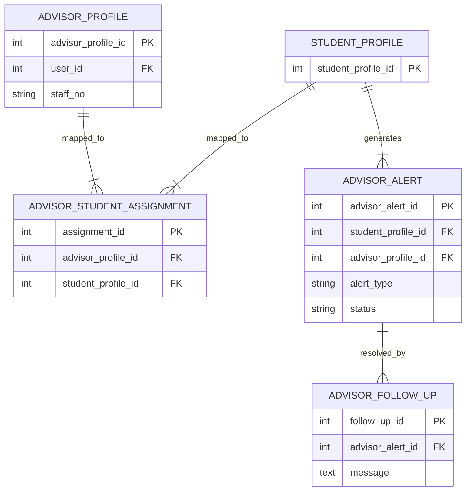
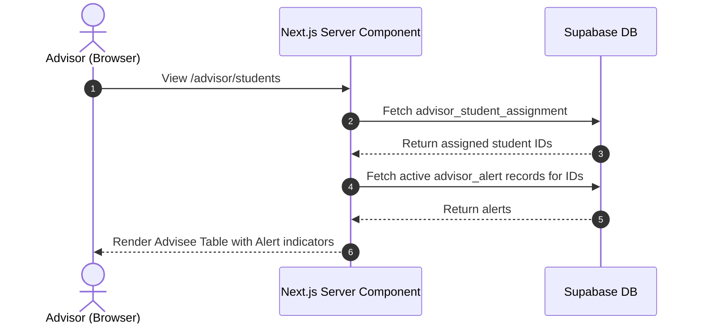
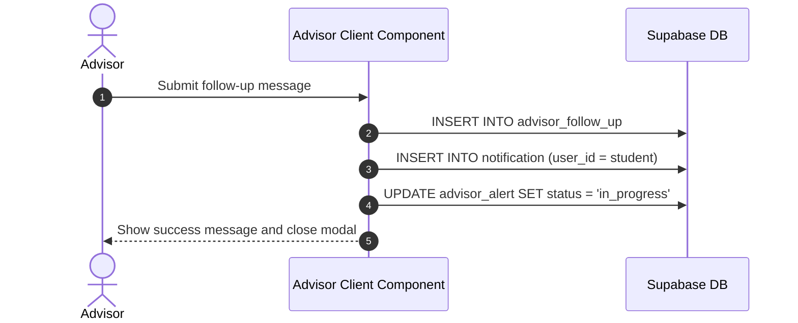
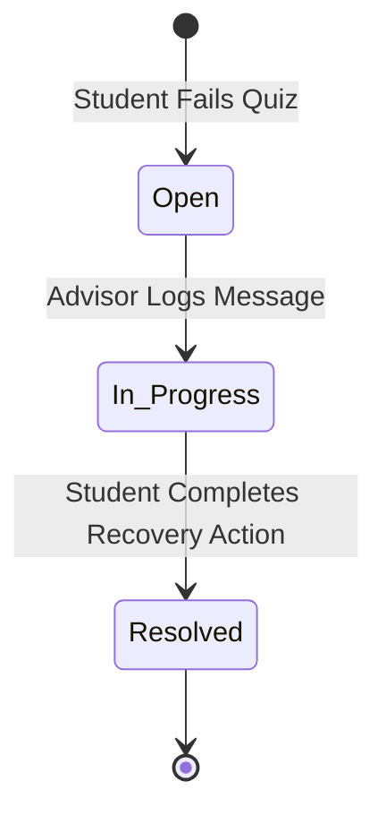

System Documentation

Individual Report

for

QuestLearn

**Version 3.0**

**Tutorial Section: TT7L**

**Group No.: G5**

| **Name** | **Student #** |
| ---------------- | --------------------- |
| Vincent Lock Chun Kit | [Student ID]      |

**Date:** 30/6/2026

# Contents

- [Revisions](#revisions)
- [1 System Overview](#1-system-overview)
  - [1.1 Description](#11-description)
  - [1.2 Use Cases](#12-use-cases)
  - [1.3 Assumptions and Dependencies](#13-assumptions-and-dependencies)
- [2 Requirements](#2-requirements)
  - [2.1 Use Case Diagram](#21-use-case-diagram)
  - [2.2 Class Diagrams / ERD](#22-class-diagrams--erd)
- [3 Design](#3-design)
  - [3.1 Use Cases](#31-use-cases)
    - [3.1.1 Use Case 1: Monitor Active Advisor Alerts](#311-use-case-1-monitor-active-advisor-alerts)
    - [3.1.2 Use Case 2: Log Follow-Up Intervention](#312-use-case-2-log-follow-up-intervention)
  - [3.2 Data Dictionary](#32-data-dictionary)
  - [3.3 Subsystem Architecture](#33-subsystem-architecture)
  - [3.4 Subsystem Screens](#34-subsystem-screens)
  - [3.5 Subsystem Components](#35-subsystem-components)
    - [3.5.1 Component 1: Alert Aggregation Query](#351-component-1-alert-aggregation-query)
    - [3.5.2 Component 2: Intervention Messaging Workflow](#352-component-2-intervention-messaging-workflow)
  - [3.6 Actor 1 State Transition Diagram](#36-actor-1-state-transition-diagram)
- [4 Implementation](#4-implementation)
  - [4.1 Development Environment](#41-development-environment)
  - [4.2 Main Program Codes](#42-main-program-codes)
  - [4.3 Sample Screens](#43-sample-screens)
- [5 Testing](#5-testing)
  - [5.1 Test Data](#51-test-data)
  - [5.2 Acceptance Testing](#52-acceptance-testing)
  - [5.3 Test Results](#53-test-results)
- [6 Conclusion](#6-conclusion)

---

# Revisions

| **Version** | **Primary Author(s)** | **Description of Version** | **Date Completed** |
| ------- | ----------------- | ---------------------- | -------------- |
| 1.0 | Vincent Lock Chun Kit | SRS in Part 1 (Requirements Analysis and Actor Mapping) | 01/05/2026 |
| 2.0 | Vincent Lock Chun Kit | SDS in Part 2 (Interface Specifications, Database Schema, UML Drafts) | 05/06/2026 |
| 3.0 | Vincent Lock Chun Kit | System Documentation in Part 3 (Advisor Dashboard, Alerts logic, Testing) | 30/06/2026 |

---

# 1 System Overview

## 1.1 Description
The Academic Advisor Subsystem acts as the primary support and intervention layer within **QuestLearn**. Instead of manually polling for student progress, the system proactively surfaces actionable intelligence to the Advisor via automated alerts (`low_quiz_score` or `low_engagement`). The Advisor can then use the platform to log follow-up messages and optionally loop in the relevant instructor, forming a cohesive academic support workflow.

## 1.2 Use Cases

| Actor | Use Cases |
| ----- | --------- |
| Advisor | UC-ADV-01: Log In as Advisor<br>UC-ADV-02: View Advisor Dashboard & System Analytics<br>UC-ADV-03: Monitor Assigned Students & Active Alerts<br>UC-ADV-04: Log Follow-Up Intervention & Notify Student<br>UC-ADV-05: Review Follow-Up History |

## 1.3 Assumptions and Dependencies
**Dependencies:**
1. **Student Subsystem Rule-Engine**: The Advisor dashboard relies on the Student Subsystem's auto-grading component to insert records into the `advisor_alert` table whenever a student scores below 50%.
2. **Supabase Relational Integrity**: Accurate display of data assumes the `advisor_student_assignment` mapping table is properly maintained, ensuring advisors only see students in their assigned purview.

**Assumptions:**
1. **Alert Volume**: It is assumed that alerts will remain manageable enough for a table view without needing complex pagination or AI-summarization in the MVP phase.
2. **Intervention Modality**: The system assumes interventions are purely text-based messages sent via the in-app notification system, bypassing external email for MVP simplicity.

---

# 2 Requirements

## 2.1 Use Case Diagram

```mermaid
usecaseDiagram
    actor Advisor as "Academic Advisor (Vincent Lock Chun Kit)"
    
    rect "QuestLearn - Advisor Subsystem" {
        usecase UC1 as "UC-ADV-01: Log In as Advisor"
        usecase UC2 as "UC-ADV-02: View Advisor Dashboard"
        usecase UC3 as "UC-ADV-03: Monitor Active Alerts"
        usecase UC4 as "UC-ADV-04: Log Follow-Up Intervention"
        usecase UC5 as "UC-ADV-05: Review Follow-Up History"
    }
    
    Advisor --> UC1
    Advisor --> UC2
    Advisor --> UC3
    Advisor --> UC4
    Advisor --> UC5
```

## 2.2 Class Diagrams / ERD



---

# 3 Design

## 3.1 Use Cases

### 3.1.1 Use Case 1: Monitor Active Advisor Alerts
The system fetches all students assigned to the advisor and lists any active alerts generated by failing grades.



### 3.1.2 Use Case 2: Log Follow-Up Intervention
The advisor selects a student, types a message, and submits it to log the intervention and alert the student.



## 3.2 Data Dictionary

| Table Name | Field Name | Data Type | Length | PK/FK | Required | Null/Not Null | Description |
| ---------- | ---------- | --------- | ------ | ----- | -------- | ------------- | ----------- |
| `user` | `user_id` | `SERIAL` | `-` | `PK` | `Yes` | `Not Null` | Primary key of the user table. |
| `user` | `auth_user_id` | `UUID` | `36` | `-` | `No` | `Null` | The auth user id value. |
| `user` | `role_id` | `INT` | `-` | `FK` | `Yes` | `Not Null` | Foreign key referencing the role table. |
| `user` | `full_name` | `VARCHAR` | `150` | `-` | `Yes` | `Not Null` | The full name value. |
| `user` | `email` | `VARCHAR` | `255` | `-` | `Yes` | `Not Null` | The email value. |
| `user` | `account_status` | `VARCHAR` | `20` | `-` | `Yes` | `Not Null` | The account status value. |
| `user` | `created_at` | `TIMESTAMP` | `-` | `-` | `Yes` | `Not Null` | The created at value. |
| `advisor_profile` | `advisor_profile_id` | `SERIAL` | `-` | `PK` | `Yes` | `Not Null` | Primary key of the advisor_profile table. |
| `advisor_profile` | `user_id` | `INT` | `-` | `FK` | `Yes` | `Not Null` | Foreign key referencing the table. |
| `advisor_profile` | `staff_no` | `VARCHAR` | `30` | `-` | `Yes` | `Not Null` | The staff no value. |
| `advisor_profile` | `department` | `VARCHAR` | `100` | `-` | `No` | `Null` | The department value. |
| `advisor_profile` | `office_hours` | `VARCHAR` | `200` | `-` | `No` | `Null` | The office hours value. |
| `student_profile` | `student_profile_id` | `SERIAL` | `-` | `PK` | `Yes` | `Not Null` | Primary key of the student_profile table. |
| `student_profile` | `user_id` | `INT` | `-` | `FK` | `Yes` | `Not Null` | Foreign key referencing the table. |
| `student_profile` | `student_no` | `VARCHAR` | `30` | `-` | `Yes` | `Not Null` | The student no value. |
| `student_profile` | `academic_level` | `VARCHAR` | `50` | `-` | `No` | `Null` | The academic level value. |
| `student_profile` | `programme` | `VARCHAR` | `100` | `-` | `No` | `Null` | The programme value. |
| `student_profile` | `department` | `VARCHAR` | `100` | `-` | `No` | `Null` | The department value. |
| `student_profile` | `learning_preference` | `VARCHAR` | `50` | `-` | `No` | `Null` | The learning preference value. |
| `advisor_student_assignment` | `advisor_student_assignment_id` | `SERIAL` | `-` | `PK` | `Yes` | `Not Null` | Primary key of the advisor_student_assignment table. |
| `advisor_student_assignment` | `advisor_profile_id` | `INT` | `-` | `FK` | `Yes` | `Not Null` | Foreign key referencing the advisor_profile table. |
| `advisor_student_assignment` | `student_profile_id` | `INT` | `-` | `FK` | `Yes` | `Not Null` | Foreign key referencing the student_profile table. |
| `advisor_student_assignment` | `assigned_at` | `TIMESTAMP` | `-` | `-` | `Yes` | `Not Null` | The assigned at value. |
| `advisor_student_assignment` | `status` | `VARCHAR` | `20` | `-` | `Yes` | `Not Null` | The status value. |
| `advisor_alert` | `advisor_alert_id` | `SERIAL` | `-` | `PK` | `Yes` | `Not Null` | Primary key of the advisor_alert table. |
| `advisor_alert` | `student_profile_id` | `INT` | `-` | `FK` | `Yes` | `Not Null` | Foreign key referencing the student_profile table. |
| `advisor_alert` | `advisor_profile_id` | `INT` | `-` | `FK` | `No` | `Null` | Foreign key referencing the advisor_profile table. |
| `advisor_alert` | `alert_type` | `VARCHAR` | `30` | `-` | `Yes` | `Not Null` | The alert type value. |
| `advisor_alert` | `severity` | `VARCHAR` | `10` | `-` | `Yes` | `Not Null` | The severity value. |
| `advisor_alert` | `source_type` | `VARCHAR` | `50` | `-` | `No` | `Null` | The source type value. |
| `advisor_alert` | `source_id` | `INT` | `-` | `-` | `No` | `Null` | The source id value. |
| `advisor_alert` | `message` | `TEXT` | `-` | `-` | `Yes` | `Not Null` | The message value. |
| `advisor_alert` | `status` | `VARCHAR` | `20` | `-` | `Yes` | `Not Null` | The status value. |
| `advisor_alert` | `created_at` | `TIMESTAMP` | `-` | `-` | `Yes` | `Not Null` | The created at value. |
| `advisor_alert` | `resolved_at` | `TIMESTAMP` | `-` | `-` | `No` | `Null` | The resolved at value. |
| `advisor_follow_up` | `advisor_follow_up_id` | `SERIAL` | `-` | `PK` | `Yes` | `Not Null` | Primary key of the advisor_follow_up table. |
| `advisor_follow_up` | `advisor_alert_id` | `INT` | `-` | `FK` | `No` | `Null` | Foreign key referencing the advisor_alert table. |
| `advisor_follow_up` | `advisor_profile_id` | `INT` | `-` | `FK` | `Yes` | `Not Null` | Foreign key referencing the advisor_profile table. |
| `advisor_follow_up` | `student_profile_id` | `INT` | `-` | `FK` | `Yes` | `Not Null` | Foreign key referencing the student_profile table. |
| `advisor_follow_up` | `instructor_profile_id` | `INT` | `-` | `FK` | `No` | `Null` | Foreign key referencing the instructor_profile table. |
| `advisor_follow_up` | `follow_up_type` | `VARCHAR` | `30` | `-` | `Yes` | `Not Null` | The follow up type value. |
| `advisor_follow_up` | `message` | `TEXT` | `-` | `-` | `Yes` | `Not Null` | The message value. |
| `advisor_follow_up` | `next_action` | `TEXT` | `-` | `-` | `No` | `Null` | The next action value. |
| `advisor_follow_up` | `follow_up_at` | `TIMESTAMP` | `-` | `-` | `Yes` | `Not Null` | The follow up at value. |
| `notification` | `notification_id` | `SERIAL` | `-` | `PK` | `Yes` | `Not Null` | Primary key of the notification table. |
| `notification` | `user_id` | `INT` | `-` | `FK` | `Yes` | `Not Null` | Foreign key referencing the table. |
| `notification` | `announcement_id` | `INT` | `-` | `FK` | `No` | `Null` | Foreign key referencing the announcement table. |
| `notification` | `message` | `TEXT` | `-` | `-` | `Yes` | `Not Null` | The message value. |
| `notification` | `is_read` | `BOOLEAN` | `-` | `-` | `Yes` | `Not Null` | The is read value. |
| `notification` | `sent_at` | `TIMESTAMP` | `-` | `-` | `Yes` | `Not Null` | The sent at value. |

## 3.3 Subsystem Architecture
The subsystem uses Next.js Client Components (e.g., `AdvisorStudentsClient.tsx`) to handle interactive elements like the Follow-up Modal, while Server Components fetch the heavily nested relational data (joining Profiles to Assignments to Alerts) securely via Supabase.

## 3.4 Subsystem Screens
1. **Dashboard (`/advisor`)**: Overview metrics showing total assigned students and aggregate alert counts.
2. **Advisee Registry (`/advisor/students`)**: A detailed table of students, showing academic information and highlighting those with active risk alerts.

_<TO DO: Place the screen designs/wireframes for these subsystem interfaces here>_

## 3.5 Subsystem Components

_<TO DO: Place the table mapping subsystem components to modules/classes/packages here>_

### 3.5.1 Component 1: Alert Aggregation Query
A complex Server-side query that joins the mapping table to the alert table, returning a structured JSON object to the Client Component to render warning icons next to specific student names.

### 3.5.2 Component 2: Intervention Messaging Workflow
A client-side form that executes multiple inserts: saving the historical text in `advisor_follow_up` and directly pushing a real-time message into the `notification` table for the target student to see on their next login.

## 3.6 Actor 1 State Transition Diagram
Represents the lifecycle of an Advisor Alert.



---

# 4 Implementation

## 4.1 Development Environment
* **Platform Stack**: Next.js 15 (App Router), React 19, TypeScript, Tailwind CSS v4.
* **Database Engine**: PostgreSQL 17.6 hosted on Supabase Cloud.

_<TO DO: Place relevant images that show the development environment/IDE here>_

## 4.2 Main Program Codes

| Application | Files |
| ----------- | ----- |
| Advisor Dashboard | `src/app/(advisor)/advisor/page.tsx` |
| Advisee Management | `src/app/(advisor)/advisor/students/page.tsx`<br>`src/app/(advisor)/advisor/students/AdvisorStudentsClient.tsx` |
| Follow-up History | `src/app/(advisor)/advisor/follow-ups/page.tsx` |

## 4.3 Sample Screens
*(Insert screenshot of Advisee table with Warning icon)*
*(Insert screenshot of Log Follow-up Modal)*

---

# 5 Testing

## 5.1 Test Data
* **Assigned Student**: See Wing Kit (`student_profile_id = 1`).
* **Condition**: Student has an active alert in `advisor_alert` from failing a testing strategies quiz.

## 5.2 Acceptance Testing

| Criteria | Test Execution Steps | Expected Outcome | Fulfilled |
| -------- | -------------------- | ---------------- | --------- |
| **Alert Display** | Open `/advisor/students` | The "Status" column shows a red "Needs Attention" badge. | **Yes** |
| **Log Intervention** | Click "Follow-Up", type message, click Send | Success toast appears, modal closes. | **Yes** |
| **Notification Hook** | Check student dashboard | In-app notification appears for the student. | **Yes** |

## 5.3 Test Results
Confirmed that the `advisor_follow_up` table properly logged the message, and the `notification` table received the insert via the client-side Supabase query execution.

_<TO DO: Place the subsystem/application test result screens and SQL output screenshots here>_

---

# 6 Conclusion
The Advisor subsystem successfully translates raw student struggle (failed quizzes) into a human intervention workflow. By surfacing these alerts automatically, the system prevents students from falling through the cracks. Future iterations could integrate automated email delivery for follow-ups alongside the in-app notifications.

### Software Quality Assurance
_<TO DO: Include details of software quality assurance practices here>_

### Group Collaboration
_<TO DO: Include details of group collaboration and teamwork here>_

### Problems Encountered
_<TO DO: Include details of problems encountered during the project and how they were resolved here>_
