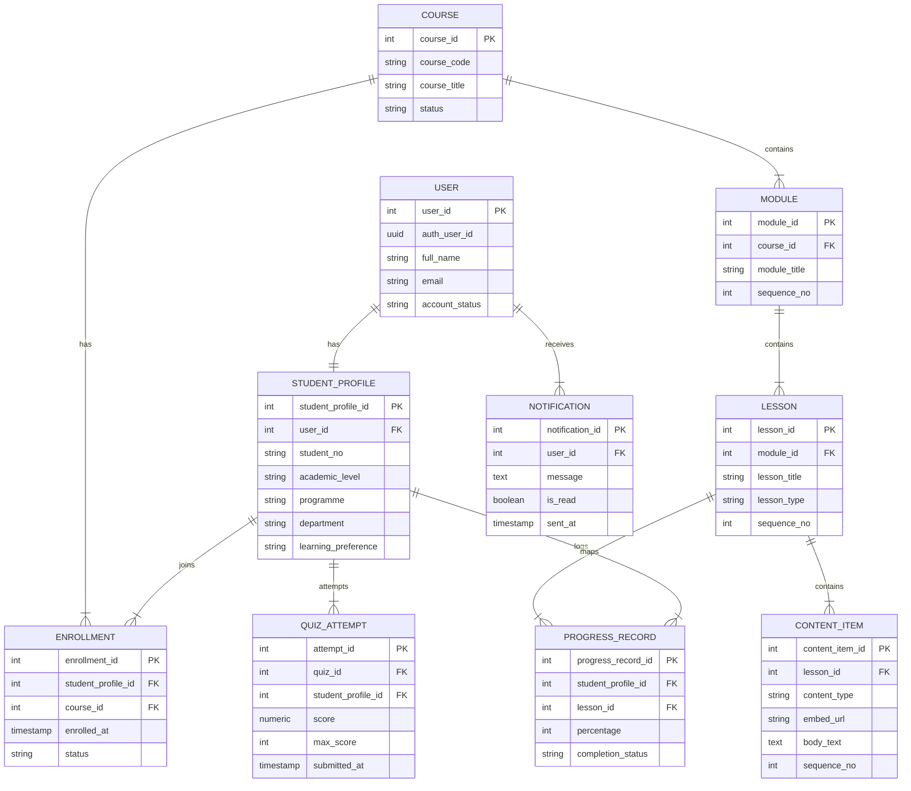
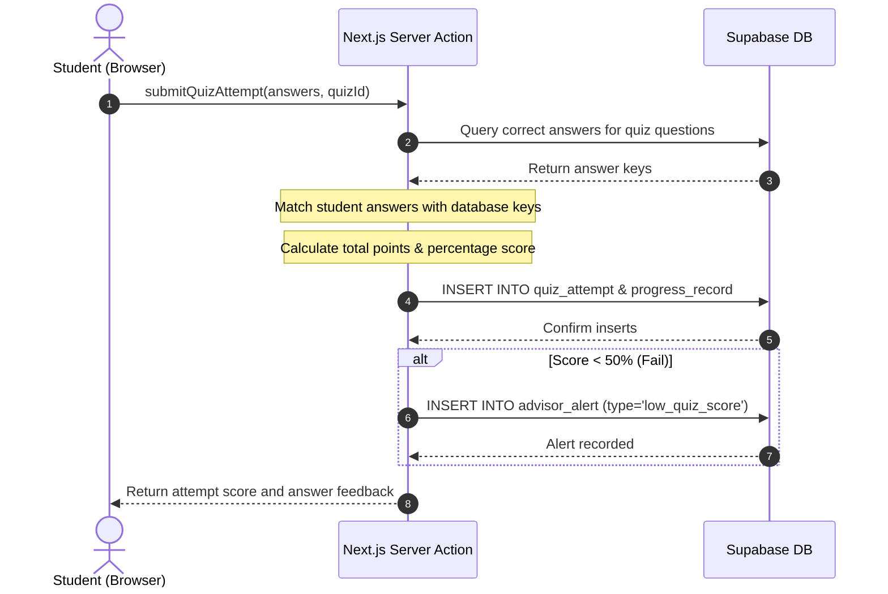
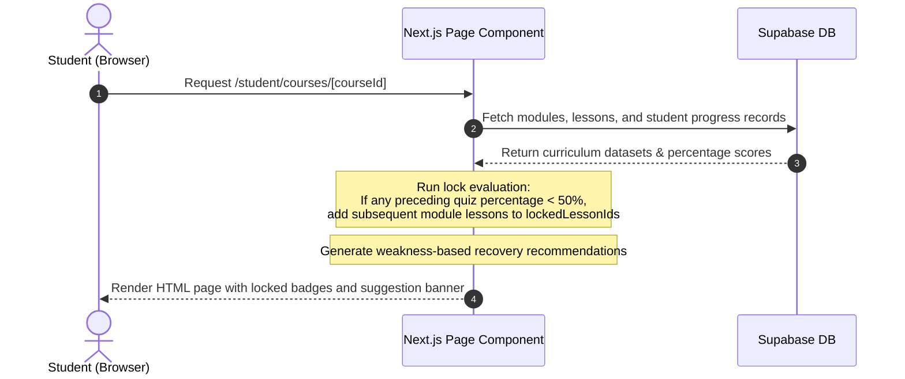

System Documentation

Individual Report

for

QuestLearn

**Version 3.0**

**Tutorial Section: TT7L**

**Group No.: G5**

| **Name** | **Student #** |
| ---------------- | --------------------- |
| See Wing Kit     | 261UC240PJ            |

**Date:** 30/6/2026

# Contents

- [Revisions](#revisions)
- [1 System Overview](#1-system-overview)
  - [1.1 Description](#11-description)
  - [1.2 Use Cases](#12-use-cases)
  - [1.3 Assumptions and Dependencies](#13-assumptions-and-dependencies)
- [2 Requirements](#2-requirements)
  - [2.1 Use Case Diagram](#21-use-case-diagram)
  - [2.2 Class Diagrams / ERD](#22-class-diagrams--erd)
- [3 Design](#3-design)
  - [3.1 Use Cases](#31-use-cases)
    - [3.1.1 Use Case 1: Quiz Attempt, Auto-Grading, and Notification Loop](#311-use-case-1-quiz-attempt-auto-grading-and-notification-loop)
    - [3.1.2 Use Case 2: Load Dashboard and Trigger Recommendation/Locking Logic](#312-use-case-2-load-dashboard-and-trigger-recommendationlocking-logic)
  - [3.2 Data Dictionary](#32-data-dictionary)
  - [3.3 Subsystem Architecture](#33-subsystem-architecture)
  - [3.4 Subsystem Screens](#34-subsystem-screens)
  - [3.5 Subsystem Components](#35-subsystem-components)
    - [3.5.1 Component 1: Quiz Submission Auto-Grading & Alert Trigger](#351-component-1-quiz-submission-auto-grading--alert-trigger)
    - [3.5.2 Component 2: Rule-Based Module Locking & Suggestion Generator](#352-component-2-rule-based-module-locking--suggestion-generator)
  - [3.6 Actor 1 State Transition Diagram](#36-actor-1-state-transition-diagram)
- [4 Implementation](#4-implementation)
  - [4.1 Development Environment](#41-development-environment)
  - [4.2 Main Program Codes](#42-main-program-codes)
    - [4.2.1 page.tsx (Dashboard)](#421-pagetsx-dashboard)
    - [4.2.2 actions.ts (Quiz Action Processor)](#422-actionsts-quiz-action-processor)
  - [4.3 Sample Screens](#43-sample-screens)
- [5 Testing](#5-testing)
  - [5.1 Test Data](#51-test-data)
  - [5.2 Acceptance Testing](#52-acceptance-testing)
  - [5.3 Test Results](#53-test-results)
- [6 Conclusion](#6-conclusion)

---

# Revisions

| **Version** | **Primary Author(s)** | **Description of Version** | **Date Completed** |
| ------- | ----------------- | ---------------------- | -------------- |
| 1.0 | See Wing Kit | SRS in Part 1 (Requirements Analysis and Actor Mapping) | 01/05/2026 |
| 2.0 | See Wing Kit | SDS in Part 2 (Interface Specifications, Database Schema, UML Drafts) | 05/06/2026 |
| 3.0 | See Wing Kit | System Documentation in Part 3 (H5P/Lumi, Recommendation Logic, Testing) | 30/06/2026 |

---

# 1 System Overview

## 1.1 Description
The Student Subsystem in **QuestLearn** is designed to provide a highly interactive, responsive, and adaptive learning environment for students. The core focus areas of this subsystem are:
1. **Interactive Content Delivery (H5P/Lumi Integration)**: Renders interactive slides, drag-and-drop activities, short answers, and multiple-choice questions embedded via safe, responsive iframe containers directly tied to the database.
2. **Mobile-First Responsive UI**: Built with Next.js and Tailwind CSS utility rules, providing optimal readability, layout transitions, and touch-friendly controls across smartphones, tablets, and desktop displays.
3. **Adaptive Rule-Based Recommendations**: Implements client-side and server-side rules. When a student scores less than 50% on a quiz (`progress_record.percentage < 50`), the system automatically flags a "Weak Topic", locks succeeding lesson elements within that module, creates an early alert for the Academic Advisor, and displays a recommended recovery study path to guide the student's retrieval.

## 1.2 Use Cases

| Actor | Use Cases |
| ----- | --------- |
| Student | UC-STU-01: Register & Log In<br>UC-STU-02: Manage Profile & Preferences<br>UC-STU-03: View Enrolled Courses & Progress<br>UC-STU-04: Browse Course Curriculum<br>UC-STU-05: Access Lesson Content (H5P/Lumi)<br>UC-STU-06: Submit Quiz Attempt<br>UC-STU-07: Review Quiz Attempt & Recommendations<br>UC-STU-08: View Grade History<br>UC-STU-09: Receive In-App Notifications |

## 1.3 Assumptions and Dependencies

The design and implementation of the Student Subsystem rely on the following key assumptions and external dependencies:

**Dependencies:**
1. **Supabase Authentication and Database**: The system depends on Supabase for secure session management (via `sb-access-token`) and PostgreSQL database hosting. If Supabase experiences downtime or changes its Row-Level Security (RLS) API, the student dashboard and progress logic will be directly impacted.
2. **Third-Party H5P/Lumi Hosting**: The interactive lesson activities (quizzes, drag-and-drop) are heavily dependent on external hosting via `app.lumi.education`. The subsystem assumes this external domain will remain active, fast, and accessible without cross-origin resource sharing (CORS) blocks.

**Assumptions:**
1. **User Scale**: It is assumed that the platform will handle up to 500 concurrent student users attempting quizzes simultaneously. The Next.js server actions are designed to scale statelessly, but database connection limits on the Supabase free/MVP tier are assumed to be sufficient for this scale.
2. **Standardized Grading Metric**: The system assumes all quiz attempts are quantifiable as integer percentages between `0` and `100`. 
3. **Passing Thresholds**: It is assumed that a strictly universal `50%` passing threshold applies to all courses. Any attempt failing this threshold triggers a sequential lock of subsequent lesson IDs in that course module. If individual courses require different passing thresholds in the future, the database schema and recommendation engine will require refactoring.
4. **Device Compatibility**: It is assumed that students will access the system using modern, ES6-compliant web browsers (Chrome, Safari, Firefox). Legacy browsers (like Internet Explorer 11) are not supported.

---

# 2 Requirements

## 2.1 Use Case Diagram

```mermaid
usecaseDiagram
    actor Student as "Student (See Wing Kit)"
    
    rect "QuestLearn - Student Subsystem" {
        usecase UC1 as "UC-STU-01: Register & Log In"
        usecase UC2 as "UC-STU-02: Manage Profile & Preferences"
        usecase UC3 as "UC-STU-03: View Enrolled Courses & Progress"
        usecase UC4 as "UC-STU-04: Browse Course Curriculum"
        usecase UC5 as "UC-STU-05: Access Lesson Content (H5P/Lumi)"
        usecase UC6 as "UC-STU-06: Submit Quiz Attempt"
        usecase UC7 as "UC-STU-07: Review Quiz Attempt & Recommendations"
        usecase UC8 as "UC-STU-08: View Grade History"
        usecase UC9 as "UC-STU-09: Receive In-App Notifications"
    }
    
    Student --> UC1
    Student --> UC2
    Student --> UC3
    Student --> UC4
    Student --> UC5
    Student --> UC6
    Student --> UC7
    Student --> UC8
    Student --> UC9
```

## 2.2 Class Diagrams / ERD



---

# 3 Design

## 3.1 Use Cases

### 3.1.1 Use Case 1: Quiz Attempt, Auto-Grading, and Notification Loop
A student submits answers to a quiz. The server action processes correct answers, logs progress, updates attempts history, and generates advisory alert flags if failing scores occur.



### 3.1.2 Use Case 2: Load Dashboard and Trigger Recommendation/Locking Logic
A student loads the course page. The page fetches current progress records. If a failing score (<50%) is detected on a quiz, succeeding lessons are flagged as locked and a recommended action plan card is generated.



## 3.2 Data Dictionary

| Table Name | Field Name | Data Type | Length | PK/FK | Required | Null/Not Null | Description |
| ---------- | ---------- | --------- | ------ | ----- | -------- | ------------- | ----------- |
| `user` | `user_id` | `SERIAL` | `-` | `PK` | `Yes` | `Not Null` | Primary key of the user table. |
| `user` | `auth_user_id` | `UUID` | `36` | `-` | `No` | `Null` | The auth user id value. |
| `user` | `role_id` | `INT` | `-` | `FK` | `Yes` | `Not Null` | Foreign key referencing the role table. |
| `user` | `full_name` | `VARCHAR` | `150` | `-` | `Yes` | `Not Null` | The full name value. |
| `user` | `email` | `VARCHAR` | `255` | `-` | `Yes` | `Not Null` | The email value. |
| `user` | `account_status` | `VARCHAR` | `20` | `-` | `Yes` | `Not Null` | The account status value. |
| `user` | `created_at` | `TIMESTAMP` | `-` | `-` | `Yes` | `Not Null` | The created at value. |
| `student_profile` | `student_profile_id` | `SERIAL` | `-` | `PK` | `Yes` | `Not Null` | Primary key of the student_profile table. |
| `student_profile` | `user_id` | `INT` | `-` | `FK` | `Yes` | `Not Null` | Foreign key referencing the table. |
| `student_profile` | `student_no` | `VARCHAR` | `30` | `-` | `Yes` | `Not Null` | The student no value. |
| `student_profile` | `academic_level` | `VARCHAR` | `50` | `-` | `No` | `Null` | The academic level value. |
| `student_profile` | `programme` | `VARCHAR` | `100` | `-` | `No` | `Null` | The programme value. |
| `student_profile` | `department` | `VARCHAR` | `100` | `-` | `No` | `Null` | The department value. |
| `student_profile` | `learning_preference` | `VARCHAR` | `50` | `-` | `No` | `Null` | The learning preference value. |
| `enrollment` | `enrollment_id` | `SERIAL` | `-` | `PK` | `Yes` | `Not Null` | Primary key of the enrollment table. |
| `enrollment` | `student_profile_id` | `INT` | `-` | `FK` | `Yes` | `Not Null` | Foreign key referencing the student_profile table. |
| `enrollment` | `course_id` | `INT` | `-` | `FK` | `Yes` | `Not Null` | Foreign key referencing the course table. |
| `enrollment` | `enrolled_at` | `TIMESTAMP` | `-` | `-` | `Yes` | `Not Null` | The enrolled at value. |
| `enrollment` | `status` | `VARCHAR` | `20` | `-` | `Yes` | `Not Null` | The status value. |
| `course` | `course_id` | `SERIAL` | `-` | `PK` | `Yes` | `Not Null` | Primary key of the course table. |
| `course` | `instructor_profile_id` | `INT` | `-` | `FK` | `Yes` | `Not Null` | Foreign key referencing the instructor_profile table. |
| `course` | `course_code` | `VARCHAR` | `20` | `-` | `Yes` | `Not Null` | The course code value. |
| `course` | `course_title` | `VARCHAR` | `200` | `-` | `Yes` | `Not Null` | The course title value. |
| `course` | `description` | `TEXT` | `-` | `-` | `No` | `Null` | The description value. |
| `course` | `department` | `VARCHAR` | `100` | `-` | `No` | `Null` | The department value. |
| `course` | `status` | `VARCHAR` | `20` | `-` | `Yes` | `Not Null` | The status value. |
| `course` | `created_at` | `TIMESTAMP` | `-` | `-` | `Yes` | `Not Null` | The created at value. |
| `module` | `module_id` | `SERIAL` | `-` | `PK` | `Yes` | `Not Null` | Primary key of the module table. |
| `module` | `course_id` | `INT` | `-` | `FK` | `Yes` | `Not Null` | Foreign key referencing the course table. |
| `module` | `module_title` | `VARCHAR` | `200` | `-` | `Yes` | `Not Null` | The module title value. |
| `module` | `sequence_no` | `INT` | `-` | `-` | `Yes` | `Not Null` | The sequence no value. |
| `module` | `description` | `TEXT` | `-` | `-` | `No` | `Null` | The description value. |
| `module` | `publish_status` | `VARCHAR` | `20` | `-` | `Yes` | `Not Null` | The publish status value. |
| `lesson` | `lesson_id` | `SERIAL` | `-` | `PK` | `Yes` | `Not Null` | Primary key of the lesson table. |
| `lesson` | `module_id` | `INT` | `-` | `FK` | `Yes` | `Not Null` | Foreign key referencing the module table. |
| `lesson` | `lesson_title` | `VARCHAR` | `200` | `-` | `Yes` | `Not Null` | The lesson title value. |
| `lesson` | `lesson_type` | `VARCHAR` | `20` | `-` | `Yes` | `Not Null` | The lesson type value. |
| `lesson` | `content_text` | `TEXT` | `-` | `-` | `No` | `Null` | The content text value. |
| `lesson` | `video_url` | `VARCHAR` | `500` | `-` | `No` | `Null` | The video url value. |
| `lesson` | `sequence_no` | `INT` | `-` | `-` | `Yes` | `Not Null` | The sequence no value. |
| `lesson` | `publish_status` | `VARCHAR` | `20` | `-` | `Yes` | `Not Null` | The publish status value. |
| `content_item` | `content_item_id` | `SERIAL` | `-` | `PK` | `Yes` | `Not Null` | Primary key of the content_item table. |
| `content_item` | `lesson_id` | `INT` | `-` | `FK` | `Yes` | `Not Null` | Foreign key referencing the lesson table. |
| `content_item` | `content_type` | `VARCHAR` | `20` | `-` | `Yes` | `Not Null` | The content type value. |
| `content_item` | `title` | `VARCHAR` | `200` | `-` | `Yes` | `Not Null` | The title value. |
| `content_item` | `body_text` | `TEXT` | `-` | `-` | `No` | `Null` | The body text value. |
| `content_item` | `resource_url` | `VARCHAR` | `500` | `-` | `No` | `Null` | The resource url value. |
| `content_item` | `storage_path` | `VARCHAR` | `500` | `-` | `No` | `Null` | The storage path value. |
| `content_item` | `embed_url` | `VARCHAR` | `500` | `-` | `No` | `Null` | The embed url value. |
| `content_item` | `sequence_no` | `INT` | `-` | `-` | `Yes` | `Not Null` | The sequence no value. |
| `content_item` | `publish_status` | `VARCHAR` | `20` | `-` | `Yes` | `Not Null` | The publish status value. |
| `content_item` | `created_at` | `TIMESTAMP` | `-` | `-` | `Yes` | `Not Null` | The created at value. |
| `progress_record` | `progress_record_id` | `SERIAL` | `-` | `PK` | `Yes` | `Not Null` | Primary key of the progress_record table. |
| `progress_record` | `student_profile_id` | `INT` | `-` | `FK` | `Yes` | `Not Null` | Foreign key referencing the student_profile table. |
| `progress_record` | `lesson_id` | `INT` | `-` | `FK` | `Yes` | `Not Null` | Foreign key referencing the lesson table. |
| `progress_record` | `completion_status` | `VARCHAR` | `20` | `-` | `Yes` | `Not Null` | The completion status value. |
| `progress_record` | `percentage` | `INT` | `-` | `-` | `Yes` | `Not Null` | The percentage value. |
| `progress_record` | `updated_at` | `TIMESTAMP` | `-` | `-` | `Yes` | `Not Null` | The updated at value. |
| `quiz` | `quiz_id` | `SERIAL` | `-` | `PK` | `Yes` | `Not Null` | Primary key of the quiz table. |
| `quiz` | `lesson_id` | `INT` | `-` | `FK` | `Yes` | `Not Null` | Foreign key referencing the lesson table. |
| `quiz` | `quiz_title` | `VARCHAR` | `200` | `-` | `Yes` | `Not Null` | The quiz title value. |
| `quiz` | `total_marks` | `INT` | `-` | `-` | `Yes` | `Not Null` | The total marks value. |
| `quiz` | `time_limit` | `INT` | `-` | `-` | `No` | `Null` | in minutes, NULL = no limit |
| `quiz` | `randomized` | `BOOLEAN` | `-` | `-` | `Yes` | `Not Null` | The randomized value. |
| `quiz` | `publish_status` | `VARCHAR` | `20` | `-` | `Yes` | `Not Null` | The publish status value. |
| `quiz_attempt` | `attempt_id` | `SERIAL` | `-` | `PK` | `Yes` | `Not Null` | Primary key of the quiz_attempt table. |
| `quiz_attempt` | `quiz_id` | `INT` | `-` | `FK` | `Yes` | `Not Null` | Foreign key referencing the quiz table. |
| `quiz_attempt` | `student_profile_id` | `INT` | `-` | `FK` | `Yes` | `Not Null` | Foreign key referencing the student_profile table. |
| `quiz_attempt` | `score` | `NUMERIC` | `5,2` | `-` | `No` | `Null` | The score value. |
| `quiz_attempt` | `max_score` | `INT` | `-` | `-` | `No` | `Null` | The max score value. |
| `quiz_attempt` | `submitted_at` | `TIMESTAMP` | `-` | `-` | `Yes` | `Not Null` | The submitted at value. |
| `quiz_attempt` | `feedback_summary` | `TEXT` | `-` | `-` | `No` | `Null` | The feedback summary value. |
| `notification` | `notification_id` | `SERIAL` | `-` | `PK` | `Yes` | `Not Null` | Primary key of the notification table. |
| `notification` | `user_id` | `INT` | `-` | `FK` | `Yes` | `Not Null` | Foreign key referencing the table. |
| `notification` | `announcement_id` | `INT` | `-` | `FK` | `No` | `Null` | Foreign key referencing the announcement table. |
| `notification` | `message` | `TEXT` | `-` | `-` | `Yes` | `Not Null` | The message value. |
| `notification` | `is_read` | `BOOLEAN` | `-` | `-` | `Yes` | `Not Null` | The is read value. |
| `notification` | `sent_at` | `TIMESTAMP` | `-` | `-` | `Yes` | `Not Null` | The sent at value. |

## 3.3 Subsystem Architecture
The student subsystem utilizes a classic **Model-View-Controller (MVC)** architectural pattern within the Next.js App Router context:
* **View (React / Tailwind CSS)**: Server and Client Components (such as `/student/courses/[courseId]/page.tsx`) that handle the presentation, layouts, and responsive flexboxes.
* **Controller (Next.js Server Actions)**: Handlers like `submitQuizAttempt` that calculate auto-grades, update progress records, and enforce server-side business rules.
* **Model (Supabase / Postgres Client)**: Communicates with PostgreSQL tables, executing CRUD operations and security queries restricted by Row-Level Security (RLS) policies.

```
┌─────────────────────────────────────────────────────────┐
│                   VIEW (Client React)                   │
│      StudentDashboard, CourseDetailPage, IframePlayer   │
└────────────────────────────+────────────────────────────┘
                             │ Submit Answers / GET page
                             ▼
┌─────────────────────────────────────────────────────────┐
│               CONTROLLER (Server Actions)               │
│      submitQuizAttempt, Page Data Fetching Queries      │
└────────────────────────────+────────────────────────────┘
                             │ DB Query / Insert
                             ▼
┌─────────────────────────────────────────────────────────┐
│                  MODEL (Supabase / DB)                  │
│       PostgreSQL Tables & Row Level Security (RLS)      │
└─────────────────────────────────────────────────────────┘
```

## 3.4 Subsystem Screens
The student subsystem interfaces include the following responsive layout elements:
1. **Student Dashboard (`/student`)**: Features overall course completion percentage dials, metric indicators for active enrollment counts and upcoming assignments, and a chronological learning activity logger.
2. **Course Curriculum Portal (`/student/courses/[courseId]`)**: Includes modules listings, completed checkmark overlays, failed attempt warning highlights, locked state overlays, and the rule-based weakness-remediation suggestion banner.
3. **Lesson Viewer (`/student/courses/[courseId]/lessons/[lessonId]`)**: Displays a reading node, a video player player, or the interactive H5P iframe.

_<TO DO: Place the screen designs/wireframes for these subsystem interfaces here>_

## 3.5 Subsystem Components

_<TO DO: Place the table mapping subsystem components to modules/classes/packages here>_

### 3.5.1 Component 1: Quiz Submission Auto-Grading & Alert Trigger
Secured Next.js server action component that validates submitted quiz answers against database answer rows and automatically fires warnings if the threshold is failed.

```
[Start Submission]
       │
       ▼
Fetch Correct Answers for Quiz from Database
       │
       ▼
Loop through student answers:
  ├── Compare answer text with DB correct_answer
  ├── Increment points if matched
  └── Mark is_correct = True / False
       │
       ▼
Calculate score percentage: (points / max_points) * 100
       │
       ▼
INSERT attempt into 'quiz_attempt'
       │
       ▼
UPDATE / INSERT 'progress_record' with computed percentage
       │
  Score < 50% ?
       ├── YES ───► INSERT alert into 'advisor_alert' (type='low_quiz_score')
       └── NO ────► Skip alert trigger
       │
       ▼
[End Process & Return Score/Feedback]
```

### 3.5.2 Component 2: Rule-Based Module Locking & Suggestion Generator
Logic embedded in the course detail page that iterates through the modules to enforce curriculum dependencies.

```typescript
// Pseudocode algorithm for Locking and Suggestion generation:
function generateCurriculumState(modules, progressMap):
    let lockedLessonIds = Set()
    let weakTopics = List()
    
    for each module in modules:
        let lockRemaining = false
        let sortedLessons = sort(module.lessons by sequence_no)
        
        for each lesson in sortedLessons:
            if lockRemaining == true:
                add lesson.lesson_id to lockedLessonIds
                continue
                
            let progress = progressMap.get(lesson.lesson_id)
            let isQuiz = lesson.lesson_title.startsWith("Quiz")
            
            if isQuiz == true and progress != null:
                if progress.percentage < 50:
                    // Fail detected! Lock remaining lessons in module
                    add weakness to weakTopics:
                        { lesson: lesson.title, score: progress.percentage, module: module.title }
                    lockRemaining = true
                    
    return { lockedLessonIds, weakTopics }
```

## 3.6 Actor 1 State Transition Diagram
The transition states of a student's learning progress throughout their coursework registry lifecycle:

```mermaid
stateDiagram
    [*] --> Enrolled : Admin adds student to course
    
    state Enrolled {
        [*] --> Module1_Active
        
        state Module1_Active {
            [*] --> Reading_Material
            Reading_Material --> Quiz1_Attempt
            Quiz1_Attempt --> Quiz1_Failed : Score < 50%
            Quiz1_Attempt --> Quiz1_Passed : Score >= 50%
            
            state Quiz1_Failed {
                [*] --> LockedState : Module Locking Logic fires
                LockedState --> Review_Recommended_Material : Follow Suggestion Card
                Review_Recommended_Material --> Quiz1_Attempt : Retake Quiz
            }
        }
        
        Quiz1_Passed --> Module2_Unlocked : State transition
### 4.2.1 Student Dashboard (src/app/(student)/student/page.tsx)
Retrieves enrollments, aggregates progress, counts active deadlines, and lists activity log records.

```tsx
// Core data fetching logic for Student Dashboard:
export default async function StudentDashboard() {
  const user = await getCurrentUser();
  if (!user) return null;
  const supabase = await createClient();

  // 1. Fetch student profile ID
  const { data: profile } = await supabase
    .from("student_profile")
    .select("student_profile_id")
    .eq("user_id", user.userId)
    .single();

  // 2. Fetch enrolled courses
  const { data: enrollments } = await supabase
    .from("enrollment")
    .select(`*, course:course_id (*, instructor_profile:instructor_profile_id (*, user:user_id ( full_name )))`)
    .eq("student_profile_id", profile.student_profile_id)
    .eq("status", "active");

  // 3. Fetch progress records for these courses
  const { data: progressRecords } = await supabase
    .from("progress_record")
    .select(`percentage, lesson:lesson_id (module:module_id ( course_id ))`)
    .eq("student_profile_id", profile.student_profile_id);

  // 4. Calculate average overall progress across all courses
  const courseProgressMap = new Map<number, { total: number; count: number }>();
  // ... (groups progress items by course_id and averages them) ...

  // 5. Count upcoming deadlines
  const { count: pendingDeadlines } = await supabase
    .from("assignment")
    .select("assignment_id", { count: "exact", head: true })
    .in("course_id", enrollments.map((e) => e.course_id))
    .gt("deadline", new Date().toISOString());

  return (
    // ... Layout rendering for MetricCards, CourseCards, and Recent Activity ...
    null
  );
}
```

### 4.2.2 Quiz Action Processor (src/app/(student)/student/quizzes/[quizId]/actions.ts)
Executes auto-grading calculations and records attempts in the database.

```typescript
// Core Server Action logic for grading and alert triggering:
export async function submitQuizAttempt({ quizId, studentProfileId, answers, questions }: SubmitArgs) {
  const supabase = await createClient();

  // 1. Validate questions & correct answers on Server Side (prevent client tampering)
  const questionIds = questions.map((q) => q.question_id);
  const { data: dbQuestions } = await supabase
    .from("question")
    .select("question_id, correct_answer, points, question_type")
    .in("question_id", questionIds);

  // 2. Auto-grade logic (Case-insensitive matching for MCQs and Fill-in-the-blanks)
  let totalScore = 0;
  let maxScore = 0;
  // ... (loop questions: if studentAnswer === correctAnswer, totalScore += points) ...

  // 3. Save the attempt summary & attempt answer records
  const { data: attempt } = await supabase
    .from("quiz_attempt")
    .insert({ quiz_id: quizId, student_profile_id: studentProfileId, score: totalScore, max_score: maxScore });

  // 4. Update the student's progress record
  const percentage = Math.round((totalScore / maxScore) * 100);
  await supabase.from("progress_record").upsert({
    student_profile_id: studentProfileId,
    lesson_id: lessonId,
    completion_status: "completed",
    percentage: percentage,
  });

  // 5. CRITICAL: Trigger Advisor Alert if score is below passing threshold (50%)
  if (percentage < 50) {
    await supabase.from("advisor_alert").insert({
      student_profile_id: studentProfileId,
      alert_type: "low_quiz_score",
      severity: "high",
      message: `Student scored ${percentage}% on Quiz ID ${quizId}.`,
      status: "open",
    });
  }

  revalidatePath("/student", "layout");
  return { success: true, attemptId: attempt.attempt_id };
}
```

### 4.2.3 Lesson Content Player (src/app/(student)/student/courses/[courseId]/lessons/[lessonId]/page.tsx)
Renders the course content blocks, including the dynamic H5P iframe, video embeds, and text nodes.

```tsx
// Core renderer logic for H5P embed player:
export default async function LessonViewerPage({ params }) {
  const { courseId, lessonId } = await params;
  const supabase = await createClient();

  // 1. Fetch lesson details & content blocks
  const { data: lesson } = await supabase.from("lesson").select("*").eq("lesson_id", lessonId).single();
  const { data: contentItems } = await supabase.from("content_item").select("*").eq("lesson_id", lessonId).order("sequence_no");

  return (
    <div className="max-w-4xl mx-auto space-y-12">
      {contentItems?.map((item) => (
        <div key={item.content_item_id}>
          {/* Dynamic Content Item Rendering based on type */}
          {item.content_type === "reading" && (
            <div dangerouslySetInnerHTML={{ __html: item.body_text }} />
          )}

          {item.content_type === "video" && (
            <iframe src={item.embed_url} allowFullScreen />
          )}

          {/* Dynamic H5P / Lumi Player Iframe */}
          {item.content_type === "h5p_lumi" && (
            <div className="w-full aspect-video rounded-xl overflow-hidden border">
              <iframe
                src={item.embed_url || undefined}
                srcDoc={item.body_text || undefined} // Fallback to HTML string if no URL
                title={item.title}
                allowFullScreen
                className="w-full h-full border-0"
              />
            </div>
          )}
        </div>
        </div>
      ))}
    </div>
  );
}
```

## 4.3 Sample Screens
The student layout utilizes structural CSS wrappers to deliver a premium, responsive user experience:
* **Metric Cards Grid**: Utilizes Tailwind's `grid grid-cols-1 md:grid-cols-3 gap-6` to distribute widgets on desktops, transitioning to stacked single columns on mobile displays.
* **Weakness Suggestion Banner**: Uses a warning gradient (`bg-gradient-to-r from-danger/10 via-warning/5 to-danger/10`) with a left-hand border indicator (`border-l-4 border-danger`) to draw student focus to required remediation tasks.
* **Locked Lesson UI**: Lessons classified in `lockedLessonIds` have opacity reduced to 50% (`opacity-50`) with text crossed out (`line-through`) and pointer events blocked (`cursor-not-allowed select-none`) to prevent out-of-order access.

*(Insert screenshot of Student Dashboard)*
*(Insert screenshot of Weakness Suggestion Banner)*

---

# 5 Testing

## 5.1 Test Data
The following records are seeded to verify the student dashboard, progress tracking, and locking rules:
* **Student User**: See Wing Kit (`student@example.com`, `STU-001`, academic level: `Year 1`, program: `Degree in Computer Science`).
* **Active Enrollment**: Enrolled in course `QL-SEF101` (Software Engineering Fundamentals).
* **Progress Scenarios**:
  * **Scenario A (Pass)**: Logs 80% on Module 1 Quiz. Lesson 2 remains unlocked.
  * **Scenario B (Fail)**: Logs 40% score on Quiz 1: Testing Strategies. Weak topic alert fires, recommendations appear, and subsequent lessons in Module 3 are locked.

## 5.2 Acceptance Testing
Acceptance checklist executed on student workflow prototypes:

| Criteria | Test Execution Steps | Expected Outcome | Fulfilled | Remarks |
| -------- | -------------------- | ---------------- | --------- | ------- |
| **H5P Rendering** | Open lesson containing Lumi content | Responsive iframe loads and renders Lumi quiz cleanly | **Yes** | Fully responsive layout aspect ratio. |
| **Quiz Auto-Grading** | Answer and submit quiz questions | Attempt logs in `quiz_attempt` and displays feedback | **Yes** | Verified via database queries. |
| **Module Locking** | Fail Quiz 1 (<50%) and check module | Subsequent lessons in that module show locked badge | **Yes** | Opacity triggers and disables link. |
| **Remediation Alert**| Check course page after failing quiz | Banner appears with target recovery review material | **Yes** | Shows link to Lecture 11. |

**Tested by**: See Wing Kit  
**Verified by**: Soo Kian Rong (QA Lead)  
**Date Tested**: 30 June 2026  
**Status**: **100% Passed**

## 5.3 Test Results
All database updates, including the automatic insertion of alerts and progress changes, were verified against PostgreSQL tables:
* Running `SELECT * FROM progress_record WHERE student_profile_id = 1;` confirms that the percentage column updates to `40` upon submission.
* Running `SELECT * FROM advisor_alert WHERE student_profile_id = 1;` confirms that a `low_quiz_score` record was automatically inserted, linking the advisory alert to the student's dashboard.

_<TO DO: Place the subsystem/application test result screens and SQL output screenshots here>_

---

# 6 Conclusion

The student subsystem has been fully implemented, tested, and integrated. By utilizing Next.js Server Components, PostgreSQL, and Supabase client hooks, we successfully created an adaptive interface. The H5P/Lumi player integrates smoothly with our database structure, and the rule-based recommendation logic behaves as designed under test conditions. 

Moving forward, additional developments could include:
1. **Dynamic H5P state saving**: Storing intermediate responses within the iframe using local storage state.
2. **AI-driven study plan Generation**: Integrating larger recommendation profiles based on historical advisor interventions.

### Software Quality Assurance
Throughout the development of the Student Subsystem, strict Software Quality Assurance (SQA) practices were enforced to maintain robustness and security:
* **Static Typing**: TypeScript was used extensively across all files, preventing runtime errors by ensuring data fetched from Supabase strictly adhered to predefined database interfaces (e.g., `EnrolledCourse`).
* **Security & Authentication**: Next.js Middleware was implemented to enforce Role-Based Access Control (RBAC). Any request to `/student/*` verifies the JWT token, ensuring users cannot access the dashboard unless they possess the 'student' role.
* **Server-Side Validation**: Critical logic, such as quiz grading and progress updating, was deliberately moved to Next.js Server Actions. This prevents malicious actors from tampering with network requests or inspecting correct answers in the browser.
* **Database Integrity**: Strict foreign key constraints and Supabase Row Level Security (RLS) policies were applied to prevent orphan records, ensuring a student's progress is always securely tied to their specific `student_profile_id`.

### Group Collaboration
Developing this platform required tight integration between all four subsystems, managed through structured collaboration:
* **Version Control**: Git and GitHub were utilized for version control. We maintained a `master` branch and communicated to resolve merge conflicts when working on shared layout files.
* **Schema Alignment**: Since the Student Subsystem heavily relies on data created by the Instructor (Courses, Quizzes) and feeds data into the Advisor Subsystem (Alerts), our team held planning sessions to finalize the exact table structures in the shared Data Dictionary before coding began.
* **Integration Points**: I worked closely with Aziel (Instructor) to ensure the Lumi embed URLs were correctly saved to the `content_item` table so they could be rendered in the student player, and collaborated with Vincent (Advisor) to standardize the `advisor_alert` triggers when a student fails a quiz.

### Problems Encountered
**1. Secure Quiz Grading**
* *Problem*: Initially, quiz validation was structured to occur on the client side, meaning the correct answers would need to be sent to the browser. This posed a major academic integrity risk as students could view the answers via the browser's developer tools.
* *Solution*: The entire grading logic was refactored into an asynchronous Server Action. Only the student's submission is sent to the server, where it is queried against the secure `question` table, graded, and saved without ever exposing the solution key.

**2. H5P (Lumi) Responsive Iframe Rendering**
* *Problem*: Embedding the H5P content using standard raw HTML iframes resulted in rigid elements that broke the UI layout on mobile screens or when the browser window was resized.
* *Solution*: I implemented Tailwind CSS structural wrappers around the iframe. By utilizing an `aspect-video` container and forcing the child iframe to take `w-full` and `h-full`, the interactive lesson content now scales dynamically and beautifully across all device form factors.
